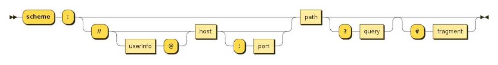
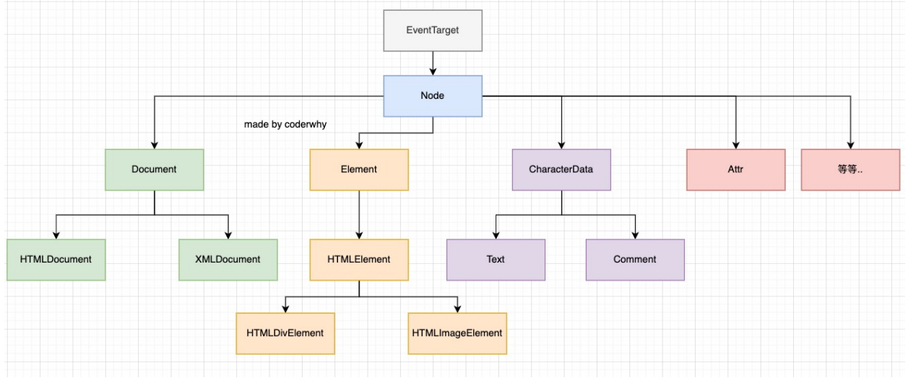
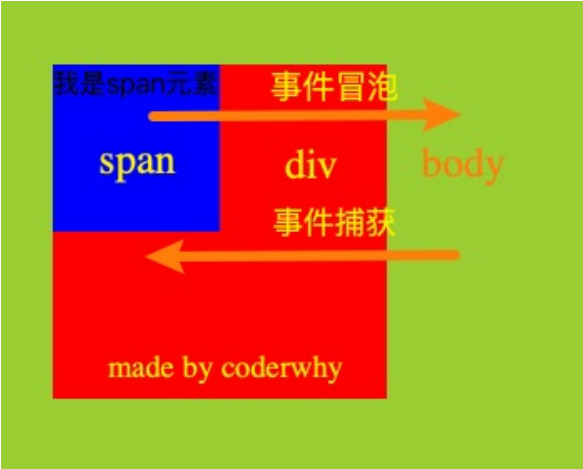

# BOM Browser Object Model


JavaScript有一个非常重要的运行环境就是浏览器，而且浏览器本身又作为一个应用程序需要对其本身进行操作，所以通常浏览器会有对 应的对象模型（BOM，Browser Object Model）。 

- 可以将BOM看成是连接JavaScript脚本与浏览器窗口的桥梁。


#### BOM主要包括一下的对象模型： 

- window：包括全局属性、方法，控制浏览器窗口相关的属性、方法； 
- location：浏览器连接到的对象的位置（URL）； 
- history：操作浏览器的历史； 
- document：当前窗口操作文档的对象；


#### window对象在浏览器中有两个身份： 

- 身份一：全局对象。 
  - 我们知道ECMAScript其实是有一个全局对象的，这个全局对象在Node中是global； 
  - 在浏览器中就是window对象； 
- 身份二：浏览器窗口对象。 
  - 作为浏览器窗口时，提供了对浏览器操作的相关的API；


#### Window全局对象

- 在浏览器中，window对象就是之前经常提到的全局对象，也就是我们之前提到过GO对象： 
  - 比如在全局通过var声明的变量，会被添加到GO中，也就是会被添加到window上； 
  - 比如window默认给我们提供了全局的函数和类：setTimeout、Math、Date、Object等；


#### Window窗口对象

- 事实上window对象上肩负的重担是非常大的： 
  - 第一：包含大量的属性，localStorage、console、location、history、screenX、scrollX等等（大概60+个属性）； 
  - 第二：包含大量的方法，alert、close、scrollTo、open等等（大概40+个方法）； 
  - 第三：包含大量的事件，focus、blur、load、hashchange等等（大概30+个事件）； 
  - 第四：包含从EventTarget继承过来的方法，addEventListener、removeEventListener、dispatchEvent方法； 
- MDN文档：https://developer.mozilla.org/zh-CN/docs/Web/API/Window


#### EventTarget

- Window继承自EventTarget，所以会继承其中的属性和方法： 
  - addEventListener：注册某个事件类型以及事件处理函数； 
  - removeEventListener：移除某个事件类型以及事件处理函数； 
  - dispatchEvent：派发某个事件类型到EventTarget上；


#### Location对象常见的属性

- Location对象用于表示window上当前链接到的URL信息。
- 常见的属性有哪些呢？ 
  - href: 当前window对应的超链接URL, 整个URL； 
  - protocol: 当前的协议； 
  - host: 主机地址； 
  - hostname: 主机地址(不带端口)； 
  - port: 端口； 
  - pathname: 路径； 
  - search: 查询字符串； 
  - hash: 哈希值； 
  - username：URL中的username（很多浏览器已经禁用）； 
  - password：URL中的password（很多浏览器已经禁用）；



- location有如下常用的方法： 
  - assign：赋值一个新的URL，并且跳转到该URL中； 
  - replace：打开一个新的URL，并且跳转到该URL中（不同的是不会在浏览记录中留下之前的记录）； 
  - reload：重新加载页面，可以传入一个Boolean类型；


#### history对象常见属性和方法

- history对象允许我们访问浏览器曾经的会话历史记录。 
- 有两个属性： 
  - length：会话中的记录条数； 
  - state：当前保留的状态值；
- 有五个方法： 
  - back()：返回上一页，等价于history.go(-1)； 
  - forward()：前进下一页，等价于history.go(1)； 
  - go()：加载历史中的某一页； 
  - pushState()：打开一个指定的地址； 
  - replaceState()：打开一个新的地址，并且使用replace；


### 认识DOM和架构

- 浏览器是用来展示网页的，而网页中最重要的就是里面各种的标签元素，JavaScript很多时候是需要操作这些元素的。 
  - JavaScript如何操作元素呢？通过Document Object Model（DOM，文档对象模型）。 
  - DOM给我们提供了一系列的模型和对象，让我们可以方便的来操作Web页面。



#### EventTarget

- 因为继承自EventTarget，所以也可以使用EventTarget的方法：
- addEventListener

#### Node节点

- 所有的DOM节点类型都继承自Node接口。 
  - https://developer.mozilla.org/zh-CN/docs/Web/API/Node 
- Node有几个非常重要的属性： 
  - nodeName：node节点的名称。 
  - nodeType：可以区分节点的类型。 
  - nodeValue：node节点的值； 
  - childNodes：所有的子节点；

#### Document

- Document节点表示的整个载入的网页，我们来看一下常见的属性和方法：

  ```js
  document.title
  document.body
  document.head
  document.children
  document.location
  
  document.getElementById('app')
  document.getElementsByName('abc')
  document.getElementsByTagName('div')
  
  // 创建元素、删除元素、获取元素
  ```

  

#### Element

创建的div、p、span等元素在DOM中表示为Element元素，

```js
// 1. 获取子元素
box.children
box.childNodes

// 2. tagName
box.tagName

// 3. id/class
box.id
box.className
box.classList

// 4. clientWidth/clientHeight/clientLeft/clientTop
box.clientWidth
box.clientHeight
box.clientLeft
box.clientTop
box.offsetWidth
box.offsetHeight
box.offsetLeft
box.offsetTop

// 5. 方法(操作属性)
const attr1 = box.getAttribute('name')
console.log(attr1)

box.setAttribute('age', '18')
```


#### 认识事件监听

- 前面我们讲到了JavaScript脚本和浏览器之间交互时，浏览器给我们提供的BOM、DOM等一些对象模型。 
  - 事实上还有一种需要和浏览器经常交互的事情就是事件监听： 
  - 浏览器在某个时刻可能会发生一些事件，比如鼠标点击、移动、滚动、获取、失去焦点、输入内容等等一系列 的事件； 
- 我们需要以某种方式（代码）来对其进行响应，进行一些事件的处理； 
  - 在Web当中，事件在浏览器窗口中被触发，并且通过绑定到某些元素上或者浏览器窗口本身，那么我们就可以 给这些元素或者window窗口来绑定事件的处理程序，来对事件进行监听。 
- 如何进行事件监听呢？ 
  - 事件监听方式一：在script中直接监听； 
  - 事件监听方式二：通过元素的on来监听事件； 
  - 事件监听方式三：通过EventTarget中的addEventListener来监听；

#### 事件冒泡和事件捕获

- 我们会发现默认情况下事件是从最内层的span向外依次传递的顺序，这个顺序我们称之为事件冒泡（Event Bubble）。 
  - 事实上，还有另外一种监听事件流的方式就是从外层到内层（body -> span），这种称之为事件捕获（Event Capture）； 
  - 为什么会产生两种不同的处理流呢？ 
    - 这是因为早期浏览器开发时，不管是IE还是Netscape公司都发现了这个问题，但是他们采用了完全相反的事 件流来对事件进行了传递； 
    - IE采用了事件冒泡的方式，Netscape采用了事件捕获的方式；




#### 事件对象event

- 当一个事件发生时，就会有和这个事件相关的很多信息： 
  - 比如事件的类型是什么，你点击的是哪一个元素，点击的位置是哪里等等相关的信息； 
  - 那么这些信息会被封装到一个Event对象中； 
  - 该对象给我们提供了想要的一些属性，以及可以通过该对象进行某些操作；

- 常见的属性： 
  - type：事件的类型； 
  - target：当前事件发生的元素； 	
  - currentTarget：当前处理事件的元素； 
  - offsetX、offsetY：点击元素的位置； 
- 常见的方法： 
  - preventDefault：取消事件的默认行为； 
  - stopPropagation：阻止事件的进一步传递；
- 事件类型：https://developer.mozilla.org/zh-CN/docs/Web/Events


