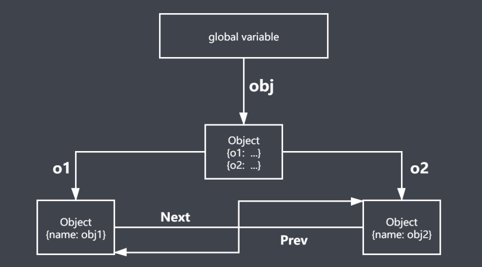
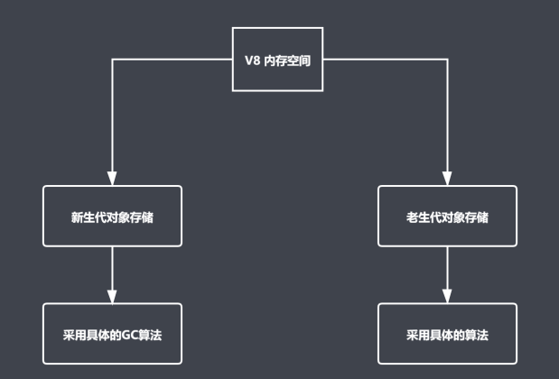
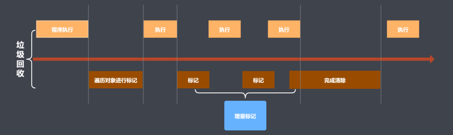

# Garbage Collection

### 内存管理

- 内存：由可读写单元组成，表示一片可操作空间
- 管理：人为的去操作一片空间的申请、使用和释放
- 内存管理：开发者主动申请空间、使用空间、释放空间
- 管理流程：申请 - > 使用 -> 释放

### JavaScript 中的垃圾

- JavaScript中内存管理是自动的
- 对象不再被引用时是垃圾
- 对象不能从根上访问时是垃圾

JavaScript 中的可达对象

- 可以访问到的对象就是可达对象（引用、作用域链）
- 可达的标准就是从根触发是否能够被找到
- JavaScript中的根可以理解为全局变量对象

### GC 算法

- GC是一种机制，垃圾回收器完成具体的工作
- 工作的内容就是查找垃圾、释放空间和回收空间
- 算法就是工作司查找和回收所遵循的规则

#### 常见的GC算法

- 引用计数
- 标记清除
- 标记整理
- 分代回收

#### 引用计数算法

- 核心思想：设置引用数，判断当前引用数是否为0
- 引用计数器
- 引用关系改变时修改引用数字
- 引用数字为0时立即回收
- 优点：
  - 发现垃圾立即回收
  - 最大限度减少程序暂停
- 缺点：
  - 无法回收循环引用的对象
  - 时间开销大

#### 标记清除算法

- 核心思想：分标记和清除两个阶段完成
- 遍历所有对象找标记活动对象
- 遍历所有对象清除没有标记对象
- 回收响应的空间
- 优点：
  - 解决循环引用问题，回收循环引用的对象
- 缺点：
  - 容易产生碎片化空间，浪费空间
  - 不会立即回收垃圾对象

#### 标记整理算法

- 标记整理可以看做是标记清除的增强
- 标记阶段的操作和标记清除一致
- 清除阶段会先执行整理，移动对象位置
- 优点：
  - 减少碎片化空间
- 缺点：
  - 不会立即回收垃圾对象
  - 移动对象位置，回收效率慢

### V8引擎垃圾回收策略

- 采用分代回收的思想
- 内存分为新生代、老生代
- 针对不同对象采用不同算法

#### V8引擎

- 主流的JavaScript执行引擎
- 采用即时编译
- 内存设限

#### V8中常用的GC算法

- 分代回收
- 空间复制
- 标记清除
- 标记整理
- 标记增量

#### V8回收新生代对象

#### V8内存分配

- V8内存空间一分为二
- 小空间用于存储新生代对象（32M|16M）
- 新生代指的是存活时间较短的对象

#### 新生代对象回收实现

- 回收过程采用复制算法 + 标记整理
- 新生代内存中分为两个大小相等的空间
- 使用空间为From，空闲空间为To
- 活动对象存储于 From 空间
- 标记整理后将活动对象拷贝至 To
- From 与 To 交换空间完成释放

#### 回收细节说明

- 拷贝过程中可能出现晋升
- 晋升就是将新生代对象移至老生代
- 一轮GC还存活的新生代需要晋升
- To 空间的使用率超过25%

#### V8回收老生代对象

- 老生代对象存放在右侧老生代区域
- 64位操作系统1.4G，32位操作系统700M
- 老生代对象是指存活时间较长的对象

#### 老生代对象回收

- 主要采用标记清除、标记整理、增量标记算法
- 首先使用标记清除完成垃圾回收
- 采用标记整理优化空间
- 采用增量标记进行效率优化

> - 新声代区域垃圾回收使用空间换时间
> - 老生代区域垃圾回收不适合复制算法

#### 标记增量优化垃圾回收

### 代码优化

- JavaScript中的内存管理自动完成
- 执行引擎会使用不同的GC算法
- GC算法工作实现了内存空间的良性循环
- Performance 工具检测内存变化
- JavaScript是单线程机制的解释型语言

#### 优化

- 避免全局变量
  - 全局变量挂载在window下
  - 至少有一个引用计数
  - 存活时间长，持续占用内存
- 避免全局查找
  - 目标变量不存在当前作用域，会通过作用域链向上查找
  - 减少全局查找降低时间消耗
  - 减少不必要的全局变量定义
  - 全局变量数据局部化
- 避免循环引用
- 采用字面量替换new 操作
- setTimeout 替换 setInterval
- 采用事件委托
- 合并循环变量和条件
- 节点添加优化