# 邂逅 JavaScript 开发

### 编程语言发展史

1. 机器语言 10000011110，机器指令
2. 汇编语言 mov、ax
3. 高级语言 编译型 C、C++、Java，解释型 JavaScript、Python

> 高级语言最终会转成机器指令
>
> ###### 10进制整数转二进制是除2取余
>
> ```
> 43（十进制） 转 2 进制
> 43 / 2 商 21 余数 1
> 21 / 2 商 10 余数 1
> 10 / 2 商 5  余数 0
>  5 / 2 商 2  余数 1
>  2 / 2 商 1  余数 0
>  1 / 2 商 0  余数 1
>  从后往前读取 43 => 101011
> ```
>
> ###### 10进制小数转2进制是乘2取1
>
> ```
> 0.1 （十进制）转 2 进制
> 0.1*2=0.2......0 -- 整数部分0。整数部分 0，清零后为 0，用0.2接着运算
> 0.2*2=0.4......0
> 0.4*2=0.8......0
> 0.8*2=1.6......1
> 0.6*2=1.2......1
> 0.2*2=0.4......0
> 0.4*2=0.8......0
> 0.8*2=1.6......1
> 0.6*2=1.2......1
> ......
> 得到整数依次是 0,0,0,1,1,0,0,1,1......
> 十进制数0.1转2进制对应的二进制数是 0.000110011001...... 无限循环小数
> 0.1+0.2 !== 0.3
> ```
>
> ```js
> 1 => number -> 8byte
> 8byte => 2**64
> js引擎 V8 中 kSmiMinValue => 0 ~ 2**32 -1, 小的数字在V8 中成为Sim，小数字 2**32
> ```
>
> 

### 浏览器工作原理

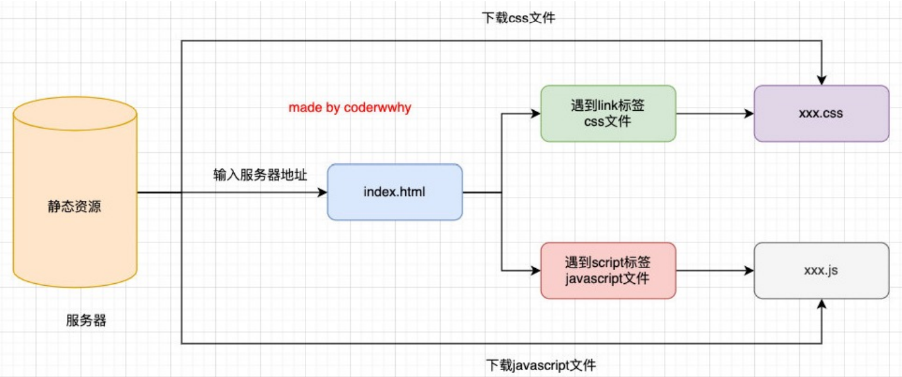


### 浏览器内核

1. Geoko：早期被Netscape和Mozilla Firfox 使用
2. Trident：微软开发，IE4~IE11，Edge转向Blink
3. Webkit：苹果基于KHTML开发，用于Safari，Chrome之前也用过
4. Blink：Webkit的分支，Google开发，目前用于Google Chrome、Edge、Opera等

浏览器内核指的是浏览器的排版引擎：

1. 排版引擎（layout engine），也称浏览器引擎（browser engine）
2. 页面渲染引擎（rendering engine）或样版引擎


### 浏览器渲染过程 

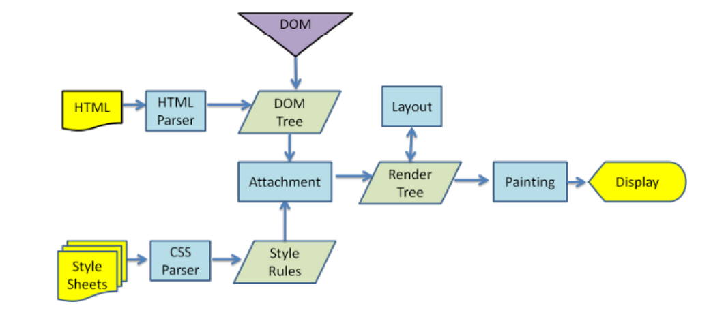


### JavaScript 引擎

> 高级语言需要被转换成机器指令，才能被CPU所执行，js引擎将 js 代码翻译成 CPU指令来执行

##### 常见的js 引擎

1. V8：google 开发
2. JavaScriptCore：Apple开发，
3. Chakra：微软开发，
4. SpiderMonkey：第一款 js 引擎，js作者开发


### 浏览器内核和 JS 引擎的关系

以Webkit为例，WebKit 由两部分组成：

1. WebCore：负责HTML/CSS解析、布局、渲染等相关的工作；
2. JavaScriptCore： 解析执行JavaScript代码


### V8 引擎

1. 由C++ 编写的Google开源高性能的JavaScript和WebAssembly引擎，它用于Chrome和Node.js
2. 可以在多种环境运行，Windows、macOS、Linux
3. V8 可以独立运行，也可以嵌入到任何 C++ 应用程序中

> astexplore.net


javascript => Parse解析器 => AST 抽象语法树 => ignition解释器 => byteCode 字节码 => 转成不同环境的CPU指令


### V8引擎的架构

V8引擎本身的源码非常复杂，大概有超过100w行C++代码，通过了解它的架构，我们可以知道它是如何对JavaScript执行的： 

- Parse 模块会将 JavaScript 代码转换成AST（抽象语法树），这是因为解释器并不直接认识JavaScript代码； 
  - 如果函数没有被调用，那么是不会被转换成AST的； 
  - Parse的V8官方文档：https://v8.dev/blog/scanner 
- Ignition是一个解释器，会将AST转换成ByteCode（字节码） 
  - 同时会收集TurboFan优化所需要的信息（比如函数参数的类型信息，有了类型才能进行真实的运算）； 
  - 如果函数只调用一次，Ignition会执行解释执行ByteCode； 
  - Ignition的V8官方文档：https://v8.dev/blog/ignition-interpreter 
- TurboFan是一个编译器，可以将字节码编译为CPU可以直接执行的机器码；
  - 如果一个函数被多次调用，那么就会被标记为热点函数，那么就会经过TurboFan转换成优化的机器码，提高代码的执行性能； 
  - 但是，机器码实际上也会被还原为ByteCode，这是因为如果后续执行函数的过程中，类型发生了变化（比如sum函数原来执行的是 number类型，后来执行变成了string类型），之前优化的机器码并不能正确的处理运算，就会逆向的转换成字节码； 
  - TurboFan的V8官方文档：https://v8.dev/blog/turbofan-jit


### V8 执行的细节

##### V8引擎解析JavaScript过程：

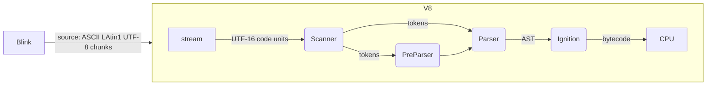

- Blink将源码交给V8引擎，Stream获取到源码并且进行编码转换；
- Scanner会进行此法分析（lexical anlysis），此法分析会将代码转换成tokens；
- 接下来tokens会被直接转换成AST树，经过Parser和PreParser；
  - Parser直接将tokens转换成AST树架构；
  - PreParser称之为预解析，需要预解析的原因：
    - 因为并不是所有的 JavaScript Code，在一开始就会被执行，如果对所有的 JavaScript Code 进行解析，必然会影响网页的效率；
    - 所以V8引擎就实现了Lazy Parsing 的方案，它的作用是将不必要的函数进行预解析，也就是只解析暂时需要的内容，而对函数的全量解析是在函数被调用时才会进行；
    - 比如在一个outer函数内部定义了另外一个inner函数，那么inner函数就会进行预解析
- 生成AST树后，会被 Ignition 解释器解释成 bytecode，之后开始执行代码


### JavaScript的执行过程

#### 初始化全局对象

- js 引擎会在代码执行之前，会在堆内存中创建一个全局对象：Global Object (GO)

  - 该对象 所有的作用域（scope）都可以访问；
  - 里面会包含Date、Array、String、Number、setTimeout、setInterval 等等；
  - 其中还有一个window属性指向自己；

  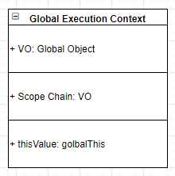


#### 执行上下文栈（调用栈）

Execution context stack 上下文执行栈 ECS

Global execution context 全局执行上下文 GEC

Function execution context 函数执行上下文 FEC

variable object VO 变量对象

Global Object

Action Object

- js引擎内部有一个执行上下文栈（Execution Context Stack，简称ECS），它是用于执行代码的调用栈。 

- 那么现在它要执行谁呢？执行的是全局的代码块： 
  - 全局的代码块为了执行会构建一个 Global Execution Context（GEC）； 
  
  - GEC会 被放入到ECS中 执行； 
  
    
  
- GEC被放入到ECS中里面包含两部分内容： 
  - 第一部分：在代码执行前，在parser转成AST的过程中，会将全局定义的变量、函数等加入到 GlobalObject 中， 变量并不会赋值，函数会在堆中开辟一块内存保存 函数体以及 parentscope：父级GO（AO）地址，返回函数内存地址给值变量；如果变量与函数重名，将共享函数内存地址
    - 这个过程也称之为变量的作用域提升（hoisting） 
  - 第二部分：在代码执行中，对变量赋值，或者执行其他的函数；如果变量名与函数重名，若变量被赋值，变量地址被修改，此时函数声明无效，无法访问函数，被变量覆盖，访问得到被覆盖的值
  
- 在执行的过程中执行到一个函数时，会根据函数体创建一个函数执行上下文（Functional Execution Context， 简称FEC），并且压入到 ECS 中。 

- FEC中包含三部分内容： 
  - 第一部分：在解析函数成为AST树结构时，会创建一个Activation Object（AO）： 
    - AO中包含形参、arguments、函数定义和指向函数对象、定义的变量； 
  
  - 第二部分：作用域链：由VO（在函数中就是AO对象）和父级VO组成，查找时会一层层查找； 
  
  - 第三部分：this绑定的值：函数运行时绑定
  
    

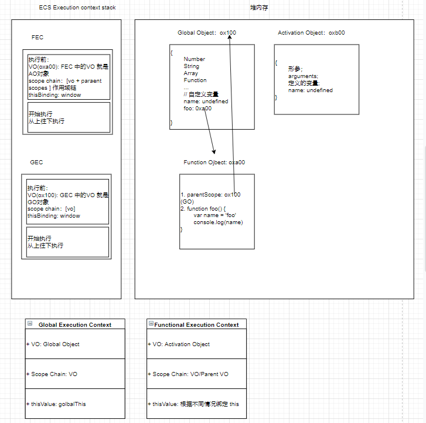

### 内存管理

在代码执行过程中都是需要分配内存，执行在内存中进行

内存声明周期：

1. 分配申请需要的内存
2. 使用分配的内存
3. 不需要使用，对其进行释放

不同的编程语言对第一步和第三步有不同的实现

1. 手动管理内存：C、C++，需要手动（malloc和free）管理内存
2. 自动管理内存：Java、JavaScript、Python等，一般不需要手动管理内存释放

### JS 内存管理

1. js 会在定义变量时分配内存

2. 对不同类型的变量分配方式不一样

   1. 基本数据类型会在执行时直接在站空间进行分配

   2. 复杂数据类型内存分配会在堆内存中开辟一块空间，并且将这块空间的指针返回值变量引用

      ```js
      var a = 1 // 栈
      var obj = { a : 1 } // 堆 0xa00
      ```

### JS 的垃圾回收

1. 内存大小有限，不需要使用，对其释放，腾出更多的内存空间
2. 在手动管理内存的语言中，
   1. 低效
   2. 很容易内存泄漏
3. 现代编程语言有自己的垃圾回收机制
   1. Garbage Collection，GC
4. GC的算法，计算不需要使用

### GC算法 - 引用计数

1.  计数器 记录引用，被引用 + 1，否则 -1，变为0，被清除
2. 弊端：循环引用的对象不会被清除

### GC算法 - 标记清除

1. 设置一个根对象（root object），从根开始找有引用的对象，没有引用的对象，不可达
2. 解决循环引用的问题

JS 引擎比较广泛采用的就是标记清除算法

### 闭包（Closure）

是在支持 头等函数 的编程语言中，实现词法绑定的一种技术； 

闭包在实现上是一个结构体，它存储了一个函数和一个关联的环境（相当于一个符号查找表）；

闭包跟函数最大的区别在于，当捕捉闭包的时候，它的 **自由变量** 会在补充时被确定，这样即使脱离了捕捉时的上下文，它也能照常运行

一个函数和对其周围状态（lexical environment，词法环境）的引用捆绑在一起（或者说函数被引用包围），这样的组合就是闭包（closure）；

闭包两部分组成：一个函数和一个关联的环境，这样组合被称为闭包 函数访问外部作用域的变量

### 闭包的内存泄漏

函数引用外部作用域没有释放，导致外部AO对象没有释放，js引擎优化，会释放外部AO没有引用的变量

#### 函数式一等公民

1. 函数可以作为参数
2. 函数作为返回值返回

```js
Array.prototype.myFilter = function(fn) {
    const _this = this
    const length = _this.length
    const arr = []
    for(let i=0;i < length;i++) {
        fn(_this[i], i, _this) && arr.push(_this[i])
    }
    return arr
}
```

### JS 函数的this指向 

> js module -> 加载 -> 编译 -> 放到一个函数 -> 执行这个函数.apply({})

**函数 this** 指向与函数**定义**的的**位置**无关，与**调用方式**有关

##### this 绑定规则：

1. 默认绑定
2. 隐式绑定
3. 显示绑定
4. new 绑定

### 规则一：默认绑定

独立函数调用，函数没有绑定this，直接调用

```javascript
// 默认绑定：独立函数调用
function foo() {
	console.log(this)
}

foo()
// 案例
function foo1() {
	console.log(this)
}

function foo2() {
	console.log(this)
    foo1()
}

function foo3() {
	console.log(this)
    foo2()
}

foo3()
// 案例
var obj = {
    name: 'why',
    foo: function() {
        console.log(this)
    }
}

var bar = obj.foo
bar() // window

// 案例
function foo() {
    return function() {
        console.log(this)
    }
}

var fn = foo()
fn() // this

var obj = {
    name: 'jz',
    eating: fn
}

obj.eating() // obj 隐式绑定
```

### 规则二：隐式绑定

- 通过对象进行调用 


### 规则三：显示调用

通过call、apply 绑定 this 直接运行，bind绑定 this 返回一个新函数 

1. call 直接运行
2. apply 直接运行

```javascript
function foo() {
    console.log(this)
}
// foo 直接调用执行全局对象
foo()
// call、apply 可以指定 this 绑定对象
var obj = {
    name: 'zs'
}
foo.call(obj)
foo.apply(obj)
```

3. bind 返回一个新函数

```javascript
function foo() {
    console.log(this)
}
// 默认绑定与显示绑定bind冲突，优先级（显示绑定）
var bar = foo.bind('aaa')
bar()
```


### 规则四：new 绑定

- JavaScript中的函数可以当做一个类的构造函数来使用，也就是new关键字
- 使用new 关键字来调用函数，执行如下操作：
  1. 创建一个新对象 obj
  2. obj的原型对象[[Prototype]] 指向 构造函数的原型对象 prototype
  3. 使用指定参数调用构造函数，并将 this 绑定到新创建的对象
  4. 判断result ，result 是对象返回result，否则返回 obj

```javascript
function Person(name, age) {
    this.name = name
    this.age = age
}

var p1 = new Person('jz', 18)
console.log(p1)
// new 的实现
function createNew(fn, ...args) {
    const obj = {}
    // obj.__proto__ = fn.prototype
    Object.setPrototypeOf(obj, fn.prototype)
    const result = fn.apply(obj, args)
    return typeof result === 'object' ? result : obj
}
```

### this 补充

思考 js 原生方法的内部函数调用如何实现，例如setTimeout中 fn 的为独立函数调用，onclick 内部绑定 dom对象

```javascript
// 1. setTimeout，内部直接调用fn，独立调用函数，fn 的this 执行window
setTimeout(fn, 2000)

```

### 规则优先级

1. 默认绑定优先级最低

2. 显示绑定优先级高于隐式绑定

   1. ```
      // 隐式绑定
      var obj = {
      	name: 'obj',
      	foo() {
      		console.log(this)
      	}
      }
      
      obj.foo()
      obj.foo.call('abc')
      
      // bind
      function foo() {
      	console.log(this)
      }
      
      var obj = {
      	name: 'jz',
      	foo: foo.bind('aaa')
      }
      
      obj.foo() // String {'aaa'}
      ```

3. new 优先级高于隐式绑定

4. new 优先级高于显示绑定

```
function foo() {
	console.log(this)
}

var bar = foo.bind('aaa')

var obj = new bar()
obj // foo {}
```


> 优先级：默认 < 隐式 < 显示 < new

结论：new 关键字不能和call、apply 一是使用

### this 规则之外 - 忽略显示绑定

> apply/call/bind：当传入null/undefined 时，自动将this 绑定为全局对象

```js
function foo() {
	console.log(this)
}

foo.apply('aaa')
// apply/call/bind：当传入null/undefined 时，自动将this 绑定为全局对象
foo.apply(null)
foo.apply(undefined)
var bar = foo.bind(null)
bar()
```

1. apply/call/bind：当传入null/undefined 时，自动将this 绑定为全局对象

2. 间接函数引用

   ```js
   var obj1 = {
   	name: 'obj1',
   	foo() {
   		console.log(this)
   	}
   }
   
   
   // 间接引用
   // 第一种情况
   var obj2 = {
   	name: 'obj2'
   }
   obj2.bar = obj1.foo
   obj2.bar() // {name: 'obj2', bar: ƒ}
   
   // 第二种情况，这种写法会报错，js在解析时会解析成如下格式，导致报错，正确的写法是在对象定义结束后加分号
   // 所以分号很重要，有些写法会导致解析错误
   /**
   var obj2 = {
   	name: 'obj2'
   }(obj2.bar = obj1.foo)()
   */
   // 错误写法
   var obj2 = {
   	name: 'obj2'
   }
   
   (obj2.bar = obj1.foo)()
   
   // 正确写法
   var obj2 = {
   	name: 'obj2'
   };
   // 这种写法(...)() 是独立函数调用，this 指向window
   (obj2.bar = obj1.foo)() 
   ```

3. 箭头函数(arrow function)

   1. 箭头函数不绑定 this、arguments属性
   2. 箭头函数不能作为构造函数来使用（和 new 一起使用，会抛出错误）
   3. 箭头函数的 this，是上层作用域的this
   4. 显示绑定不能改变箭头函数的 this

   ```javascript
   () => {}
   
   var nums = [1,2,3,4,5]
   nums.forEach((item, index, array)=>{})
   
   // 简写
   // 1. 函数只要一个参数 () 可以省略
   nums.forEach(item => {
       item % 2
   })
   // 2. 函数只返回一行代码 {} 可以省略
   // 强调：并且它会默认将这行代码的执行结果作为返回值
   nums.forEach(item => item % 2)
   // 3. 箭头函数返回一个对象
   var bar = () => ({name: 'jz'})
   ```

   ### 箭头函数 面试题

   ```js
   var name = "window";
   
   var person = {
     name: "person",
     sayName: function () {
       console.log(this.name);
     }
   };
   
   function sayName() {
     var sss = person.sayName;
     sss(); // window 独立函数调用
     person.sayName(); // person 隐式绑定
     (person.sayName)(); // person 隐式绑定
     (b = person.sayName)(); // 特殊情况 window
   }
   
   sayName();
   ```

   ```js
   var name = 'window'
   var person1 = {
     name: 'person1',
     foo1: function () {
       console.log(this.name)
     },
     foo2: () => console.log(this.name),
     foo3: function () {
       return function () {
         console.log(this.name)
       }
     },
     foo4: function () {
       return () => {
         console.log(this.name)
       }
     }
   }
   
   var person2 = { name: 'person2' }
   
   person1.foo1(); // person1 隐式绑定
   person1.foo1.call(person2); // person2 显示绑定
   
   person1.foo2(); // window
   person1.foo2.call(person2); // window
   
   person1.foo3()(); // window 独立函数调用
   person1.foo3.call(person2)(); // window 独立函数调用
   person1.foo3().call(person2); // person2 显示绑定
   
   person1.foo4()(); // person1
   person1.foo4.call(person2)(); // person2
   person1.foo4().call(person2); // person 1
   ```

   ```js
   var name = 'window'
   function Person (name) {
     this.name = name
     this.foo1 = function () {
       console.log(this.name)
     },
     this.foo2 = () => console.log(this.name),
     this.foo3 = function () {
       return function () {
         console.log(this.name)
       }
     },
     this.foo4 = function () {
       return () => {
         console.log(this.name)
       }
     }
   }
   var person1 = new Person('person1')
   var person2 = new Person('person2')
   
   person1.foo1() // person1 隐式绑定
   person1.foo1.call(person2) // person2 显示绑定
   
   person1.foo2() // person1
   person1.foo2.call(person2) // person1
   
   person1.foo3()() // window 独立函数调用
   person1.foo3.call(person2)() // window 独立函数调用
   person1.foo3().call(person2) // person2 显示绑定
   
   person1.foo4()() // person1
   person1.foo4.call(person2)() // person2
   person1.foo4().call(person2) // person1
   ```

   ```js
   var name = 'window'
   function Person (name) {
     this.name = name
     this.obj = {
       name: 'obj',
       foo1: function () {
         return function () {
           console.log(this.name)
         }
       },
       foo2: function () {
         return () => {
           console.log(this.name)
         }
       }
     }
   }
   var person1 = new Person('person1')
   var person2 = new Person('person2')
   
   person1.obj.foo1()() // window 独立函数调用
   person1.obj.foo1.call(person2)() // window 独立函数调用
   person1.obj.foo1().call(person2) // person2 显式绑定
   
   person1.obj.foo2()() // obj
   person1.obj.foo2.call(person2)() // person2
   person1.obj.foo2().call(person2) // obj
   ```

   

## 函数式编程

### 实现apply、call、bind

> **`Object` 构造函数将给定的值包装为一个新对象。**
>
> - 如果给定的值是 [`null`](https://developer.mozilla.org/zh-CN/docs/Web/JavaScript/Reference/Global_Objects/null) 或 [`undefined`](https://developer.mozilla.org/zh-CN/docs/Web/JavaScript/Reference/Global_Objects/undefined), 它会创建并返回一个空对象。
> - 否则，它将返回一个和给定的值相对应的类型的对象。
> - 如果给定值是一个已经存在的对象，则会返回这个已经存在的值（相同地址）。
>
> apply/call/bind：当传入null/undefined 时，自动将this 绑定为全局对象

```
// apply 考虑边界值
// window node 都有golbalThis全局对象
// fn.apply(obj, [1, 2, 3])
Function.prototype.myApply = function(thisArg, argArray = []) {
	// 1. 获取需要被执行的函数
	const fn = this
	// 2. 处理绑定的thisArg，基本数据类型绑定this
	const ctx = (thisArg !== null && thisArg !== undefined) ? Object(thisArg) : golbalThis
	// const args = Array.from(arguments).slice(1)
	// 3. ctx 添加 fn 属性，执行 隐式绑定 this
	const key = Symbol('key')
	ctx[key] = fn
	const res = ctx[key](...argArray)
	delete ctx[key]
	// 4. 返回 res
	return res
}

// call
// fn.call(obj, 1, 2, 3)
Function.prototype.myCall = function(thisArg, ...args) {
	// 获取需要被执行的函数
	const fn = this
	// 处理绑定的thisArg
	const ctx = (thisArg !== null && thisArg !== undefined) ? Object(thisArg) : golbalThis
	// const args = Array.from(arguments).slice(1)
	const key = Symbol('key')
	ctx[key] = fn
	const res = ctx[key](...args)
	delete ctx[key]
	return res
}

function foo(num) {
	console.log(num, this)
}

var obj = {
	name: 'jz'
}

foo.myApply(obj)

// bind
// fn.bind(obj, ...args) 返回一个新函数，可以 new
Function.prototype.myBind = function(thisArg, ...args) {
	// 1. 获取到需要调用函数
	const fn = this
	const ctx = (thisArg !== null && thisArg !== undefined) ? Object(thisArg) : globalThis
	const key = Symbol('key')
	ctx[key] = fn
	function proxyFn(...args1) {
		// 判断当前的 this.__proto__ 是否指向 Fn.prototype
		// this instanceof Fn 为true，说明new Fn(...args)
		if(this instanceof Fn) {
			this[key] = fn
            const res = this[key](...args, ...args1)
            delete this[key]
            return res
		} else {
            const res = ctx[key](...args, ...args1)
            delete ctx[key]
            return res
		}
		
	}
	proxyFn.prototype = fn.prototype
	return proxyFn
}

function foo(name, age) {
	this.name = name
	this.age = age
	console.log(this)
}

```


### arguments

- arguments 是一个 对应于传递给 函数的参数 的 类数组（array like）对象
- 箭头函数没有 arguments，去上层作用域查找 arguments

#### 常见的arguments的操作：

1. 获取参数的长度 arguments.length
2. 根据索引值获取参数 arguments[0]
3. 获取到当前函数 arguments.callee

#### 类数组转数组

```js
// 1. 使用 for
var newArr = []
for(var i =0;i<arguments.length;i++){
	newArr.push(arguments[i])
}

// 2.
var newArr2 = Array.prototype.slice.call(arguments)
// 模拟 slice 的实现
Array.prototype.slice = function(start = 0, end = this.length){
	let arr = this
	let newArr = []
	for(let i = start ; i< end; i++) {
		newArr.push(arr[i])
	}
	return newArr
}
// 3.
var newArr3 = Array.from(arguments)
// 4
var newArr4 = [...arguments]
```

### 纯函数（Pure Function）

- 函数式编程中有一个非常重要的概念叫纯函数，JavaScript符合函数式编程的范式，所以也有纯函数的概念
  - 掌握纯函数对于理解很多框架的设计是非常有帮助的
  - react 中的组件就被要求是纯函数，redux中有一个reducer的概念
- 纯函数的维基百科定义：
  - 在程序设计中，若一个函数符合以下条件，那么这个函数被称为纯函数： 
  - 此函数在相同的输入值时，需产生相同的输出。 
  - 函数的输出和输入值以外的其他隐藏信息或状态无关，也和由I/O设备产生的外部输出无关。 
  - 该函数不能有语义上可观察的函数副作用，诸如“触发事件”，使输出设备输出，或更改输出值以外物件的内容等
- 总结：
  - 确定的输入，一定会产生确定的输出
  - 函数执行过程中，不能产生副作用

### 副作用

- 副作用的概念

  - 副作用（side effect）其实本身是医学的概念，比如吃药会有一些副作用

  - 在计算机科学中，也引用副作用的概念，表示在执行一个函数时，除了返回函数值之外，还对调用函数产生 了附加的影响，比如修改了全局变量，修改参数或者改变外部的存储；
- 纯函数在执行过程中不能产生副作用


### 纯函数 案例

数组两个方法，slice，splice

1. slice ，确定输入值，返回固定的值，不会改变原数组，slice 是一个纯函数
2. splice，执行时，会修改原数组，修改的这个操作就是产生的副作用

React 中所有组件都是按照纯函数进行编程


### JavaScript 柯里化

- 维基百科的解释： 
- 在计算机科学中，柯里化（英语：Currying），又译为卡瑞化或加里化； 
  - 是把接收多个参数的函数，变成接受一个单一参数（最初函数的第一个参数）的函数，并且返回接受余下的参 数，而且返回结果的新函数的技术； 
  - 柯里化声称 “如果你固定某些参数，你将得到接受余下参数的一个函数”； 
- 维基百科的结束非常的抽象，我们这里做一个总结： p
  - 只传递给函数一部分参数来调用它，让它返回一个函数去处理剩余的参数； 
  - 这个过程就称之为柯里化

#### 让函数的职责单一

为什么需要柯里化：

1. 在函数式编程中，希望一个函数的问题尽可能的单一，而不是将一大堆得处理过程交给一个函数来处理
2. 每次传入的参数在单一的函数中进行，处理完成后在下一个函数中使用处理后的参数

#### 逻辑复用

可以对于一些功能实现复用，不用重复去定义

```js
function log(date, type, message) {
  console.log(`[${date.getHours()}:${date.getMinutes()}][${type}: ${message}]`)
}
// 柯里化实现
const curryLog = date => type => message => console.log(`[${date.getHours()}:${date.getMinutes()}][${type}: ${message}]`)
// 这里复用log的逻辑
const type = curryLog(new Date())('log')
type('test')
type('测试')
```

#### 柯里化的实现

````js
function curry(fn) {
  function curryFn(...args) {
    // 判断当前接收到参数的个数，是否和需要接受的参数是否一致
    if(args.length >= fn.length) {
      // 绑定 this，如果显示绑定this
        // fn.call(this, ...args)
      return fn.apply(this, args)
    } else {
      return function(...args1) {
          // 递归调用
        return curryFn.apply(this, [...args, ...args1])
      }
    }
  }

  return curryFn
}
````

#### 柯里化应用场景

1. React Reduce
2. Vue 源码使用


#### 组合函数

- 组合（Compose）函数是在JavaScript开发过程中一种对函数的使用技巧、模式： 
  - 比如我们现在需要对某一个数据进行函数的调用，执行两个函数fn1和fn2，这两个函数是依次执行的； 
  - 那么如果每次我们都需要进行两个函数的调用，操作上就会显得重复； 
  - 那么是否可以将这两个函数组合起来，自动依次调用呢？ 
  - 这个过程就是对函数的组合，我们称之为 组合函数（Compose Function）；

```js
function componse(...fns) {
  const length = fns.length
  for (let i = 0; i < length; i++) {
    if (typeof fns[i] !== 'function') {
      throw TypeError('Expected arguments are function')
    }
  }
  return function (...args) {
    let index = 0
    let result = length ? fns[index].apply(this, args) : args
    while(true) {
      index++
      if(index>=length) {
        break
      }
      result = fns[index].call(this, result)
    }
    return result
  }
}

console.log(componse(add, square, double)(1))

function double(m) {
  return m * 2
}

function square(n) {
  return n ** 2
}

function add(num) {
  return num + 2
}
```


### JS 其他知识点

#### with 语句

1. with 语句可以形成自己的作用域，去先传入参数的中查找，然后再去上层作用域，一层层到全局
2. 严格模式不能使用

```js
let message = 'Hello World'
const obj = {
    message: 'obj msg'
}
with(obj) {
    console.log(message) // obj msg
}
```

#### eval 执行js字符串代码

> 不建议开发使用
>
> 1. eval 代码的可读性非常的差（代码的可读性是高质量代码的重要原则）； 
> 2. eval 是一个字符串，那么有可能在执行的过程中被刻意篡改，那么可能会造成被攻击的风险； 
> 3. eval 的执行必须经过JS解释器，不能被JS引擎优化；

```js
var jsString = `var message = 'hello';console.log(message)`
eval(jsString)
```


#### 严格模式

- 在ECMAScript5标准中，JavaScript提出了严格模式的概念（Strict Mode）： 
  - 严格模式很好理解，是一种具有限制性的JavaScript模式，从而使代码隐式的脱离了 ”松散（sloppy）模式“； 
  - 支持严格模式的浏览器在检测到代码中有严格模式时，会以更加严格的方式对代码进行检测和执行； 
- 严格模式对正常的JavaScript语义进行了一些限制： 
  - 严格模式通过 **抛出错误** 来消除一些原有的 **静默（silent）错误**； 
  - 严格模式让JS引擎在执行代码时可以进行更多的优化（不需要对一些特殊的语法进行处理）； 
  - 严格模式禁用了在ECMAScript未来版本中可能会定义的一些语法；（关键字、保留字）

- 严格模式支持粒度话的迁移： 严格模式通过在文件或者函数开头使用 use strict 来开启

  - 可以支持在js文件中开启严格模式； 

  - 也支持对某一个函数开启严格模式；

    ```js
    // "use strict"
    
    function foo() {
    	// "use strict"
    }
    ```

- 严格模式限制

  1. 无法意外的创建全局变量 
  2.  严格模式会使引起静默失败(silently fail,注:不报错也没有任何效果)的赋值操作抛出异常 
  3. 严格模式下试图删除不可删除的属性 
  4. 严格模式不允许函数参数有相同的名称 
  5. 不允许0的八进制语法 
  6. 在严格模式下，不允许使用with 
  7.  在严格模式下，eval不再为上层引用变量 
  8. 严格模式下，this绑定不会默认转成对象

```js
// "use strict"
function foo() {
    console.log(this)
}

foo() // undefined

setTimeout(function() {
    console.log(this)
})
```


## 面向对象

### 面向对象是现实的抽象方式

- 对象是JavaScript中一个非常重要的概念，这是因为对象可以将多个相关联的数据封装到一起，更好的描述一个事物： 
  -  比如我们可以描述一辆车：Car，具有颜色（color）、速度（speed）、品牌（brand）、价格（price），行驶（travel）等 等；
  - 比如我们可以描述一个人：Person，具有姓名（name）、年龄（age）、身高（height），吃东西（eat）、跑步（run） 等等； 
- 用对象来描述事物，更有利于我们将现实的事物，抽离成代码中某个数据结构： 
  - 所以有一些编程语言就是纯面向对象的编程语言，比Java； 
  - 你在实现任何现实抽象时都需要先创建一个类，根据类再去创建对象；

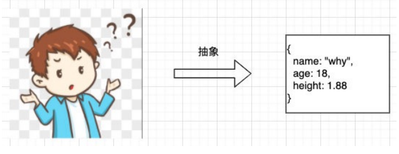

### JavaScript的面向对象

- JavaScript其实支持多种编程范式的，包括函数式编程和面向对象编程： 

  - JavaScript中的对象被设计成一组属性的无序集合，像是一个哈希表，有key和value组成； 
  - key是一个标识符名称，value可以是任意类型，也可以是其他对象或者函数类型； 
  - 如果值是一个函数，那么我们可以称之为是对象的方法； 

- 如何创建一个对象呢？

- 早期使用创建对象的方式最多的是使用Object类，并且使用new关键字来创建一个对象： 

  - 这是因为早期很多JavaScript开发者是从Java过来的，它们也更习惯于Java中通过new的方式创建一个对象； 

    ```js
    var obj = new Object()
    obj.name = 'jz'
    obj.age = 18
    obj.eating = function() {
        console.log(this.name + ' eating')
    }
    ```

    

- 后来很多开发者为了方便起见，都是直接通过字面量的形式来创建对象： 

  - 这种形式看起来更加的简洁，并且对象和属性之间的内聚性也更强，所以这种方式后来就流行了起来；

    ```js
    var obj = {
        name: 'jz',
        age: 18,
        eating() {
            console.log(this.name + ' eating')
        }
    }
    ```

    


### 对属性的操作

要对一个属性进行比较精准的操作控制，那么我们就可以使用属性描述符

- 通过属性描述符可以精准的添加或修改对象的属性； 
- 属性描述符需要使用 Object.defineProperty 来对属性进行添加或者修改；


### Object.defineProperty

> Object.defineProperty(obj, prop, descriptor)

- 可接收三个参数： 
  - obj要定义属性的对象； 
  - prop要定义或修改的属性的名称或 Symbol； 
  - descriptor要定义或修改的属性描述符； 
- 返回值： 
  - 被传递给函数的对象。

#### 属性描述符

- 属性描述符的类型有两种： 

  - 数据属性（Data Properties）描述符（Descriptor）； 
  - 存取属性（Accessor访问器 Properties）描述符（Descriptor）；

  |                | configurable | enumerable | value |      | writable | get  | set  |
  | -------------- | ------------ | ---------- | ----- | ---- | -------- | ---- | ---- |
  | 数据属性描述符 | Y            | Y          | Y     |      | Y        | N    | N    |
  | 存取属性描述符 | Y            | Y          | N     |      | N        | Y    | Y    |

#### 数据属性描述符

- 数据数据描述符有如下四个特性： 
- [[Configurable]]：表示属性是否可以通过delete删除属性，是否可以修改它的特性，或者是否可以将它修改为存取属性描述符； 
  - 当我们直接在一个对象上定义某个属性时，这个属性的[[Configurable]]为true； 
  - 当我们通过属性描述符定义一个属性时，这个属性的[[Configurable]]默认为false；
-  [[Enumerable]]：表示属性是否可以通过for-in或者Object.keys()返回该属性； 
  - 当我们直接在一个对象上定义某个属性时，这个属性的[[Enumerable]]为true； 
  - 当我们通过属性描述符定义一个属性时，这个属性的[[Enumerable]]默认为false； 
- [[Writable]]：表示是否可以修改属性的值； 
  - 当我们直接在一个对象上定义某个属性时，这个属性的[[Writable]]为true； 
  - 当我们通过属性描述符定义一个属性时，这个属性的[[Writable]]默认为false； 
- [[value]]：属性的value值，读取属性时会返回该值，修改属性时，会对其进行修改； 
  - 默认情况下这个值是undefined；

#### 存取属性描述符

数据数据描述符有如下四个特性： 

- [[Configurable]]：表示属性是否可以通过delete删除属性，是否可以修改它的特性，或者是否可以将它修改为存取属性 描述符； 
  - 和数据属性描述符是一致的； 
  - 当我们直接在一个对象上定义某个属性时，这个属性的[[Configurable]]为true； 
  - 当我们通过属性描述符定义一个属性时，这个属性的[[Configurable]]默认为false； 
- [[Enumerable]]：表示属性是否可以通过for-in或者Object.keys()返回该属性； 
  - 和数据属性描述符是一致的； 
  - 当我们直接在一个对象上定义某个属性时，这个属性的[[Enumerable]]为true；
  - 当我们通过属性描述符定义一个属性时，这个属性的[[Enumerable]]默认为false； 
- [[get]]：获取属性时会执行的函数。默认为undefined 
- [[set]]：设置属性时会执行的函数。默认为undefined

```js
let obj = {
    name: 'jz',
    age: 18,
    _adress: 'beijing' // _私有属性，约定
}

Object.defineProperty(obj, 'adress', {
  configurable: true,
  enumerable: true,
  get() {
    return obj._adress
  },
  set(value) {
    foo(value)
    obj._adress = value
  }
})

// 或者直接get set
let obj = {
    name: 'jz',
    age: 18,
    _adress: 'beijing', // _私有属性，约定
    get adress(){
        return this._adress
    },
    set adress(value){
        this._adress = value
    }
}
// 获取obj的name的属性描述
Object.getOwnPropertyDescriptor(obj, 'name')
// 获取obj所有的属性，属性描述
Object.getOwnPropertyDescriptors(obj)
// 禁止对象继续添加新的属性
Object.preventExtensions(obj)
// 禁止对象添加新属性并且将现有属性标记为不可配置
Object.seal(obj) // preventExtensions + (configurable = false) 
// 冻结对象，任何操作都会失败
Object.freeze(obj) // seal + (writable = false)

```


### 创建多个对象的方案，设计模式

#### 1. 工厂模式，工厂方法来创建对象

​	**缺点**：获取不到对象的具体类型

```js
function createPerson(name, age, height, address) {
  var p = new Object()
  p.name = name
  p.age = name
  p.height = height
  p.address = address

  p.eating = function() {
    console.log(this.name+' eating!')
  }

  p.running = function() {
    console.log(this.name+' running!')
  }

  return p
}

var p1 = createPerson('zs', 18, 1.75, 'shanghai')
var p2 = createPerson('zs', 18, 1.75, 'shanghai')
var p3 = createPerson('zs', 18, 1.75, 'shanghai')

p1 => {
  name: 'zs',
  age: 'zs',
  height: 1.75,
  address: 'shanghai',
  eating: [Function (anonymous)],
  running: [Function (anonymous)]
}

```

#### 2. 构造函数模式

##### 什么是构造函数？ 

- 构造函数也称之为构造器（constructor），通常是我们在创建对象时会调用的函数； 

- 在其他面向的编程语言里面，构造函数是存在于类中的一个方法，称之为构造方法； 

- 但是JavaScript中的构造函数有点不太一样； 

##### JavaScript中的构造函数是怎么样的？ 

- **构造函数**也是一个**普通的函数**，从表现形式来说，和千千万万个普通的函数没有任何区别； 
- 那么如果这么一个**普通的函数**被使用**new**操作符来调用了，那么**这个函数**就称之为是一个**构造函数**；

##### new操作符调用的作用

##### 一个函数被使用new操作符调用了，那么它会执行如下操作：

1. 在内存中创建一个新的对象（空对象）； 
2. 这个对象内部的[[prototype]]属性会被赋值为该构造函数的prototype属性；（后面详细讲）； 
3. 构造函数内部的this，会指向创建出来的新对象； 
4. 执行函数的内部代码（函数体代码）； 
5. 如果构造函数没有返回非空对象，则返回创建出来的新对象

##### 构造函数，首字母大写

**缺点**：每次重新new，创建新对象，需要为每个对象去创建一个函数对象实例，浪费空间

```js
function Person(name, age) {
  this.name = name
  this.age = age

  this.eating = function() {
    console.log(this.name + ' eating!')
  }
}

var p1 = new Person('jz', 18)
var p2 = new Person('zs', 18)

console.log(p1)
```


#### 3. 原型和构造函数结合

> 对象隐式原型属性 [[Prototype]] => `obj.__proto__` / `Object.getPrototypeOf()`
>
> 函数显式原型对象 prototype =>  `fn.prototype`
>
> 函数隐式原型属性 [[Prototype]] => `fn.__proto__`

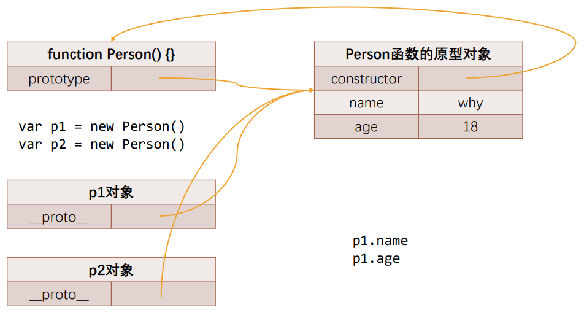

```js
function Person(name, age) {
  this.name = name
  this.age = age
}

Person.prototype.eating = function() {
  console.log(this.name + ' eating!')
}

var p1 = new Person('zs', 18)
var p2 = new Person('ls', 18)

p1.eating()
p2.eating()

```

#### 对象的原型

- JavaScript当中每个对象都有一个特殊的内置属性 [[prototype]]，这个特殊的对象可以指向另外一个对象。
- 那么这个对象有什么用呢？
  - 当我们通过引用对象的属性key来获取一个value时，它会触发 [[Get]]的操作； 
  - 这个操作会首先检查该属性是否有对应的属性，如果有的话就使用它； 
  - 如果对象中没有改属性，那么会访问对象[[prototype]]内置属性指向的对象上的属性；
- 获取的方式有两种： 
  - 方式一：通过对象的 __proto__ 属性可以获取到（但是这个是早期浏览器自己添加的，存在一定的兼容性问 题）； 
  - 方式二：通过 Object.getPrototypeOf 方法可以获取到

#### 函数的原型 prototype

js函数有一个特殊的属性 prototype

### JavaScript 中的类和对象

- 当我们编写如下代码的时候，我们会如何来称呼这个Person呢？ 
  - 在 JS 中 Person 应该被称之为是一个构造函数； 
  - 从很多面向对象语言过来的开发者，也习惯称之为**类**，因为类可以帮助我们创建出来对象p1、p2； 
  - 如果从面向对象的编程范式角度来看，Person确实是可以称之为类的；

```js
function Person() {

}

var p1 = new Person()
```

#### 面向对象的特性 – 继承

- 面向对象有三大特性：封装、继承、多态（抽象：把现实抽象为类）
  -  封装：我们前面将属性和方法封装到一个类中，可以称之为封装的过程； 
  - 继承：继承是面向对象中非常重要的，不仅仅可以减少重复代码的数量，也是多态前提（纯面向对象中）；
  -  多态：不同的对象在执行时表现出不同的形态；
- 继承
  - 继承可以帮助我们将重复的代码和逻辑抽取到父类中，子类只需要直接继承过来使用即可。

#### JavaScript原型链

```
var obj = {} // new Object()
obj.__proto__ === Object.prototype
obj.__proto__.__proto__ === null
```

#### Object的原型

Object.prototype 顶层原型，原型属性指向null，该对象上有很多默认的属性和方法

Object 是所有类的父类


#### 通过原型链继承

```js
function Person() {
  this.name = 'jz'
  this.friends = []
}

Person.prototype.eating = function () {
  console.log(this.name + ' eating~')
}

function Student(sno) {
  this.sno = sno
}

Student.prototype = new Person()

Student.prototype.studying = function (){
  console.log(this.name + ' studing~')
}

var student1 = new Student(111)
var student2 = new Student(112)

// 直接给student2 添加 name 属性
student2.name = 'zs'

// 获取引用，修改引用的属性，会相互影响
student2.friends.push('ls')

console.log(student1)
console.log(student2)
student1.eating()
student1.studying()
// Person { sno: 111 }
// Person { sno: 112, name: 'zs' }
// jz eating~
// jz studing~

```

##### 原型链继承的弊端

但是目前有一个很大的弊端：某些属性其实是保存在p对象上的； 

- 第一，我们通过直接打印对象是看不到这个属性的（原型上的name没有展示）； 
- 第二，这个属性会被多个对象共享，如果这个对象（friends）是一个引用类型，那么就会造成问题； 
- 第三，不能给Person传递参数，因为这个对象是一次性创建的（没办法定制化）；


#### 借用构造函数继承（组合借用继承）

- 为了解决原型链继承中存在的问题，开发人员提供了一种新的技术: constructor stealing(有很多名称: 借用构造函 数或者称之为经典继承或者称之为伪造对象)： 

  - steal是偷窃、剽窃的意思，但是这里可以翻译成借用； 

- 借用继承的做法非常简单：在子类型构造函数的内部调用父类型构造函数. 

  - 因为函数可以在任意的时刻被调用； 
  - 因此通过apply()和call()方法也可以在新创建的对象上执行构造函数；

- **弊端**：

  - Person函数至少调用两次
  - Student 的原型对象上多出一些属性（new Person 返回的对象上产生一些属性）

  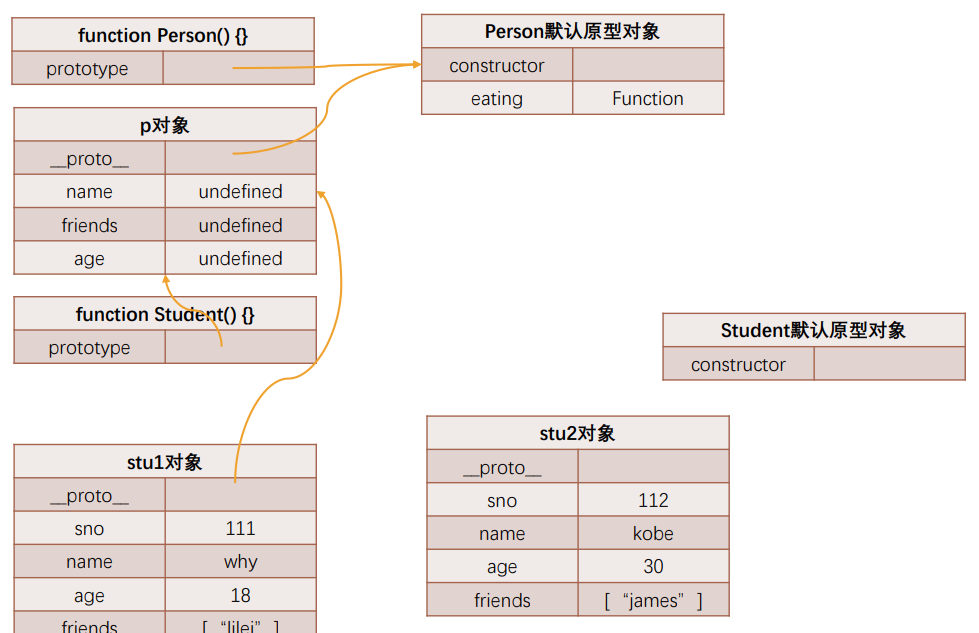

```js
function Person(name, age, friends) {
  this.name = name
  this.age = age
  this.friends = friends
}

Person.prototype.eating = function () {
  console.log(this.name + ' eating~')
}

function Student(name, age, friends, sno) {
  // 借用构造函数，绑定 this 传值
  Person.call(this, name, age, friends)
  this.sno = sno
}

// 创建一个对象
Student.prototype = new Person()

Student.prototype.studying = function (){
  console.log(this.name + ' studing~')
}

var student1 = new Student('jz', 18, ['kobe', 'james'], 1)
var student2 = new Student('ls', 18, ['curry'], 2)

// 直接给student2 添加 name 属性
student2.name = 'zs'

// 获取引用，修改引用的属性，会相互影响
student2.friends.push('ls')

console.log(student1)
console.log(student2)
student1.eating()
student1.studying()
// Person { sno: 111 }
// Person { sno: 112, name: 'zs' }
// jz eating~
// jz studing~
```


#### 原型式继承

- 原型式继承的渊源 
  - 这种模式要从道格拉斯·克罗克福德（Douglas Crockford，著名的前端大师，JSON的创立者）在2006年写的 一篇文章说起: Prototypal Inheritance in JavaScript(在JS中使用原型式继承) 
  - 在这篇文章中，它介绍了一种继承方法，而且这种继承方法不是通过构造函数来实现的. 
  - 为了理解这种方式，我们先再次回顾一下JavaScript想实现继承的目的：重复利用另外一个对象的属性和方法. 
- 最终的目的：student对象的原型指向了person对象；

```js
// 原型式继承 三种方法
function createObject1(o) {
  var newObj = {}
  Object.setPrototypeOf(newObj, o)
  return newObj
}

function createObject2(o) {
  function Fn() {}
  Fn.prototype = o
  return new Fn()
}

// info的原型指向obj
var info = Object.create(obj)
console.log(info)
console.log(info.__proto__)

```


#### 寄生式继承函数

- 寄生式(Parasitic)继承 

  - 寄生式(Parasitic)继承是与原型式继承紧密相关的一种思想, 并且同样由道格拉斯·克罗克福德(Douglas Crockford)提出和推广的； 
  - 寄生式继承的思路是结合原型类继承和工厂模式的一种方式； 
  - 即创建一个封装继承过程的函数, 该函数在内部以某种方式来增强对象，最后再将这个对象返回；

  ```javascript
  // 原型式继承
  function object(obj) {
    function Fn() {}
    Fn.prototype = obj
    return new Fn()
  }
  
  // 工厂函数 + 原型继承
  function createStudent(name) {
    var newObj = object(Person.prototype)
    newObj.name = name
    newObj.studying = function() {
      console.log(this.name + ' studying')
    }
  
    return newObj
  }
  
  function Person(name, age) {}
  
  Person.prototype.eating = function() {
    console.log(this.name + ' eating~')
  }
  
  var stu = createStudent(Person.prototype)
  console.log(stu)
  ```

- 弊端：

  - 不能明确新对象的类型
  - 新对象每次都会创建函数实例对象 （studing）


#### 寄生组合式继承

[MDN 寄生组合实现](https://developer.mozilla.org/zh-CN/docs/Web/JavaScript/Reference/Global_Objects/Object/create)

- 现在我们来回顾一下之前提出的比较理想的组合继承 
  - 组合继承是比较理想的继承方式, 但是存在两个问题: 
    - 问题一: 构造函数会被调用两次: 一次在创建子类型原型对象的时候, 一次在创建子类型实例的时候. 
    - 问题二: 父类型中的属性会有两份: 一份在原型对象中, 一份在子类型实例中. 
- 事实上, 我们现在可以利用寄生式继承将这两个问题给解决掉. 
- 你需要先明确一点: 当我们在子类型的构造函数中调用父类型.call(this, 参数)这个函数的时候, 就会将父类型中 的属性和方法复制一份到了子类型中. 所以父类型本身里面的内容, 我们不再需要. 
  - 这个时候, 我们还需要获取到一份父类型的原型对象中的属性和方法. 
  - 能不能直接让子类型的原型对象 = 父类型的原型对象呢? 
  - 不要这么做, 因为这么做意味着以后修改了子类型原型对象的某个引用类型的时候, 父类型原生对象的引用类型 也会被修改. 
  - 我们使用前面的寄生式思想就可以了.

```javascript
// 原型式继承
function createObject(obj) {
  function Fn() {}
  Fn.prototype = obj
  return new Fn()
}

function inheritPrototype(SubType, SuperType) {
  // SubType.prototype = Object.create(SuperType.prototype)
  // 原型式继承
  SubType.prototype = createObject(SuperType.prototype)
  // 改变 constructor 指向 SubType，明确类型
  Object.defineProperty(SubType.prototype, 'constructor', {
    configurable: true,
    enumerable: false,
    writable: true,
    value: SubType
  })
}

function Person(name, age) {
  this.name = name
  this.age = age
}

Person.prototype.eating = function() {
  console.log(this.name + ' eating')
}

function Student(name, age, sno) {
  // 借用构造函数，绑定 this 传值
  Person.call(this, name, age)
  this.sno = sno
}

// Student.prototype = Object.create(Person.prototype)
// Object.defineProperty(Student, 'constructor', {
//   configurable: true,
//   enumerable: false,
//   writable: true,
//   value: Student
// })
inheritPrototype(Student, Person)

Student.prototype.studying = function () {
  console.log(this.name + ' studying')
}

var stu = new Student('jz', 18, 1)
console.log(stu)
stu.eating()
stu.studying()

```


#### 对象方法补充

1. hasOwnProperty 判断对象是否有某一个属于自己的属性（不包括原型上的属性）
2. in/for in 判断某个属性是否在某个对象或某个对象的原型上
3. instanceof 用于检测构造函数的prototype，是否出现在实例对象的原型链上
4. isPrototypeOf 用于检测某个对象，是否出现在某个实例对象的原型链上

```javascript
var obj = {
  name: 'jz',
  age: 18
}

var info = Object.create(obj, {
  address: {
    writable: true,
    value: 'shanghai'
  }
})

// hasOwnProperty 判断属性是否属于对象，不包括原型继承属性
console.log(info.hasOwnProperty('name')) // false
console.log(info.hasOwnProperty('address')) // true

// in / for in 操作符 包括原型继承属性
console.log('address' in info) // true
console.log('name' in info) // true

// instanceof 判断当前构造函数有没有出现在对象的原型链中
console.log(info instanceof Function)
console.log(info instanceof Object)

// isPrototypeOf 用于检测某个对象，是否出现某个实例对象的原型链上
function Person() {

}

var p = new Person()

console.log(Person.prototype.isPrototypeOf(p))
console.log(obj.isPrototypeOf(info))
```


#### class定义类

- 在ES6（ECMAScript2015）新的标准中使用了class关键字来直接定义类； 
- 但是类本质上依然是ES5的构造函数、原型链的语法糖而已；

```javascript
class Person{}

var Student = class {}
```

#### 类的构造函数

- 每个类都可以有一个自己的构造函数（方法），这个方法的名称是固定的constructor； 
- 当我们通过new操作符，操作一个类的时候会调用这个类的构造函数constructor； 
- 每个类只能有一个构造函数，如果包含多个构造函数，那么会抛出异常；

#### 类的实例方法

#### 类的访问器方法

setter 和 getter

#### 类的静态方法

静态方法通常用于定义直接使用类来执行的方法，不需要有类的实例，使用static关键字来定义

#### ES6的继承 - extends

#### super 关键字

- 这个super关键字有不同的使用方式： 

  - 注意：在子（派生）类的构造函数中使用this或者返回默认对象之前，必须先通过super调用父类的构造函数！ 

  - super的使用位置有三个：子类的构造函数、实例方法、静态方法；

    ```js
    // 调用 父对象/父类 的构造函数
    super([arguments])
    // 调用 父对象/父类 上的方法
    super.functionOnparent([arguments])
    
    ```

    ```javascript
    class Person {
      // 类的构造方法
      constructor(name, age) {
        this.name = name
        this.age = age
        this._address = 'shanghai'
      }
    
      // 类的实例方法
      eating() {
        console.log(this.name + ' eating!')
      }
    
      running() {
        console.log(this.name + ' running!')
      }
    
      // 类的访问器，进行拦截
      get address() {
        return this._address
      }
    
      set address(value) {
        this._address = value
      }
    
      // 静态方法，类方法
      static createPerson(name, age){
        return new Person(name, age)
      }
    
      static staticMethod() {
        console.log('PersonStaticMethod')
      }
    }
    
    // var p1 = new Person('jz', 18)
    // var p2 = new Person('zs', 18)
    // console.log(p1, p2)
    // p1.eating()
    // p2.eating()
    //
    // console.log(Object.getOwnPropertyDescriptors(Person.prototype))
    
    class Student extends Person {
      // JS 引擎在解析子类的时候要求，如果有实现继承
      // 那么子类的构造方法，在使用this之前
      constructor(name, age, sno) {
        super(name, age)
        this.sno = sno
      }
    
      studying() {
        console.log(this.name + ' studying')
      }
    
      // 父类方法重写
      running() {
        console.log('Student ' + this.name + ' running!')
      }
    
      eating() {
        // 调用父类的方法
        // 复用逻辑
        super.eating();
        console.log('Student ' + this.name + ' eating little')
      }
    
      // 静态方法重写，逻辑复用
      static staticMethod() {
        super.staticMethod()
        console.log('StudentStaticMethod')
      }
    }
    
    var stu = new Student('jz', 18, 1)
    console.log(stu)
    stu.eating()
    stu.running()
    Student.staticMethod()
    ```

    

#### ES6 转 ES5

```javascript
// babel es6 编译 ES
"use strict";

function _typeof(obj) {
  "@babel/helpers - typeof";
  return (
    (_typeof =
      "function" == typeof Symbol && "symbol" == typeof Symbol.iterator
        ? function (obj) {
          return typeof obj;
        }
        : function (obj) {
          return obj &&
          "function" == typeof Symbol &&
          obj.constructor === Symbol &&
          obj !== Symbol.prototype
            ? "symbol"
            : typeof obj;
        }),
      _typeof(obj)
  );
}

function _get() {
  if (typeof Reflect !== "undefined" && Reflect.get) {
    _get = Reflect.get;
  } else {
    debugger
    _get = function _get(target, property, receiver) {
      var base = _superPropBase(target, property);
      if (!base) return;
      var desc = Object.getOwnPropertyDescriptor(base, property);
      if (desc.get) {
        return desc.get.call(arguments.length < 3 ? target : receiver);
      }
      return desc.value;
    };
  }
  return _get.apply(this, arguments);
}

function _superPropBase(object, property) {
  while (!Object.prototype.hasOwnProperty.call(object, property)) {
    object = _getPrototypeOf(object);
    if (object === null) break;
  }
  return object;
}

function _inherits(subClass, superClass) {
  if (typeof superClass !== "function" && superClass !== null) {
    throw new TypeError("Super expression must either be null or a function");
  }
  subClass.prototype = Object.create(superClass && superClass.prototype, {
    constructor: { value: subClass, writable: true, configurable: true }
  });
  Object.defineProperty(subClass, "prototype", { writable: false });
  // 目的是静态方法的继承
  // Student.__proto__ = Person
  if (superClass) _setPrototypeOf(subClass, superClass);
}

function _setPrototypeOf(o, p) {
  _setPrototypeOf =
    Object.setPrototypeOf ||
    function _setPrototypeOf(o, p) {
      o.__proto__ = p;
      return o;
    };
  return _setPrototypeOf(o, p);
}

function _createSuper(Derived) {
  var hasNativeReflectConstruct = _isNativeReflectConstruct();
  return function _createSuperInternal() {
    var Super = _getPrototypeOf(Derived),
      result;
    if (hasNativeReflectConstruct) {
      var NewTarget = _getPrototypeOf(this).constructor;
      result = Reflect.construct(Super, arguments, NewTarget);
    } else {
      result = Super.apply(this, arguments);
    }
    return _possibleConstructorReturn(this, result);
  };
}

function _possibleConstructorReturn(self, call) {
  if (call && (_typeof(call) === "object" || typeof call === "function")) {
    return call;
  } else if (call !== void 0) {
    throw new TypeError(
      "Derived constructors may only return object or undefined"
    );
  }
  return _assertThisInitialized(self);
}

function _assertThisInitialized(self) {
  if (self === void 0) {
    throw new ReferenceError(
      "this hasn't been initialised - super() hasn't been called"
    );
  }
  return self;
}

function _isNativeReflectConstruct() {
  if (typeof Reflect === "undefined" || !Reflect.construct) return false;
  if (Reflect.construct.sham) return false;
  if (typeof Proxy === "function") return true;
  try {
    Boolean.prototype.valueOf.call(
      Reflect.construct(Boolean, [], function () {})
    );
    return true;
  } catch (e) {
    return false;
  }
}

function _getPrototypeOf(o) {
  _getPrototypeOf = Object.setPrototypeOf
    ? Object.getPrototypeOf
    : function _getPrototypeOf(o) {
      return o.__proto__ || Object.getPrototypeOf(o);
    };
  return _getPrototypeOf(o);
}

function _classCallCheck(instance, Constructor) {
  if (!(instance instanceof Constructor)) {
    throw new TypeError("Cannot call a class as a function");
  }
}

function _defineProperties(target, props) {
  for (var i = 0; i < props.length; i++) {
    var descriptor = props[i];
    descriptor.enumerable = descriptor.enumerable || false;
    descriptor.configurable = true;
    if ("value" in descriptor) descriptor.writable = true;
    Object.defineProperty(target, descriptor.key, descriptor);
  }
}

function _createClass(Constructor, protoProps, staticProps) {
  if (protoProps) _defineProperties(Constructor.prototype, protoProps);
  if (staticProps) _defineProperties(Constructor, staticProps);
  Object.defineProperty(Constructor, "prototype", { writable: false });
  return Constructor;
}

var Person = /*#__PURE__*/ (function () {
  function Person(name, age) {
    _classCallCheck(this, Person);

    this.name = name;
    this.age = age;
    this._address = "shanghai";
  }

  _createClass(
    Person,
    [
      {
        key: "eating",
        value: function eating() {
          console.log(this.name + " eating!");
        }
      },
      {
        key: "running",
        value: function running() {
          console.log(this.name + " running!");
        }
      },
      {
        key: "address",
        get: function get() {
          return this._address;
        },
        set: function set(value) {
          this._address = value;
        }
      }
    ],
    [
      {
        key: "createPerson",
        value: function createPerson(name, age) {
          return new Person(name, age);
        }
      },
      {
        key: "staticMethod",
        value: function staticMethod() {
          console.log("PersonStaticMethod");
        }
      }
    ]
  );

  return Person;
})();

var Student = /*#__PURE__*/ (function (_Person) {
  _inherits(Student, _Person);
debugger
  var _super = _createSuper(Student);

  function Student(name, age, sno) {
    var _this;

    _classCallCheck(this, Student);

    // Person 不能当成一个普通的函数去调用
    // Person.call(this, name, age)
    _this = _super.call(this, name, age);
    _this.sno = sno;
    return _this;
  }

  _createClass(
    Student,
    [
      {
        key: "studying",
        value: function studying() {
          console.log(this.name + " studying");
        }
      },
      {
        key: "running",
        value: function running() {
          console.log("Student " + this.name + " running!");
        }
      },
      {
        key: "eating",
        value: function eating() {
          _get(_getPrototypeOf(Student.prototype), "eating", this).call(this);

          console.log("Student " + this.name + " eating little");
        }
      }
    ],
    [
      {
        key: "staticMethod",
        value: function staticMethod() {
          _get(_getPrototypeOf(Student), "staticMethod", this).call(this);

          console.log("StudentStaticMethod");
        }
      }
    ]
  );

  return Student;
})(Person);

var stu = new Student("jz", 18, 1);
Student.staticMethod()

```


### ES6 ~ ES12

#### 继承内置类

- 累继承内置类

  ```javascript
  class JZArray extends Array {
    firstItem() {
      return this[0]
    }
  
    lastItem() {
      return this[this.length -1]
    }
  }
  
  var arr = new JZArray(1,2,3)
  console.log(arr.firstItem())
  console.log(arr.lastItem())
  ```

#### 类的混入mixin

- JavaScript的类只支持单继承：也就是只能有一个父类

  - 那么在开发中我们我们需要在一个类中添加更多相似的功能时，应该如何来做呢？ 
  - 这个时候我们可以使用混入（mixin）；
  - 弊端：混入一些属性比较麻烦

  ```js
  class Person{
  
  }
  
  // class Runner {
  //   running(){}
  // }
  //
  // class Eater {
  //   eating(){}
  // }
  
  function mixinRunner(BaseClass) {
    class NewClass extends BaseClass {
      running() {
        console.log('running~')
      }
    }
  
    return NewClass
  }
  
  function mixinEating(BaseClass) {
    // 可以省略 class 后的类名
    return class extends BaseClass {
      eating() {
        console.log('eating~')
      }
    }
  }
  
  // JS中只支持单继承
  class Student extends Person {
  
  }
  
  // 混入 running
  var NewStudent = mixinEating(mixinRunner(Student))
  
  var ns = new NewStudent()
  ns.running()
  ns.eating()
  
  ```


#### 在React中的高阶组件

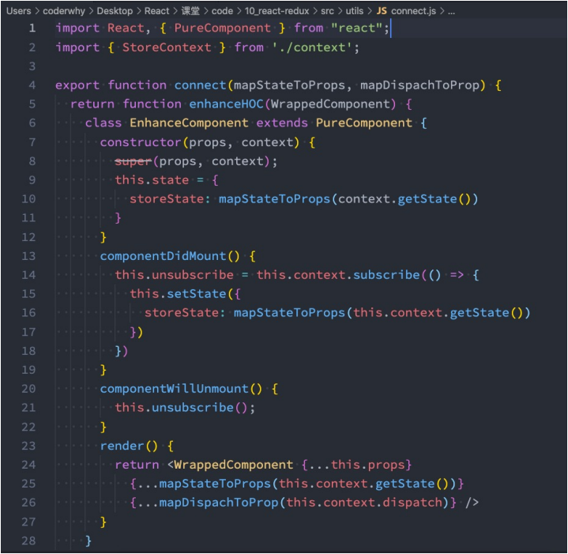

#### 

#### JavaScript中的多态

- 维基百科对多态的定义：多态（英语：polymorphism）指为不同数据类型的实体提供统一的接口，或使用一 个单一的符号来表示多个不同的类型。 
- 非常的抽象，个人的总结：不同的数据类型进行同一个操作，表现出不同的行为，就是多态的体现。

```js
function sum(a+b) {
	return a + b
}

sum(10, 20)
sum('abc', 'cba')
```


#### 字面量的增强

1. 属性的简写
2. 方法的简写
3. 计算属性名简写

```js
var name 'jz'
var age = 18

var obj = {
    name: name,
    // 1. 属性
    age,
    foo: function(){
        
    },
    // 2. 方法的简写
    bar() {
        
    },
    // 3. 计算属性名
    [name + 123]: 'haha'
}

console.log(obj)
```


#### 解构 Destructing

- ES6中新增了一个从数组或对象中方便获取数据的方法，称之为解构Destructuring。 

- 我们可以划分为：数组的解构和对象的解构。

- 数组的解构：

  - 基本解构过程 
  - 顺序解构 
  - 解构出数组 
  - 默认值

  ```js
  var names = ['nba', 'cba','abc']
  
  var [item1, item2, item3, item4 = 'test'] = names
  console.log(item1, item2, item3, item4)
  
  var [,,iteml] = names
  console.log(iteml)
  
  var [itemx, ...newNames] = names
  console.log(itemx, newNames)
  
  ```

  

- 对象的解构

  - 基本解构过程 
  - 任意顺序 
  - 重命名 
  - 默认值

```js
var obj = {
  name: 'jz',
  age: 18,
  height: 188
}

var {name, age, height}  = obj
console.log(name, age, height)

var {age} = obj
console.log(age)

var {name: newName} = obj
console.log(newName)

var {address = 'test'} = obj

console.log(address)

function foo(obj) {

}
// 函数参数解构
function bar({name, age}) {

}
```


#### let/const

ES6新增的两个关键字

- let关键字： 
  - 从直观的角度来说，let和var是没有太大的区别的，都是用于声明一个变量 
- const关键字： 
- const关键字是constant的单词的缩写，表示常量、衡量的意思； 
  - 它表示保存的数据一旦被赋值，就不能被修改； 
  - 但是如果赋值的是引用类型，那么可以通过引用找到对应的对象，修改对象的内容； 
-  注意：另外let、const不允许重复声明变量；
- let、const和var的另一个重要区别是作用域提升：
  - 我们知道var声明的变量是会进行作用域提升的； 
  - 但是如果我们使用let声明的变量，在声明之前访问会报错；
- 那么是不是意味着foo变量只有在代码执行阶段才会创建的呢？ 
  - 事实上并不是这样的，我们可以看一下ECMA262对let和const的描述； 
  - 这些变量会被创建在包含他们的词法环境被实例化时，但是是不可以访问它们的，直到词法绑定被求值；


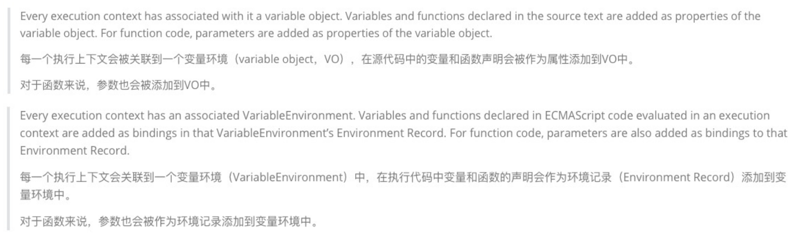

#### 变量被保存到VariableMap中

- 也就是说我们声明的变量和环境记录是被添加到变量环境中的： 
  - 但是标准有没有规定这个对象是window对象或者其他对象呢？ 
  - 其实并没有，那么JS引擎在解析的时候，其实会有自己的实现； 
  - 比如v8中其实是通过VariableMap的一个hashmap来实现它们的存储的。 
  - 那么window对象呢？而window对象是早期的GO对象，在最新的实现中其实是浏览器添加的全局对象，并且 一直保持了window和var之间值的相等性；


#### var的块级作用域

- JavaScript只会形成两个作用域：全局作用域和函数作用域。

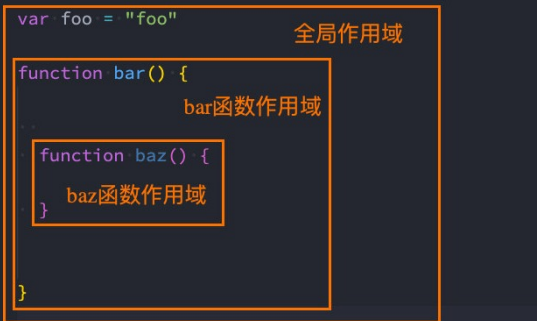

- ES5中放到一个代码中定义的变量，外面是可以访问的：

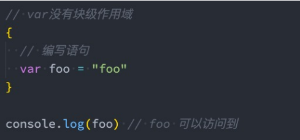

#### let/const的块级作用域

- 在ES6中新增了块级作用域，并且通过let、const、function、class声明的标识符是具备块级作用域的限制的：
- if、switch也是块级作用域
  - 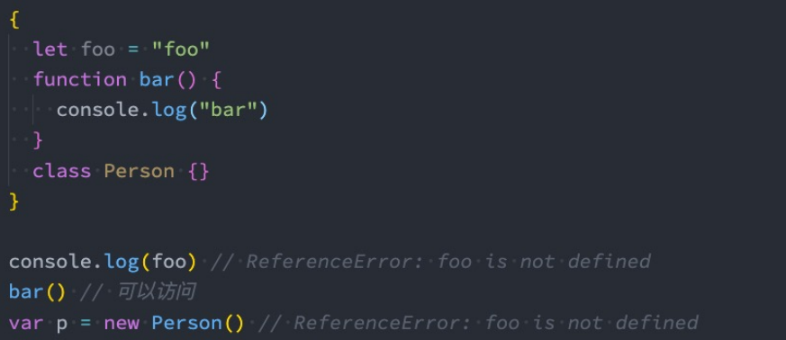
- 但是我们会发现函数拥有块级作用域，但是外面依然是可以访问的： 
  - 这是因为引擎会对函数的声明进行特殊的处理，允许像var那样进行提升；

#### 块级作用域的应用

```javascript
for (var i = 0; i < 5; i++) {
  setTimeout(() => console.log(i), 1000)
}

for (var i = 0; i < 5; i++) {
  (function (n) {
    setTimeout(() => console.log(n), 1000)
  })(i)
}

for (let i = 0; i < 5; i++) {
  setTimeout(() => console.log(i), 1000)
}

```

#### 暂时性死区

- 在ES6中，我们还有一个概念称之为暂时性死区： 

  - 它表达的意思是在一个代码中，使用let、const声明的变量，在声明之前，变量都是不可以访问的； 
  - 我们将这种现象称之为 temporal dead zone（暂时性死区，TDZ）；

  ```js
  var foo = 'foo'
  
  if(true) {
    console.log(foo) // ReferenceError: Cannot access 'foo' before initialization
  
    let foo = 'bar'
  }
  ```


#### 模板字符串 `${expression}`

- 模板字符串还有另外一种用法：标签模板字符串（Tagged Template Literals）。 

- 我们一起来看一个普通的JavaScript的函数： 

  ```js
  function foo(...args) {
      console.log(args)
  }
  
  // [ 'hello world' ]
  foo('hello world')
  ```

  

- 如果我们使用标签模板字符串，并且在调用的时候插入其他的变量： 

  - 模板字符串被拆分了； 
  - 第一个元素是数组，是被模块字符串拆分的字符串组合； 
  - 后面的元素是一个个模块字符串传入的内容；

  ```js
  function foo(...args) {
    console.log(args)
  }
  
  const name = 'jz'
  const age = 18
  
  // [ [ 'Hello ', ' World ', '' ], 'jz', 18 ]
  foo `Hello ${name} World ${age}`
  ```


#### React的styled-components库

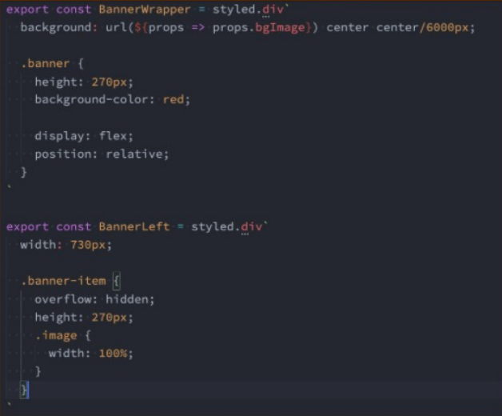


#### 函数的默认参数

- 默认值可以和解构一起使用
- 参数的默认值通常会放到最后，代码规范
- 默认值会改变函数的length的个数，默认值以及后面的参数都不计算在length之内

```js
function foo(m='a', n='b') {
    console.log(a, b)
}

function bar({name, age} = { name: 'jz', age: 18}) {}
function bar({name, age} = {}) {}

function foo(x, y, z = 20, m, n) {
  console.log(x, y, z)
}

console.log(foo.length) // 2
```


#### 函数的剩余参数

- ES6中引用了rest parameter，可以将不定数量的参数放入到一个数组中： 

  - 如果最后一个参数是 ... 为前缀的，那么它会将剩余的参数放到该参数中，并且作为一个数组；

    ```js
    function foo(m, n, ...args) {
        console.log(m, n)
        console.log(args)
    }
    ```

- 剩余参数和arguments的区别

  - 剩余参数之包含那些没有对应形参的实参，而arguments对象包含了传给函数的所有实参；
  - arguments对象不是一个真正的数组，而rest参数是一个真正的数组，可以进行数组的所有操作；
  - parguments是早期的ECMAScript中为了方便去获取所有的参数提供的一个数据结构，而rest参数是ES6中提供 并且希望以此来替代arguments的；
  - 剩余参数必须放到最后一个位置，否则会报错。


#### 箭头函数(arrow function)

1. 箭头函数不绑定 this、arguments属性

2. 箭头函数不能作为构造函数来使用（和 new 一起使用，会抛出错误）

   1. 箭头函数没有显示原型，所以不能作为构造函数，使用new创建对象

      ```js
      let baz = () => {
        console.log('baz')
      }
      
      // undefined
      console.log(baz.prototype)
      
      // TypeError: baz is not a constructor
      var f = new baz()
      ```

      

3. 箭头函数的 this，是上层作用域的this

4. 显示绑定不能改变箭头函数的 this


#### 展开语法

- 展开语法(Spread syntax)： 
  - 可以在函数调用/数组构造时，将数组表达式或者string在语法层面展开； 
  - 还可以在构造字面量对象时, 将对象表达式按key-value的方式展开；
- 展开语法的场景： 
  - 在函数调用时使用； 
  - 在数组构造时使用； 
  - 在构建对象字面量时，也可以使用展开运算符，这个是在ES2018（ES9）中添加的新特性；
- **注意**：展开运算符其实是一种浅拷贝；

```js
const names = ['jz', 'zs', 'ls']
const name = 'nbz'
const info = {
  name: 'jz',
  age: 18
}

function foo(x, y, z) {
  console.log(x, y, z)
}

// foo.apply(null, names)

// jz zs ls
foo(...names)
// n b z
foo(...name)

const newNames = [...names, ...name]
// [ 'jz', 'zs', 'ls', 'n', 'b', 'z' ]
console.log(newNames)

// {
//   '0': 'jz',
//   '1': 'zs',
//   '2': 'ls',
//   name: 'jz',
//   age: 18,
//   address: 'shanghai'
// }
const obj = { ...info, address: 'shanghai', ...names}
console.log(obj)
```


#### 数值的表示

- 在ES6中规范了二进制和八进制的写法：

  - ```javascript
    // 十进制
    const num1 = 100
    // b => binary
    /*
    * 0 * 2**0 + 0 * 2**1 + 1 * 2**2 = 4
    * */
    const num2 = 0b100
    // o => octal
    /*
    * 0 * 8**0 + 0 * 8**1 + 1 * 8**2 = 64
    * */
    const num3 = 0o100
    // x => hex
    // 0 * 16**0 + 0 * 16**1 + 0 * 16**2 = 256
    const num4 = 0x100
    
    // 100 4 64 256
    console.log(num1, num2, num3, num4)
    ```

- ES2021新增热性：数字过长时，可以使用_作为连字符

  ```js
  const num5 = 100_000_000
  ```


#### Symbol

- Symbol是什么呢？Symbol是ES6中新增的一个基本数据类型，翻译为符号。 
- 那么为什么需要Symbol呢？ 
- 在ES6之前，对象的属性名都是字符串形式，那么很容易造成属性名的冲突； 
  - 比如原来有一个对象，我们希望在其中添加一个新的属性和值，但是我们在不确定它原来内部有什么内容的情况下， 很容易造成冲突，从而覆盖掉它内部的某个属性； 
  - 比如在apply、call、bind实现时，我们有给其中添加一个fn属性，那么如果它内部原来已经有了fn属性了 呢？ 
  - 比如开发中我们使用混入，那么混入中出现了同名的属性，必然有一个会被覆盖掉； 
- Symbol就是为了解决上面的问题，用来生成一个独一无二的值。 
  - Symbol值是通过Symbol函数来生成的，生成后可以作为属性名； 
  - 也就是在ES6中，对象的属性名可以使用字符串，也可以使用Symbol值； 
- Symbol即使多次创建值，它们也是不同的：Symbol函数执行后每次创建出来的值都是独一无二的； 
- 我们也可以在创建Symbol值的时候传入一个描述description：这个是ES2019（ES10）新增的特性；

```javascript
// Symbol 作为key
let s1 = Symbol()
let s2 = Symbol()
let s3 = Symbol()

console.log(s1 === s2)

let obj = {
  name: 'jz',
  age: 18,
  [s1]: 'abc',
  [s2]: 'cba'
}

obj[s3] = 'nba'
const s4 = Symbol()
Object.defineProperty(obj, s4, {
  configurable: true,
  enumerable: true,
  writable: true,
  value: 'baz'
})

console.log(obj[s1], obj[s2], obj[s3], obj[s4])
// 注意：不能使用.语法获取 obj.s1
// 使用Symbol作为key，在遍历obj中一些方法获取不到
console.log(Object.keys(obj))
console.log(Object.getOwnPropertyNames(obj))
console.log(Object.getOwnPropertySymbols(obj))
const skeys = Object.getOwnPropertySymbols(obj)
for(const skey of skeys) {
  console.log(obj[skey])
}

// Symbol.for(key)
const sa = Symbol.for('aaa')
const sb = Symbol.for('aaa')
console.log(sa === sb)
const key = Symbol.keyFor(sa)
console.log(key)

```


#### Set的基本使用

- 在ES6之前，我们存储数据的结构主要有两种：数组、对象。 
  - 在ES6中新增了另外两种数据结构：Set、Map，以及它们的另外形式WeakSet、WeakMap。 
- Set是一个新增的数据结构，可以用来保存数据，类似于数组，但是和数组的区别是元素不能重复。 
  - 创建Set我们需要通过Set构造函数（暂时没有字面量创建的方式）： 
- 我们可以发现Set中存放的元素是不会重复的，那么Set有一个非常常用的功能就是给数组去重。

```javascript
const set1 = new Set()

set1.add(1)
set1.add(2)

console.log(set1) // Set(2) { 1, 2 }

const set2 = new Set([1, 2, 3])
console.log(set2) // Set(3) { 1, 2, 3 }

const arr1 = [...set2]
const arr2 = Array.from(set2)
console.log(arr1, arr2) // [ 1, 2, 3 ] [ 1, 2, 3 ]
```

#### Set 常见方法

- Set常见的属性： 
  - size：返回Set中元素的个数； 
- Set常用的方法： 
  - add(value)：添加某个元素，返回Set对象本身； 
  - delete(value)：从set中删除和这个值相等的元素，返回boolean类型； 
  - has(value)：判断set中是否存在某个元素，返回boolean类型； 
  - clear()：清空set中所有的元素，没有返回值； 
  - forEach(callback, [, thisArg])：通过forEach遍历set； 
  - 另外Set是支持for of的遍历的。