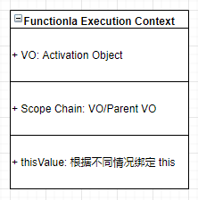
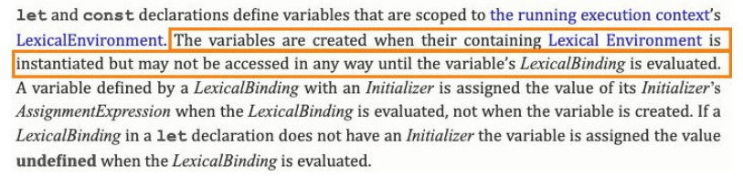

# 邂逅 JavaScript 开发

### 编程语言发展史

1. 机器语言 10000011110，机器指令
2. 汇编语言 mov、ax
3. 高级语言 编译型 C、C++、Java，解释型 JavaScript、Python

> 高级语言最终会转成机器指令
>
> ###### 10进制整数转二进制是除2取余
>
> ```
> 43（十进制） 转 2 进制
> 43 / 2 商 21 余数 1
> 21 / 2 商 10 余数 1
> 10 / 2 商 5  余数 0
> 5 / 2 商 2  余数 1
> 2 / 2 商 1  余数 0
> 1 / 2 商 0  余数 1
> 从后往前读取 43 => 101011
> ```
>
> ###### 10进制小数转2进制是乘2取1
>
> ```
> 0.1 （十进制）转 2 进制
> 0.1*2=0.2......0 -- 整数部分0。整数部分 0，清零后为 0，用0.2接着运算
> 0.2*2=0.4......0
> 0.4*2=0.8......0
> 0.8*2=1.6......1
> 0.6*2=1.2......1
> 0.2*2=0.4......0
> 0.4*2=0.8......0
> 0.8*2=1.6......1
> 0.6*2=1.2......1
> ......
> 
> 从前往后得到整数依次是 0,0,0,1,1,0,0,1,1......
> 十进制数0.1转2进制对应的二进制数是 0.000110011001...... 无限循环小数
> 0.1+0.2 !== 0.3
> ```
>
> ```js
> 1 => number -> 8byte
> 8byte => 2**64
> js引擎 V8 中 kSmiMinValue => 0 ~ 2**32 -1, 小的数字在V8 中成为Sim，小数字 2**32
> ```
>
> 

### 浏览器工作原理


### 浏览器内核

1. Geoko：早期被Netscape和Mozilla Firfox 使用
2. Trident：微软开发，IE4~IE11，Edge转向Blink
3. Webkit：苹果基于KHTML开发，用于Safari，Chrome之前也用过
4. Blink：Webkit的分支，Google开发，目前用于Google Chrome、Edge、Opera等

浏览器内核指的是浏览器的排版引擎：

1. 排版引擎（layout engine），也称浏览器引擎（browser engine）
2. 页面渲染引擎（rendering engine）或样版引擎


### 浏览器渲染过程 


### JavaScript 引擎

> 高级语言需要被转换成机器指令，才能被CPU所执行，js引擎将 js 代码翻译成 CPU指令来执行

##### 常见的js 引擎

1. V8：google 开发
2. JavaScriptCore：Apple开发，
3. Chakra：微软开发，
4. SpiderMonkey：第一款 js 引擎，js作者开发


### 浏览器内核和 JS 引擎的关系

以Webkit为例，WebKit 由两部分组成：

1. WebCore：负责HTML/CSS解析、布局、渲染等相关的工作；
2. JavaScriptCore： 解析执行JavaScript代码


### V8 引擎

1. 由C++ 编写的Google开源高性能的JavaScript和WebAssembly引擎，它用于Chrome和Node.js
2. 可以在多种环境运行，Windows、macOS、Linux
3. V8 可以独立运行，也可以嵌入到任何 C++ 应用程序中

> astexplore.net


javascript => Parse解析器 => AST 抽象语法树 => ignition解释器 => byteCode 字节码 => 转成不同环境的CPU指令


### V8引擎的架构

V8引擎本身的源码非常复杂，大概有超过100w行C++代码，通过了解它的架构，我们可以知道它是如何对JavaScript执行的： 

- Parse 模块会将 JavaScript 代码转换成AST（抽象语法树），这是因为解释器并不直接认识JavaScript代码； 
  - 如果函数没有被调用，那么是不会被转换成AST的； 
  - Parse的V8官方文档：https://v8.dev/blog/scanner 
- Ignition是一个解释器，会将AST转换成ByteCode（字节码） 
  - 同时会收集TurboFan优化所需要的信息（比如函数参数的类型信息，有了类型才能进行真实的运算）； 
  - 如果函数只调用一次，Ignition会执行解释执行ByteCode； 
  - Ignition的V8官方文档：https://v8.dev/blog/ignition-interpreter 
- TurboFan是一个编译器，可以将字节码编译为CPU可以直接执行的机器码；
  - 如果一个函数被多次调用，那么就会被标记为热点函数，那么就会经过TurboFan转换成优化的机器码，提高代码的执行性能； 
  - 但是，机器码实际上也会被还原为ByteCode，这是因为如果后续执行函数的过程中，类型发生了变化（比如sum函数原来执行的是 number类型，后来执行变成了string类型），之前优化的机器码并不能正确的处理运算，就会逆向的转换成字节码； 
  - TurboFan的V8官方文档：https://v8.dev/blog/turbofan-jit


### V8 执行的细节

##### V8引擎解析JavaScript过程：


- Blink将源码交给V8引擎，Stream获取到源码并且进行编码转换；
- Scanner会进行此法分析（lexical anlysis），此法分析会将代码转换成tokens；
- 接下来tokens会被直接转换成AST树，经过Parser和PreParser；
  - Parser直接将tokens转换成AST树架构；
  - PreParser称之为预解析，需要预解析的原因：
    - 因为并不是所有的 JavaScript Code，在一开始就会被执行，如果对所有的 JavaScript Code 进行解析，必然会影响网页的效率；
    - 所以V8引擎就实现了Lazy Parsing 的方案，它的作用是将不必要的函数进行预解析，也就是只解析暂时需要的内容，而对函数的全量解析是在函数被调用时才会进行；
    - 比如在一个outer函数内部定义了另外一个inner函数，那么inner函数就会进行预解析
- 生成AST树后，会被 Ignition 解释器解释成 bytecode，之后开始执行代码


### JavaScript的执行过程

#### 初始化全局对象

- js 引擎会在代码执行之前，会在堆内存中创建一个全局对象：Global Object (GO)

  - 该对象所有的作用域（scope）都可以访问；
  - 里面会包含Date、Array、String、Number、setTimeout、setInterval 等等；
  - 其中还有一个window属性指向自己；

  


#### 执行上下文栈（调用栈）

Execution context stack 上下文执行栈 ECS

Global execution context 全局执行上下文 GEC

Function execution context 函数执行上下文 FEC

variable object VO 变量对象

Global Object

Activation Object

- js引擎内部有一个执行上下文栈（Execution Context Stack，简称ECS），它是用于执行代码的调用栈。 

- 那么现在它要执行谁呢？执行的是全局的代码块： 
  - 全局的代码块为了执行会构建一个 Global Execution Context（GEC）； 
  
  - GEC会被放入到ECS中 执行； 
  
    
  
- GEC被放入到ECS中里面包含两部分内容： 
  - 第一部分：在代码执行前，在parser转成AST的过程中，会将全局定义的变量、函数等加入到 GlobalObject 中， 变量并不会赋值，函数会在堆中开辟一块内存保存函数体以及 parentScope：父级GO（AO）地址，返回函数内存地址给值变量；如果变量与函数重名，将共享函数内存地址
    - 这个过程也称之为变量的作用域提升（hoisting） 
  - 第二部分：在代码执行中，对变量赋值，或者执行其他的函数；如果变量名与函数重名，若变量被赋值，变量地址被修改，此时函数声明无效，无法访问函数，被变量覆盖，访问得到被覆盖的值
  
- 在执行的过程中执行到一个函数时，会根据函数体创建一个函数执行上下文（Functional Execution Context， 简称FEC），并且压入到 ECS 中。 

- FEC中包含三部分内容： 
  - 第一部分：在解析函数成为AST树结构时，会创建一个Activation Object（AO）： 
    - AO中包含形参、arguments、函数定义和指向函数对象、定义的变量； 
  
  - 第二部分：作用域链：由VO（在函数中就是AO对象）和父级VO组成，查找时会一层层查找； 
  
  - 第三部分：this绑定的值：函数运行时绑定
  
    


### 内存管理

在代码执行过程中都是需要分配内存，执行在内存中进行

内存声明周期：

1. 分配申请需要的内存
2. 使用分配的内存
3. 不需要使用，对其进行释放

不同的编程语言对第一步和第三步有不同的实现

1. 手动管理内存：C、C++，需要手动（malloc和free）管理内存
2. 自动管理内存：Java、JavaScript、Python等，一般不需要手动管理内存释放

### JS 内存管理

1. js 会在定义变量时分配内存

2. 对不同类型的变量分配方式不一样

   1. 基本数据类型会在执行时直接在栈空间进行分配

   2. 复杂数据类型内存分配会在堆内存中开辟一块空间，并且将这块空间的指针返回值变量引用

      ```js
      var a = 1 // 栈
      var obj = { a : 1 } // 堆 0xa00
      ```

### JS 的垃圾回收

1. 内存大小有限，不需要使用，对其释放，腾出更多的内存空间
2. 在手动管理内存的语言中，
   1. 低效
   2. 很容易内存泄漏
3. 现代编程语言有自己的垃圾回收机制
   1. Garbage Collection，GC
4. GC的算法，计算不需要使用

### GC算法 - 引用计数

1.  计数器 记录引用，被引用 + 1，否则 -1，变为0，被清除
2. 弊端：循环引用的对象不会被清除

### GC算法 - 标记清除

1. 设置一个根对象（root object），从根开始找有引用的对象，没有引用的对象，不可达
2. 解决循环引用的问题

JS 引擎比较广泛采用的就是标记清除算法

### 闭包（Closure）

是在支持头等函数 的编程语言中，实现词法绑定的一种技术； 

闭包在实现上是一个结构体，它存储了一个函数和一个关联的环境（相当于一个符号查找表）；

闭包跟函数最大的区别在于，当捕捉闭包的时候，它的 **自由变量** 会在补充时被确定，这样即使脱离了捕捉时的上下文，它也能照常运行

一个函数和对其周围状态（lexical environment，词法环境）的引用捆绑在一起（或者说函数被引用包围），这样的组合就是闭包（closure）；

闭包两部分组成：一个函数和一个关联的环境，这样组合被称为闭包 函数访问外部作用域的变量

### 闭包的内存泄漏

函数引用外部作用域没有释放，导致外部AO对象没有释放，js引擎优化，会释放外部AO没有引用的变量

#### 函数式一等公民

1. 函数可以作为参数
2. 函数作为返回值返回

```js
Array.prototype.myFilter = function(fn) {
    const _this = this
    const length = _this.length
    const arr = []
    for(let i=0;i < length;i++) {
        fn(_this[i], i, _this) && arr.push(_this[i])
    }
    return arr
}
```

### JS 函数的this指向 

> js module -> 加载 -> 编译 -> 放到一个函数 -> 执行这个函数.apply({})

**函数 this** 指向与函数**定义**的的**位置**无关，与**调用方式**有关

##### this 绑定规则：

1. 默认绑定
2. 隐式绑定
3. 显示绑定
4. new 绑定

### 规则一：默认绑定

独立函数调用，函数没有绑定this，直接调用

```javascript
// 默认绑定：独立函数调用
function foo() {
	console.log(this)
}

foo()
// 案例
function foo1() {
	console.log(this)
}

function foo2() {
	console.log(this)
    foo1()
}

function foo3() {
	console.log(this)
    foo2()
}

foo3()
// 案例
var obj = {
    name: 'why',
    foo: function() {
        console.log(this)
    }
}

var bar = obj.foo
bar() // window

// 案例
function foo() {
    return function() {
        console.log(this)
    }
}

var fn = foo()
fn() // this

var obj = {
    name: 'jz',
    eating: fn
}

obj.eating() // obj 隐式绑定
```

### 规则二：隐式绑定

- 通过对象进行调用 


### 规则三：显示调用

通过call、apply 绑定 this 直接运行，bind绑定 this 返回一个新函数 

1. call 直接运行
2. apply 直接运行

```javascript
function foo() {
    console.log(this)
}
// foo 直接调用执行全局对象
foo()
// call、apply 可以指定 this 绑定对象
var obj = {
    name: 'zs'
}
foo.call(obj)
foo.apply(obj)
```

3. bind 返回一个新函数

```javascript
function foo() {
    console.log(this)
}
// 默认绑定与显示绑定bind冲突，优先级（显示绑定）
var bar = foo.bind('aaa')
bar()
```


### 规则四：new 绑定

- JavaScript中的函数可以当做一个类的构造函数来使用，也就是new关键字
- 使用new 关键字来调用函数，执行如下操作：
  1. 创建一个新对象 obj
  2. obj的原型对象[[Prototype]] 指向 构造函数的原型对象 prototype
  3. 使用指定参数调用构造函数，并将 this 绑定到新创建的对象
  4. 判断result ，result 是对象返回result，否则返回 obj

```javascript
function Person(name, age) {
    this.name = name
    this.age = age
}

var p1 = new Person('jz', 18)
console.log(p1)
// new 的实现
function createNew(fn, ...args) {
    const obj = {}
    // obj.__proto__ = fn.prototype
    Object.setPrototypeOf(obj, fn.prototype)
    const result = fn.apply(obj, args)
    return typeof result === 'object' ? result : obj
}
```

### this 补充

思考 js 原生方法的内部函数调用如何实现，例如setTimeout中 fn 的为独立函数调用，onclick 内部绑定 dom对象

```javascript
// 1. setTimeout，内部直接调用fn，独立调用函数，fn 的this 执行window
setTimeout(fn, 2000)

```

### 规则优先级

1. 默认绑定优先级最低

2. 显示绑定优先级高于隐式绑定

   1. ```
      // 隐式绑定
      var obj = {
      	name: 'obj',
      	foo() {
      		console.log(this)
      	}
      }
      
      obj.foo()
      obj.foo.call('abc')
      
      // bind
      function foo() {
      	console.log(this)
      }
      
      var obj = {
      	name: 'jz',
      	foo: foo.bind('aaa')
      }
      
      obj.foo() // String {'aaa'}
      ```

3. new 优先级高于隐式绑定

4. new 优先级高于显示绑定

```
function foo() {
	console.log(this)
}

var bar = foo.bind('aaa')

var obj = new bar()
obj // foo {}
```


> 优先级：默认 < 隐式 < 显示 < new

结论：new 关键字不能和call、apply 一是使用

### this 规则之外 - 忽略显示绑定

> apply/call/bind：当传入null/undefined 时，自动将this 绑定为全局对象

```js
function foo() {
	console.log(this)
}

foo.apply('aaa')
// apply/call/bind：当传入null/undefined 时，自动将this 绑定为全局对象
foo.apply(null)
foo.apply(undefined)
var bar = foo.bind(null)
bar()
```

1. apply/call/bind：当传入null/undefined 时，自动将this 绑定为全局对象

2. 间接函数引用

   ```js
   var obj1 = {
   	name: 'obj1',
   	foo() {
   		console.log(this)
   	}
   }
   
   
   // 间接引用
   // 第一种情况
   var obj2 = {
   	name: 'obj2'
   }
   obj2.bar = obj1.foo
   obj2.bar() // {name: 'obj2', bar: ƒ}
   
   // 第二种情况，这种写法会报错，js在解析时会解析成如下格式，导致报错，正确的写法是在对象定义结束后加分号
   // 所以分号很重要，有些写法会导致解析错误
   /**
   var obj2 = {
   	name: 'obj2'
   }(obj2.bar = obj1.foo)()
   */
   // 错误写法
   var obj2 = {
   	name: 'obj2'
   }
   
   (obj2.bar = obj1.foo)()
   
   // 正确写法
   var obj2 = {
   	name: 'obj2'
   };
   // 这种写法(...)() 是独立函数调用，this 指向window
   (obj2.bar = obj1.foo)() 
   ```

3. 箭头函数(arrow function)

   1. 箭头函数不绑定 this、arguments属性
   2. 箭头函数不能作为构造函数来使用（和 new 一起使用，会抛出错误）
   3. 箭头函数的 this，是上层作用域的this
   4. 显示绑定不能改变箭头函数的 this

   ```javascript
   () => {}
   
   var nums = [1,2,3,4,5]
   nums.forEach((item, index, array)=>{})
   
   // 简写
   // 1. 函数只要一个参数 () 可以省略
   nums.forEach(item => {
       item % 2
   })
   // 2. 函数只返回一行代码 {} 可以省略
   // 强调：并且它会默认将这行代码的执行结果作为返回值
   nums.forEach(item => item % 2)
   // 3. 箭头函数返回一个对象
   var bar = () => ({name: 'jz'})
   ```

   ### 箭头函数 面试题

   ```js
   var name = "window";
   
   var person = {
     name: "person",
     sayName: function () {
       console.log(this.name);
     }
   };
   
   function sayName() {
     var sss = person.sayName;
     sss(); // window 独立函数调用
     person.sayName(); // person 隐式绑定
     (person.sayName)(); // person 隐式绑定
     (b = person.sayName)(); // 特殊情况 window
   }
   
   sayName();
   ```

   ```js
   var name = 'window'
   var person1 = {
     name: 'person1',
     foo1: function () {
       console.log(this.name)
     },
     foo2: () => console.log(this.name),
     foo3: function () {
       return function () {
         console.log(this.name)
       }
     },
     foo4: function () {
       return () => {
         console.log(this.name)
       }
     }
   }
   
   var person2 = { name: 'person2' }
   
   person1.foo1(); // person1 隐式绑定
   person1.foo1.call(person2); // person2 显示绑定
   
   person1.foo2(); // window
   person1.foo2.call(person2); // window
   
   person1.foo3()(); // window 独立函数调用
   person1.foo3.call(person2)(); // window 独立函数调用
   person1.foo3().call(person2); // person2 显示绑定
   
   person1.foo4()(); // person1
   person1.foo4.call(person2)(); // person2
   person1.foo4().call(person2); // person 1
   ```

   ```js
   var name = 'window'
   function Person (name) {
     this.name = name
     this.foo1 = function () {
       console.log(this.name)
     },
     this.foo2 = () => console.log(this.name),
     this.foo3 = function () {
       return function () {
         console.log(this.name)
       }
     },
     this.foo4 = function () {
       return () => {
         console.log(this.name)
       }
     }
   }
   var person1 = new Person('person1')
   var person2 = new Person('person2')
   
   person1.foo1() // person1 隐式绑定
   person1.foo1.call(person2) // person2 显示绑定
   
   person1.foo2() // person1
   person1.foo2.call(person2) // person1
   
   person1.foo3()() // window 独立函数调用
   person1.foo3.call(person2)() // window 独立函数调用
   person1.foo3().call(person2) // person2 显示绑定
   
   person1.foo4()() // person1
   person1.foo4.call(person2)() // person2
   person1.foo4().call(person2) // person1
   ```

   ```js
   var name = 'window'
   function Person (name) {
     this.name = name
     this.obj = {
       name: 'obj',
       foo1: function () {
         return function () {
           console.log(this.name)
         }
       },
       foo2: function () {
         return () => {
           console.log(this.name)
         }
       }
     }
   }
   var person1 = new Person('person1')
   var person2 = new Person('person2')
   
   person1.obj.foo1()() // window 独立函数调用
   person1.obj.foo1.call(person2)() // window 独立函数调用
   person1.obj.foo1().call(person2) // person2 显式绑定
   
   person1.obj.foo2()() // obj
   person1.obj.foo2.call(person2)() // person2
   person1.obj.foo2().call(person2) // obj
   ```

   

## 函数式编程

### 实现apply、call、bind

> **`Object` 构造函数将给定的值包装为一个新对象。**
>
> - 如果给定的值是 [`null`](https://developer.mozilla.org/zh-CN/docs/Web/JavaScript/Reference/Global_Objects/null) 或 [`undefined`](https://developer.mozilla.org/zh-CN/docs/Web/JavaScript/Reference/Global_Objects/undefined), 它会创建并返回一个空对象。
> - 否则，它将返回一个和给定的值相对应的类型的对象。
> - 如果给定值是一个已经存在的对象，则会返回这个已经存在的值（相同地址）。
>
> apply/call/bind：当传入null/undefined 时，自动将this 绑定为全局对象

```js
// apply 考虑边界值
// window node 都有golbalThis全局对象
// fn.apply(obj, [1, 2, 3])
Function.prototype.myApply = function(thisArg, argArray = []) {
	// 1. 获取需要被执行的函数
	const fn = this
	// 2. 处理绑定的thisArg，基本数据类型绑定this
	const ctx = (thisArg !== null && thisArg !== undefined) ? Object(thisArg) : golbalThis
	// const args = Array.from(arguments).slice(1)
	// 3. ctx 添加 fn 属性，执行 隐式绑定 this
	const key = Symbol('key')
	ctx[key] = fn
	const res = ctx[key](...argArray)
	delete ctx[key]
	// 4. 返回 res
	return res
}

// call
// fn.call(obj, 1, 2, 3)
Function.prototype.myCall = function(thisArg, ...args) {
	// 获取需要被执行的函数
	const fn = this
	// 处理绑定的thisArg
	const ctx = (thisArg !== null && thisArg !== undefined) ? Object(thisArg) : golbalThis
	// const args = Array.from(arguments).slice(1)
	const key = Symbol('key')
	ctx[key] = fn
	const res = ctx[key](...args)
	delete ctx[key]
	return res
}

function foo(num) {
	console.log(num, this)
}

var obj = {
	name: 'jz'
}

foo.myApply(obj)

// bind
// fn.bind(obj, ...args) 返回一个新函数，可以 new
Function.prototype.myBind = function(thisArg, ...args) {
	// 1. 获取到需要调用函数
	const fn = this
	const ctx = (thisArg !== null && thisArg !== undefined) ? Object(thisArg) : globalThis
	const key = Symbol('key')
	ctx[key] = fn
	function proxyFn(...args1) {
		// 判断当前的 this.__proto__ 是否指向 Fn.prototype
		// this instanceof Fn 为true，说明new Fn(...args)
				if(this instanceof proxyFn) {
				this[key] = fn
            const res = this[key](...args, ...args1)
            delete this[key]
            return res
		} else {
            const res = ctx[key](...args, ...args1)
            delete ctx[key]
            return res
		}
		
	}
	proxyFn.prototype = fn.prototype
	return proxyFn
}

function foo(name, age) {
	this.name = name
	this.age = age
	console.log(this)
}

```


### arguments

- arguments 是一个 对应于传递给 函数的参数 的 类数组（array like）对象
- 箭头函数没有 arguments，去上层作用域查找 arguments

#### 常见的arguments的操作：

1. 获取参数的长度 arguments.length
2. 根据索引值获取参数 arguments[0]
3. 获取到当前函数 arguments.callee

#### 类数组转数组

```js
// 1. 使用 for
var newArr = []
for(var i =0;i<arguments.length;i++){
	newArr.push(arguments[i])
}

// 2.
var newArr2 = Array.prototype.slice.call(arguments)
// 模拟 slice 的实现
Array.prototype.slice = function(start = 0, end = this.length){
	let arr = this
	let newArr = []
	for(let i = start ; i< end; i++) {
		newArr.push(arr[i])
	}
	return newArr
}
// 3.
var newArr3 = Array.from(arguments)
// 4
var newArr4 = [...arguments]
```

### 纯函数（Pure Function）

- 函数式编程中有一个非常重要的概念叫纯函数，JavaScript符合函数式编程的范式，所以也有纯函数的概念
  - 掌握纯函数对于理解很多框架的设计是非常有帮助的
  - react 中的组件就被要求是纯函数，redux中有一个reducer的概念
- 纯函数的维基百科定义：
  - 在程序设计中，若一个函数符合以下条件，那么这个函数被称为纯函数： 
  - 此函数在相同的输入值时，需产生相同的输出。 
  - 函数的输出和输入值以外的其他隐藏信息或状态无关，也和由I/O设备产生的外部输出无关。 
  - 该函数不能有语义上可观察的函数副作用，诸如“触发事件”，使输出设备输出，或更改输出值以外物件的内容等
- 总结：
  - 确定的输入，一定会产生确定的输出
  - 函数执行过程中，不能产生副作用

### 副作用

- 副作用的概念

  - 副作用（side effect）其实本身是医学的概念，比如吃药会有一些副作用

  - 在计算机科学中，也引用副作用的概念，表示在执行一个函数时，除了返回函数值之外，还对调用函数产生 了附加的影响，比如修改了全局变量，修改参数或者改变外部的存储；
- 纯函数在执行过程中不能产生副作用


### 纯函数 案例

数组两个方法，slice，splice

1. slice ，确定输入值，返回固定的值，不会改变原数组，slice 是一个纯函数
2. splice，执行时，会修改原数组，修改的这个操作就是产生的副作用

React 中所有组件都是按照纯函数进行编程


### JavaScript 柯里化

- 维基百科的解释： 
- 在计算机科学中，柯里化（英语：Currying），又译为卡瑞化或加里化； 
  - 是把接收多个参数的函数，变成接受一个单一参数（最初函数的第一个参数）的函数，并且返回接受余下的参 数，而且返回结果的新函数的技术； 
  - 柯里化声称 “如果你固定某些参数，你将得到接受余下参数的一个函数”； 
- 维基百科的结束非常的抽象，我们这里做一个总结：
  - 只传递给函数一部分参数来调用它，让它返回一个函数去处理剩余的参数； 
  - 这个过程就称之为柯里化

#### 让函数的职责单一

为什么需要柯里化：

1. 在函数式编程中，希望一个函数的问题尽可能的单一，而不是将一大堆得处理过程交给一个函数来处理
2. 每次传入的参数在单一的函数中进行，处理完成后在下一个函数中使用处理后的参数

#### 逻辑复用

可以对于一些功能实现复用，不用重复去定义

```js
function log(date, type, message) {
  console.log(`[${date.getHours()}:${date.getMinutes()}][${type}: ${message}]`)
}
// 柯里化实现
const curryLog = date => type => message => console.log(`[${date.getHours()}:${date.getMinutes()}][${type}: ${message}]`)
// 这里复用log的逻辑
const type = curryLog(new Date())('log')
type('test')
type('测试')
```

#### 柯里化的实现

````js
function curry(fn) {
  function curryFn(...args) {
    // 判断当前接收到参数的个数，是否和需要接受的参数是否一致
    if(args.length >= fn.length) {
      // 绑定 this，如果显示绑定this
        // fn.call(this, ...args)
      return fn.apply(this, args)
    } else {
      return function(...args1) {
          // 递归调用
        return curryFn.apply(this, [...args, ...args1])
      }
    }
  }

  return curryFn
}
````

#### 柯里化应用场景

1. React Reduce
2. Vue 源码使用


#### 组合函数

- 组合（Compose）函数是在JavaScript开发过程中一种对函数的使用技巧、模式： 
  - 比如我们现在需要对某一个数据进行函数的调用，执行两个函数fn1和fn2，这两个函数是依次执行的； 
  - 那么如果每次我们都需要进行两个函数的调用，操作上就会显得重复； 
  - 那么是否可以将这两个函数组合起来，自动依次调用呢？ 
  - 这个过程就是对函数的组合，我们称之为 组合函数（Compose Function）；

```js
// function compose(...fns) {
//   const length = fns.length
//   for (let i = 0; i < length; i++) {
//     if (typeof fns[i] !== 'function') {
//       throw TypeError('Expected arguments are function')
//     }
//   }
//   return function (...args) {
//     let index = 0
//     let result = length ? fns[index].apply(this, args) : args
//     while(true) {
//       index++
//       if(index>=length) {
//         break
//       }
//       result = fns[index].call(this, result)
//     }
//     return result
//   }
// }

// console.log(compose(add, square, double)(1))

function double(m) {
  return m * 2
}

function square(n) {
  return n ** 2
}

function add(num) {
  return num + 2
}

// 从左往右执行
const compose = (...fns) => value => fns.reduce((pre, cur) => cur(pre), value)
// 从右往左执行
const pipe = (...fns) => value => fns.reduceRight((pre, cur) => cur(pre), value)

console.log(compose(add, square, double)(1))
console.log(pipe(add, square, double)(1))

```


### JS 其他知识点

#### with 语句

1. with 语句可以形成自己的作用域，去先传入参数的中查找，然后再去上层作用域，一层层到全局
2. 严格模式不能使用

```js
let message = 'Hello World'
const obj = {
    message: 'obj msg'
}
with(obj) {
    console.log(message) // obj msg
}
```

#### eval 执行js字符串代码

> 不建议开发使用
>
> 1. eval 代码的可读性非常的差（代码的可读性是高质量代码的重要原则）； 
> 2. eval 是一个字符串，那么有可能在执行的过程中被刻意篡改，那么可能会造成被攻击的风险； 
> 3. eval 的执行必须经过JS解释器，不能被JS引擎优化；

```js
var jsString = `var message = 'hello';console.log(message)`
eval(jsString)
```


#### 严格模式

- 在ECMAScript5标准中，JavaScript提出了严格模式的概念（Strict Mode）： 
  - 严格模式很好理解，是一种具有限制性的JavaScript模式，从而使代码隐式的脱离了 ”松散（sloppy）模式“； 
  - 支持严格模式的浏览器在检测到代码中有严格模式时，会以更加严格的方式对代码进行检测和执行； 
- 严格模式对正常的JavaScript语义进行了一些限制： 
  - 严格模式通过 **抛出错误** 来消除一些原有的 **静默（silent）错误**； 
  - 严格模式让JS引擎在执行代码时可以进行更多的优化（不需要对一些特殊的语法进行处理）； 
  - 严格模式禁用了在ECMAScript未来版本中可能会定义的一些语法；（关键字、保留字）

- 严格模式支持粒度话的迁移： 严格模式通过在文件或者函数开头使用 use strict 来开启

  - 可以支持在js文件中开启严格模式； 

  - 也支持对某一个函数开启严格模式；

    ```js
    "use strict"
    
    function foo() {
    	"use strict"
    }
    ```

- 严格模式限制

  1. 无法意外的创建全局变量 
  2.  严格模式会使引起静默失败(silently fail,注:不报错也没有任何效果)的赋值操作抛出异常 
  3. 严格模式下试图删除不可删除的属性 
  4. 严格模式不允许函数参数有相同的名称 
  5. 不允许0的八进制语法 
  6. 在严格模式下，不允许使用with 
  7.  在严格模式下，eval不再为上层引用变量 
  8. 严格模式下，this绑定不会默认转成对象

```js
// "use strict"
function foo() {
    console.log(this)
}

foo() // undefined

setTimeout(function() {
    console.log(this)
})
```


## 面向对象

### 面向对象是现实的抽象方式

- 对象是JavaScript中一个非常重要的概念，这是因为对象可以将多个相关联的数据封装到一起，更好的描述一个事物： 
  -  比如我们可以描述一辆车：Car，具有颜色（color）、速度（speed）、品牌（brand）、价格（price），行驶（travel）等 等；
  - 比如我们可以描述一个人：Person，具有姓名（name）、年龄（age）、身高（height），吃东西（eat）、跑步（run） 等等； 
- 用对象来描述事物，更有利于我们将现实的事物，抽离成代码中某个数据结构： 
  - 所以有一些编程语言就是纯面向对象的编程语言，比Java； 
  - 你在实现任何现实抽象时都需要先创建一个类，根据类再去创建对象；


### JavaScript的面向对象

- JavaScript其实支持多种编程范式的，包括函数式编程和面向对象编程： 

  - JavaScript中的对象被设计成一组属性的无序集合，像是一个哈希表，有key和value组成； 
  - key是一个标识符名称，value可以是任意类型，也可以是其他对象或者函数类型； 
  - 如果值是一个函数，那么我们可以称之为是对象的方法； 

- 如何创建一个对象呢？

- 早期使用创建对象的方式最多的是使用Object类，并且使用new关键字来创建一个对象： 

  - 这是因为早期很多JavaScript开发者是从Java过来的，它们也更习惯于Java中通过new的方式创建一个对象； 

    ```js
    var obj = new Object()
    obj.name = 'jz'
    obj.age = 18
    obj.eating = function() {
        console.log(this.name + ' eating')
    }
    ```

    

- 后来很多开发者为了方便起见，都是直接通过字面量的形式来创建对象： 

  - 这种形式看起来更加的简洁，并且对象和属性之间的内聚性也更强，所以这种方式后来就流行了起来；

    ```js
    var obj = {
        name: 'jz',
        age: 18,
        eating() {
            console.log(this.name + ' eating')
        }
    }
    ```

    


### 对属性的操作

要对一个属性进行比较精准的操作控制，那么我们就可以使用属性描述符

- 通过属性描述符可以精准的添加或修改对象的属性； 
- 属性描述符需要使用 Object.defineProperty 来对属性进行添加或者修改；


### Object.defineProperty

> Object.defineProperty(obj, prop, descriptor)

- 可接收三个参数： 
  - obj 要定义属性的对象； 
  - prop 要定义或修改的属性的名称或 Symbol； 
  - descriptor 要定义或修改的属性描述符； 
- 返回值： 
  - 被传递给函数的对象。

#### 属性描述符

- 属性描述符的类型有两种： 

  - 数据属性（Data Properties）描述符（Descriptor）； 
  - 存取属性（Accessor访问器 Properties）描述符（Descriptor）；

  |                | configurable | enumerable | value |      | writable | get  | set  |
  | -------------- | ------------ | ---------- | ----- | ---- | -------- | ---- | ---- |
  | 数据属性描述符 | Y            | Y          | Y     |      | Y        | N    | N    |
  | 存取属性描述符 | Y            | Y          | N     |      | N        | Y    | Y    |

#### 数据属性描述符

- 数据数据描述符有如下四个特性： 
- [[Configurable]]：表示属性是否可以通过delete删除属性，是否可以修改它的特性，或者是否可以将它修改为存取属性描述符； 
  - 当我们直接在一个对象上定义某个属性时，这个属性的[[Configurable]]为true； 
  - 当我们通过属性描述符定义一个属性时，这个属性的[[Configurable]]默认为false；
-  [[Enumerable]]：表示属性是否可以通过for-in或者Object.keys()返回该属性； 
  - 当我们直接在一个对象上定义某个属性时，这个属性的[[Enumerable]]为true； 
  - 当我们通过属性描述符定义一个属性时，这个属性的[[Enumerable]]默认为false； 
- [[Writable]]：表示是否可以修改属性的值； 
  - 当我们直接在一个对象上定义某个属性时，这个属性的[[Writable]]为true； 
  - 当我们通过属性描述符定义一个属性时，这个属性的[[Writable]]默认为false； 
- [[value]]：属性的value值，读取属性时会返回该值，修改属性时，会对其进行修改； 
  - 默认情况下这个值是undefined；

#### 存取属性描述符

数据数据描述符有如下四个特性： 

- [[Configurable]]：表示属性是否可以通过delete删除属性，是否可以修改它的特性，或者是否可以将它修改为存取属性 描述符； 
  - 和数据属性描述符是一致的； 
  - 当我们直接在一个对象上定义某个属性时，这个属性的[[Configurable]]为true； 
  - 当我们通过属性描述符定义一个属性时，这个属性的[[Configurable]]默认为false； 
- [[Enumerable]]：表示属性是否可以通过for-in或者Object.keys()返回该属性； 
  - 和数据属性描述符是一致的； 
  - 当我们直接在一个对象上定义某个属性时，这个属性的[[Enumerable]]为true；
  - 当我们通过属性描述符定义一个属性时，这个属性的[[Enumerable]]默认为false； 
- [[get]]：获取属性时会执行的函数。默认为undefined 
- [[set]]：设置属性时会执行的函数。默认为undefined

```js
let obj = {
    name: 'jz',
    age: 18,
    _adress: 'beijing' // _私有属性，约定
}

Object.defineProperty(obj, 'adress', {
  configurable: true,
  enumerable: true,
  get() {
    return obj._adress
  },
  set(value) {
    foo(value)
    obj._adress = value
  }
})

// 或者直接get set
let obj = {
    name: 'jz',
    age: 18,
    _adress: 'beijing', // _私有属性，约定
    get adress(){
        return this._adress
    },
    set adress(value){
        this._adress = value
    }
}
// 获取obj的name的属性描述
Object.getOwnPropertyDescriptor(obj, 'name')
// 获取obj所有的属性，属性描述
Object.getOwnPropertyDescriptors(obj)
// 禁止对象继续添加新的属性
Object.preventExtensions(obj)
// 禁止对象添加新属性并且将现有属性标记为不可配置
Object.seal(obj) // preventExtensions + (configurable = false) 
// 冻结对象，任何操作都会失败
Object.freeze(obj) // seal + (writable = false)

```


### 创建多个对象的方案，设计模式

#### 1. 工厂模式，工厂方法来创建对象

​	**缺点**：获取不到对象的具体类型

```js
function createPerson(name, age, height, address) {
  var p = new Object()
  p.name = name
  p.age = name
  p.height = height
  p.address = address

  p.eating = function() {
    console.log(this.name+' eating!')
  }

  p.running = function() {
    console.log(this.name+' running!')
  }

  return p
}

var p1 = createPerson('zs', 18, 1.75, 'shanghai')
var p2 = createPerson('zs', 18, 1.75, 'shanghai')
var p3 = createPerson('zs', 18, 1.75, 'shanghai')

p1 => {
  name: 'zs',
  age: 'zs',
  height: 1.75,
  address: 'shanghai',
  eating: [Function (anonymous)],
  running: [Function (anonymous)]
}

```

#### 2. 构造函数模式

##### 什么是构造函数？ 

- 构造函数也称之为构造器（constructor），通常是我们在创建对象时会调用的函数； 

- 在其他面向的编程语言里面，构造函数是存在于类中的一个方法，称之为构造方法； 

- 但是JavaScript中的构造函数有点不太一样； 

##### JavaScript中的构造函数是怎么样的？ 

- **构造函数**也是一个**普通的函数**，从表现形式来说，和千千万万个普通的函数没有任何区别； 
- 那么如果这么一个**普通的函数**被使用**new**操作符来调用了，那么**这个函数**就称之为是一个**构造函数**；

##### new操作符调用的作用

##### 一个函数被使用new操作符调用了，那么它会执行如下操作：

1. 在内存中创建一个新的对象（空对象）； 
2. 这个对象内部的[[prototype]]属性会被赋值为该构造函数的prototype属性；（后面详细讲）； 
3. 构造函数内部的this，会指向创建出来的新对象； 
4. 执行函数的内部代码（函数体代码）； 
5. 如果构造函数没有返回非空对象，则返回创建出来的新对象

##### 构造函数，首字母大写

**缺点**：每次重新new，创建新对象，需要为每个对象去创建一个函数对象实例，浪费空间

```js
function Person(name, age) {
  this.name = name
  this.age = age

  this.eating = function() {
    console.log(this.name + ' eating!')
  }
}

var p1 = new Person('jz', 18)
var p2 = new Person('zs', 18)

console.log(p1)
```


#### 3. 原型和构造函数结合

> 对象隐式原型属性 [[Prototype]] => `obj.__proto__` / `Object.getPrototypeOf()`
>
> 函数显式原型对象 prototype =>  `fn.prototype`
>
> 函数隐式原型属性 [[Prototype]] => `fn.__proto__`


```js
function Person(name, age) {
  this.name = name
  this.age = age
}

Person.prototype.eating = function() {
  console.log(this.name + ' eating!')
}

var p1 = new Person('zs', 18)
var p2 = new Person('ls', 18)

p1.eating()
p2.eating()

```

#### 对象的原型

- JavaScript当中每个对象都有一个特殊的内置属性 [[prototype]]，这个特殊的对象可以指向另外一个对象。
- 那么这个对象有什么用呢？
  - 当我们通过引用对象的属性key来获取一个value时，它会触发 [[Get]]的操作； 
  - 这个操作会首先检查该属性是否有对应的属性，如果有的话就使用它； 
  - 如果对象中没有改属性，那么会访问对象[[prototype]]内置属性指向的对象上的属性；
- 获取的方式有两种： 
  - 方式一：通过对象的 __proto__ 属性可以获取到（但是这个是早期浏览器自己添加的，存在一定的兼容性问 题）； 
  - 方式二：通过 Object.getPrototypeOf 方法可以获取到

#### 函数的原型 prototype

js函数有一个特殊的属性 prototype

### JavaScript 中的类和对象

- 当我们编写如下代码的时候，我们会如何来称呼这个Person呢？ 
  - 在 JS 中 Person 应该被称之为是一个构造函数； 
  - 从很多面向对象语言过来的开发者，也习惯称之为**类**，因为类可以帮助我们创建出来对象p1、p2； 
  - 如果从面向对象的编程范式角度来看，Person确实是可以称之为类的；

```js
function Person() {

}

var p1 = new Person()
```

#### 面向对象的特性 – 继承

- 面向对象有三大特性：封装、继承、多态（抽象：把现实抽象为类）
  -  封装：我们前面将属性和方法封装到一个类中，可以称之为封装的过程； 
  - 继承：继承是面向对象中非常重要的，不仅仅可以减少重复代码的数量，也是多态前提（纯面向对象中）；
  -  多态：不同的对象在执行时表现出不同的形态；
- 继承
  - 继承可以帮助我们将重复的代码和逻辑抽取到父类中，子类只需要直接继承过来使用即可。

#### JavaScript原型链

```
var obj = {} // new Object()
obj.__proto__ === Object.prototype
obj.__proto__.__proto__ === null
```

#### Object的原型

Object.prototype 顶层原型，原型属性指向null，该对象上有很多默认的属性和方法

Object 是所有类的父类


#### 通过原型链继承

```js
function Person() {
  this.name = 'jz'
  this.friends = []
}

Person.prototype.eating = function () {
  console.log(this.name + ' eating~')
}

function Student(sno) {
  this.sno = sno
}

Student.prototype = new Person()

Student.prototype.studying = function (){
  console.log(this.name + ' studing~')
}

var student1 = new Student(111)
var student2 = new Student(112)

// 直接给student2 添加 name 属性
student2.name = 'zs'

// 获取引用，修改引用的属性，会相互影响
student2.friends.push('ls')

console.log(student1)
console.log(student2)
student1.eating()
student1.studying()
// Person { sno: 111 }
// Person { sno: 112, name: 'zs' }
// jz eating~
// jz studing~

```

##### 原型链继承的弊端

但是目前有一个很大的弊端：某些属性其实是保存在对象上的； 

- 第一，我们通过直接打印对象是看不到这个属性的（原型上的name没有展示）； 
- 第二，这个属性会被多个对象共享，如果这个对象（friends）是一个引用类型，那么就会造成问题； 
- 第三，不能给Person传递参数，因为这个对象是一次性创建的（没办法定制化）；


#### 借用构造函数继承（组合借用继承）

- 为了解决原型链继承中存在的问题，开发人员提供了一种新的技术: constructor stealing(有很多名称: 借用构造函 数或者称之为经典继承或者称之为伪造对象)： 

  - steal是偷窃、剽窃的意思，但是这里可以翻译成借用； 

- 借用继承的做法非常简单：在子类型构造函数的内部调用父类型构造函数. 

  - 因为函数可以在任意的时刻被调用； 
  - 因此通过apply()和call()方法也可以在新创建的对象上执行构造函数；

- **弊端**：

  - Person函数至少调用两次
  - Student 的原型对象上多出一些属性（new Person 返回的对象上产生一些属性）

  

```js
function Person(name, age, friends) {
  this.name = name
  this.age = age
  this.friends = friends
}

Person.prototype.eating = function () {
  console.log(this.name + ' eating~')
}

function Student(name, age, friends, sno) {
  // 借用构造函数，绑定 this 传值
  Person.call(this, name, age, friends)
  this.sno = sno
}

// 创建一个对象
Student.prototype = new Person()

Student.prototype.studying = function (){
  console.log(this.name + ' studing~')
}

var student1 = new Student('jz', 18, ['kobe', 'james'], 1)
var student2 = new Student('ls', 18, ['curry'], 2)

// 直接给student2 添加 name 属性
student2.name = 'zs'

// 获取引用，修改引用的属性，会相互影响
student2.friends.push('ls')

console.log(student1)
console.log(student2)
student1.eating()
student1.studying()
// Person { sno: 111 }
// Person { sno: 112, name: 'zs' }
// jz eating~
// jz studing~
```


#### 原型式继承

- 原型式继承的渊源 
  - 这种模式要从道格拉斯·克罗克福德（Douglas Crockford，著名的前端大师，JSON的创立者）在2006年写的 一篇文章说起: Prototypal Inheritance in JavaScript(在JS中使用原型式继承) 
  - 在这篇文章中，它介绍了一种继承方法，而且这种继承方法不是通过构造函数来实现的. 
  - 为了理解这种方式，我们先再次回顾一下JavaScript想实现继承的目的：重复利用另外一个对象的属性和方法. 
- 最终的目的：student对象的原型指向了person对象；

```js
// 原型式继承 三种方法
function createObject1(o) {
  var newObj = {}
  Object.setPrototypeOf(newObj, o)
  return newObj
}

function createObject2(o) {
  function Fn() {}
  Fn.prototype = o
  return new Fn()
}

// info的原型指向obj
var info = Object.create(obj)
console.log(info)
console.log(info.__proto__)

```


#### 寄生式继承函数

- 寄生式(Parasitic)继承 

  - 寄生式(Parasitic)继承是与原型式继承紧密相关的一种思想, 并且同样由道格拉斯·克罗克福德(Douglas Crockford)提出和推广的； 
  - 寄生式继承的思路是结合原型类继承和工厂模式的一种方式； 
  - 即创建一个封装继承过程的函数, 该函数在内部以某种方式来增强对象，最后再将这个对象返回；

  ```javascript
  // 原型式继承
  function object(obj) {
    function Fn() {}
    Fn.prototype = obj
    return new Fn()
  }
  
  // 工厂函数 + 原型继承
  function createStudent(name) {
    var newObj = object(Person.prototype)
    newObj.name = name
    newObj.studying = function() {
      console.log(this.name + ' studying')
    }
  
    return newObj
  }
  
  function Person(name, age) {}
  
  Person.prototype.eating = function() {
    console.log(this.name + ' eating~')
  }
  
  var stu = createStudent(Person.prototype)
  console.log(stu)
  ```

- 弊端：

  - 不能明确新对象的类型
  - 新对象每次都会创建函数实例对象 （studing）


#### 寄生组合式继承

[MDN 寄生组合实现](https://developer.mozilla.org/zh-CN/docs/Web/JavaScript/Reference/Global_Objects/Object/create)

- 现在我们来回顾一下之前提出的比较理想的组合继承 
  - 组合继承是比较理想的继承方式, 但是存在两个问题: 
    - 问题一: 构造函数会被调用两次: 一次在创建子类型原型对象的时候, 一次在创建子类型实例的时候. 
    - 问题二: 父类型中的属性会有两份: 一份在原型对象中, 一份在子类型实例中. 
- 事实上, 我们现在可以利用寄生式继承将这两个问题给解决掉. 
- 你需要先明确一点: 当我们在子类型的构造函数中调用父类型.call(this, 参数)这个函数的时候, 就会将父类型中 的属性和方法复制一份到了子类型中. 所以父类型本身里面的内容, 我们不再需要. 
  - 这个时候, 我们还需要获取到一份父类型的原型对象中的属性和方法. 
  - 能不能直接让子类型的原型对象 = 父类型的原型对象呢? 
  - 不要这么做, 因为这么做意味着以后修改了子类型原型对象的某个引用类型的时候, 父类型原生对象的引用类型 也会被修改. 
  - 我们使用前面的寄生式思想就可以了.

```javascript
// 原型式继承
function createObject(obj) {
  function Fn() {}
  Fn.prototype = obj
  return new Fn()
}

function inheritPrototype(SubType, SuperType) {
  // SubType.prototype = Object.create(SuperType.prototype)
  // 原型式继承
  SubType.prototype = createObject(SuperType.prototype)
  // 改变 constructor 指向 SubType，明确类型
  Object.defineProperty(SubType.prototype, 'constructor', {
    configurable: true,
    enumerable: false,
    writable: true,
    value: SubType
  })
}

function Person(name, age) {
  this.name = name
  this.age = age
}

Person.prototype.eating = function() {
  console.log(this.name + ' eating')
}

function Student(name, age, sno) {
  // 借用构造函数，绑定 this 传值
  Person.call(this, name, age)
  this.sno = sno
}

// Student.prototype = Object.create(Person.prototype)
// Object.defineProperty(Student, 'constructor', {
//   configurable: true,
//   enumerable: false,
//   writable: true,
//   value: Student
// })
inheritPrototype(Student, Person)

Student.prototype.studying = function () {
  console.log(this.name + ' studying')
}

var stu = new Student('jz', 18, 1)
console.log(stu)
stu.eating()
stu.studying()

```


#### 对象方法补充

1. hasOwnProperty 判断对象是否有某一个属于自己的属性（不包括原型上的属性）
2. in/for in 判断某个属性是否在某个对象或某个对象的原型上
3. instanceof 用于检测构造函数的prototype，是否出现在实例对象的原型链上
4. isPrototypeOf 用于检测某个对象，是否出现在某个实例对象的原型链上

```javascript
var obj = {
  name: 'jz',
  age: 18
}

var info = Object.create(obj, {
  address: {
    writable: true,
    value: 'shanghai'
  }
})

// hasOwnProperty 判断属性是否属于对象，不包括原型继承属性
console.log(info.hasOwnProperty('name')) // false
console.log(info.hasOwnProperty('address')) // true

// in / for in 操作符 包括原型继承属性
console.log('address' in info) // true
console.log('name' in info) // true

// instanceof 判断当前构造函数有没有出现在对象的原型链中
console.log(info instanceof Function)
console.log(info instanceof Object)

// isPrototypeOf 用于检测某个对象，是否出现某个实例对象的原型链上
function Person() {

}

var p = new Person()

console.log(Person.prototype.isPrototypeOf(p))
console.log(obj.isPrototypeOf(info))
```


#### class定义类

- 在ES6（ECMAScript2015）新的标准中使用了class关键字来直接定义类； 
- 但是类本质上依然是ES5的构造函数、原型链的语法糖而已；

```javascript
class Person{}

var Student = class {}
```

#### 类的构造函数

- 每个类都可以有一个自己的构造函数（方法），这个方法的名称是固定的constructor； 
- 当我们通过new操作符，操作一个类的时候会调用这个类的构造函数constructor； 
- 每个类只能有一个构造函数，如果包含多个构造函数，那么会抛出异常；

#### 类的实例方法

#### 类的访问器方法

setter 和 getter

#### 类的静态方法

静态方法通常用于定义直接使用类来执行的方法，不需要有类的实例，使用static关键字来定义

#### ES6的继承 - extends

#### super 关键字

- 这个super关键字有不同的使用方式： 

  - 注意：在子（派生）类的构造函数中使用this或者返回默认对象之前，必须先通过super调用父类的构造函数！ 

  - super的使用位置有三个：子类的构造函数、实例方法、静态方法；

    ```js
    // 调用 父对象/父类 的构造函数
    super([arguments])
    // 调用 父对象/父类 上的方法
    super.functionOnparent([arguments])
    
    ```

    ```javascript
    class Person {
      // 类的构造方法
      constructor(name, age) {
        this.name = name
        this.age = age
        this._address = 'shanghai'
      }
    
      // 类的实例方法
      eating() {
        console.log(this.name + ' eating!')
      }
    
      running() {
        console.log(this.name + ' running!')
      }
    
      // 类的访问器，进行拦截
      get address() {
        return this._address
      }
    
      set address(value) {
        this._address = value
      }
    
      // 静态方法，类方法
      static createPerson(name, age){
        return new Person(name, age)
      }
    
      static staticMethod() {
        console.log('PersonStaticMethod')
      }
    }
    
    // var p1 = new Person('jz', 18)
    // var p2 = new Person('zs', 18)
    // console.log(p1, p2)
    // p1.eating()
    // p2.eating()
    //
    // console.log(Object.getOwnPropertyDescriptors(Person.prototype))
    
    class Student extends Person {
      // JS 引擎在解析子类的时候要求，如果有实现继承
      // 那么子类的构造方法，在使用this之前
      constructor(name, age, sno) {
        super(name, age)
        this.sno = sno
      }
    
      studying() {
        console.log(this.name + ' studying')
      }
    
      // 父类方法重写
      running() {
        console.log('Student ' + this.name + ' running!')
      }
    
      eating() {
        // 调用父类的方法
        // 复用逻辑
        super.eating();
        console.log('Student ' + this.name + ' eating little')
      }
    
      // 静态方法重写，逻辑复用
      static staticMethod() {
        super.staticMethod()
        console.log('StudentStaticMethod')
      }
    }
    
    var stu = new Student('jz', 18, 1)
    console.log(stu)
    stu.eating()
    stu.running()
    Student.staticMethod()
    ```

    

#### ES6 转 ES5

```javascript
// babel es6 编译 ES
"use strict";

function _typeof(obj) {
  "@babel/helpers - typeof";
  return (
    (_typeof =
      "function" == typeof Symbol && "symbol" == typeof Symbol.iterator
        ? function (obj) {
          return typeof obj;
        }
        : function (obj) {
          return obj &&
          "function" == typeof Symbol &&
          obj.constructor === Symbol &&
          obj !== Symbol.prototype
            ? "symbol"
            : typeof obj;
        }),
      _typeof(obj)
  );
}

function _get() {
  if (typeof Reflect !== "undefined" && Reflect.get) {
    _get = Reflect.get;
  } else {
    debugger
    _get = function _get(target, property, receiver) {
      var base = _superPropBase(target, property);
      if (!base) return;
      var desc = Object.getOwnPropertyDescriptor(base, property);
      if (desc.get) {
        return desc.get.call(arguments.length < 3 ? target : receiver);
      }
      return desc.value;
    };
  }
  return _get.apply(this, arguments);
}

function _superPropBase(object, property) {
  while (!Object.prototype.hasOwnProperty.call(object, property)) {
    object = _getPrototypeOf(object);
    if (object === null) break;
  }
  return object;
}

function _inherits(subClass, superClass) {
  if (typeof superClass !== "function" && superClass !== null) {
    throw new TypeError("Super expression must either be null or a function");
  }
  subClass.prototype = Object.create(superClass && superClass.prototype, {
    constructor: { value: subClass, writable: true, configurable: true }
  });
  Object.defineProperty(subClass, "prototype", { writable: false });
  // 目的是静态方法的继承
  // Student.__proto__ = Person
  if (superClass) _setPrototypeOf(subClass, superClass);
}

function _setPrototypeOf(o, p) {
  _setPrototypeOf =
    Object.setPrototypeOf ||
    function _setPrototypeOf(o, p) {
      o.__proto__ = p;
      return o;
    };
  return _setPrototypeOf(o, p);
}

function _createSuper(Derived) {
  var hasNativeReflectConstruct = _isNativeReflectConstruct();
  return function _createSuperInternal() {
    var Super = _getPrototypeOf(Derived),
      result;
    if (hasNativeReflectConstruct) {
      var NewTarget = _getPrototypeOf(this).constructor;
      result = Reflect.construct(Super, arguments, NewTarget);
    } else {
      result = Super.apply(this, arguments);
    }
    return _possibleConstructorReturn(this, result);
  };
}

function _possibleConstructorReturn(self, call) {
  if (call && (_typeof(call) === "object" || typeof call === "function")) {
    return call;
  } else if (call !== void 0) {
    throw new TypeError(
      "Derived constructors may only return object or undefined"
    );
  }
  return _assertThisInitialized(self);
}

function _assertThisInitialized(self) {
  if (self === void 0) {
    throw new ReferenceError(
      "this hasn't been initialised - super() hasn't been called"
    );
  }
  return self;
}

function _isNativeReflectConstruct() {
  if (typeof Reflect === "undefined" || !Reflect.construct) return false;
  if (Reflect.construct.sham) return false;
  if (typeof Proxy === "function") return true;
  try {
    Boolean.prototype.valueOf.call(
      Reflect.construct(Boolean, [], function () {})
    );
    return true;
  } catch (e) {
    return false;
  }
}

function _getPrototypeOf(o) {
  _getPrototypeOf = Object.setPrototypeOf
    ? Object.getPrototypeOf
    : function _getPrototypeOf(o) {
      return o.__proto__ || Object.getPrototypeOf(o);
    };
  return _getPrototypeOf(o);
}

function _classCallCheck(instance, Constructor) {
  if (!(instance instanceof Constructor)) {
    throw new TypeError("Cannot call a class as a function");
  }
}

function _defineProperties(target, props) {
  for (var i = 0; i < props.length; i++) {
    var descriptor = props[i];
    descriptor.enumerable = descriptor.enumerable || false;
    descriptor.configurable = true;
    if ("value" in descriptor) descriptor.writable = true;
    Object.defineProperty(target, descriptor.key, descriptor);
  }
}

function _createClass(Constructor, protoProps, staticProps) {
  if (protoProps) _defineProperties(Constructor.prototype, protoProps);
  if (staticProps) _defineProperties(Constructor, staticProps);
  Object.defineProperty(Constructor, "prototype", { writable: false });
  return Constructor;
}

var Person = /*#__PURE__*/ (function () {
  function Person(name, age) {
    _classCallCheck(this, Person);

    this.name = name;
    this.age = age;
    this._address = "shanghai";
  }

  _createClass(
    Person,
    [
      {
        key: "eating",
        value: function eating() {
          console.log(this.name + " eating!");
        }
      },
      {
        key: "running",
        value: function running() {
          console.log(this.name + " running!");
        }
      },
      {
        key: "address",
        get: function get() {
          return this._address;
        },
        set: function set(value) {
          this._address = value;
        }
      }
    ],
    [
      {
        key: "createPerson",
        value: function createPerson(name, age) {
          return new Person(name, age);
        }
      },
      {
        key: "staticMethod",
        value: function staticMethod() {
          console.log("PersonStaticMethod");
        }
      }
    ]
  );

  return Person;
})();

var Student = /*#__PURE__*/ (function (_Person) {
  _inherits(Student, _Person);
debugger
  var _super = _createSuper(Student);

  function Student(name, age, sno) {
    var _this;

    _classCallCheck(this, Student);

    // Person 不能当成一个普通的函数去调用
    // Person.call(this, name, age)
    _this = _super.call(this, name, age);
    _this.sno = sno;
    return _this;
  }

  _createClass(
    Student,
    [
      {
        key: "studying",
        value: function studying() {
          console.log(this.name + " studying");
        }
      },
      {
        key: "running",
        value: function running() {
          console.log("Student " + this.name + " running!");
        }
      },
      {
        key: "eating",
        value: function eating() {
          _get(_getPrototypeOf(Student.prototype), "eating", this).call(this);

          console.log("Student " + this.name + " eating little");
        }
      }
    ],
    [
      {
        key: "staticMethod",
        value: function staticMethod() {
          _get(_getPrototypeOf(Student), "staticMethod", this).call(this);

          console.log("StudentStaticMethod");
        }
      }
    ]
  );

  return Student;
})(Person);

var stu = new Student("jz", 18, 1);
Student.staticMethod()

```


### ES6 ~ ES12

#### 继承内置类

- 类继承内置类

  ```javascript
  class JZArray extends Array {
    firstItem() {
      return this[0]
    }
  
    lastItem() {
      return this[this.length -1]
    }
  }
  
  var arr = new JZArray(1,2,3)
  console.log(arr.firstItem())
  console.log(arr.lastItem())
  ```

#### 类的混入mixin

- JavaScript的类只支持单继承：也就是只能有一个父类

  - 那么在开发中我们我们需要在一个类中添加更多相似的功能时，应该如何来做呢？ 
  - 这个时候我们可以使用混入（mixin）；
  - 弊端：混入一些属性比较麻烦

  ```js
  class Person{
  
  }
  
  // class Runner {
  //   running(){}
  // }
  //
  // class Eater {
  //   eating(){}
  // }
  
  function mixinRunner(BaseClass) {
    class NewClass extends BaseClass {
      running() {
        console.log('running~')
      }
    }
  
    return NewClass
  }
  
  function mixinEating(BaseClass) {
    // 可以省略 class 后的类名
    return class extends BaseClass {
      eating() {
        console.log('eating~')
      }
    }
  }
  
  // JS中只支持单继承
  class Student extends Person {
  
  }
  
  // 混入 running
  var NewStudent = mixinEating(mixinRunner(Student))
  
  var ns = new NewStudent()
  ns.running()
  ns.eating()
  
  ```


#### 在React中的高阶组件


#### JavaScript中的多态

- 维基百科对多态的定义：多态（英语：polymorphism）指为不同数据类型的实体提供统一的接口，或使用一 个单一的符号来表示多个不同的类型。 
- 非常的抽象，个人的总结：不同的数据类型进行同一个操作，表现出不同的行为，就是多态的体现。

```js
function sum(a+b) {
	return a + b
}

sum(10, 20)
sum('abc', 'cba')
```


#### 字面量的增强

1. 属性的简写
2. 方法的简写
3. 计算属性名简写

```js
var name 'jz'
var age = 18

var obj = {
    name: name,
    // 1. 属性
    age,
    foo: function(){
        
    },
    // 2. 方法的简写
    bar() {
        
    },
    // 3. 计算属性名
    [name + 123]: 'haha'
}

console.log(obj)
```


#### 解构 Destructing

- ES6中新增了一个从数组或对象中方便获取数据的方法，称之为解构Destructuring。 

- 我们可以划分为：数组的解构和对象的解构。

- 数组的解构：

  - 基本解构过程 
  - 顺序解构 
  - 解构出数组 
  - 默认值

  ```js
  var names = ['nba', 'cba','abc']
  
  var [item1, item2, item3, item4 = 'test'] = names
  console.log(item1, item2, item3, item4)
  
  var [,,iteml] = names
  console.log(iteml)
  
  var [itemx, ...newNames] = names
  console.log(itemx, newNames)
  
  ```

  

- 对象的解构

  - 基本解构过程 
  - 任意顺序 
  - 重命名 
  - 默认值

```js
var obj = {
  name: 'jz',
  age: 18,
  height: 188
}

var {name, age, height}  = obj
console.log(name, age, height)

var {age} = obj
console.log(age)

var {name: newName} = obj
console.log(newName)

var {address = 'test'} = obj

console.log(address)

function foo(obj) {

}
// 函数参数解构
function bar({name, age}) {

}
```


#### let/const

ES6新增的两个关键字

- let关键字： 
  - 从直观的角度来说，let和var是没有太大的区别的，都是用于声明一个变量 
- const关键字： 
- const关键字是constant的单词的缩写，表示常量、衡量的意思； 
  - 它表示保存的数据一旦被赋值，就不能被修改； 
  - 但是如果赋值的是引用类型，那么可以通过引用找到对应的对象，修改对象的内容； 
-  注意：另外let、const不允许重复声明变量；
- let、const和var的另一个重要区别是作用域提升：
  - 我们知道var声明的变量是会进行作用域提升的； 
  - 但是如果我们使用let声明的变量，在声明之前访问会报错；
- 那么是不是意味着foo变量只有在代码执行阶段才会创建的呢？ 
  - 事实上并不是这样的，我们可以看一下ECMA262对let和const的描述； 
  - 这些变量会被创建在包含他们的词法环境被实例化时，但是是不可以访问它们的，直到词法绑定被求值；




#### 变量被保存到VariableMap中

- 也就是说我们声明的变量和函数的声明会作为环境记录是被添加到变量环境中的： 
  - 但是标准有没有规定这个对象是window对象或者其他对象呢？ 
  - 其实并没有，那么JS引擎在解析的时候，其实会有自己的实现； 
  - 比如v8中其实是通过VariableMap的一个hashmap来实现它们的存储的。 
  - 那么window对象呢？而window对象是早期的GO对象，在最新的实现中其实是浏览器添加的全局对象，并且 一直保持了window和var之间值的相等性；


#### var的块级作用域

- JavaScript只会形成两个作用域：全局作用域和函数作用域。


- ES5中放到一个代码中定义的变量，外面是可以访问的：


#### let/const的块级作用域

- 在ES6中新增了块级作用域，并且通过let、const、function、class声明的标识符是具备块级作用域的限制的：
- if、switch也是块级作用域
  - 
- 但是我们会发现函数拥有块级作用域，但是外面依然是可以访问的： 
  - 这是因为引擎会对函数的声明进行特殊的处理，允许像var那样进行提升；

#### 块级作用域的应用

```javascript
for (var i = 0; i < 5; i++) {
  setTimeout(() => console.log(i), 1000)
}

for (var i = 0; i < 5; i++) {
  (function (n) {
    setTimeout(() => console.log(n), 1000)
  })(i)
}

for (let i = 0; i < 5; i++) {
  setTimeout(() => console.log(i), 1000)
}

```

#### 暂时性死区

- 在ES6中，我们还有一个概念称之为暂时性死区： 

  - 它表达的意思是在一个代码中，使用let、const声明的变量，在声明之前，变量都是不可以访问的； 
  - 我们将这种现象称之为 temporal dead zone（暂时性死区，TDZ）；

  ```js
  var foo = 'foo'
  
  if(true) {
    console.log(foo) // ReferenceError: Cannot access 'foo' before initialization
  
    let foo = 'bar'
  }
  ```


#### 模板字符串 `${expression}`

- 模板字符串还有另外一种用法：标签模板字符串（Tagged Template Literals）。 

- 我们一起来看一个普通的JavaScript的函数： 

  ```js
  function foo(...args) {
      console.log(args)
  }
  
  // [ 'hello world' ]
  foo('hello world')
  ```

  

- 如果我们使用标签模板字符串，并且在调用的时候插入其他的变量： 

  - 模板字符串被拆分了； 
  - 第一个元素是数组，是被模块字符串拆分的字符串组合； 
  - 后面的元素是一个个模块字符串传入的内容；

  ```js
  function foo(...args) {
    console.log(args)
  }
  
  const name = 'jz'
  const age = 18
  
  // [ [ 'Hello ', ' World ', '' ], 'jz', 18 ]
  foo `Hello ${name} World ${age}`
  ```


#### React的styled-components库


#### 函数的默认参数

- 默认值可以和解构一起使用
- 参数的默认值通常会放到最后，代码规范
- 默认值会改变函数的length的个数，默认值以及后面的参数都不计算在length之内

```js
function foo(m ='a', n ='b') {
    console.log(a, b)
}

function bar({name, age} = { name: 'jz', age: 18}) {}
function bar({name, age} = {}) {}

function foo(x, y, z = 20, m, n) {
  console.log(x, y, z)
}

console.log(foo.length) // 2
```


#### 函数的剩余参数

- ES6中引用了rest parameter，可以将不定数量的参数放入到一个数组中： 

  - 如果最后一个参数是 ... 为前缀的，那么它会将剩余的参数放到该参数中，并且作为一个数组；

    ```js
    function foo(m, n, ...args) {
        console.log(m, n)
        console.log(args)
    }
    ```

- 剩余参数和arguments的区别

  - 剩余参数之包含那些没有对应形参的实参，而arguments对象包含了传给函数的所有实参；
  - arguments对象不是一个真正的数组，而rest参数是一个真正的数组，可以进行数组的所有操作；
  - parguments是早期的ECMAScript中为了方便去获取所有的参数提供的一个数据结构，而rest参数是ES6中提供 并且希望以此来替代arguments的；
  - 剩余参数必须放到最后一个位置，否则会报错。


#### 箭头函数(arrow function)

1. 箭头函数不绑定 this、arguments属性

2. 箭头函数不能作为构造函数来使用（和 new 一起使用，会抛出错误）

   1. 箭头函数没有显示原型，所以不能作为构造函数，使用new创建对象

      ```js
      let baz = () => {
        console.log('baz')
      }
      
      // undefined
      console.log(baz.prototype)
      
      // TypeError: baz is not a constructor
      var f = new baz()
      ```

      

3. 箭头函数的 this，是上层作用域的this

4. 显示绑定不能改变箭头函数的 this


#### 展开语法

- 展开语法(Spread syntax)： 
  - 可以在函数调用/数组构造时，将数组表达式或者string在语法层面展开； 
  - 还可以在构造字面量对象时, 将对象表达式按key-value的方式展开；
- 展开语法的场景： 
  - 在函数调用时使用； 
  - 在数组构造时使用； 
  - 在构建对象字面量时，也可以使用展开运算符，这个是在ES2018（ES9）中添加的新特性；
- **注意**：展开运算符其实是一种浅拷贝；

```js
const names = ['jz', 'zs', 'ls']
const name = 'nbz'
const info = {
  name: 'jz',
  age: 18
}

function foo(x, y, z) {
  console.log(x, y, z)
}

// foo.apply(null, names)

// jz zs ls
foo(...names)
// n b z
foo(...name)

const newNames = [...names, ...name]
// [ 'jz', 'zs', 'ls', 'n', 'b', 'z' ]
console.log(newNames)

// {
//   '0': 'jz',
//   '1': 'zs',
//   '2': 'ls',
//   name: 'jz',
//   age: 18,
//   address: 'shanghai'
// }
const obj = { ...info, address: 'shanghai', ...names}
console.log(obj)
```


#### 数值的表示

- 在ES6中规范了二进制和八进制的写法：

  - ```javascript
    // 十进制
    const num1 = 100
    // b => binary
    /*
    * 0 * 2**0 + 0 * 2**1 + 1 * 2**2 = 4
    * */
    const num2 = 0b100
    // o => octal
    /*
    * 0 * 8**0 + 0 * 8**1 + 1 * 8**2 = 64
    * */
    const num3 = 0o100
    // x => hex
    // 0 * 16**0 + 0 * 16**1 + 0 * 16**2 = 256
    const num4 = 0x100
    
    // 100 4 64 256
    console.log(num1, num2, num3, num4)
    ```

- ES2021新增热性：数字过长时，可以使用_作为连字符

  ```js
  const num5 = 100_000_000
  ```


#### Symbol

- Symbol是什么呢？Symbol是ES6中新增的一个基本数据类型，翻译为符号。 
- 那么为什么需要Symbol呢？ 
- 在ES6之前，对象的属性名都是字符串形式，那么很容易造成属性名的冲突； 
  - 比如原来有一个对象，我们希望在其中添加一个新的属性和值，但是我们在不确定它原来内部有什么内容的情况下， 很容易造成冲突，从而覆盖掉它内部的某个属性； 
  - 比如在apply、call、bind实现时，我们有给其中添加一个fn属性，那么如果它内部原来已经有了fn属性了 呢？ 
  - 比如开发中我们使用混入，那么混入中出现了同名的属性，必然有一个会被覆盖掉； 
- Symbol就是为了解决上面的问题，用来生成一个独一无二的值。 
  - Symbol值是通过Symbol函数来生成的，生成后可以作为属性名； 
  - 也就是在ES6中，对象的属性名可以使用字符串，也可以使用Symbol值； 
- Symbol即使多次创建值，它们也是不同的：Symbol函数执行后每次创建出来的值都是独一无二的； 
- 我们也可以在创建Symbol值的时候传入一个描述description：这个是ES2019（ES10）新增的特性；

```javascript
// Symbol 作为key
let s1 = Symbol()
let s2 = Symbol()
let s3 = Symbol()

console.log(s1 === s2)

let obj = {
  name: 'jz',
  age: 18,
  [s1]: 'abc',
  [s2]: 'cba'
}

obj[s3] = 'nba'
const s4 = Symbol()
Object.defineProperty(obj, s4, {
  configurable: true,
  enumerable: true,
  writable: true,
  value: 'baz'
})

console.log(obj[s1], obj[s2], obj[s3], obj[s4])
// 注意：不能使用.语法获取 obj.s1
// 使用Symbol作为key，在遍历obj中一些方法获取不到
console.log(Object.keys(obj))
console.log(Object.getOwnPropertyNames(obj))
console.log(Object.getOwnPropertySymbols(obj))
const skeys = Object.getOwnPropertySymbols(obj)
for(const skey of skeys) {
  console.log(obj[skey])
}

// Symbol.for(key)
const sa = Symbol.for('aaa')
const sb = Symbol.for('aaa')
console.log(sa === sb)
const key = Symbol.keyFor(sa)
console.log(key)

```


#### Set的基本使用

- 在ES6之前，我们存储数据的结构主要有两种：数组、对象。 
  - 在ES6中新增了另外两种数据结构：Set、Map，以及它们的另外形式WeakSet、WeakMap。 
- Set是一个新增的数据结构，可以用来保存数据，类似于数组，但是和数组的区别是元素不能重复。 
  - 创建Set我们需要通过Set构造函数（暂时没有字面量创建的方式）： 
- 我们可以发现Set中存放的元素是不会重复的，那么Set有一个非常常用的功能就是给数组去重。

```javascript
const set1 = new Set()

set1.add(1)
set1.add(2)

console.log(set1) // Set(2) { 1, 2 }

const set2 = new Set([1, 2, 3])
console.log(set2) // Set(3) { 1, 2, 3 }

const arr1 = [...set2]
const arr2 = Array.from(set2)
console.log(arr1, arr2) // [ 1, 2, 3 ] [ 1, 2, 3 ]
```

#### Set 常见方法

- Set常见的属性： 
  - size：返回Set中元素的个数； 
- Set常用的方法： 
  - add(value)：添加某个元素，返回Set对象本身； 
  - delete(value)：从set中删除和这个值相等的元素，返回boolean类型； 
  - has(value)：判断set中是否存在某个元素，返回boolean类型； 
  - clear()：清空set中所有的元素，没有返回值； 
  - forEach(callback, [, thisArg])：通过forEach遍历set； 
  - 另外Set是支持for of的遍历的。


#### WeakSet使用

- 和Set类似的另外一个数据结构称之为WeakSet，也是内部元素不能重复的数据结构。 

- 那么和Set有什么区别呢？ 

  - 区别一：WeakSet中只能存放对象类型，不能存放基本数据类型； 
  - 区别二：**WeakSet**对元素的引用是**弱引用**，**Set**对元素的引用是**强引用**，如果没有其他引用对某个对象进行引用，那么GC可以对该对象进行回收；

  ```js
  ```

- WeakSet常见的方法： 

  - add(value)：添加某个元素，返回WeakSet对象本身； 
  - delete(value)：从WeakSet中删除和这个值相等的元素，返回boolean类型； 
  - has(value)：判断WeakSet中是否存在某个元素，返回boolean类型；

- 注意：WeakSet 不能进行遍历

- 应用场景

```js
const weakSet = new WeakSet()

const obj = {}

weakSet.add(obj)

// WeakSet的应用场景
const personSet = new WeakSet()
class Person {
  constructor() {
    personSet.add(this)
  }
  running() {
    if(!personSet.has(this)) {
      throw new Error('不能通过非构造方法对象调用running方法')
    }
    console.log('running!', this)
  }
}

const p = new Person()
p.running()
p.running.call({name: 'jz'}) // Error: 不能通过非构造方法对象调用running方法
```


#### Map

- 另外一个新增的数据结构是Map，用于存储映射关系。
- 但是我们可能会想，在之前我们可以使用对象来存储映射关系，他们有什么区别呢？ 
  - 事实上我们对象存储映射关系只能用字符串（ES6新增了Symbol）作为属性名（key）； 
  - 某些情况下我们可能希望通过其他类型作为key，比如对象，这个时候会自动将对象转成字符串来作为key； 
- 那么我们就可以使用Map：
- Map常见的属性： 
  - size：返回Map中元素的个数； 
- Map常见的方法： pset(key, value)：在Map中添加key、value，并且返回整个Map对象；
  - set(key, value):  在Map中添加key、value，并且返回整个Map对象；
  - get(key)：根据key获取Map中的value； 
  - has(key)：判断是否包括某一个key，返回Boolean类型；
  - delete(key)：根据key删除一个键值对，返回Boolean类型； 
  - clear()：清空所有的元素； pforEach(callback, [, thisArg])：通过forEach遍历Map； 
  - Map也可以通过for of进行遍历。


#### WeakMap的使用

- 和Map类型的另外一个数据结构称之为WeakMap，也是以键值对的形式存在的。

- 那么和Map有什么区别呢？ 

  - 区别一：WeakMap的key只能使用对象，不接受其他的类型作为key； 
  - 区别二：WeakMap的key对对象想的引用是弱引用，如果没有其他引用引用这个对象，那么GC可以回收该对象；

- WeakMap常见的方法有四个： 

  - set(key, value)：在Map中添加key、value，并且返回整个Map对象； 
  - get(key)：根据key获取Map中的value； 
  - has(key)：判断是否包括某一个key，返回Boolean类型； 
  - delete(key)：根据key删除一个键值对，返回Boolean类型；

- 注意：WeakMap 不能遍历

- WeakMap 应用场景：

  ```js
  const weakMap = new WeakMap()
  
  weakMap.set({}, 'aaa')
  
  console.log(weakMap)
  
  // WeakMap 的使用场景，Vue3 响应式
  const obj = {
    name: 'jz',
    age: 18
  }
  
  function objNameFn1() {
    console.log('objNamesFn1 执行')
  }
  
  function objNameFn2() {
    console.log('objNamesFn2 执行')
  }
  
  const targetMap = new WeakMap()
  const depsMap = new Map()
  depsMap.set('name', [objNameFn1, objNameFn2])
  targetMap.set(obj, depsMap)
  
  // 监听 obj 属性变化
  obj.name = 'why'
  const target = targetMap.get(obj)
  const cbs = target.get('name').forEach(cb => cb())
  
  ```


#### ES7 - Array Includes

- 在ES7之前，如果我们想判断一个数组中是否包含某个元素，需要通过 indexOf 获取结果，并且判断是否为 -1。 

- 在ES7中，我们可以通过includes来判断一个数组中是否包含一个指定的元素，根据情况，如果包含则返回 true， 否则返回false。

- includes 可以判断数组中是否包含NaN，indexof不可以

  > arr.includes(valueToFind[, fromIndex])

#### ES7 - 指数(乘方)

> Math.pow(3, 3)
>
> 3 ** 3


#### ES8 - Object values/keys/entries

```js
const obj = {
  name: 'jz',
  age: 18
}

console.log(Object.values(obj)) // [ 'jz', 18 ]
console.log(Object.keys(obj)) // [ 'name', 'age' ]
console.log(Object.entries(obj)) // [ [ 'name', 'jz' ], [ 'age', 18 ] ]
```


#### ES8 - String Padding

字符串填充padStart、padEnd

```js
const message = 'Hello World'

const newMessage = message.padStart(15, '*').padEnd(20, '-')
console.log(newMessage) // ****Hello World-----
```


#### ES8 - Trailing Commas

- 在ES8中，允许在函数定义和调用时多加一个逗号

  ```js
  function foo(a, b,) {
  
  }
  
  foo(10, 20,)
  ```

  

#### ES9新增知识点

- Async iterators：
- Object spread operators：
- Promise finally：


#### ES10 - flat flatMap

- flat() 方法会按照一个可指定的深度递归遍历数组，并将所有元素与遍历到的子数组中的元素合并为一个新数组返回。 
- flatMap() 方法首先使用映射函数映射每个元素，然后将结果压缩成一个新数组。 
  - 注意一：flatMap是先进行map操作，再做flat的操作； 
  - 注意二：flatMap中的flat相当于深度为1；

```js
const arr = [1, 2, [[3, 45], 6], [7, 8]]

console.log(arr.flat())

console.log(arr.flat(Infinity))

const messages = ['Hello World', 'my name is jz']

const mewMessages = messages.flatMap((message) => {
  return message.split(' ')
})

console.log(mewMessages) // [ 'Hello', 'World', 'my', 'name', 'is', 'jz' ]

```


#### ES10 - Object fromEntries

```js
const obj = {
  name: 'jz',
  age: 18
}

const entries = Object.entries(obj)
console.log(entries) // [ [ 'name', 'jz' ], [ 'age', 18 ] ]

const info = Object.fromEntries(entries)
console.log(info) // { name: 'jz', age: 18 }

// 应用场景
const queryString = 'http://www.baidu.com/api/users?name=jz&age=18'.split('?')[1]
const searchParams = new URLSearchParams(queryString)
console.log(searchParams) // URLSearchParams { 'name' => 'jz', 'age' => '18' }
const paramsObj = Object.fromEntries(searchParams)
console.log(paramsObj) // { name: 'jz', age: '18' }
```


#### ES10 - trimStart trimEnd

去除收尾空格 trimStart 和 trimEnd

```js
const message = ' hello world '
```


#### ES10 - Symbol、Optional catch binding


#### ES11 - BigInt

BigInt 基本数据类型

```js
// ES11 之前 最大整数 MAX_SAFE_INTEGER，再大就不能准确展示
const maxInt = Number.MAX_SAFE_INTEGER
console.log(maxInt) // 9007199254740991
console.log(maxInt + 1) // 9007199254740992
console.log(maxInt + 2) // 9007199254740992

// ES11 新增基本数据类型 BigInt
const bigInt = 9023923423423424234423423423n
console.log(bigInt) // 9023923423423424234423423423n

// console.log(bigInt + 10) // TypeError: Cannot mix BigInt and other types, use explicit conversions
console.log(bigInt + 10n) // 9023923423423424234423423433n

const num = 100
console.log(bigInt + BigInt(num)) // 9023923423423424234423423523n

const smallNum = Number(bigInt)
console.log(smallNum) // 9.023923423423424e+27
```


#### ES11 - Nullish Coalescing Operator

- ES11，Nullish Coalescing Operator增加了空值合并操作符：

  ```js
  // 空值合并运算 ?? 只有 undefined 和 null 为false
  const foo = 0 // 0 null
  const bar = foo ?? 'default value' // 0
  const baz = foo || 'default value' // default value
  
  console.log(bar)
  
  
  ```


#### ES11 - Optional Chaining 可选链

- 可选链也是ES11中新增一个特性，主要作用是让我们的代码在进行null和undefined判断时更加清晰和简洁：

  ```js
  const info = {
    name: 'jz',
    age: 18,
    // friend: {
    //   name: 'yy',
    //   girlFriend: 'pp'
    // }
  }
  
  if(info.friend && info.friend.girlFriend) {
    console.log(info.friend.girlFriend)
  }
  
  console.log(info?.friend?.girlFriend)
  ```


#### ES11 - Global This

- 在之前我们希望获取JavaScript环境的全局对象，不同的环境获取的方式是不一样的 
  - 比如在浏览器中可以通过this、window来获取； 
  - 比如在Node中我们需要通过global来获取； 
- 那么在ES11中对获取全局对象进行了统一的规范：globalThis

```js
console.log(globalThis)
console.log(this) // 浏览器
console.log(global === globalThis) // Node
```


#### ES11 - for..in标准化

- 在ES11之前，虽然很多浏览器支持for...in来遍历对象类型，但是并没有被ECMA标准化。 
- 在ES11中，对其进行了标准化，for...in是用于遍历对象的key的：


#### ES11 其他知识点

- Dynamic Import
- Promise.allSettled
- Import meta


#### ES12 - FinalizationRegistry

- FinalizationRegistry 对象可以让你在对象被垃圾回收时请求一个回调。 

  - FinalizationRegistry 提供了这样的一种方法：当一个在注册表中注册的对象被回收时，请求在某个时间点上调 用一个清理回调。（清理回调有时被称为 finalizer ）; 
  - 你可以通过调用register方法，注册任何你想要清理回调的对象，传入该对象和所含的值;

  ```js
  const date = new Date()
  const registry = new FinalizationRegistry(value => {
    console.log((new Date() - date) / 1000)
    console.log('对象被销毁了', value)
  })
  
  let obj = {}
  let info = {}
  
  registry.register(obj, 'obj')
  registry.register(obj, 'info')
  
  obj = null
  info = null
  
  // WeakRef 弱引用的使用
  const date = new Date()
  const registry = new FinalizationRegistry(value => {
    console.log((new Date() - date) / 1000)
    console.log('对象被销毁了', value)
  })
  
  let obj = {
    name: 'jz'
  }
  // let info = obj // 强引用，不会被 GC回收
  
  // let info = new WeakSet()
  // info.add(obj) // 若引用，当 obj 为null，被GC回收
  
  // 弱引用，创建一个 WeakRef 对象
  let info = new WeakRef(obj)
  // deref() 获取到原对象，原对象被销毁为undefined
  info.deref()
  console.log(info.deref().name)
  
  registry.register(obj, 'obj')
  
  obj = null
  
  
  ```

  

#### ES12 - logical assignment operators

1. ||=，逻辑或运算符
2. &&=，逻辑与运算符
3. ??=，逻辑空运算符

```js
let message = ''
// message = message || 'Hello World'
// 1. ||= 逻辑或运算符
message ||= 'Hello World'

console.log(message)

// const obj = {
//   foo() {
//     console.log('foo')
//
//   }
// }
//
// obj.foo && obj.foo()
// 2. &&= 逻辑与运算符

let info = {
  name: 'jz'
}

// info = info && info.name
info &&= info.name

console.log(info)

// 3. ??= 逻辑空运算符
let msg = null
msg ??= 'msg'
console.log(msg)

```


#### ES12其他知识点

- Numeric Separator：讲过了； 
- String.replaceAll：字符串替换；

### Proxy-Reflect，响应式原理

#### 监听对象的操作

1. Object.defineProperty(obj, key, {})
   1. 首先，Object.defineProperty设计的初衷，不是为了去监听截止一个对象中 所有的属性的。 
      1. 我们在定义某些属性的时候，初衷其实是定义普通的属性，但是后面我们强 行将它变成了数据属性描述符。 
   2. 其次，如果我们想监听更加丰富的操作，比如新增属性、删除属性，那么 Object.defineProperty是无能为力的。 
   3. 所以我们要知道，存储数据描述符设计的初衷并不是为了去监听一个完整的对 象。


#### Proxy基本使用

- 在ES6中，新增了一个Proxy类，这个类从名字就可以看出来，是用于帮助我们创建一个代理的： 
  - 也就是说，如果我们希望监听一个对象的相关操作，那么我们可以先创建一个代理对象（Proxy对象）； 
  - 之后对该对象的所有操作，都通过代理对象来完成，代理对象可以监听我们想要对原对象进行哪些操作； 
- 我们可以将上面的案例用Proxy来实现一次： 
  - 首先，我们需要new Proxy对象，并且传入需要侦听的对象以及一个处理对象，可以称之为handler； 
    - const p = new Proxy(target, handler) 
  - 其次，我们之后的操作都是直接对Proxy的操作，而不是原有的对象，因为我们需要在handler里面进行侦听；

#### Proxy的set和get捕获器

- 如果我们想要侦听某些具体的操作，那么就可以在handler中添加对应的捕捉器（Trap）： 
- set和get分别对应的是函数类型； 
- set函数有四个参数： 
  - target：目标对象（侦听的对象）； 
  - property：将被设置的属性key； 
  - value：新属性值； 
  - receiver：调用的代理对象； 
- get函数有三个参数： 
  - target：目标对象（侦听的对象）； 
  - property：被获取的属性key； 
  - receiver：调用的代理对象；

#### Proxy所有捕获器

- 13个活捉器分别是做什么的呢？ 
- handler.getPrototypeOf() 
  - Object.getPrototypeOf 方法的捕捉器。 
- handler.setPrototypeOf() 
  - Object.setPrototypeOf 方法的捕捉器。 
- handler.isExtensible() 
  - Object.isExtensible 方法的捕捉器。 
- handler.preventExtensions() 
  - Object.preventExtensions 方法的捕捉器。 
- handler.getOwnPropertyDescriptor() 
  - Object.getOwnPropertyDescriptor 方法的捕捉器。 
- handler.defineProperty() 
  - Object.defineProperty 方法的捕捉器。
- handler.ownKeys() 
  - Object.getOwnPropertyNames 方法
  - Object.getOwnPropertySymbols 方法的捕捉器。 
- handler.has() 
  - in 操作符的捕捉器。 
- handler.get() 
  - 属性读取操作的捕捉器。 
- handler.set() 
  - 属性设置操作的捕捉器。 
- handler.deleteProperty() 
  - delete 操作符的捕捉器。 
- handler.apply() 
  - 函数调用操作的捕捉器。 
- handler.construct() 
  - new 操作符的捕捉器。


#### Proxy的construct和apply

函数对象的监听

```js
function foo() {

}

const fooProxy = new Proxy(foo, {
  apply(target, thisArg, otherArgs) {
    console.log('apply')
    return target.apply(thisArg, otherArgs)
  },
  construct(target, argArray, newTarget) {
    console.log('new')
    return new target(...argArray)
  }
})

fooProxy()
new fooProxy()
fooProxy.apply({})
```


#### Reflect的作用

- Reflect也是ES6新增的一个API，它是一个对象，字面的意思是反射。
- 那么这个Reflect有什么用呢？ 
  - 它主要提供了很多操作JavaScript对象的方法，有点像Object中操作对象的方法； 
  - 比如Reflect.getPrototypeOf(target)类似于 Object.getPrototypeOf()； 
  - 比如Reflect.defineProperty(target, propertyKey, attributes)类似于Object.defineProperty()；
- 如果我们有Object可以做这些操作，那么为什么还需要有Reflect这样的新增对象呢？ 
  - 这是因为在早期的ECMA规范中没有考虑到这种对 对象本身 的操作如何设计会更加规范，所以将这些API放到了Object上面； 
  - 但是Object作为一个构造函数，这些操作实际上放到它身上并不合适； 
  - 另外还包含一些类似于 in、delete操作符，让JS看起来是会有一些奇怪的； 
  - 所以在ES6中新增了Reflect，让我们这些操作都集中到了Reflect对象上； 
- 那么Object和Reflect对象之间的API关系，可以参考MDN文档： 
  - https://developer.mozilla.org/zhCN/docs/Web/JavaScript/Reference/Global_Objects/Reflect/Comparing_Reflect_and_Object_methods

#### Reflect的常见方法

- Reflect中有哪些常见的方法呢？它和Proxy是一一对应的，也是13个： 
- Reflect.getPrototypeOf(target) 
  - 类似于 Object.getPrototypeOf()。 
- Reflect.setPrototypeOf(target, prototype) 
  - 设置对象原型的函数. 返回一个 Boolean， 如果更新成功，则返 回true。 
- Reflect.isExtensible(target) 
  - 类似于 Object.isExtensible() 
- Reflect.preventExtensions(target) 
  - 类似于 Object.preventExtensions()。返回一个Boolean。 
- Reflect.getOwnPropertyDescriptor(target, propertyKey) 
  - 类似于 Object.getOwnPropertyDescriptor()。如果对象中存在 该属性，则返回对应的属性描述符, 否则返回 undefined. 
- Reflect.defineProperty(target, propertyKey, attributes) 
  - 和 Object.defineProperty() 类似。如果设置成功就会返回 true Reflect的常见方法 
- Reflect.ownKeys(target) 
  - 返回一个包含所有自身属性（不包含继承属性）的数组。(类似于 Object.keys(), 但不会受enumerable影响). 
- Reflect.has(target, propertyKey) 
  - 判断一个对象是否存在某个属性，和 in 运算符 的功能完全相同。 
- Reflect.get(target, propertyKey[, receiver]) 
  - 获取对象身上某个属性的值，类似于 target[name]。 
- Reflect.set(target, propertyKey, value[, receiver]) 
  - 将值分配给属性的函数。返回一个Boolean，如果更新成功，则返回true。 
- Reflect.deleteProperty(target, propertyKey) 
  - 作为函数的delete操作符，相当于执行 delete target[name]。 
- Reflect.apply(target, thisArgument, argumentsList) 
  - 对一个函数进行调用操作，同时可以传入一个数组作为调用参数。和 Function.prototype.apply() 功能类似。 
- Reflect.construct(target, argumentsList[, newTarget]) 
  - 对构造函数进行 new 操作，相当于执行 new target(...args)。


#### Receiver的作用

- 我们发现在使用getter、setter的时候有一个receiver的参数，它的作用是什么呢？ 

  - 如果我们的源对象（obj）有setter、getter的访问器属性，那么可以通过receiver来改变里面的this； 

- 我们来看这样的一个对象：

  ```js
  const obj = {
    _name: 'jz',
    age: 18,
    get name() {
      return this._name
    },
    set name(newValue) {
      this._name = newValue
    }
  }
  
  const handler = {
    get(target, key, receiver) {
      console.log(`get ${key}: ${target[key]}`)
      return Reflect.get(target, key, receiver)
    },
    set(target, key, value, receiver) {
      console.log(`set ${key}: ${value}`)
      Reflect.set(target, key, value, receiver)
    }
  }
  
  const objProxy = new Proxy(obj, handler)
  
  objProxy.name = 'zs'
  objProxy.age = 28
  
  console.log(objProxy.name)
  console.log(obj, objProxy)
  
  log: 
  set name: zs
  set _name: zs
  set age: 28
  get name: zs
  get _name: zs
  zs
  { _name: 'zs', age: 28, name: [Getter/Setter] } { _name: 'zs', age: 28, name: [Getter/Setter] }
  
  ```

  

#### Reflect的construct

```js
function Student(name, age) {
  this.name = name
  this.age = age
}

function Person() {}

// Reflect.construct 执行new Student()，创建出来的对象的隐式原型指向Person的显示原型
const stu = Reflect.construct(Student, ['jz', 18], Person)
console.log(stu.__proto__ === Person.prototype) // true
```


#### 响应式：自动响应数据变量的代码机制


#### 响应式函数设计


#### 对象的依赖管理数据结构


#### 总结

1. 使用观察者模式进行依赖收集
2. 初始化wacher收集依赖，Dep保存依赖
3. 封装数据的依赖数据结构
4. 使用Proxy代理对象，getter 收集依赖，setter 触发更新操作

```javascript
let activeReactiveFn = null

// 管理依赖
class Depend {
  constructor() {
    // Set 防止重复添加更新函数
    this.reactiveFns = new Set()
  }

  addDep(fn) {
    this.reactiveFns.add(fn)
  }

  depend() {
    if (!activeReactiveFn) return
    this.addDep(activeReactiveFn)
  }

  notify() {
    this.reactiveFns.forEach(fn => fn())
  }
}

const targetMap = new WeakMap()
// 依赖收集数据对象封装
function getDepend(target, key) {
  let objMap = targetMap.get(target)
  if (!objMap) {
    objMap = new Map()
    targetMap.set(target, objMap)
  }

  let depMap = objMap.get(key)
  if (!depMap) {
    depMap = new Depend()
    objMap.set(key, depMap)
  }

  return depMap
}

// 收集依赖函数
class Watcher {
  constructor(fn) {
    activeReactiveFn = fn
    fn()
    activeReactiveFn = null
  }
}

// 数据响应式
function reactive(obj) {
  return new Proxy(obj, {
    get(target, key, receiver) {
      const dep = getDepend(target, key)
      dep.depend()
      return Reflect.get(target, key, receiver)
    },
    set(target, key, value, receiver) {
      Reflect.set(target, key, value, receiver)
      const dep = getDepend(target, key)
      dep.notify()
    }
  })
}

let obj = {
  name: 'jz',
  age: 18
}

const objProxy = reactive(obj)

// 初始化收集依赖
new Watcher(function () {
  console.log('start')
  console.log(objProxy.name, 'get name')
  console.log(objProxy.name, 'get name')
  console.log(objProxy.name, 'get name')
  console.log('end')
})

console.log('data update')
objProxy.name = 'll'

```


### Promise

新技术的出现都是为了解决原有技术的痛点

#### 异步任务的处理

- 那么这里我从一个实际的例子来作为切入点： 

  - 我们调用一个函数，这个函数中发送网络请求（我们可以用定时器来模拟）；
  - 如果发送网络请求成功了，那么告知调用者发送成功，并且将相关数据返回过去； 
  - 如果发送网络请求失败了，那么告知调用者发送失败，并且告知错误信息；

  ```js
  /*
  * 这种回调有很多弊端：
  * 1> 需要按照固定格式进行使用
  * 2> 第三方库的使用，需要按照别人的写法进行使用
  * */
  // request.js
  function requestData(url, sucessCb, failtureCb) {
    // 模拟网络请求
    setTimeout(() => {
      if(url === 'url') {
        sucessCb('success')
      } else {
        failtureCb('error')
      }
    }, 3000)
  }
  
  requestData('url', function (msg) {
    console.log(msg)
  },function (msg) {
    console.log(msg)
  })
  
  // 使用Promise 解决回调问题
  function requestData(url) {
    return new Promise((resolve, reject) => {
      setTimeout(() => {
        if(url) {
          resolve('success')
        } else {
          reject('error')
        }
      }, 3000)
    })
  }
  
  requestData().then(res => console.log(res), error => console.log('err: ', error))
  ```

  

#### Promise 的概念

- Promise是一个类，可以翻译成 承诺、许诺 、期约； 

- 当我们需要给予调用者一个承诺：待会儿我会给你回调数据时，就可以创建一个Promise的对象；

- 在通过new创建Promise对象时，我们需要传入一个回调函数，我们称之为executor 

  - 这个回调函数会被立即执行，并且给传入另外两个回调函数resolve、reject； 
  - 当我们调用resolve回调函数时，会执行Promise对象的then方法传入的回调函数； 
  - 当我们调用reject回调函数时，会执行Promise对象的catch方法传入的回调函数；

  ```js
  const promise = new Promise((resolve, reject) => {
    console.log(1)
    setTimeout(() => {
      console.log(2)
      resolve('success')
    }, 2000)
  })
  
  promise
    .then(res => {
      console.log(3)
    })
  ```


#### Promise 使用时状态

- Promise使用过程，我们可以将它划分成三个状态： 
- 待定（pending）: 初始状态，既没有被兑现，也没有被拒绝； 
  - 当执行executor中的代码时，处于该状态； 
- 已兑现（fulfilled）: 意味着操作成功完成； 
  - 执行了resolve时，处于该状态； 
- 已拒绝（rejected）: 意味着操作失败； 
  - 执行了reject时，处于该状态；
- 一旦状态被确定下来，Promise的状态会被 锁死，该Promise的状态是不可更改的

#### resolve不同值的区别

- 情况一：如果resolve传入一个普通的值或者对象，那么这个值会作为then回调的参数； 

- 情况二：如果resolve中传入的是另外一个Promise，那么这个新Promise会决定原Promise的状态： 

- 情况三：如果resolve中传入的是一个thenable对象，并且这个对象有实现then方法，那么会执行该then方法，并且根据 then方法的结果来决定Promise的状态：

  ```js
  // resolve 传入普通值或对象，这个值会作为then回调的参数
  new Promise((resolve, reject) => {
    resolve('aaa')
  }).then(res => console.log(res))
  
  // resolve 传入另一个Promise，这个新的Promise会决定原Promise的状态
  new Promise((resolve, reject) => {
    resolve(new Promise((resolve1, reject1) => {
      // resolve1('aaa')
      reject1('error')
    }))
  }).then(res => console.log('success: ', res), err => console.log('failure: ', err))
  
  // resolve 传入一个对象，并且这个对象有实现then方法，会执行该then方法，并且根据返回的then方法的结果来决定Promise的状态
  new Promise((resolve, reject) => {
    resolve({
      then: (resolve1, reject1) => {
        // resolve1('aaa--')
        reject1('bbb--')
    	}
    })
  }).then(res => console.log('success: ', res), err => console.log('error: ', err))
  ```


#### then方法 - 接受两个参数

- then方法是**Promise实例对象**(new Promise())上的一个方法：它其实是放在Promise的原型上的 Promise.prototype.then 
- then方法接受两个参数： 
  - fulfilled的回调函数：当状态变成fulfilled时会回调的函数； 
  - reject的回调函数：当状态变成reject时会回调的函数；

#### then方法 - 多次调用

- 一个Promise的then方法是可以被多次调用的： 
  - 每次调用我们都可以传入对应的fulfilled回调； 
  - 当Promise的状态变成fulfilled的时候，这些回调函数都会被执行；


#### then方法 – 返回值，返回的是一个Promise对象

- then方法本身是有返回值的，它的返回值是一个Promise，所以我们可以进行如下的链式调用： 
  - 但是then方法返回的Promise到底处于什么样的状态呢？ 
- Promise有三种状态，那么这个Promise处于什么状态呢？ 
  - 当then方法中的回调函数本身在执行的时候，那么它处于pending状态； 
  - 当then方法中的回调函数返回一个结果时，那么它处于fulfilled状态，并且会将结果作为resolve的参数； 
    - 情况一：返回一个普通的值； 
    - 情况二：返回一个Promise； 
    - 情况三：返回一个thenable值；
    - 情况四：没有返回值，为undefined
- 当then方法抛出一个异常时，那么它处于reject状态；

#### catch方法 – 多次调用

- catch方法也是Promise实例对象上的一个方法：它也是放在Promise的原型上的 Promise.prototype.catch 
- 一个Promise的catch方法是可以被多次调用的： 
  - 每次调用我们都可以传入对应的reject回调； 
  - 当Promise的状态变成reject的时候，这些回调函数都会被执行；
  - 当executor抛出错误时，这些回调函数也都会执行

#### catch方法的返回值

- 事实上catch方法也是会返回一个Promise对象的，所以catch方法后面我们可以继续调用then方法或者catch方法： 

- catch传入的回调在执行完后，默认状态依然会是fulfilled的； 

- 那么如果我们希望后续继续执行catch，那么需要抛出一个异常：

  ```js
  const promise = new Promise((resolve, reject) => {
    resolve('success')
    // reject('failure')
  })
  
  promise.then(res => {
    throw new Error('cuole')
  }).catch(err => {
    console.log('err: ', err)
    // return '111'
    throw new Error('catch err')
  }).then(res => {
    console.log(res)
  }).catch(err => {
    console.log('err: ', err)
  })
  ```

  

#### finally方法

- finally是在ES9（ES2018）中新增的一个特性：表示无论Promise对象无论变成fulfilled还是reject状态，最终都会被执行的代码。 
- finally方法是不接收参数的，因为无论前面是fulfilled状态，还是reject状态，它都会执行。

```js
const promise = new Promise((resolve, reject) => {
  resolve('success')
  // reject('failure')
})

promise.finally(() => {
  console.log('finally')
}).then(res => console.log('res: ', res))
.catch(err => console.log('err: ', err))
```


#### resolve方法

- then、catch、finally方法都属于Promise的实例方法，都是存放在Promise的prototype上的。

- Promise.resolve() 类方法，相当于new Promise()，并且执行resolve操作:

  ```js
  const promise = Promise.resolve({name: 'jz'})
  // 相当于：
  const promise = new Promise(resolve => resolve({name: 'jz'}))
  ```

  

- resolve参数的形态： 

  - 情况一：参数是一个普通的值或者对象 
  - 情况二：参数本身是Promise 
  - 情况三：参数是一个thenable

#### reject方法

- reject方法类似于resolve方法，只是会将Promise对象的状态设置为reject状态。 

- Promise.reject的用法相当于new Promise，只是会调用reject：

  ```js
  const promise1 = Promise.reject({name: 'jz'})
  // 相当于:
  const promise2 = new Promise((resolve, reject) => {
    reject({name: 'jz'})
  })
  ```

- Promise.reject传入的参数无论是什么形态，都会直接作为reject状态的参数传递到catch的。

#### all方法

- 另外一个类方法是Promise.all： 

  - 它的作用是将多个Promise包裹在一起形成一个新的Promise； 参数为可迭代对象
  - 当参数值为普通值，[1,2,3]，会把普通值转为promise对象
  - 新的Promise状态由包裹的所有Promise共同决定： 
    - 当所有的Promise状态变成fulfilled状态时，新的Promise状态为fulfilled，并且会将所有Promise的返回值 组成一个数组； 
    - 当有一个Promise状态为reject时，新的Promise状态为reject，并且会将第一个reject的返回值作为参数；
  
  ```js
  const p1 = new Promise((resolve, reject) => {
    setTimeout(() => resolve(1), 1000)
  })
  const p2 = new Promise((resolve, reject) => {
    setTimeout(() => resolve(2), 1000)
  })
  const p3 = new Promise((resolve, reject) => {
    setTimeout(() => resolve(3), 1000)
  })
  const p4 = new Promise((resolve, reject) => {
    setTimeout(() => reject(4), 1000)
  })
  
  Promise.all([p1, p2, p3, p4])
    .then(res => console.log('res => ', res))
    .catch(err => console.log('err => ', err)) // err => 4
  ```


#### allSettled方法

- all方法有一个缺陷：当有其中一个Promise变成reject状态时，新Promise就会立即变成对应的reject状态。 
  - 那么对于resolved的，以及依然处于pending状态的Promise，我们是获取不到对应的结果的；
- 在ES11（ES2020）中，添加了新的API Promise.allSettled： 
  - 该方法会在所有的Promise都有结果（settled），无论是fulfilled，还是reject时，才会有最终的状态； 
  - 并且这个Promise的结果一定是fulfilled的；
- 我们来看一下打印的结果： 
  - allSettled的结果是一个数组，数组中存放着每一个Promise的结果，并且是对应一个对象的； 
  - 这个对象中包含status状态，以及对应的value值；

```js
const p1 = new Promise((resolve, reject) => {
  setTimeout(() => resolve(1), 1000)
})
const p2 = new Promise((resolve, reject) => {
  setTimeout(() => resolve(2), 1000)
})
const p3 = new Promise((resolve, reject) => {
  setTimeout(() => resolve(3), 1000)
})
const p4 = new Promise((resolve, reject) => {
  setTimeout(() => reject(4), 1000)
})

Promise.allSettled([p1, p2, p3, p4])
  .then(res => console.log('res => ', res))
  .catch(err => console.log('err => ', err))
// res =>  [
//   { status: 'fulfilled', value: 1 },
//   { status: 'fulfilled', value: 2 },
//   { status: 'fulfilled', value: 3 },
//   { status: 'rejected', reason: 4 }
// ]
```


#### race方法

- 如果有一个Promise有了结果，我们就希望决定最终新Promise的状态，那么可以使用race方法： 
  - race是竞技、竞赛的意思，表示多个Promise相互竞争，谁先有结果，那么就使用谁的结果；
  - 如果第一个Promise为rejected，新Promise的状态为rejected；

```js
const p1 = new Promise((resolve, reject) => {
  setTimeout(() => resolve(1), 1000)
})
const p2 = new Promise((resolve, reject) => {
  setTimeout(() => resolve(2), 1500)
})
const p3 = new Promise((resolve, reject) => {
  setTimeout(() => resolve(3), 2000)
})
const p4 = new Promise((resolve, reject) => {
  setTimeout(() => reject(4), 500)
})

Promise.race([p1, p2, p3, p4])
  .then(res => console.log('res => ', res))
  .catch(err => console.log('err => ', err)) // err => 4
```


#### any方法

- any方法是ES12中新增的方法，和race方法是类似的： 
  - any方法会等到一个fulfilled状态，才会决定新Promise的状态； 
  - 如果所有的Promise都是reject的，那么也会等到所有的Promise都变成rejected状态；
  - 如果所有的Promise都是reject，那么会报一个错误 [AggregateError: 

```js
const p1 = new Promise((resolve, reject) => {
  setTimeout(() => resolve(1), 1000)
})
const p2 = new Promise((resolve, reject) => {
  setTimeout(() => resolve(2), 1500)
})
const p3 = new Promise((resolve, reject) => {
  setTimeout(() => resolve(3), 2000)
})
const p4 = new Promise((resolve, reject) => {
  setTimeout(() => reject(4), 500)
})

Promise.any([p1, p2, p3, p4])
  .then(res => console.log('res => ', res)) // res => 1
  .catch(err => console.log('err => ', err))
```


#### Promise 实现

[Promises/A+](https://promisesaplus.com/)

1. 定义Promise 的状态
2. 实现executor()立即执行，内部接收resolve，reject
   1. resolve 添加微任务，改变Promise状态，处理onFulfilled
   2. reject 添加微任务，改变Promise状态，处理onRejected
3. 实现then方法
   1. 接收成功和失败回调函数
   2. 判断当前 promise 状态，
      1. 如果已经 fulfilled 或 rejected 立即执行对应回调
      2. 如果pending，保存回调函数，状态改变时执行
   3. then执行完返回 promise 对象
4. 实现catch方法，调用then方法，接收onRejected回调
5. 实现 finally 方法，调用then方法
6. 实现类方法all
   1. 所有promise都fulfilled返回所有值
   2. 只要有一个rejected，返回rejected
7. allSellted
   1. 返回所有的结果，包括rejected，最后resolve所有结果，结果包括promise状态和值
8. race，先执行完先返回
9. any
   1. 至少返回一个状态为fulfilled的值
   2. 如果全是rejected，执行reject()

```js
// https://promisesaplus.com/
// 定义Promise 状态
const PROMISE_STATUS_PENDING = 'pending'
const PROMISE_STATUS_FULFILLED = 'fulfilled'
const PROMISE_STATUS_REJECTED = 'rejected'

class JzPromise {
  constructor(executor) {
    this.status = PROMISE_STATUS_PENDING
    this.value = undefined
    this.reason = undefined
    this.onFulfilledFns = new Set()
    this.onRejectedFns = new Set()

    try {
      executor(this.resolve.bind(this), this.reject.bind(this))
    } catch (err) {
      this.reject(err)
    }
  }

  resolve(value) {
    JzPromise.execFnUpdateStatusAndExecutionCallback.call(this, PROMISE_STATUS_FULFILLED, value)
  }

  reject(reason) {
    JzPromise.execFnUpdateStatusAndExecutionCallback.call(this, PROMISE_STATUS_REJECTED, reason)
  }

  then(onFulfilled, onRejected) {
    return new JzPromise((resolve, reject) => {
      JzPromise.execFnWithThen.call(this, onFulfilled, onRejected, resolve, reject)
    })
  }

  catch(onRejected) {
    return this.then(undefined, onRejected)
  }

  finally(onFinally) {
    return this.then((value) => {
      onFinally()
      return value
    }, (err) => {
      onFinally()
      throw err
    })
  }

  static resolve(value) {
    return new JzPromise((resolve, reject) => {
      resolve(value)
    })
  }

  static reject(value) {
    return new JzPromise((resolve, reject) => {
      reject(value)
    })
  }

  static all(promises = []) {
    return new JzPromise((resolve, reject) => {
      const results = []
      promises.forEach(promise => {
        promise.then(res => {
          results.push(res)
          JzPromise.execFnLengthResolve(results, promises, resolve)
        }, reject)
      })
    })
  }

  static allSettled(promises = []) {
    return new JzPromise((resolve, reject) => {
      const results = []
      promises.forEach(promise => {
        promise.then(res => {
          results.push({
            status: 'fulfilled',
            value: res
          })
          JzPromise.execFnLengthResolve(results, promises, resolve)
        }, err => {
          results.push({
            status: 'rejected',
            reason: err
          })
          JzPromise.execFnLengthResolve(results, promises, resolve)
        })
      })
    })
  }

  static race(promises = []) {
    return new JzPromise((resolve, reject) => {
      promises.forEach(promise => {
        promise.then(resolve, reject)
      })
    })
  }

  static any(promises = []) {
    return new JzPromise((resolve, reject) => {
      const results = []
      promises.forEach(promise => {
        promise.then(resolve, err => {
          results.push(err)
          if (results.length === promises.length) {
            reject(new AggregateError('All promises were rejected]'))
          }
        })
      })
    })
  }

  static execFnWithThen(onFulfilled, onRejected, resolve, reject) {
    // 设置初始值
    onFulfilled = onFulfilled || (value => value)
    onRejected = onRejected || (reason => {
      throw reason
    })

    // 判断状态
    if (this.status === PROMISE_STATUS_PENDING) {
      this.onFulfilledFns.add((value) => {
        JzPromise.execFnCatchError(onFulfilled, value, resolve, reject)
      })
      this.onRejectedFns.add((reason) => {
        JzPromise.execFnCatchError(onRejected, reason, resolve, reject)
      })
    }

    if (this.status === PROMISE_STATUS_FULFILLED) {
      JzPromise.execFnCatchError(onFulfilled, this.value, resolve, reject)
    }

    if (this.status === PROMISE_STATUS_REJECTED) {
      JzPromise.execFnCatchError(onRejected, this.reason, resolve, reject)
    }
  }

  static execFnUpdateStatusAndExecutionCallback(status, value, cbFns) {
    if (this.status === PROMISE_STATUS_PENDING) {
      queueMicrotask(() => {
        if (this.status !== PROMISE_STATUS_PENDING) return
        this.status = status
        if (this.status === PROMISE_STATUS_FULFILLED) {
          this.value = value
          this.onFulfilledFns.forEach(onFulfilled => onFulfilled(value))
        } else if (this.status === PROMISE_STATUS_REJECTED) {
          this.reason = value
          this.onRejectedFns.forEach(onFulfilled => onFulfilled(value))
        }
      })
    }
  }

  static execFnCatchError(handler, value, resolve, reject) {
    try {
      resolve(handler(value))
    } catch (err) {
      reject(err)
    }
  }

  static execFnLengthResolve(results, promises, resolve) {
    if (results.length === promises.length) {
      resolve(results)
    }
  }
}
```


### Iterator-Generator

#### 迭代器

- 迭代器（iterator），是确使用户可在容器对象（container，例如链表或数组）上遍访的对象，使用该接口无需关心对象的内部实现细节。 
  - 其行为像数据库中的光标，迭代器最早出现在1974年设计的CLU编程语言中； 
  - 在各种编程语言的实现中，迭代器的实现方式各不相同，但是基本都有迭代器，比如Java、Python等； 
- 从迭代器的定义我们可以看出来，迭代器是帮助我们对某个数据结构进行遍历的对象。
- 在JavaScript中，迭代器也是一个具体的对象，这个对象需要符合迭代器协议（iterator protocol）： 
  - 迭代器协议定义了产生一系列值（无论是有限还是无限个）的标准方式； 
  - 那么在js中这个标准就是一个特定的next方法；
- next方法有如下的要求： 
  - 一个无参数或者一个参数的函数，返回一个应当拥有以下两个属性的对象： 
  - done（boolean） 
    - 如果迭代器可以产生序列中的下一个值，则为 false。（这等价于没有指定 done 这个属性。） 
    - 如果迭代器已将序列迭代完毕，则为 true。这种情况下，value 是可选的，如果它依然存在，即为迭代结束之后的默认返回值。
  - value 
    - 迭代器返回的任何 JavaScript 值。done 为 true 时可省略。

#### 迭代器练习

```js
// 迭代器
// const iterator = {
//   next: function () {
//     return {done: true, value: 123}
//   }
// }

const names = ['nba', 'cba', 'abc']

// const iterator = names[Symbol.iterator]()
// console.log(iterator.next())
// console.log(iterator.next())
// console.log(iterator.next())
// console.log(iterator.next())

// 创建一个迭代器对象来访问数组
// let index = 0
// const namesIterator = {
//   next: function () {
//     if (index < names.length) {
//       return {done: false, value: names[index++]}
//     } else {
//       return {done: true, value: undefined}
//     }
//   }
// }

// console.log(namesIterator.next())
// console.log(namesIterator.next())
// console.log(namesIterator.next())
// console.log(namesIterator.next())
// console.log(namesIterator.next())

//  创建一个有限的迭代器对象
function createArrayIterator(arr) {
  let index = 0
  return {
    next: function () {
      if (index < arr.length) {
        return {done: false, value: arr[index++]}
      } else {
        return {done: true, value: undefined}
      }
    }
  }
}

const namesIterator = createArrayIterator(names)

console.log(namesIterator.next())
console.log(namesIterator.next())
console.log(namesIterator.next())
console.log(namesIterator.next())

// 创建一个无限的迭代器
function createNumberIterator() {
  let index = 0
  return {
    next: function () {
      return {done: false, value: index++}
    }
  }
}

const numberIterator = createNumberIterator()
console.log(numberIterator.next())
console.log(numberIterator.next())
console.log(numberIterator.next())
console.log(numberIterator.next())
console.log(numberIterator.next())
console.log(numberIterator.next())
console.log(numberIterator.next())
console.log(numberIterator.next())
```


### 可迭代对象

- 但是上面的代码整体来说看起来是有点奇怪的： 
  - 我们获取一个数组的时候，需要自己创建一个index变量，再创建一个所谓的迭代器对象； 
  - 事实上我们可以对上面的代码进行进一步的封装，让其变成一个可迭代对象； 
- 什么又是可迭代对象呢？
-  它和迭代器是不同的概念； 
- 当一个对象实现了iterable protocol协议时，它就是一个可迭代对象； 
- 这个对象的要求是必须实现 @@iterator 方法，在代码中我们使用 Symbol.iterator 访问该属性； 
- 当我们要问一个问题，我们转成这样的一个东西有什么好处呢？ 
- 当一个对象变成一个可迭代对象的时候，进行某些迭代操作，比如 for...of 操作时，其实就会调用它的 @@iterator 方法；

```js
const iterableObj = {
  names: ['abc', 'cba', 'nba'],
  // 可计算属性
  [Symbol.iterator]: function () {
    let index = 0

    return {
      next: () => {
        if (index < this.names.length) {
          return {done: false, value: this.names[index++]}
        } else {
          return {done: true, value: undefined}
        }
      }
    }
  }
}

const iterator = iterableObj[Symbol.iterator]()

console.log(iterator.next())
console.log(iterator.next())
console.log(iterator.next())
console.log(iterator.next())

const iterator1 = iterableObj[Symbol.iterator]()

console.log(iterator1.next())
console.log(iterator1.next())
console.log(iterator1.next())
console.log(iterator1.next())

for (const item of iterableObj) {
  console.log(item)
}
```


#### 原生迭代器对象

- 事实上我们平时创建的很多原生对象已经实现了可迭代协议，会生成一个迭代器对象的： 
  - String、Array、Map、Set、arguments对象、NodeList集合；


#### 可迭代对象的应用

- JavaScript中语法：
  - for ...of、
  - 展开语法（spread syntax）
  - yield*
  - 解构赋值（Destructuring_assignment） 
- 创建一些对象时：
  - new Map([Iterable])
  - new WeakMap([iterable])
  - new Set([iterable])
  - new WeakSet([iterable]); 
- 一些方法的调用：
  - Promise.all(iterable)
  - Promise.race(iterable)
  - Array.from(iterable);

```js
// 1. for of
// 2. 展开语法(spread syntax)
const iterableObj = {
  names: ['abc', 'cba', 'nba'],
  [Symbol.iterator]: function () {
    let index = 0

    return {
      next: () => {
        if (index < this.names.length) {
          return {done: false, value: this.names[index++]}
        } else {
          return {done: true, value: undefined}
        }
      }
    }
  }
}

const names = ['abc', 'cba', 'nba']
const newNames = [...names, ...iterableObj] // [ 'abc', 'cba', 'nba', 'abc', 'cba', 'nba' ]
console.log(newNames)

const obj = {name: 'jz', age: 18}
// 注意：ES9(ES2018) 中新增的一个特性：对象展开运算用的不是迭代器实现的
const newObj = {...obj}
console.log(obj)

// 3. 解构语法
const {name1, name2} = names
// 注意：也是ES9新增的特性，不是迭代器实现的
const {name, age} = obj

// 3.创建一些其他对象时
const set1 = new Set(iterableObj)
const set2 = new Set(names)

const arr1 = Array.from(iterableObj)

// 5. Promise.all 参数为可迭代对象
Promise.all(iterableObj).then(res => {
  console.log(res)
})
```


#### 自定义类的迭代

- 在前面我们看到Array、Set、String、Map等类创建出来的对象都是可迭代对象： 
  - 在面向对象开发中，我们可以通过class定义一个自己的类，这个类可以创建很多的对象： 
  - 如果我们也希望自己的类创建出来的对象默认是可迭代的，那么在设计类的时候我们就可以添加上 @@iterator 方法；
- 案例：创建一个classroom的类 
  - 教室中有自己的位置、名称、当前教室的学生； 
  - 这个教室可以进来新学生（push）； 
  - 创建的教室对象是可迭代对象；

```javascript
class Classroom {
  constructor(adderss, name, students) {
    this.address = adderss
    this.name = name
    this.students = students
  }

  entry(student) {
    this.students.push(student)
  }

  [Symbol.iterator]() {
    let index = 0

    return {
      next: () => {
        if (index < this.students.length) {
          return {done: false, value: this.students[index++]}
        } else {
          return {done: true, value: undefined}
        }
      },
       //  监听迭代器的中断
      return: () => {
        console.log('迭代器提前终止')
        return {
          done: true,
          value: undefined
        }
      }
    }
  }
}

const classroom = new Classroom('3#802', 'room', ['james', 'kobe', 'jz'])
classroom.entry('lilei')

for (let stu of classroom) {
  console.log(stu)
  // 终止迭代器
  if (stu === 'jz') break
}
```

#### 迭代器的中断

- 迭代器在某些情况下会在没有完全迭代的情况下中断： 
- 比如遍历的过程中通过break、continue、return、throw中断了循环操作； 
- 比如在解构的时候，没有解构所有的值； 
- 那么这个时候我们想要监听中断的话，可以添加return方法：

#### 生成器

- 生成器是ES6中新增的一种函数控制、使用的方案，它可以让我们更加灵活的控制函数什么时候继续执行、暂停执行等。 
- 平时我们会编写很多的函数，这些函数终止的条件通常是返回值或者发生了异常。

- 生成器函数也是一个函数，但是和普通的函数有一些区别： 
  - 首先，生成器函数需要在function的后面加一个符号：* ；
  - 其次，生成器函数可以通过yield关键字来控制函数的执行流程；
  - 最后，生成器函数的返回值是一个Generator（生成器）： 
    - 生成器事实上是一种特殊的迭代器； 
    - MDN：Instead, they return a special type of iterator, called a Generator.

#### 生成器传递参数 – next函数

- 函数既然可以暂停来分段执行，那么函数应该是可以传递参数的，我们是否可以给每个分段来传递参数呢？ 

  - 我们在调用next函数的时候，可以给它传递参数，那么这个参数会作为上一个yield语句的返回值； 
  - 注意：也就是说我们是为本次的函数代码块执行提供了一个值；

  ```js
  function* foo(num) {
    console.log('start')
  
    // return 会使生成器结束
    // return 10
  
    const value1 = 1 + num
    console.log('value1 => ', value1)
    const x = yield value1 + 1
  
    const value2 = 2 + x
    console.log('value2 => ', value2)
    const y = yield value2
  
    const value3 = 3 + y
    console.log('value3 => ', value3)
    yield value3
  
    console.log('end')
    // 生成器结束 done为true，value为123
    return 123
  }
  
  // 但调用生成器函数时，会返回Generator，生成器是一个特殊的迭代器
  const generator = foo(5)
  
  console.log('返回值 =>', generator.next())
  console.log('返回值 =>', generator.next(5))
  console.log('返回值 =>', generator.next(7))
  console.log('返回值 =>', generator.next())
  
  // start
  // value1 =>  6
  // 返回值 => { value: 7, done: false }
  // value2 =>  7
  // 返回值 => { value: 7, done: false }
  // value3 =>  10
  // 返回值 => { value: 10, done: false }
  // end
  // 返回值 => { value: 123, done: true }
  
  
  ```

  

#### 生成器提前结束 - return函数

- return 传值之后这个生成器函数就会结束 done 为true，之后调用next就不会继续生成值

```js
function* foo(num) {
  console.log('start')

  // return 会使生成器结束
  // return 10

  const value1 = 1 + num
  console.log('value1 => ', value1)
  const x = yield value1 + 1

  const value2 = 2 + x
  console.log('value2 => ', value2)
  const y = yield value2

  const value3 = 3 + y
  console.log('value3 => ', value3)
  yield value3

  console.log('end')
  // 生成器结束 done为true，value为123
  return 123
}

// 但调用生成器函数时，会返回Generator，生成器是一个特殊的迭代器
const generator = foo(5)

console.log(generator.next())
console.log(generator.return(15))

/*
start
value1 =>  6
{ value: 7, done: false }
{ value: 15, done: true }
*/


```


#### 生成器抛出异常 – throw函数

- 除了给生成器函数内部传递参数之外，也可以给生成器函数内部抛出异常： 
  - 抛出异常后我们可以在生成器函数中捕获异常； 
  - 但是在catch语句中不能继续yield新的值了，但是可以在catch语句外使用yield继续中断函数的执行；

```js
function* foo(num) {
  console.log('start')

  const value1 = 1 + num
  console.log('value1 => ', value1)
  let x = 0
  try {
    x = yield value1 + 1
  } catch (err) {
    console.log('捕获到异常', err)
  }

  const value2 = 2 + x
  console.log('value2 => ', value2)
  const y = yield value2

  const value3 = 3 + y
  console.log('value3 => ', value3)
  yield value3

  console.log('end')
  // 生成器结束 done为true，value为123
  return 123
}

// 但调用生成器函数时，会返回Generator，生成器是一个特殊的迭代器
const generator = foo(5)

const result = generator.next()
if (result.value !== 6) {
  console.log(generator.throw(5))
}

/*
  start
  value1 =>  6
  捕获到异常 5
  value2 =>  2
  { value: 2, done: false }

 */


```


#### 生成器替代迭代器

- yield*来生产一个可迭代对象： 

  - 这个时候相当于是一种yield的语法糖，只不过会依次迭代这个可迭代对象，每次迭代其中的一个值；

    ```js
    yield* arr // 是下面for yield 的简写
    
    for (const item of arr) {
       yield item
      }
    ```

    

```js
function* createArrayIterator(arr) {
  // 3. 第三种写法 yield*是第二种写法的语法糖
  yield* arr

  // 2. 第二种写法
  // for (const item of arr) {
  //   yield item
  // }

  // let index = 0
  // yield arr[index++]
  // yield arr[index++]
  // yield arr[index++]
// 1. 第一种写法 迭代器 iterator
  // return {
  //   next: function () {
  //     if (index < arr.length) {
  //       return {done: false, value: arr[index++]}
  //     } else {
  //       return {done: true, value: undefined}
  //     }
  //   }
  // }
}

const names = ['abc', 'cba', 'nba']
const namesIterator = createArrayIterator(names)

console.log(namesIterator.next())
console.log(namesIterator.next())
console.log(namesIterator.next())
console.log(namesIterator.next())

// 创建一个函数，这个函数可以迭代一个范围内的数字
function* createRangeIerator(start, end) {
  for (let i = start; i < end; i++) {
    yield i
  }

  // let index = start
  // return {
  //   next: function () {
  //     if (index < end) {
  //       return {done: false, value: index++}
  //     } else {
  //       return {done: true, value: undefined}
  //     }
  //   }
  // }
}

const rangeIterator = createRangeIerator(5, 10)
console.log(rangeIterator.next())
console.log(rangeIterator.next())
console.log(rangeIterator.next())
console.log(rangeIterator.next())
console.log(rangeIterator.next())
console.log(rangeIterator.next())
console.log(rangeIterator.next())

```


#### 异步处理方案

```js
function requestData(url) {
  return new Promise(resolve => {
    setTimeout(() => resolve(url), 1000)
  })
}

// 1. promise then
// requestData('jz').then(res => {
//   return requestData(res + 'aaa')
// }).then(res => {
//   return requestData(res + 'bbb')
// }).then(res => {
//   return requestData(res + 'ccc')
// }).then(res => console.log(res))

// 1. generator promise
// function* getData() {
//   const res1 = yield requestData('why')
//   const res2 = yield requestData(res1 + 'aaa')
//   const res3 = yield requestData(res2 + 'bbb')
//   const res4 = yield requestData(res3 + 'ccc')
//   console.log(res4)
// }

// const generator = getData('jz')
// generator.next().value.then(res => {
//   generator.next(res).value.then(res => {
//     generator.next(res).value.then(res => {
//       generator.next(res)
//     })
//   })
// })

// function execGen(gen) {
//   const generator = gen()
//   function exec(res) {
//     const result = generator.next(res)
//     if (result.done) return result.value
//     result.value.then(res => exec(res))
//   }
//
//   exec()
// }

//  3. 自执行generator函数
// function execGen(gen) {
//   function exec(res) {
//     const result = gen.next(res)
//     if (result.done) return res.value
//     result.value.then(res => exec(res))
//   }
//
//   exec()
// }

// execGen(getData)

// 3. co
// TJ 前端大神 co/n(nvm)/commander/express/koa
// const co = require('co')
// co(getData)

// 4. async/await
async function getData() {
  const res1 = await requestData('why')
  const res2 = await requestData(res1 + 'aaa')
  const res3 = await requestData(res2 + 'bbb')
  const res4 = await requestData(res3 + 'ccc')
  console.log(res4)
}

getData()
```


### async await

#### 异步函数 async function

- async关键字用于声明一个异步函数： 
  - async是asynchronous单词的缩写，异步、非同步； 
  - sync是synchronous单词的缩写，同步、同时；

#### 异步函数的执行流程

- 异步函数的内部代码执行过程和普通的函数是一致的，默认情况下也是会被同步执行。
- 异步函数有返回值时，和普通函数会有区别： 
  - 情况一：异步函数也可以有返回值，但是异步函数的返回值会被包裹到Promise.resolve中； 
  - 情况二：如果我们的异步函数的返回值是Promise，Promise.resolve的状态会由Promise决定；
  - 情况三：如果我们的异步函数的返回值是一个对象并且实现了thenable，那么会由对象的then方法来决定；
- 如果我们在async中抛出了异常，那么程序它并不会像普通函数一样报错，而是会作为Promise的reject来传递；

```js
async function foo() {
  console.log('foo start')

  console.log('foo end')

  // return 123
  // return Promise.resolve(345)
  // return {
  //   then(resolve, reject) {
  //     resolve('test')
  //   }
  // }

  // throw error
  throw new Error('出错了')
}

console.log('script start')
// 异步函数的返回值一定是一个Promise 实例
const promise = foo()
promise.then(res => {
  console.log('promise exec', res)
}, err => console.log('error: ', err))

console.log('script end')

/*
  script start
  foo start
  foo end
  script end
  error:  Error: 出错了
*/


```


#### await关键字

- async函数另外一个特殊之处就是可以在它内部使用await关键字，而普通函数中是不可以的。 
- await关键字有什么特点呢？ 
  - 通常使用await是后面会跟上一个表达式，这个表达式会返回一个Promise； 
  - 那么await会等到Promise的状态变成fulfilled状态，之后继续执行异步函数； 
- 如果await后面是一个普通的值，那么会直接返回这个值；
- 如果await后面是一个thenable的对象，那么会根据对象的then方法调用来决定后续的值； 
- 如果await后面的表达式，返回的Promise是reject的状态，那么会将这个reject结果直接作为函数的Promise的 reject值；

```js
function requestData() {
  return new Promise((resolve, reject) => {
    setTimeout(() => reject(123), 2000)
  })
}

async function foo() {
  // 1. await promise
  // const res = await requestData()

  // 2. await 普通值
  // const res = await 123

  // 3. await thenable 对象
  // const res = await {
  //   then: function (resolve) {
  //     resolve(345)
  //   }
  // }

  // 4. reject值
  const res = await requestData()
  console.log(res)
}

foo().catch(err => console.log('error => ', err))

```


#### 进程和线程

操作系统是软件和硬件操作系统的桥梁

- 线程和进程是操作系统中的两个概念： 
  - 进程（process）：计算机已经运行的程序，是操作系统管理程序的一种方式； 
  - 线程（thread）：操作系统能够运行运算调度的最小单位，通常情况下它被包含在进程中； 
- 听起来很抽象，这里还是给出我的解释： 
  - 进程：我们可以认为，启动一个应用程序，就会默认启动一个进程（也可能是多个进程）； 
  - 线程：每一个进程中，都会启动至少一个线程用来执行程序中的代码，这个线程被称之为主线程； 
  - 所以我们也可以说进程是线程的容器； 
- 再用一个形象的例子解释： 
  - 操作系统类似于一个大工厂；
  - 工厂中里有很多车间，这个车间就是进程； 
  - 每个车间可能有一个以上的工人在工厂，这个工人就是线程；

#### 操作系统 – 进程 – 线程


#### 操作系统的工作方式

- 操作系统是如何做到同时让多个进程（边听歌、边写代码、边查阅资料）同时工作呢？ 
  - 这是因为CPU的运算速度非常快，它可以快速的在多个进程之间迅速的切换；
  - 当我们进程中的线程获取到时间片时，就可以快速执行我们编写的代码；
  - 对于用户来说是感受不到这种快速的切换的；


#### 浏览器中的JavaScript线程

- 我们经常会说JavaScript是单线程的，但是JavaScript的线程应该有自己的容器进程：浏览器或者Node。 
  - 浏览器是一个进程吗，它里面只有一个线程吗？ 
  - 目前多数的浏览器其实都是多进程的，当我们打开一个tab页面时就会开启一个新的进程，这是为了防止一个页 面卡死而造成所有页面无法响应，整个浏览器需要强制退出； 
  - 每个进程中又有很多的线程，其中包括执行JavaScript代码的线程； 
- JavaScript的代码执行是在一个单独的线程中执行的： 
  - 这就意味着JavaScript的代码，在同一个时刻只能做一件事； 
  - 如果这件事是非常耗时的，就意味着当前的线程就会被阻塞； 
- 所以真正耗时的操作，实际上并不是由JavaScript线程在执行的： 
  - 浏览器的每个进程是多线程的，那么其他线程可以来完成这个耗时的操作； 
  - 比如网络请求、定时器，我们只需要在特性的时候执行应该有的回调即可；


#### 浏览器的事件循环

- 如果在执行JavaScript代码的过程中，有异步操作呢？ 
  - 中间我们插入了一个setTimeout的函数调用； 
  - 这个函数被放到入调用栈中，执行会立即结束，并不会阻塞后续代码的执行；


#### 宏任务和微任务

- 但是事件循环中并非只维护着一个队列，事实上是有两个队列： 
  - 宏任务队列（macrotask queue）：ajax、setTimeout、setInterval、DOM监听、UI Rendering等 
  - 微任务队列（microtask queue）：Promise的then回调、 Mutation Observer API、queueMicrotask()等
- 那么事件循环对于两个队列的优先级是怎么样的呢？ 
  1. main script中的代码优先执行（编写的顶层script代码）； 
  2. 在执行任何一个宏任务之前（不是队列，是一个宏任务），都会先查看微任务队列中是否有任务需要执行 
     - 也就是宏任务执行之前，必须保证微任务队列是空的； 
     - 如果不为空，那么就优先执行微任务队列中的任务（回调）；
- Promise 事件执行
  - then 方法中 return 普通值，立即执行resolve(普通值)
  - then 方法中return thenable 对象，多加一次微任务
  - then 方法中返回一个Promise对象，多加两次微任务

#### Node-事件循环


- 浏览器中的EventLoop是根据HTML5定义的规范来实现的，不同的浏览器可能会有不同的实现，而Node中是由 libuv实现的。 
- 这里我们来给出一个Node的架构图： 
  - 我们会发现libuv中主要维护了一个EventLoop和worker threads（线程池）； 
  - EventLoop负责调用系统的一些其他操作：文件的IO、Network、child-processes等 、
- libuv是一个多平台的专注于异步IO的库，它最初是为Node开发的，但是现在也被使用到Luvit、Julia、pyuv等其 他地方；


#### Node事件循环的阶段

- 我们最前面就强调过，事件循环像是一个桥梁，是连接着应用程序的JavaScript和系统调用之间的通道： 
  - 无论是我们的文件IO、数据库、网络IO、定时器、子进程，在完成对应的操作后，都会将对应的结果和回调函数放到事件循环（任务队列）中； 
  - 事件循环会不断的从任务队列中取出对应的事件（回调函数）来执行；
- 但是一次完整的事件循环Tick分成很多个阶段： 
  - 定时器（Timers）：本阶段执行已经被 setTimeout() 和 setInterval() 的调度回调函数。 
  - I/O事件回调阶段(I/O callbacks)，待定回调（Pending Callback）：对某些系统操作（如TCP错误类型）执行回调，比如TCP连接时接收到 ECONNREFUSED。 
  - 闲置阶段（idle, prepare）：仅系统内部使用。 
  - 轮询阶段（Poll）：检索新的 I/O 事件；执行与 I/O 相关的回调； 
  - 检测阶段（check）：setImmediate() 回调函数在这里执行。 
  - 关闭事件回调函数（close callbacks）：一些关闭的回调函数，如：socket.on('close', ...)。
- poll：
  - 这个阶段是轮询时间，用于等待还未返回的 I/O 事件，比如服务器的回应、用户移动鼠标等等。
    这个阶段的时间会比较长。如果没有其他异步任务要处理（比如到期的定时器），会一直停留在这个阶段，等待 I/O 请求返回结果。
- check:
  - 该阶段执行setImmediate()的回调函数。
- close:
  - 该阶段执行关闭请求的回调函数，比如socket.on('close', ...)。
- timer阶段:
  - 这个是定时器阶段，处理setTimeout()和setInterval()的回调函数。进入这个阶段后，主线程会检查一下当前时间，是否满足定时器的条件。如果满足就执行回调函数，否则就离开这个阶段。
- I/O callback阶段：
  除了以下的回调函数，其他都在这个阶段执行：
  - setTimeout()和setInterval()的回调函数
  - setImmediate()的回调函数
  - 用于关闭请求的回调函数，比如socket.on('close', ...)


#### Node的宏任务和微任务

- 我们会发现从一次事件循环的Tick来说，Node的事件循环更复杂，它也分为微任务和宏任务： 
  - 宏任务（macrotask）：setTimeout、setInterval、IO事件、setImmediate、close事件； 
  - 微任务（microtask）：Promise的then回调、process.nextTick、queueMicrotask；
- 但是，Node中的事件循环不只是 微任务队列和 宏任务队列： 
  - 微任务队列： 
    - next tick queue：process.nextTick； 
    - other queue：Promise的then回调、queueMicrotask； 
  - 宏任务队列： 
    - timer queue：setTimeout、setInterval； 
    - poll queue：IO事件； 
    - check queue：setImmediate； 
    - close queue：close事件；


#### Node事件循环的顺序

- 所以，在每一次事件循环的tick中，会按照如下顺序来执行代码： 
  - next tick microtask queue； 
  - other microtask queue； 
  - timer queue； 
  - poll queue； 
  - check queue； 
  - close queue；


### 错误处理方案

> 开发中封装一些工具函数，内部对于一些参数进行验证、内部执行错误，函数内部要告知外界内部出现了错误，通过 throw 关键字，抛出异常

- throw 语句：
  - throw语句用于抛出一个用户自定义的异常； 
  - 当遇到throw语句时，当前的函数执行会被停止（throw后面的语句不会执行）；


#### throw 关键字

- throw表达式就是在throw后面可以跟上一个表达式来表示具体的异常信息： 

  > throw expression

- throw关键字可以跟上哪些类型呢？ 

  - 基本数据类型：比如number、string、Boolean 
  - 对象类型：对象类型可以包含更多的信息

```js
function foo(type) {
  console.log('start')
  if (type === 0) {
    // 1.抛出基本数据类型 string
    // throw 'type is not 0'

    // 2. 抛出对象
    // throw {
    //   errorCode: -1001,
    //   errormessage: 'type is not 0'
    // }

    // 3. 创建类，并且创建这个类对应的对象
    // throw new JzError(-1, 'type is not 0')

    // 4. 使用内置 Error 类
    throw new Error('type is not 0')
  }
  console.log('end')
}

class JzError {
  constructor(code, msg) {
    this.code = code
    this.msg = msg
  }
}

foo(0)
```


#### Error类型

Error包含三个属性： 

- messsage：创建Error对象时传入的message； 
- name：Error的名称，通常和类的名称一致； 
- stack：整个Error的错误信息，包括函数的调用栈，当我们直接打印Error对象时，打印的就是stack；

Error有一些自己的子类： 

- RangeError：下标值越界时使用的错误类型； 
- SyntaxError：解析语法错误时使用的错误类型； 
- TypeError：出现类型错误时，使用的错误类型；


#### 异常的处理

一个函数抛出了异常，调用它的时候程序会被强制终止： 

- 这是因为如果我们在调用一个函数时，这个函数抛出了异常，但是我们并没有对这个异常进行处理，那么这个异常会继续传 递到上一个函数调用中； 
- 而如果到了最顶层（全局）的代码中依然没有对这个异常的处理代码，这个时候就会报错并且终止程序的运行；


#### 异常的捕获

- 使用try catch 捕获异常
- 在ES10（ES2019）中，catch后面绑定的error可以省略。
- 当然，如果有一些必须要执行的代码，我们可以使用finally来执行： 
  - finally表示最终一定会被执行的代码结构； 
  - 注意：如果try和finally中都有返回值，那么会使用finally当中的返回值；

```js
function foo() {
  throw new Error('test')
}

function bar() {
  try {
    foo()
  } catch (err) {
    console.log('err => ', err.message)
  } finally {
    console.log('finally')
  }
}

bar()
```


### 模块化

- 在网页开发的早期，Brendan Eich开发JavaScript仅仅作为一种脚本语言，做一些简单的表单验证或动画实现等，那个时候代码还是很少的： 
  - 这个时候我们只需要讲JavaScript代码写到`<script>`标签中即可； 
  - 并没有必要放到多个文件中来编写；甚至流行：通常来说 JavaScript 程序的长度只有一行。
- 但是随着前端和JavaScript的快速发展，JavaScript代码变得越来越复杂了： 
  - ajax的出现，前后端开发分离，意味着后端返回数据后，我们需要通过JavaScript进行前端页面的渲染； 
  - SPA的出现，前端页面变得更加复杂：包括前端路由、状态管理等等一系列复杂的需求需要通过JavaScript来实现； 
  - 包括Node的实现，JavaScript编写复杂的后端程序，没有模块化是致命的硬伤；
- 所以，模块化已经是JavaScript一个非常迫切的需求： 
  - 但是JavaScript本身，直到ES6（2015）才推出了自己的模块化方案； 
  - 在此之前，为了让JavaScript支持模块化，涌现出了很多不同的模块化规范：AMD、CMD、CommonJS等； 


#### 没有模块化带来的问题

- 早期没有模块化带来了很多的问题：比如命名冲突的问题

- 当然，我们有办法可以解决上面的问题：立即函数调用表达式（IIFE） 

  - IIFE (Immediately Invoked Function Expression)

- 但是，我们其实带来了新的问题： 

  - 第一，我必须记得每一个模块中返回对象的命名，才能在其他模块使用过程中正确的使用； 
  - 第二，代码写起来混乱不堪，每个文件中的代码都需要包裹在一个匿名函数中来编写； 
  - 第三，在没有合适的规范情况下，每个人、每个公司都可能会任意命名、甚至出现模块名称相同的情况；

- 虽然实现了模块化，但是实现过于简单，并且是没有规范的。 

  - 我们需要制定一定的规范来约束每个人都按照这个规范去编写模块化的代码； 
  - 这个规范中应该包括核心功能：模块本身可以导出暴露的属性，模块又可以导入自己需要的属性； 
  - JavaScript社区为了解决上面的问题，涌现出一系列好用的规范；

  ```js
  // 自定义模块化规范
  
  // a.js
  var module1 = (function () {
    var name = 'jz'
    var age = 18
  
    return {
      name: name,
      age: age
    }
  })()
  
  // b.js
  var module2 = (function () {
    var name = 'jz'
    var age = 18
  
    return {
      name: name,
      age: age
    }
  })()
  
  // c.js
  module1.name
  module2.age
  ```

  

#### CommonJS规范和Node关系

- 我们需要知道CommonJS是一个规范，最初提出来是在浏览器以外的地方使用，并且当时被命名为ServerJS，后来为了 体现它的广泛性，修改为CommonJS，平时我们也会简称为CJS。 
  - Node是CommonJS在服务器端一个具有代表性的实现； 
  - Browserify是CommonJS在浏览器中的一种实现； 
  - webpack打包工具具备对CommonJS的支持和转换； 
- 所以，Node中对CommonJS进行了支持和实现，让我们在开发node的过程中可以方便的进行模块化开发： 
- 在Node中每一个js文件都是一个单独的模块； 
- 这个模块中包括CommonJS规范的核心变量：exports、module.exports、require； 
- 我们可以使用这些变量来方便的进行模块化开发； 
- 前面我们提到过模块化的核心是导出和导入，Node中对其进行了实现： 
  - exports和module.exports可以负责对模块中的内容进行导出； 
  - require函数可以帮助我们导入其他模块（自定义模块、系统模块、第三方库模块）中的内容；


#### exports导出

- 注意：exports是一个对象，我们可以在这个对象中添加很多个属性，添加的属性会导出；

  ```js
  // node源码实现
  module.exports = {}
  exports = module.exports
  
  // exports 和 module.exports 指向的同一个对象的引用
  
  // exports = {} 重新赋值，和module.exports 不是同一个对象，所以这种写法错误
  ```

  

#### module.exports

- 但是Node中我们经常导出东西的时候，又是通过module.exports导出的： 
- module.exports和exports有什么关系或者区别呢？ 
- 我们追根溯源，通过维基百科中对CommonJS规范的解析： 
  - CommonJS中是没有module.exports的概念的； 
  - 但是为了实现模块的导出，Node中使用的是Module的类，每一个模块都是Module的一个实例，也就是 module； 
  - 所以在Node中真正用于导出的其实根本不是exports，而是module.exports； 
  - 因为module才是导出的真正实现者；
- 但是，为什么exports也可以导出呢？ 
  - 这是因为module对象的exports属性是exports对象的一个引用； 
  - 也就是说 module.exports = exports = main中的bar；


#### require细节

- require是一个函数，可以帮助我们引入一个文件（模块）中导出的对象。 

- 那么，require的查找规则是怎么样的呢？ 

  - https://nodejs.org/dist/latest-v14.x/docs/api/modules.html#modules_all_together 

- 这里我总结比较常见的查找规则：导入格式如下：require(X) 

- 情况一：X是一个Node核心模块，比如path、http 

  - 直接返回核心模块，并且停止查找

- 情况二：X是以 ./ 或 ../ 或 /（根目录）开头的 

  - 第一步：将X当做一个文件在对应的目录下查找； 
    1. 如果有后缀名，按照后缀名的格式查找对应的文件 
    2. 如果没有后缀名，会按照如下顺序： 
       1.  直接查找文件X 
       2. 查找X.js文件 
       3. 查找X.json文件 
       4. 查找X.node文件 
  - 第二步：没有找到对应的文件，将X作为一个目录 
    1. 查找目录下面的index文件 
    2. 查找X/index.js文件
    3. 查找X/index.json文件
    4. 查找X/index.node文件
    5. 如果没有找到，那么报错：not found

- 情况三：直接是一个X（没有路径），并且X不是一个核心模块

  - 查找node_modules，逐层往上查找 

  ```js
  [
    'E:\\learn\\jsNext\\code\\模块化\\commonjs\\03_exports\\node_modules',
    'E:\\learn\\jsNext\\code\\模块化\\commonjs\\node_modules',
    'E:\\learn\\jsNext\\code\\模块化\\node_modules',
    'E:\\learn\\jsNext\\code\\node_modules',
    'E:\\learn\\jsNext\\node_modules',
    'E:\\learn\\node_modules',
    'E:\\node_modules'
  ]
  
  ```

  

#### 模块的加载过程

- 结论一：模块在被第一次引入时，模块中的js代码会被运行一次
- 结论二：模块被多次引入时，会缓存，最终只加载（运行）一次 
  - 每个模块对象module都有一个属性：loaded。 
  - 为false表示还没有加载，为true表示已经加载；
- 如果有循环引入，那么加载顺序是什么？
- 如果出现右图模块的引用关系，那么加载顺序是什么呢？ 
  - 这个其实是一种数据结构：图结构； 
  - 图结构在遍历的过程中，有深度优先搜索（DFS, depth first search）和广度优先搜索（BFS, breadth first search）； 
  - Node采用的是深度优先算法：main -> aaa -> ccc -> ddd -> eee ->bbb


#### CommonJS规范缺点（运行时加载）

- CommonJS加载模块是同步的： 
  - 同步的意味着只有等到对应的模块加载完毕，当前模块中的内容才能被运行； 
  - 这个在服务器不会有什么问题，因为服务器加载的js文件都是本地文件，加载速度非常快；
  - 在 CommonJS 中，在导出时复制整个导出对象。这意味着导出的任何值(如数字)都是副本。这意味着，如果导出模块稍后更改了该值，导入模块不会看到该更改。
- 如果将它应用于浏览器呢？ 
  - 浏览器加载js文件需要先从服务器将文件下载下来，之后再加载运行； 
  - 那么采用同步的就意味着后续的js代码都无法正常运行，即使是一些简单的DOM操作；
- 所以在浏览器中，我们通常不使用CommonJS规范： 
  - 当然在webpack中使用CommonJS是另外一回事； 
  - 因为它会将我们的代码转成浏览器可以直接执行的代码；
- 在早期为了可以在浏览器中使用模块化，通常会采用AMD或CMD： 
  - 但是目前一方面现代的浏览器已经支持ES Modules，另一方面借助于webpack等工具可以实现对CommonJS或者ES Module代码的转换；

#### AMD规范

- AMD主要是应用于浏览器的一种模块化规范： 
- AMD是Asynchronous Module Definition（异步模块定义）的缩写； 
  - 它采用的是异步加载模块； 
  - 事实上AMD的规范还要早于CommonJS，但是CommonJS目前依然在被使用，而AMD使用的较少了； 
- 规范只是定义代码的应该如何去编写，只有有了具体的实现才能被应用： 
  - AMD实现的比较常用的库是require.js和curl.js；


#### require.js的使用

- 第一步：下载require.js 
  - 下载地址：https://github.com/requirejs/requirejs 
  - 找到其中的require.js文件；

- 第二步：定义HTML的script标签引入require.js和定义入口文件： 

  - data-main属性的作用是在加载完src的文件后会加载执行该文件 require.js的使用

  `<script src="./lib/require.js" data-main="./index.js"></script>`


#### CMD规范

- CMD规范也是应用于浏览器的一种模块化规范： 
  - CMD 是Common Module Definition（通用模块定义）的缩写；
  - 它也采用了异步加载模块，但是它将CommonJS的优点吸收了过来； 
  - 但是目前CMD使用也非常少了； 
- CMD也有自己比较优秀的实现方案： SeaJS


#### ES Module

- JavaScript没有模块化一直是它的痛点，所以才会产生我们前面学习的社区规范：CommonJS、AMD、CMD等， 所以在ES推出自己的模块化系统时，大家也是兴奋异常。
- ES Module和CommonJS的模块化有一些不同之处： 
  - 一方面它使用了 import 和 export 关键字； 
  - 另一方面它采用编译期的静态分析，并且也加入了动态引用的方式；

- ES Module模块采用export和import关键字来实现模块化： 
  - export负责将模块内的内容导出； 
  - import负责从其他模块导入内容；
- 了解：采用ES Module将自动采用严格模式：use strict 
  - 如果你不熟悉严格模式可以简单看一下MDN上的解析； 
  - https://developer.mozilla.org/zh-CN/docs/Web/JavaScript/Reference/Strict_mode


#### 案例代码结构组件

```js
<script src="./modules/foo.js" type="module"></script>
<script src="index.js" type="module"></script>
```

> 注意：本地运行需要启动服务器来运行 index.html

#### export 关键字

> export 导出的是变量的引用，导入、导出指向同一个内存地址

- export关键字将一个模块中的变量、函数、类等导出；

- 我们希望将其他中内容全部导出，它可以有如下的方式： 

  - 方式一：在语句声明的前面直接加上export关键字 
  - 方式二：将所有需要导出的标识符，放到export后面的 {}中
    - 注意：这里的 {}里面不是ES6的对象字面量的增强写法，{}也不是表示一个对象的； 
    - 所以： export {name: name}，是错误的写法； 
  - 方式三：导出时给标识符起一个别名

  ```js
  // 1. export 声明语句
  // export const name = 'jz'
  // export const age = 18
  //
  // export const obj = {}
  //
  // export class Foo {}
  
  // 2. export 导出和声明分开
  const name = 'jz'
  const age = 18
  const obj = {}
  
  function foo() {
  }
  
  // export {
  //   name,
  //   age,
  //   obj,
  //   foo
  // }
  
  // 3. 第二种导出时起别名
  export {
    name as fName,
    age as fAge,
    foo as fFoo
  }
  ```

  


#### import 关键字

- import关键字负责从另外一个模块中导入内容
- 导入内容的方式也有多种： 
- 方式一：import { 标识符列表 } from '模块'； 
  - 注意：这里的{}也不是一个对象，里面只是存放导入的标识符列表内容； 
- 方式二：导入时给标识符起别名 
- 方式三：通过 * 将模块功能放到一个模块功能对象（a module object）上

```js
// 1. 普通导入
// import { name, age, obj, foo } from './foo.js'
// console.log(name, age)

// 2. 起别名
// import { fName, fAge } from './foo.js'
// console.log(fName, fAge)

// import { fName as name, fAge as age } from './foo.js'
// console.log(name, age)

// 3. * 直接拿出所有的内容
import * as foo from './foo.js'
console.log(foo)

```


#### export和import结合使用

- 在开发和封装一个功能库时，通常我们希望将暴露的所有接口放到一个文件中； 
- 这样方便指定统一的接口规范，也方便阅读； 
- 这个时候，我们就可以使用export和import结合使用；

```js
//  utils  工具函数
//  index.js
// 1. 统一导入、导出
import {sum, sub} from './math.js'
// // 统一导入
export {
   sum,
   sub
 }

// 2. 导出方式一
export {sum, sub} from './math.js'

// 3. 导出方式三
export * from './math.js'
```


#### defult 用法

> 之前导出的功能都是有名字的导出（named export）
>
> 注意：在一个模块中，只能有一个默认导出（default export）

- 默认导出export时可以不需要指定名字； 
- 在导入时不需要使用 {}，并且可以自己来指定名字； 
- 它也方便我们和现有的CommonJS等规范相互操作；

```js
const foo = 'foo'

// 第一种方式
export default foo
export default function() {}

// 第二种方式
export {
  foo as default
}
```


#### import函数

某些情况下，希望动态的来加载某一个模块： 

- 如果根据不懂的条件，动态来选择加载模块的路径； 
- 这个时候我们需要使用 import() 函数来动态加载，返回一个promise对象

```js
// import 返回一个 promise 实例
import('./foo.js').then((foo) => {
   console.log(foo)
 })

//  使用 await
let foo = await import('./foo.js')
console.log(foo)
```


#### import meta

import.meta是一个给JavaScript模块暴露特定上下文的元数据属性的对象。 

- 它包含了这个模块的信息，比如说这个模块的URL； 
- 在ES11（ES2020）中新增的特性；


#### ES Module的解析流程

- ES Module 加载 js文件的过程是编译（解析）时加载的，并且是异步的
- 异步的意味着：JS引擎在遇到 import时会去获取这个js文件，但是这个获取的过程是异步的，并不会阻塞主线程继续执行；
  - 也就是说设置了 type=module 的代码，相当于在script标签上也加上了 async 属性；
  - 不会阻塞后面的 script代码的执行

- ES Module是如何被浏览器解析并且让模块之间可以相互引用的呢？ 
  - https://hacks.mozilla.org/2018/03/es-modules-a-cartoon-deep-dive/
- ES Module的解析过程可以划分为三个阶段：
  - 阶段一：构建（Construction），根据地址查找js文件，并且下载，将其解析成模块记录（Module Record）； 
  - 阶段二：实例化（Instantiation），对模块记录进行实例化，并且分配内存空间，把所有导出的值放入内存（并不会填充值），然后把导入和导出都指向对应的内存地址。 
  - 阶段三：运行（Evaluation），运行代码，计算值，并且将值填充到内存地址中；
- ES 模块使用一种叫做**活绑定**的东西。两个模块都指向内存中的相同位置。这意味着当导出模块更改一个值时，该更改将显示在导入模块中。导出值的模块可以随时更改这些值，但导入模块不能更改其导入值。也就是说，如果一个模块导出一个对象，它可以改变该对象上的属性值。


#### 阶段一：构建阶段


#### 阶段二和三：实例化阶段 – 求值阶段


#### cjs 与 esm 相互调用

需要区分环境

1. 浏览器环境不行，浏览器不支持cjs
2. node 环境分版本，最新版本支持
3. webpack 环境

```js
module.exports = {
    name:  'jz'
}
```


### 手写

#### 1. 事件总线 eventBus

```js
class JZEventBus {
  constructor() {
    this.eventBus = {}
  }

  on(eventName, eventCb, thisArg) {
    let handles = this.eventBus[eventName]
    if (!handles) {
      handles = []
      this.eventBus[eventName] = handles
    }
    handles.push({
      eventCb,
      thisArg
    })
  }

  emit(eventName, ...payload) {
    const handlers = this.eventBus[eventName]
    if (!handlers) return
    handlers.forEach(handler => handler.eventCb.apply(handler.thisArg, payload))
  }

  off(eventName, eventCb) {
    let handlers = this.eventBus[eventName]
    const newHandlers = [...handlers]
    for (const handler of newHandlers) {
      if (handler.eventCb === eventCb) {
        const index = handlers.indexOf(handler)
        handlers.splice(index, 1)
      }
    }
  }
}

const eventBus = new JZEventBus()

// index.js
eventBus.on("abc", function () {
  console.log("监听abc1", this)
}, {name: "jz"})

const handleCallback = function () {
  console.log("监听abc2", this)
}
eventBus.on("abc", handleCallback, {name: "jz"})

// utils.js
eventBus.emit("abc", 123)

// 移除监听
eventBus.off("abc", handleCallback)
eventBus.emit("abc", 123)
```


#### 2. 防抖 debounce

```js
function debounce(fn, delay, immediate = false, callback) {
  let timer = null
  let isInvoke = false

  const _debounce = function (...args) {
    console.log(args)
    return new Promise(resolve => {
      if (timer) clearTimeout(timer)

      if (immediate && !isInvoke) {
        isInvoke = true
        const result = fn.apply(this, args)
        callback && callback(result)
        resolve(result)
      } else {
        timer = setTimeout(() => {
          const result = fn.apply(this, args)
          callback && callback(result)
          resolve(result)
          isInvoke = false
        }, delay)
      }
    })
  }

  _debounce.cancel = function () {
    if (timer) clearTimeout(timer)
    timer = null
    isInvoke = false
  }

  return _debounce
}
```


#### 3. 节流 throttle

```js
function throttle(fn, wait, options = {leading: false, trailing: false}) {
  let lastTime = 0
  const {leading, trailing} = options
  let timer = null

  const _throttle = function (...args) {
    const nowTime = new Date().getTime()
    if (!lastTime && !leading) lastTime = nowTime
    const remainTime = wait - (nowTime - lastTime)
    if (remainTime <= 0) {
      console.log('remainTIme')
      if (timer) {
        clearTimeout(time)
        timer = null
      }
      fn.apply(this, args)
      lastTime = nowTime
      return
    }

    if (trailing && !timer) {
      timer = setTimeout(() => {
        console.log('timer')
        timer = null
        fn.apply(this, args)
        lastTime = !leading ? 0 : new Date().getTime()
      }, remainTime)
    }
  }

  return _throttle
}
```


#### 4. 深拷贝 deepClone

```js
function isObject(value) {
  const type = typeof value
  return value !== null && type === 'object'
}

function deepClone(originValue, map = new WeakMap()) {
  if (originValue instanceof Set) {
    return new Set([...originValue])
  }

  if (originValue instanceof Map) {
    return new Map([...originValue])
  }

  if (typeof originValue === 'symbol') {
    return Symbol(originValue.description)
  }

  if (typeof originValue === 'function') {
    return originValue
  }

  if (!isObject(originValue)) {
    return originValue
  }

  if (map.has(originValue)) {
    return map.get(originValue)
  }

  const originTypeIsArray = Array.isArray(originValue)
  const newObject = originTypeIsArray ? [] : {}
  map.set(originValue, newObject)

  if (originTypeIsArray) {
    for (const value of originValue) {
      newObject.push(deepClone(value, map))
    }
  } else {
    for (const key in originValue) {
      if (originValue.hasOwnProperty(key)) {
        newObject[key] = deepClone(originValue[key], map)
      }
    }
  }

  const sKeys = Object.getOwnPropertySymbols(originValue)
  for (const sKey of sKeys) {
    newObject[sKey] = deepClone(originValue[sKey], map)
  }

  return newObject
}

// 测试代码
let s1 = Symbol("aaa")
let s2 = Symbol("bbb")

const obj = {
  name: "jz",
  age: 18,
  friend: {
    name: "james",
    address: {
      city: "广州"
    }
  },
  // 数组类型
  hobbies: ["abc", "cba", "nba"],
  // 函数类型
  foo: function (m, n) {
    console.log("foo function")
    console.log("100代码逻辑")
    return 123
  },
  // Symbol作为key和value
  [s1]: "abc",
  s2: s2,
  // Set/Map
  set: new Set(["aaa", "bbb", "ccc"]),
  map: new Map([["aaa", "abc"], ["bbb", "cba"]])
}

obj.info = obj

const newObj = deepClone(obj)
console.log(newObj === obj)
obj.name = 'jz'
obj.age = 20
console.log(newObj)
console.log(newObj.info.info.info)
```

