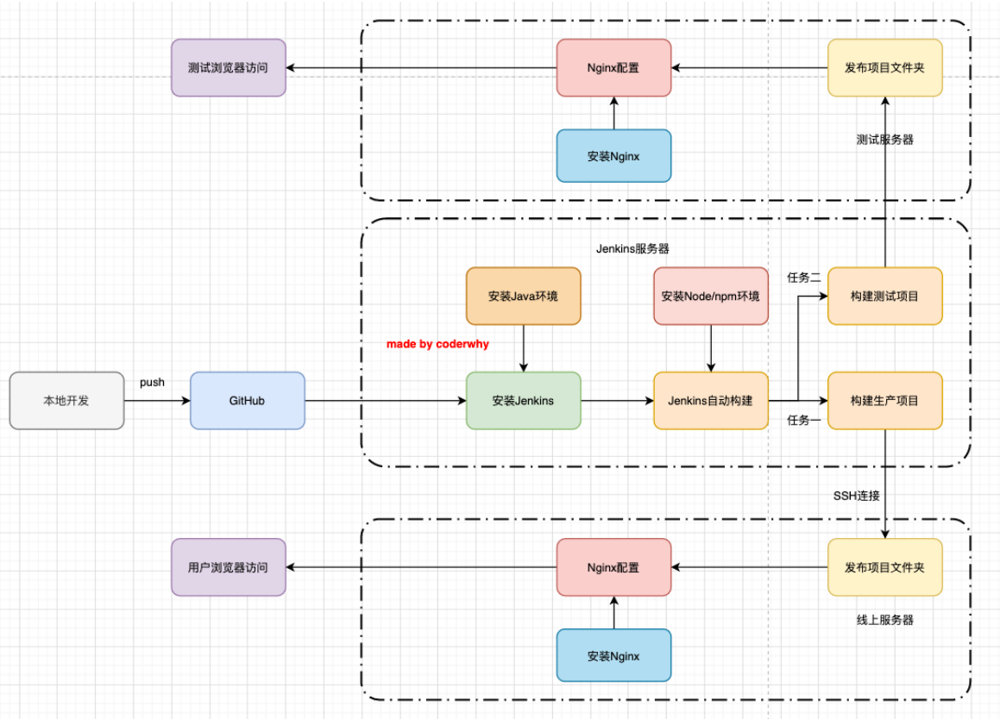

# Nginx

[centos8安装 Nginx](https://segmentfault.com/a/1190000040125857)

> 启动 systemctl start nginx
> 停止 systemctl stop nginx
> 状态 systemctl status nginx
> 打开开机自启 systemctl enable nginx
> 关闭开机自启 systemctl disable nginx
>
> 启动 /home/work/nginx/sbin/nginx
> 重载配置文件 /home/work/nginx/sbin/nginx -s reload
> 重启 /home/work/nginx/sbin/nginx -s reopen
> 停止 /home/work/nginx/sbin/nginx -s stop

### 配置文件分离

- nginx.conf

  ```shell
  #user  nobody;
  # 配置用户权限，访问文件需要
  user root;
  
  # 配置文件分离
  include /opt/nginx/conf.d/*.conf;
  
  # /opt/nginx/conf.d/music.conf
  server {
    listen 7878;
    server_name _;
  
    location / {
      root /root/music/build;
      index index.html;
      try_files $uri /index.html;
    }
  }
  ```

### 命令行scp上传

```sh
# scp -r .\build root@121.5.70.248:/root/music
```

### 自动化部署的流程


