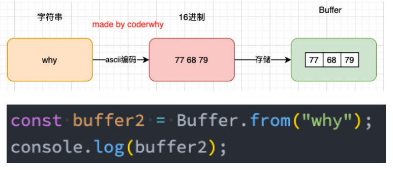

# Node

### Node 介绍


#### Node.js架构

- Node.js的架构图： 
  - 编写的JavaScript代码会经过V8引擎，再通过Node.js的Bindings，将任务放到Libuv的事件循环中； 
  - libuv（Unicorn Velociraptor—独角伶盗龙）是使用 C语言编写的库； 
  - libuv提供了事件循环、文件系统读写、网络IO、线程池等等内容； 
  - 具体内部代码的执行流程，我会在后续专门讲解事件和异步IO的原理中详细讲解；


#### 应用场景

- 目前前端开发的库都是以node包的形式进行管理； 
- npm、yarn工具成为前端开发使用最多的工具； 
- 越来越多的公司使用Node.js作为web服务器开发； 
- 大量项目需要借助Node.js完成前后端渲染的同构应用； 
- 资深前端工程师需要为项目编写脚本工具（前端工程师编写脚本通常会使用JavaScript，而不是Python或者shell）； 
- 很多企业在使用Electron来开发桌面应用程序；


#### Node的REPL

- REPL是Read-Eval-Print Loop的简称，翻译为 “读取-求值-输出” 循环； 
- REPL是一个简单的、交互式的编程环境；
- 浏览器的console就可以看成一个REPL；
- Node也给我们提供了一个REPL环境


#### Node程序传递参数

- 执行node，传递一些参数

  - node index.js env=development jz

- 获取传递到的参数

  - 获取参数其实是在process的内置对象中的； 
  - 如果我们直接打印这个内置对象，它里面包含特别的信息： 
    - 其他的一些信息，比如版本、操作系统等；

- process.argv属性，包含了我们需要的参数，argv 的由来：

  - C/C++程序中的main函数中，实际上可以获取到两个参数： 
    - argc：argument counter的缩写，传递参数的个数； 
    - argv：argument vector的缩写，传入的具体参数。
      - vector翻译过来是矢量的意思，在程序中表示的是一种数据结构。 
      - 在C++、Java中都有这种数据结构，是一种数组结构； 
      - 在JavaScript中也是一个数组，里面存储一些参数信息；

  ```js
  argv: [
    'C:\\Users\\Administrator\\AppData\\Roaming\\nodejs\\node.exe',
    'E:\\learn\\node\\node_base\\01_给node传递参数\\index.js',
    'env=development',
    'jz'
  ]
  ```


#### Node的输出

- console.log
  - 输出内容
- console.clear
  - 清空控制台
- console.trace
  - 打印函数的调用栈
- 还有一些其他console方法


#### 全局对象

- Node中给我们提供了一些全局对象

#### 特殊的全局对象

- 为什么称之为特殊的全局对象呢？ 

  - 这些全局对象**可以在模块中任意使用**，但是在**命令行交互中是不可以使用的**； 
  - 包括：`__dirname`、`__filename`、`exports`、`module`、`require()`

- __dirname：获取当前文件所在的路径：

  - __注意：不包括后面的文件名 __

- __filename：获取当前文件所在的路径和文件名称： 

  - 注意：包括后面的文件名称

  ```js
  console.log(__dirname)
  console.log(__filename)
  
  // E:\learn\node\node_base
  // E:\learn\node\node_base\02_Node中的全局对象.js
  ```

  

#### 常见的全局对象

- process对象：process提供了Node进程中相关的信息： 
  - 比如Node的运行环境、参数信息等； 
  - 后面在项目中，我也会讲解，如何将一些环境变量读取到 process 的 env 中；
  - fs读取文件在项目中的任何一个地方的相对路径，都是相对于 process.cwd ，当前启动目录的路径，所有路径尽可能使用绝对路径，使用path.resolve(__dirname, './xxx/xx')
- console对象：提供了简单的调试控制台，在前面讲解输入内容时已经学习过了。 
  - 更加详细的查看官网文档：https://nodejs.org/api/console.html 
- 定时器函数：在Node中使用定时器有好几种方式： 
  - setTimeout(callback, delay[, ...args])：callback 在delay毫秒后执行一次； 
  - setInterval(callback, delay[, ...args])：callback 每delay毫秒重复执行一次； 
  - setImmediate(callback[, ...args])：callback I/O事件后的回调的“立即”执行； 
    - 这里先不展开讨论它和setTimeout(callback, 0)之间的区别； 
    - 因为它涉及到事件循环的阶段问题，我会在后续详细讲解事件循环相关的知识； 
  - process.nextTick(callback[, ...args])：添加到下一次tick队列中； 
    - 具体的讲解，也放到事件循环中说明；


#### global对象

- global是一个全局对象，事实上前端我们提到的 process、console、setTimeout等都有被放到global中

#### global和window的区别

- 在浏览器中，全局变量都是在window上的，比如有document、setInterval、setTimeout、alert、console等等 
- 在Node中，我们也有一个global属性，并且看起来它里面有很多其他对象。 
- 但是在浏览器中执行的JavaScript代码，如果我们在顶级范围内通过var定义的一个属性，默认会被添加到window 对象上： 
- 但是在node中，我们通过var定义一个变量，它只是在当前模块中有一个变量，不会放到全局中；


### JavaScript模块化

#### 模块化

- 模块化开发
  - 事实上模块化开发最终的目的是将程序划分成一个个小的结构； 
  - 这个结构中编写属于自己的逻辑代码，有自己的作用域，不会影响到其他的结构； 
  - 这个结构可以将自己希望暴露的变量、函数、对象等导出给其结构使用； 
  - 也可以通过某种方式，导入另外结构中的变量、函数、对象等；
- 上面说提到的结构，就是模块；按照这种结构划分开发程序的过程，就是模块化开发的过程；
- 无论你多么喜欢JavaScript，以及它现在发展的有多好，我们都需要承认在Brendan Eich用了10天写出JavaScript的时候， 它都有很多的缺陷： 
  - 比如 var定义的变量作用域问题； 
  - 比如 JavaScript的面向对象并不能像常规面向对象语言一样使用class； 
  - 比如 JavaScript没有模块化的问题；
- Brendan Eich本人也多次承认过 JavaScript设计之初的缺陷，但是随着 JavaScript的发展以及标准化，存在的缺陷问题基本都得到了完善。无论是web、移动端、小程序端、服务器端、桌面应用都被广泛的使用；

#### 没有模块化带来的问题

- 早期没有模块化带来了很多的问题：比如命名冲突的问题 
- 当然，我们有办法可以解决上面的问题：立即函数调用表达式（IIFE） 
  - IIFE (Immediately Invoked Function Expression) 
- 但是，我们其实带来了新的问题： 
  - 第一，我必须记得每一个模块中返回对象的命名，才能在其他模块使用过程中正确的使用； 
  - 第二，代码写起来混乱不堪，每个文件中的代码都需要包裹在一个匿名函数中来编写； 
  - 第三，在没有合适的规范情况下，每个人、每个公司都可能会任意命名、甚至出现模块名称相同的情况； 
- 所以，我们会发现，虽然实现了模块化，但是我们的实现过于简单，并且是没有规范的。 
- 我们需要制定一定的规范来约束每个人都按照这个规范去编写模块化的代码； 
- 这个规范中应该包括核心功能：模块本身可以导出暴露的属性，模块又可以导入自己需要的属性； 
- JavaScript社区为了解决上面的问题，涌现出一系列好用的规范，接下来我们就学习具有代表性的一些规范。


#### CommonJS 和 Node

> Node.js中实现CommonJS规范的本质就是**对象的引用赋值** （浅拷贝）

- 我们需要知道CommonJS是一个规范，最初提出来是在浏览器以外的地方使用，并且当时被命名为ServerJS，后来为了 体现它的广泛性，修改为CommonJS，平时我们也会简称为CJS。 
  - Node是CommonJS在服务器端一个具有代表性的实现； 
  - Browserify是CommonJS在浏览器中的一种实现； 
  - webpack打包工具具备对CommonJS的支持和转换； 
- 所以，Node中对CommonJS进行了支持和实现，让我们在开发node的过程中可以方便的进行模块化开发： 
  - 在Node中每一个js文件都是一个单独的模块； 
  - 这个模块中包括CommonJS规范的核心变量：exports、module.exports、require； 
  - 我们可以使用这些变量来方便的进行模块化开发； 
- 模块化的核心是导出和导入，Node中对其进行了实现： 
  - exports和module.exports可以负责对模块中的内容进行导出； 
  - require函数可以帮助我们导入其他模块（自定义模块、系统模块、第三方库模块）中的内容；
  - `module.export = {}; exports = module.exports` 赋值的操作是在顶层执行的
    - exports.name = 'jz'
    - 如果改变export对象的引用，exports = { name: 'jz' } 相当于改变了引用地址，和module.export 指向的不是同一个对象，最终导出的是module.exports 对象，这里改变exports的引用不会被导出
- 维基百科中对 commonJS规范的解析： 
  - commonJS中是没有 module.exports的概念的； 
  - 但是为了实现模块的导出，Node中使用的是 Module类，每一个模块都是 Module的一个实例，也就是 module； 
  - 所以在Node中真正用于导出的其实根本不是 exports，而是module.exports； 
  - 因为module才是导出的真正实现者；


#### 理解对象的引用赋值

- 创建一个obj对象，会在堆内存中开辟空间保存值，返回引用
- info = obj ,是引用赋值，指向内存中同一块地址


#### require细节

- require是一个函数，可以帮助我们引入一个文件（模块）中导入的对象。 
- 那么，require的查找规则是怎么样的呢？ 
  - https://nodejs.org/dist/latest-v14.x/docs/api/modules.html#modules_all_together 
- 这里我总结比较常见的查找规则：导入格式如下：require(X) 
- 情况一：X是一个核心模块，比如path、http 
  - 直接返回核心模块，并且停止查找

- 情况二：X是以 ./ 或 ../ 或 /（根目录）开头的 
  - 第一步：将 X当做一个文件在对应的目录下查找； 
    1. 如果有后缀名，按照后缀名的格式查找对应的文件 
    2. 如果没有后缀名，会按照如下顺序： 
       1. 直接查找文件X 
       2. 查找X.js文件 
       3. 查找X.json文件 
       4. 查找X.node文件
  -  第二步：没有找到对应的文件，将X作为一个目录，查找目录下面的index文件 
    1. 查找X/index.js文件 
    2. 查找X/index.json文件 
    3. 查找X/index.node文件
    4. 如果没有找到，那么报错：not found
- 情况三：直接是一个X（没有路径），并且X不是一个核心模块
  - 回去当前路径中查找 node_modules/ 目录下的第三方模块，如果没有找到，逐层向上查找 node_modules/ 下的第三方模块
  - `module.paths`每一个模块都是一个Module实例，可以拿到 paths的所有路径，然后 node通过paths路径查找
  - 如果上面的路径中都没有找到，那么报错：not found


#### 模块的加载过程

> 模块的加载过程是同步的，先执行require('X')，然后执行后面的代码

- 结论一：模块在被第一次引入时，模块中的js代码会被运行一次
- 结论二：模块被多次引入时，会缓存，最终只加载（运行）一次 
  - 每个模块对象module都有一个属性：loaded。 
  - 为false表示还没有加载，为true表示已经加载；
- 结论三：如果有循环引入，Node采用的是深度优先算法，深度优先搜索


#### Node.js源码loader.js解读

> lib > internal > modules > cjs > loader.js


#### Node.js中使用ESM模块

- 方式一：文件名使用 mjs
- 方式二：package.json 配置 type：module


#### CJS与ESM交互

- 结论一：通常情况下，cjs不支持esm
  - cjs是同步，esm需要静态解析，异步加载，原理上有冲突
  - Node当中不支持
- 结论二：多数情况下，esm可以加载cjs
  - esm在加载cjs时，会将cjs的当做default导出
  - Node中支持


### Node常用内置模块

#### 内置模块 path

- path模块用于对路径和文件进行处理，提供了很多好用的方法。 
- 并且我们知道在Mac OS、Linux和window上的路径时不一样的 
  - window上会使用 \或者 \\ \来作为文件路径的分隔符，当然目前也支持 /； 
  - 在Mac OS、Linux的Unix操作系统上使用 / 来作为文件路径的分隔符； 
- 那么如果我们在window上使用 \ 来作为分隔符开发了一个应用程序，要部署到Linux上面应该怎么办呢？ 
  - 显示路径会出现一些问题； 
  - 所以为了屏蔽他们之间的差异，在开发中对于路径的操作我们可以使用 path 模块； 
- 可移植操作系统接口（英语：Portable Operating System Interface，缩写为POSIX） 
  - Linux和Mac OS都实现了POSIX接口； 
  - Window部分电脑实现了POSIX接口；

```js
const path = require('path')

const basePath = '/User/Jz'
const filename = 'abc.txt'

const filepath = path.resolve(basePath, filename)

console.log(filepath)
```


#### path常见的API

- 从路径中获取信息 

  - dirname：获取文件的父文件夹； 
  - basename：获取文件名； 
  - extname：获取文件扩展名，带 .html；

- 路径的拼接 

  - 如果我们希望将多个路径进行拼接，但是不同的操作系统可能使用的是不同的分隔符； 
  - 这个时候我们可以使用path.join函数；

- 将文件和某个文件夹拼接 

  - 如果我们希望将某个文件和文件夹拼接，可以使用 path.resolve; 
  - resolve函数会判断我们拼接的路径前面是否有 /或../或./； 
  - 如果有表示是一个绝对路径，会返回对应的拼接路径； 
  - 如果没有，那么会和当前执行文件所在的文件夹进行路径的拼接

  ```js
  const path = require('path')
  
  const basePath = './User/Jz'
  const filename = 'abc.txt'
  
  const filepath = path.resolve(basePath, filename)
  // console.log(filepath)
  
  // 1. 获取路径信息
  // console.log(path.dirname(filepath))
  // console.log(path.basename(filepath))
  // console.log(path.extname(filepath))
  
  // 2. join 路径拼接
  const filepath1 = path.join(basePath, filename)
  console.log(filepath1)
  
  // 3. resolve 路径拼接
  const filepath3 = path.resolve(basePath, filename)
  console.log(filepath3)
  ```

  

#### 在webpack中的使用

- 在webpack中获取路径或者起 别名的地方也可以使用


#### 内置模块fs

- fs是File System的缩写，表示文件系统。 
- 对于任何一个为服务器端服务的语言或者框架通常都会有自己的文件系统： 
  - 因为服务器需要将各种数据、文件等放置到不同的地方； 
  - 比如用户数据可能大多数是放到数据库中的； 
  - 比如某些配置文件或者用户资源（图片、音视频）都是以文件的形式存在于操作系统上的； 
- Node也有自己的文件系统操作模块，就是fs： 
  - 借助于Node帮我们封装的文件系统，我们可以在任何的操作系统（window、Mac OS、Linux）上面直接去操作文件； 
  - 这也是Node可以开发服务器的一大原因，也是它可以成为前端自动化脚本等热门工具的原因；


#### fs的API介绍

- Node文件系统的API非常的多： 

  - https://nodejs.org/dist/latest-v14.x/docs/api/fs.html 
  - 我们不可能，也没必要一个个去学习； 
  - 这个更多的应该是作为一个API查询的手册，等用到的时候查询即可；
  - 学习阶段我们只需要学习最常用的即可；

- 但是这些API大多数都提供三种操作方式： 

  - 方式一：同步操作文件：代码会被阻塞，不会继续执行； 
  - 方式二：异步回调函数操作文件：代码不会被阻塞，需要传入回调函数，当获取到结果时，回调函数被执行； 
  - 方式三：异步Promise操作文件：代码不会被阻塞，通过 fs.promises 调用方法操作，会返回一个Promise， 可以通过then、catch进行处理；

  ```js
  const fs = require('fs')
  
  // 获取 abc.txt 的文件信息
  const filepath = './abc.txt'
  
  // 1. 同步方式，阻塞后续代码执行
  const info = fs.statSync(filepath)
  console.log('后续代码执行')
  console.log(info)
  
  // 2. 异步IO回调
  fs.stat(filepath, (err, info) => {
    if (err) {
      console.log(err)
      return
    }
    console.log(info)
  })
  console.log('后续代码执行')
  
  // 3. Promise
  fs.promises.stat(filepath).then(console.log).catch(console.log)
  console.log('后续代码执行')
  ```


#### 文件描述符

- 文件描述符（File descriptors）是什么呢？ 
  - 在 POSIX 系统上，对于每个进程，内核都维护着一张当前打开着的文件和资源的表格。 
  - 每个打开的文件都分配了一个称为文件描述符的简单的数字标识符。 
  - 在系统层，所有文件系统操作都使用这些文件描述符来标识和跟踪每个特定的文件。 
  - Windows 系统使用了一个虽然不同但概念上类似的机制来跟踪资源。 
- 为了简化用户的工作，Node.js 抽象出操作系统之间的特定差异，并为所有打开的文件分配一个数字型的文件描述符。 
- fs.open() 方法用于分配新的文件描述符。 
  - 一旦被分配，则文件描述符可用于从文件读取数据、向文件写入数据、或请求关于文件的信息。

```js
const fs = require('fs')

const filepath = './abc.txt'

fs.open(filepath, (err, fd) => {
  if (err) {
    console.log(err)
    return
  }

  console.log(fd)
  fs.fstat(fd, (err, info) => {
    console.log(info)
  })
})
```


#### 文件的读写

- 如果我们希望对文件的内容进行操作，这个时候可以使用文件的读写： 
  - fs.readFile(path[, options], callback)：读取文件的内容； 
  - fs.writeFile(file, data[, options], callback)：在文件中写入内容；
- 在上面的代码中，你会发现有一个大括号没有填写任何的内容，这个是写入时填写的option参数： 
  - flag：写入的方式。 
  - encoding：字符的编码；

```js
const fs = require('fs')

const filepath = './abc.txt'

// 1. 文件的写入
const data = '你好，justin'
fs.writeFile(filepath, data, {flag: 'a', encoding: 'utf8'}, (err) => {
  console.log(err)
})

// 2. 文件的读取
fs.readFile(filepath, {encoding: 'utf-8'}, (err, info) => {
  if (err) {
    console.log(err)
    return
  }

  console.log(info)
})
```

#### 文件夹操作

- 新建一个文件夹 
  - 使用fs.mkdir()或fs.mkdirSync()创建一个新文件夹： 
- 获取文件夹的内容 
- 文件重命名

```JS
const fs = require('fs')
const path = require('path')

const dirPath = './jz'

// 1. 创建文件夹
if (!fs.existsSync(dirPath)) {
  fs.mkdir(dirPath, err => console.log(err))
}

// 2. 读取文件夹
// fs.readdir(dirPath, (err, files) => {
//   if (err) {
//     console.log(err)
//     return
//   }
//   console.log(files)
//   files.forEach(file => {
//     const filePath = path.resolve(dirPath, file)
//     fs.stat(filePath, (err, info) => {
//       if(err) {
//         console.log(err)
//         return
//       }
//       console.log(info.isDirectory())
//     })
//   })
// })

function readFiles(dirPath) {
  fs.readdir(dirPath, {withFileTypes: true}, (err, files) => {
    if (err) {
      console.log(err)
      return
    }
    for (const file of files) {
      const filePath = path.resolve(dirPath, file.name)
      if (file.isDirectory()) {
        readFiles(filePath)
        return
      }
      console.log(file.name)
    }
  })
}

readFiles(dirPath)

// 重命名
fs.rename(dirPath, './kobe', err => console.log(err))
```


#### 文件夹的复制

```js
const fs = require('fs')
const path = require('path')
const resolve = (dir, filename) => path.resolve(dir, filename)

// 1. 接收导出的目录和导入的目录
srcPath = process.argv[2]
destPath = process.argv[3]

function copyFiles(srcPath, destPath) {
  if (!fs.existsSync(destPath)) {
    fs.mkdir(destPath, err => {
      if (!err) console.log('文件开始拷贝')
      const srcFiles = fs.readdirSync(srcPath, {withFileTypes: true})
      for (const file of srcFiles) {
        const srcFile = resolve(srcPath, file.name)
        const destFile = resolve(destPath, file.name)
        if (file.isFile() && file.name.endsWith('.js')) {
          fs.copyFileSync(srcFile, destFile)
          console.log('拷贝成功')
        } else if (file.isDirectory()) {
          copyFiles(srcFile, destFile)
        }
      }
    })
  }
}

copyFiles(srcPath, destPath)
```


#### events模块

- Node中的核心API都是基于异步事件驱动的： 
  - 这个体系中，某些对象（发射器（Emitters））发出某一个事件； 
  - 我们可以监听这个事件（监听器 Listeners），并且传入的回调函数，这个回调函数会在监听到事件时调用； 
- 发出事件和监听事件都是通过EventEmitter类来完成的，它们都属于events对象。 
  - emitter.on(eventName, listener)：监听事件，也可以使用 addListener； 
  - emitter.off(eventName, listener)：移除事件监听，也可以使 用removeListener； 
  - emitter.emit(eventName[, ...args])：发出事件，可以携带一 些参数；

#### 常见的属性

- EventEmitter的实例有一些属性，可以记录一些信息： 
  - emitter.eventNames()：返回当前 EventEmitter对象注册的事件字符串数组； 
  - emitter.getMaxListeners()：返回当前 EventEmitter对象的最大监听器数量，可以通过setMaxListeners() 来修改，默认是10； 
  - emitter.listenerCount(事件名称)：返回当前 EventEmitter对象某一个事件名称，监听器的个数；
  - emitter.listeners(事件名称)：返回当前 EventEmitter对象某个事件监听器上所有的监听器数组；

#### 方法的补充

- emitter.once(eventName, listener)：事件监听一次 
- emitter.prependListener()：将监听事件添加到最前面
- emitter.prependOnceListener()：将监听事件添加到最前面，但是只监听一次
- emitter.removeAllListeners([eventName])：移除所有的监听器


### 包管理工具

### 开发脚手架工具


#### 1. 自定义终端指令

1. 入口文件 `index.js` 配置 node 可执行文件，Shebang 是一项操作系统特性，可用于运行任何解释语言：Python、Perl 等。对于 Node.js，配置如下

   ```js
   #!/usr/bin/env node
   
   ```

2. package.json 中添加bin：

   ```json
   "bin": {
       "coderjz": "index.js"
     },
   ```

3. 执行 npm link，会将bin中的coderjz指令添加到环境变量中，然后index.js就可以执行

   ```she
   coderjz
   ```


#### 2. 创建指令

> 使用第三方库 commander，查看文档进行配置
>
> chalk

```js
// index.js
#!/usr/bin/env node

const {program} = require('commander');

const helpOptions = require('./lib/core/help')

// 查看版本号
program.version(require('./package.json').version)

// 自定义help和可选信息
helpOptions()

program.parse()
// 获取传入的参数
console.log(program.opts().dest)

// lib/core/help.js
const {program} = require("commander");

const helpOptions = () => {
  // 增加自己的options
  program.option('-c --coderjz', 'a coderjz cli')
  program.option('-t --test', 'test option commander')
  program.option('-d --dest <dest>', 'a destination folder, example -d /src/components')

  // 自动解析传入的参数，目前版本不用传递 process.argv
  // program.parse(process.argv)
  program.on('--help', () => {
    console.log('')
    console.log('Other:')
    console.log('  other options~')
  })
}

module.exports = helpOptions
```

1. 配置 `create <demo>` 指令

   ```js
   const {program} = require('commander');
   const {createProjectAction, addComponentAction, addPageAction, addStoreAction} = require('./actions')
   
   const createCommands = () => {
     program
       .command('create <project> [others...]')
       .description('clone repository into a folder')
       .action(createProjectAction)
   
     program
       .command('addCpn <name>')
       .description('add vue component, example: coderjz addCpn Name [-d /src/xxx]')
       .action((name) => {
         const dest = program.opts().dest || 'src/components'
         addComponentAction(name, dest)
       })
   
     program
       .command('addPage <name>')
       .description('add vue page, , example: coderjz addPage Name [-d /src/xxx]')
       .action(name => {
         const dest = program.opts().dest || 'src/pages'
         addPageAction(name, dest)
       })
   
     program
       .command('addStore <name>')
       .description('add vue store, example: coderjz addStore Name [-d /src/xxx]')
       .action(name => {
         const dest = program.opts().dest || 'src/store/modules'
         addStoreAction(name, dest)
       })
   }
   
   module.exports = createCommands
   ```

2. `createProjectAction` 执行动作进行模块拆解

3. `createProjectAction` 中需要做的任务

   1. 下载模板
   2. 创建子进程，执行 `npm install`，下载项目依赖
   3. 创建子进程，执行`npm run serve`，启动项目

   ```js
   const {promisify} = require('util')
   const path = require('path')
   
   // promisify 把 download 异步回调转成 promise
   const download = promisify(require('download-git-repo'))
   const open = require('open')
   
   const {vueRepo} = require('../config/repo-config')
   const {spawn} = require('../utils/terminal')
   const {compile, writeFileSync, createDirSync} = require('../utils/utils')
   const {hint, warning, error} = require('../utils/log')
   
   // promise.then也有嵌套，async 转成同步
   const createProjectAction = async project => {
     // 控制台输出颜色变化差价 chalk
     hint('coderjz helps you create you project~')
     // 1. clone temp
     await download(vueRepo, project, {clone: true})
   
     // 2. 执行 npm install
     // 在windows下npm的执行名不同，windows 执行 node.cmd
     const command = process.platform === 'win32' ? 'npm.cmd' : 'npm'
     await spawn(command, ['install'], {cwd: `./${project}`})
   
     // 3. 运行 npm run serve
     // 这里使用 await 子进程不会结束，胡阻塞后续 open 的执行
     spawn(command, ['run', 'serve'], {cwd: `./${project}`})
   
     // 4. 打开浏览器
     open('http://localhost:8080')
   }
   
   // 添加组件的action
   const addComponentAction = async (name, dest) => {
     // 2. 编译 ejs 模板 返回result
     const templatePath = 'vue-component.ejs'
     const data = {name, lowerName: name.toLowerCase()}
     const result = await compile(templatePath, data)
   
     // 3. result 写入 .vue 文件, 放到对应文件夹下
     // 判断当前路径是否存在，不存在，递归创建文件夹
     if (createDirSync(dest)) {
       const targetPath = path.resolve(dest, `${name}.vue`)
       await writeFileSync(targetPath, result)
     }
   }
   
   // 添加页面
   const addPageAction = async (name, dest) => {
     const templatePageName = 'vue-component.ejs'
     const templateRouterName = 'vue-router.ejs'
     const data = {name, lowerName: name.toLowerCase()}
   
     const resultPage = await compile(templatePageName, data)
     const resultRouter = await compile(templateRouterName, data)
   
     const targetDest = path.resolve(dest, name.toLowerCase())
     if (createDirSync(targetDest)) {
       const targetPagePath = path.resolve(targetDest, `${name}.vue`)
       await writeFileSync(targetPagePath, resultPage)
       const targetRouterPath = path.resolve(targetDest, 'router.js')
       await writeFileSync(targetRouterPath, resultRouter)
     }
   }
   
   // 添加store
   const addStoreAction = async (name, dest) => {
     const templateStoreName = 'vue-store.ejs'
     const templateTypesName = 'vue-types.ejs'
   
     const resultStore = await compile(templateStoreName, {})
     const resultTypes = await compile(templateTypesName, {})
     const targetDest = path.resolve(dest, name.toLowerCase())
   
     if (createDirSync(targetDest)) {
       const targetStorePath = path.resolve(targetDest, 'index.js')
       const targetTypesPath = path.resolve(targetDest, 'types.js')
   
       await writeFileSync(targetStorePath, resultStore)
       await writeFileSync(targetTypesPath, resultTypes)
     }
   }
   
   module.exports = {
     createProjectAction,
     addComponentAction,
     addPageAction,
     addStoreAction
   }
   ```

4. 配置创建组件指令 `addCpn <name>`

   1. 通过ejs编译模板，返回编译后的结果
   2. 然后把结果写入对应文件夹

#### 3. 封装指令，创建lib文件夹

- --|lib
- -----|core
- -------| help.js
- --|utils

#### 查看指令的目录

`where node`

#### 命令行选择

`inquirer`


#### 发布项目 

- 注册npm账号： https://www.npmjs.com/ 
- 选择sign up 
- 在命令行登录： npm login
- 修改package.json 
  - homepage
  - repository
    - type: git
    - url: 'git url'
  - license
  - author
- 发布到npm registry上 npm publish
- 更新仓库：
  - 1.修改版本号(最好符合semver规范)
- 删除发布的包： npm unpublish
- 让发布的包过期：  npm deprecate


### Buffer的使用

#### 数据的二进制

- 计算机中所有的内容：文字、数字、图片、音频、视频最终都会使用二进制来表示。 
- JavaScript可以直接去处理非常直观的数据：比如字符串，我们通常展示给用户的也是这些内容。 
- 不对啊，JavaScript不是也可以处理图片吗？ 
  - 事实上在网页端，图片我们一直是交给浏览器来处理的； 
  - JavaScript或者HTML，只是负责告诉浏览器一个图片的地址； 
  - 浏览器负责获取这个图片，并且最终讲这个图片渲染出来； 
- 但是对于服务器来说是不一样的： 
  - 服务器要处理的本地文件类型相对较多; 
  - 比如某一个保存文本的文件并不是使用 utf-8进行编码的，而是用 GBK，那么我们必须读取到他们的二进制数据，再通过GKB转换成对应的文字； 
  - 比如我们需要读取的是一张图片数据（二进制），再通过某些手段对图片数据进行二次的处理（裁剪、格式转换、旋转、添加滤 镜），Node中有一个 Sharp的库，就是读取图片或者传入图片的 Buffer对其再进行处理； 
  - 比如在 Node中通过TCP建立长连接，TCP传输的是字节流，我们需要将数据转成字节再进行传入，并且需要知道传输字节的大小 （客户端需要根据大小来判断读取多少内容）；


#### Buffer和二进制

- 我们会发现，对于前端开发来说，通常很少会和二进制打交道，但是对于服务器端为了做很多的功能，我们必须直接去操作其二进制的数据； 
- 所以Node为了可以方便开发者完成更多功能，提供给了我们一个类Buffer，并且它是全局的。 
- 我们前面说过，Buffer中存储的是二进制数据，那么到底是如何存储呢？ 
  - 我们可以将Buffer看成是一个存储二进制的数组； 
  - 这个数组中的每一项，可以保存8位二进制： 00000000 

- 为什么是8位呢？ 
  - 在计算机中，很少的情况我们会直接操作一位二进制，因为一位二进制存储的数据是非常有限的； 
  - 所以通常会将8位合在一起作为一个单元，这个单元称之为一个字节（byte）； 
  - 也就是说 1byte = 8bit，1kb=1024byte，1M=1024kb; 
  - 比如很多编程语言中的int类型是4个字节，long类型时8个字节； 
  - 比如TCP传输的是字节流，在写入和读取时都需要说明字节的个数； 
  - 比如RGB的值分别都是255，所以本质上在计算机中都是用一个字节存储的；


#### Buffer和字符串

- Buffer相当于是一个字节的数组，数组中的每一项对于一个字节的大小：

- 如果我们希望将一个字符串放入到Buffer中，是怎么样的过程呢？

  

#### 如果是中文呢？

- 默认编码：utf-8
- 如果编码和解码不同：


#### Buffer的其他创建

- Buffer.from()
- Buffer.alloc()


### 事件循环和异步IO


#### 事件循环

- 事件循环是什么？ 
  - 事实上我把事件循环理解成我们编写的JavaScript和浏览器或者Node之间的一个桥梁。
- 浏览器的事件循环是一个我们编写的JavaScript代码和浏览器API调用(setTimeout/AJAX/监听事件等)的一个桥梁, 桥梁之间他们通过回调函数进行沟通。 
- Node的事件循环是一个我们编写的JavaScript代码和系统调用（file system、network等）之间的一个桥梁, 桥梁 之间他们通过回调函数进行沟通的.


#### 进程和线程

- 线程和进程是操作系统中的两个概念： 
  - 进程（process）：计算机已经运行的程序； 
  - 线程（thread）：操作系统能够运行运算调度的最小单位； 
- 听起来很抽象，我们直观一点解释： 
  - 进程：我们可以认为，启动一个应用程序，就会默认启动一个进程（也可能是多个进程）； 
  - 线程：每一个进程中，都会启动一个线程用来执行程序中的代码，这个线程被称之为主线程； 
  - 所以我们也可以说进程是线程的容器； 
- 再用一个形象的例子解释： 
  - 操作系统类似于一个工厂； 
  - 工厂中里有很多车间，这个车间就是进程；
  - 每个车间可能有一个以上的工人在工厂，这个工人就是线程；

#### 多进程多线程开发

- 操作系统是如何做到同时让多个进程（边听歌、边写代码、边查阅资料）同时工作呢？ 
  - 这是因为CPU的运算速度非常快，它可以快速的在多个进程之间迅速的切换； 
  - 当我们的进程中的线程获取获取到时间片时，就可以快速执行我们编写的代码；
  - 对于用于来说是感受不到这种快速的切换的；


#### Node的架构分析

- 浏览器中的EventLoop是根据HTML5定义的规范来实现的，不同的浏览器可能会有不同的实现，而Node中是由 libuv实现的。 
- 我们来看在很早就给大家展示的Node架构图：
  - libuv中主要维护了一个EventLoop和worker threads（线程池）； 
  - EventLoop负责调用系统的一些其他操作：文件的IO、Network、child-processes等 
- libuv是一个多平台的专注于异步IO的库，它最初是为Node开发的，但是现在也被使用到Luvit、Julia、pyuv等其他地方；
  - application 对应的js代码
  - V8引擎解析js代码


#### 阻塞IO和非阻塞IO

- 如果我们希望在程序中对一个文件进行操作，那么我们就需要打开这个文件：通过文件描述符。 
  - 我们思考：JavaScript可以直接对一个文件进行操作吗？ 
  - 看起来是可以的，但是事实上我们任何程序中的文件操作都是需要进行系统调用（操作系统的文件系统）； 
  - 事实上对文件的操作，是一个操作系统的IO操作（输入、输出）；
- 操作系统为我们提供了阻塞式调用和非阻塞式调用： 
  - 阻塞式调用： 调用结果返回之前，当前线程处于阻塞态（阻塞态CPU是不会分配时间片的），调用线程只有在得到调用结果之后才会继续执行。 
  - 非阻塞式调用： 调用执行之后，当前线程不会停止执行，只需要过一段时间来检查一下有没有结果返回即可。
- 所以我们开发中的很多耗时操作，都可以基于这样的非阻塞式调用： 
  - 比如网络请求本身使用了Socket通信，而Socket本身提供了select模型，可以进行非阻塞方式的工作； 
  - 比如文件读写的IO操作，我们可以使用操作系统提供的基于事件的回调机制


#### 非阻塞IO的问题

- 但是非阻塞IO也会存在一定的问题：我们并没有获取到需要读取（我们以读取为例）的结果 
  - 那么就意味着为了可以知道是否读取到了完整的数据，我们需要频繁的去确定读取到的数据是否是完整的； 
  - 这个过程我们称之为轮询操作；
- 那么这个轮询的工作由谁来完成呢？ 
  - 如果我们的主线程频繁的去进行轮询的工作，那么必然会大大降低性能； 
  - 并且开发中我们可能不只是一个文件的读写，可能是多个文件； 
  - 而且可能是多个功能：网络的IO、数据库的IO、子进程调用；
- libuv提供了一个线程池（Thread Pool）： 
  - 线程池会负责所有相关的操作，并且会通过轮询等方式等待结果； 
  - 当获取到结果时，就可以将对应的回调放到事件循环（某一个事件队列）中； 
  - 事件循环就可以负责接管后续的回调工作，告知JavaScript应用程序执行对应的回调函数；

#### 阻塞和非阻塞，同步和异步的区别？

- 阻塞和非阻塞是对于被调用者来说的； 
  - 在我们这里就是系统调用，操作系统为我们提供了阻塞调用和非阻塞调用；
- 同步和异步是对于调用者来说的； 
  - 在我们这里就是自己的程序； 
  - 如果我们在发起调用之后，不会进行其他任何的操作，只是等待结果，这个过程就称之为同步调用； 
  - 如果我们再发起调用之后，并不会等待结果，继续完成其他的工作，等到有回调时再去执行，这个过程就是 异步调用；
- Libuv采用的就是非阻塞异步IO的调用方式；


#### Node事件循环的阶段

- 我们最前面就强调过，事件循环像是一个桥梁，是连接着应用程序的JavaScript和系统调用之间的通道： 
  - 无论是我们的文件IO、数据库、网络IO、定时器、子进程，在完成对应的操作后，都会将对应的结果和回调函数放到事件循环（任务队列）中； 
  - 事件循环会不断的从任务队列中取出对应的事件（回调函数）来执行；
- 但是一次完整的事件循环 Tick分成很多个阶段： 
  - 定时器（Timers）：本阶段执行已经被 setTimeout() 和 setInterval() 的调度回调函数。 
  - 待定回调（Pending Callback）：对某些系统操作（如TCP错误类型）执行回调，比如TCP连接时接收到 ECONNREFUSED。 
  - idle, prepare：仅系统内部使用。 
  - 轮询（Poll）：检索新的 I/O 事件；执行与 I/O 相关的回调； 轮询阶段会尽可能停留，如果一直轮询很消耗性能，所以tick在这里会阻塞，等待IO回调，这里希望IO回调在当前tick尽快的执行
  - 检测：setImmediate() 回调函数在这里执行。 
  - 关闭的回调函数：一些关闭的回调函数，如：socket.on('close', ...)。
- 


#### Node的微任务和宏任务

- 我们会发现从一次事件循环的Tick来说，Node的事件循环更复杂，它也分为微任务和宏任务： 
  - 宏任务（macrotask）：setTimeout、setInterval、IO事件、setImmediate、close事件； 
  - 微任务（microtask）：Promise的then回调、process.nextTick、queueMicrotask；
- 但是，Node中的事件循环不只是 微任务队列和 宏任务队列： 
- 微任务队列： 
  - next tick queue：process.nextTick； 
  - other queue：Promise的then回调、queueMicrotask； 
- 宏任务队列： 
  - timer queue：setTimeout、setInterval； 
  - poll queue：IO事件； 
  - check queue：setImmediate；
  - close queue：close事件；


#### 面试题分析

```js
async function async1() {
  console.log('async1 start')
  await async2()
  console.log('async1 end')
}

async function async2() {
  console.log('async2')
}

console.log('script start')

setTimeout(function () {
  console.log('setTimeout0')
}, 0)

setTimeout(function () {
  console.log('setTimeout2')
}, 300)

setImmediate(() => console.log('setImmediate'));

process.nextTick(() => console.log('nextTick1'));

async1();

process.nextTick(() => console.log('nextTick2'));

new Promise(function (resolve) {
  console.log('promise1')
  resolve();
  console.log('promise2')
}).then(function () {
  console.log('promise3')
})

console.log('script end')


// script start
// async1 start
// async2
// promise1
// promise2
// script end
// nextTick1
// nextTick2
// async1 end
//  promise3
// setTimeout0
// setImmediate
// setTimeout2
```


##### setTimeout setImmediate

- 这里的执行的顺序每次不一样：
- 为什么会出现不同的情况呢？ 
  - 在Node源码的deps/uv/src/timer.c中141行，有一个 uv__next_timeout 的函数； 
  - 这个函数决定了，poll阶段要不要阻塞在这里； 
  - 阻塞在这里的目的是当有异步IO被处理时，尽可能快的让代码被执行； 
  - 
- 和上面有什么关系呢？ 
  - 开始执行顶层代码，初始化事件循环
  - 情况一：如果事件循环开启的时间(ms)是小于 setTimeout函数的执行时间的； 
  - 也就意味着先开启了event-loop，但是这个时候执行到timer阶段，并没有定时器的回调被放到入 timer queue中； 
  - 所以没有被执行，后续开启定时器和检测到有setImmediate时，就会跳过 poll阶段，向后继续执行； 
  - 这个时候是先检测 setImmediate，第二次的tick中执行了timer中的 setTimeout； 
- 情况二：如果事件循环开启的时间(ms)是早于 setTimeout函数的执行时间的； 
  - 这就意味着在第一次 tick中，已经准备好了timer queue； 
  - 所以会直接按照顺序执行即可；

```js
setTimeout(() => {
  console.log("setTimeout");
}, 0);

setImmediate(() => {
  console.log("setImmediate");
});

// 问题: setTimeout setImmediate
```


### Stream

#### 认识Stream

- 什么是流呢？ 
  - 我们的第一 反应 应该是流水，源源不断的流动； 
  - 程序中的流也是类似的含义，我们可以想象当我们从一个文件中读取数据时，文件的二进制（字节）数据会源源不断的被读取到我们程序中； 
  - 而这个一连串的字节，就是我们程序中的流； 
- 所以，我们可以这样理解流： 
  - 是连续字节的一种表现形式和抽象概念；
  - 流应该是可读的，也是可写的；
- 在之前学习文件的读写时，我们可以直接通过 readFile或者 writeFile方式读写文件，为什么还需要流呢？ 
  - 直接读写文件的方式，虽然简单，但是无法控制一些细节的操作； 
  - 比如从什么位置开始读、读到什么位置、一次性读取多少个字节； 
  - 读到某个位置后，暂停读取，某个时刻恢复读取等等；
  - 或者这个文件非常大，比如一个视频文件，一次性全部读取并不合适；


#### 文件读写的Stream

- 事实上Node中很多对象是基于流实现的： 
  - http模块的 Request和 Response对象； 
  - process.stdout 对象； 
- 官方：另外所有的流都是EventEmitter的实例：
- Node.js中有四种基本流类型： 
  - Writable：可以向其写入数据的流（例如 fs.createWriteStream()）。 
  - Readable：可以从中读取数据的流（例如 fs.createReadStream()）。 
  - Duplex：同时为 Readable和 Writable（例如 net.Socket）。 
  - Transform：Duplex可以在写入和读取数据时修改或转换数据的流（例如zlib.createDeflate()）。 
- 这里我们通过fs的操作，讲解一下Writable、Readable，另外两个大家可以自行学习一下。

```js
// 读取流
const fs = require('fs')

// 创建读取流
const reader = fs.createReadStream('./foo.txt', {
  start: 3,
  end: 8,
  highWaterMark: 2
})

reader.on('open', () => console.log('文件被打开'))
reader.on('close', () => console.log('close 文件被关闭'))
reader.on('end', () => console.log('end 文件被关闭'))


reader.on('data', (data) => {
  console.log(data)

  // 暂停读取
  reader.pause()

  // 1s 后恢复读取
  setTimeout(() => reader.resume(), 1000)
})

// 写入流
// 写入文件
const fs = require('fs')

// 传统的写入方式
// fs.writeFile('./bar.txt', 'Hello Stream', {flag: 'a+'}, console.log)

// Stream的写入方式
const writer = fs.createWriteStream('./bar.txt', {
  flags: 'r+',
  start: 5
})

writer.write('你好啊', (err) => {
  if (err) {
    console.log(err)
    return
  }
  console.log('写入成功')
})

writer.write('李银河', (err) => {
  if (err) {
    console.log(err)
    return
  }
  console.log('写入成功')
})

// 关闭 close 不常用，用end方法
// writer.close()
// end 做了两件事，一是写入Hello World，二是调用close
writer.end('Hello World')

// pipe
const fs = require('fs')

// 传统复制写入
// fs.readFile('./bar.txt', (err, data) => {
//   fs.writeFile('./boz.txt', data, console.log)
// })

// Stream
const reader = fs.createReadStream('./bar.txt')
const writer = fs.createWriteStream('./boz.txt')

reader.pipe(writer)
reader.on('end', () => {
  // 如果 Readable 流在处理过程中触发错误，则 Writable 目标不会自动关闭。 如果发生错误，则需要手动关闭每个流以防止内存泄漏。
  writer.close()
})
```


### Http模块

#### Web服务器

- Web服务器
  - 当应用程序（客户端）需要某一个资源时，可以向一个台服务器，通过Http请求获取到这个资源；提供资源的这个服务器，就是一个Web服务器；
  - 
- 目前有很多开源的Web服务器：Nginx、Apache（静态）、Apache Tomcat（静态、动态）、Node.js


#### 创建服务器

> http 是基于 tcp 应用层协议

- 创建服务器对象，我们是通过 createServer 来完成的 

  - http.createServer 会返回服务器的对象； 
  - 底层其实使用直接 new Server 对象。
  - 创建 Server时会传入一个回调函数，这个回调函数在被调用时会传入两个参数： 
    - req：request请求对象，包含请求相关的信息； 
    - res：response响应对象，包含我们要发送给客户端的信息；

  ```js
  const http = require('http')
  
  // 方式一
  const server1 = http.createServer((req, res) => {
    res.end('Server1')
  })
  
  server1.listen(8000, () => console.log('server1 启动'))
  
  const server2 = http.createServer((req, res) => {
    res.end('Server2')
  })
  
  server2.listen(() => {
    console.log('server2 启动')
    console.log(server2.address().port)
  })
  
  const server3 = new http.Server((req, res) => {
    res.end('Server3')
  })
  
  server3.listen(8003, () => console.log('server3 启动'))
  
  ```

  

#### 监听主机和端口号

- Server通过 listen方法来开启服务器，并且在某一个主机和端口上监听网络请求： 
  - 也就是当我们通过 ip:port的方式发送到我们监听的 Web服务器上时； 
  - 我们就可以对其进行相关的处理； 
- listen函数有三个参数： 
  - 端口port: 可以不传, 系统会默认分配端, 后续项目中我们会写入到环境变量中； 
  - 主机host: 通常可以传入localhost、ip地址127.0.0.1、或者ip地址0.0.0.0，默认是0.0.0.0； 
  - localhost：本质上是一个域名，通常情况下会被解析成127.0.0.1； 
  - 127.0.0.1：回环地址（Loop Back Address），表达的意思其实是我们主机自己发出去的包，直接被自己接收； 
    - 正常的数据库包经常 应用层 - 传输层 - 网络层 - 数据链路层 - 物理层 ； 
    - 而回环地址，是在网络层直接就被获取到了，是不会经常数据链路层和物理层的； 
    - 比如我们监听 127.0.0.1时，在同一个网段下的主机中，通过ip地址是不能访问的； 
  - 0.0.0.0： 
    - 监听IPV4上所有的地址，再根据端口找到不同的应用程序； 
    - 比如我们监听 0.0.0.0时，在同一个网段下的主机中，通过ip地址是可以访问的； 
  - 回调函数：服务器启动成功时的回调函数；


#### request对象

- 在向服务器发送请求时，我们会携带很多信息，比如： 
  - 本次请求的URL，服务器需要根据不同的URL进行不同的处理； 
  - 本次请求的请求方式，比如GET、POST请求传入的参数和处理的方式是不同的； 
  - 本次请求的headers中也会携带一些信息，比如客户端信息、接受数据的格式、支持的编码格式等； 
  - 等等... 
- 这些信息，Node会帮助我们封装到一个 request的对象中，我们可以直接来处理这个request对象：

```js
const http = require('http')

// 创建一个服务器
const server = http.createServer((req, res) => {
  const {url, method, headers} = req
  console.log(url, method, headers)
  res.end('Hello Server')
})

// 启动服务器，指定端口号和主机
server.listen(8888, 'localhost', () => {
  console.log('server listen')
})
```


#### URL的处理

- 那么如果用户发送的地址中还携带一些额外的参数呢？ 

  - http://localhost:8000/login?name=why&password=123; 
  - 这个时候，url的值是 /login?name=why&password=123；

- 我们如何对它进行解析呢？使用内置模块url，query解析使用内置模块 querystring

- 目前querystring正在废弃，使用URLSearchParams代替

  ```js
  const http = require('http')
  const url = require('url')
  const qs = require('querystring')
  
  // 创建一个服务器
  const server = http.createServer((req, res) => {
    const {pathname, query} = url.parse(req.url)
    console.log(pathname, query)
  
    if (pathname === '/login') {
      const {username, password} = qs.parse(query)
      
      const params = new URLSearchParams(query)
      const {username, password} = Object.fromEntries(params)
      
      console.log(username, password)
      res.end('result~')
    }
  })
  
  // 启动服务器，指定端口号和主机
  server.listen(8888, 'localhost', () => {
    console.log('server listen')
  })
  ```


#### method的处理

- 在 Restful规范（设计风格）中，我们对于数据的增删改查应该通过不同的请求方式：
  - GET：查询数据；
  - POST：新建数据； 
  - PATCH：更新数据； 
  - DELETE：删除数据； 
- 所以，我们可以通过判断不同的请求方式进行不同的处理。 
  - 比如创建一个用户： 
  - 请求接口为 /users； 
  - 请求方式为 POST请求； 
  - 携带数据 username和password；


#### headers属性（一）

##### 在request对象的header中也包含很多有用的信息，客户端会默认传递过来一些信息：

- content-type是这次请求携带的数据的类型： 
  - application/json表示是一个json类型； 
  - text/plain表示是文本类型； 
  - application/xml表示是xml类型； 
  - multipart/form-data表示是上传文件；
- content-length：文件的大小和长度
- connection: keep-alive
  - http是基于TCP协议的，但是通常在进行一次请求和响应结束后会立刻中断； 
  - 在http1.0中，如果想要继续保持连接： 
    - 浏览器需要在请求头中添加 connection: keep-alive；
    - 服务器需要在响应头中添加 connection: keep-alive； 
    - 当客户端再次放请求时，就会使用同一个连接，直接一方中断连接； 
  - 在http1.1中，所有连接默认是 connection: keep-alive的； 
    - 不同的Web服务器会有不同的保持 keep-alive的时间； 
    - Node中默认是 5s；
- accept-encoding：告知服务器，客户端支持的文件压缩格式，比如js文件可以使用gzip编码，对应 .gz文件；
- accept：告知服务器，客户端可接受文件的格式类型；
- user-agent：客户端相关的信息；

#### 返回响应结果

- 如果我们希望给客户端响应的结果数据，可以通过两种方式： 
  - Write方法：这种方式是直接写出数据，但是并没有关闭流； 
  - end方法：这种方式是写出最后的数据，并且写出后会关闭流；
- 如果我们没有调用 end和 close，客户端将会一直等待结果： 
  - 所以客户端在发送网络请求时，都会设置超时时间。

#### 返回状态码

- Http状态码（Http Status Code）是用来表示Http响应状态的数字代码： 
  - Http状态码非常多，可以根据不同的情况，给客户端返回不同的状态码； 
  - 常见的状态码是下面这些（后续项目中，也会用到其中的状态码）；


- 设置状态码常见的有两种方式：

  ```js
    // 设置状态码
    // 设置方式一
    res.statusCode = 400
    // 设置方式二
    res.writeHead(500)
  ```


#### 响应头文件

- 返回头部信息，主要有两种方式： 
  - res.setHeader：一次写入一个头部信息； 
  - res.writeHead：同时写入header和status；
- Header设置 Content-Type有什么作用呢？ 
  - 默认客户端接收到的是字符串，客户端会按照自己默认的方式进行处理；

```js
const http = require('http')

// 创建一个服务器
const server = http.createServer((req, res) => {
  // 设置响应header
  // 方式一
  // res.setHeader('Content-Type', 'text/plain;charset=utf8')
  // 方式二
  res.writeHead(200, {
    // 'Content-Type': 'text/plain;charset=utf8'
    'Content-Type': 'text/html;charset=utf8'
  })
  // 响应请求
  res.end('<h2>Hello Server</h2>')
})

// 启动服务器，指定端口号和主机
server.listen(8888, 'localhost', () => {
  console.log('server listen')
})
```


#### http请求

- axios库可以在浏览器中使用，也可以在Node中使用： 

  - 在浏览器中，axios使用的是封装xhr； 
  - 在Node中，使用的是http内置模块；

  ```js
  const http = require('http')
  
  // http 发送 get 请求
  // http.get('http://localhost:8888', res => {
  //   res.on('data', data => {
  //     console.log(data.toString())
  //   })
  //
  //   res.on('end', () => {
  //     console.log('获取所有结果')
  //   })
  // })
  
  // http 发送 post 请求
  const req = http.request({
    method: 'POST',
    hostname: 'localhost',
    port: 8888
  }, res => {
    res.on('data', data => {
      console.log(data.toString())
    })
  
    res.on('end', () => {
      console.log('获取所有结果')
    })
  })
  
  // 需要end结束，不然会请求会阻塞
  req.end()
  ```


#### 文件上传

```js
const http = require('http')
const qs = require('querystring')
const fs = require('fs')

const server = http.createServer((req, res) => {
  if (req.url === '/upload') {
    if (req.method === 'POST') {
      // 客户端发送过来的数据 body 中有很多信息
      // 注意：设置文件上传的编码格式为binary二进制
      req.setEncoding('binary')

      const boundary = req.headers['content-type'].split('; ')[1].replace('boundary=', '')
      const totalLength = Number(req.headers['content-length'])
      let body = ''

      req.on('data', data => {
        body += data
        res.write(`文件上传进度：${body.length / totalLength * 100}%\n`)
      })

      req.on('end', () => {
        // 处理body
        // 1. 拿到文件类型 Content-Type
        const payload = qs.parse(body, '\r\n', ': ')
        const type = payload['Content-Type']
        // 2. 通过查看 body 发现 type 后面就是file数据
        const typeIndex = body.indexOf(type)
        const typeLength = type.length
        let imageData = body.substring(typeIndex + typeLength)

        // 3. 将中间的两个空格去掉
        imageData = imageData.replace(/^\s\s*/, '')

        // 4. 将最后的 boundary 去掉
        imageData = imageData.substring(0, imageData.indexOf(`--${boundary}--`))
        
        const extname = type.split('/')[1]
        fs.writeFile(`./${new Date().getTime()}jz.${extname}`, imageData, {encoding: 'binary'}, (err) => {
          res.end('文件上传成功~')
        })
      })
    }
  }
})

server.listen(9000, () => {
  console.log('server port: 8888')
})
```


#### 常用包汇总

- `dotenv` 配置 .env 文件，读取该文件，将配置参数绑定到 process.env 上
- `minimist` 解析命令行参数，在每个参数名称之前都需要使用双破折号 
  - `node .\args.js --name=jx --age=18`
- `chalk`命令行颜色输出
- `progress`在控制台中创建一个进度条
- `inquirer`交互式命令行
- `cowsay`命令行输图案
- `fs-extra`内置 fs模块替代品，在其上提供了更多的特性

#### npm操作包

- `npm list` 查看所有已安装的 npm 包的版本，包括它们的依赖项
- `npm list -g`是用于全局安装的包
- `npm list --depth=0`只获取顶级的包(基本上就是您让 npm 安装并在 package.json 中列出的那些包) ，运行 npm list —— deep = 0:
- `npm list cowsay`通过指定其名称来获得特定包的版本，也适用于您安装的软件包的依赖关系
- `npm view cowsay version`查看 npm 存储库中包的最新可用版本
- `npm view < package > versions`列出包的所有以前版本
- `npm install <package>@<version>`安装npm包旧版本
- `npm uninstall <package-name>`卸载包
- `npm list -g --depth 0`**查看全局安装的软件包**

### Express 框架

#### 认识Web框架

- 前面我们已经学习了使用http内置模块来搭建Web服务器，为什么还要使用框架？ 
  - 原生http在进行很多处理时，会较为复杂； 
  - 有URL判断、Method判断、参数处理、逻辑代码处理等，都需要我们自己来处理和封装； 
  - 并且所有的内容都放在一起，会非常的混乱； 
- 目前在Node中比较流行的Web服务器框架是express、koa； 
  - 我们先来学习express，后面再学习koa，并且对他们进行对比； 
- express早于koa出现，并且在Node社区中迅速流行起来： 
  - 我们可以基于express快速、方便的开发自己的Web服务器；
  - 并且可以通过一些实用工具和中间件来扩展自己功能； 
- Express整个框架的核心就是**中间件**，理解了中间件其他一切都非常简单！


#### Express安装

- express的使用过程有两种方式： 
  - 方式一：通过express提供的脚手架，直接创建一个应用的骨架； 
  - 方式二：从零搭建自己的express应用结构；

- 方式一：安装express-generator 
  - 安装脚手架 npm install -g express-generator
  - 创建项目 express express-demo
  - 安装依赖 npm install
  - 启动项目 node bin/www
- 方式二：从零搭建自己的express应用结构； 
  - npm init -y


#### Express的基本使用

- 我们来创建第一个express项目： 
  - 我们会发现，之后的开发过程中，可以方便的将请求进行分离： 
  - 无论是不同的URL，还是get、post等请求方式； 
  - 这样的方式非常方便我们已经进行维护、扩展； 
- 当然，这只是初体验，接下来我们来探索更多的用法； 
- 请求的路径中如果有一些参数，可以这样表达： 
  - /users/:userId； 
  - 在request对象中药获取可以通过 req.params.userId; 
- 返回数据，我们可以方便的使用json： 
  - res.json(数据)方式； 
- 可以支持其他的方式，可以自行查看文档； 
  - https://www.expressjs.com.cn/guide/routing.html


#### 认识中间件

- Express是一个路由和中间件的Web框架，它本身的功能非常少： 
  - Express应用程序本质上是一系列中间件函数的调用；

- 中间件是什么呢？ 
  - 中间件的本质是传递给 express的一个回调函数； 
  - 这个回调函数接受三个参数： 
    - 请求对象（request对象）； 
    - 响应对象（response对象）； 
    - next函数（在express中定义的用于执行下一个中间件的函数）；

- 中间件中可以执行哪些任务呢？ 
  - 执行任何代码；
  - 更改请求（request）和响应（response）对象；
  - 结束请求-响应周期（返回数据）；
  - 调用栈中的下一个中间件；
- 如果当前中间件功能没有结束请求-响应周期，则必须调用 next() 将控制权传递给下一个中间件功能，否则，请求将被挂起。


#### 应用中间件 – 自己编写

- 那么，如何将一个中间件应用到我们的应用程序中呢？
  -  express主要提供了两种方式：app/router.use和app/router.methods； 
  - 可以是 app，也可以是router;
  - methods指的是常用的请求方式，比如： app.get或app.post等； 
- 我们先来学习use的用法，因为methods的方式本质是use的特殊情况；
  - 案例一：最普通的中间件 
  - 案例二：path匹配中间件 
  - 案例三：path和method匹配中间件 
  - 案例四：注册多个中间件


#### 应用中间件 – body解析

- 并非所有的中间件都需要我们从零去编写： 
  - express有内置一些帮助我们完成对 request解析的中间件； 
  - registry仓库中也有很多可以辅助我们开发的中间件； 
- 在客户端发送post请求时，会将数据放到body中： 
  - 客户端可以通过 json的方式传递； 
  - 也可以通过 form表单的方式传递；


#### 编写解析request body中间件

```js
app.use((req, res, next) => {
  if (req.headers['content-type'] === 'application/json') {
    req.on('data', data => {
      const info = JSON.parse(data.toString())
      req.body = Object.assign({}, info) // 将body放入req对象上，接下里可以直接用body
    })

    req.on('end', () => {
      next()
    })
  } else {
    next()
  }
})
```


#### 应用中间件 – express提供

- 但是，事实上我们可以使用 express内置的中间件或者使用 body-parser来完成：

- 如果我们解析的是 application/x-www-form-urlencoded：

  ```js
  // 使用express提供给我们的body解析
  // body-parser: express3.x 内置express框架
  // body-parser: express4.x 被分离出去
  // body-parser类似功能: express4.16.x 内置成函数
  // express.json() 解析 application/json 数据的中间件
  app.use(express.json())
  
  // extended
  // true: 那么对urlencoded进行解析时, 它使用的是第三方库: qs
  // false: 那么对urlencoded进行解析时, 它使用的是Node内置模块: querystring
  app.use(express.urlencoded({extended: true}));
  
  app.post('/login', (req, res, next) => {
    console.log(req.body)
    res.end('Hello Home')
  })
  
  app.post('/products', (req, res, next) => {
    console.log(req.body)
    res.end('Add Product Info Sucess')
  })
  ```


#### 应用中间件 – 第三方中间件

- 上传文件，我们可以使用 express提供的 multer来完成：
- 于multer帮助我们解析一些form-data中的普通数据，那么我们可以使用any：

```js
const path = require('path')

const express = require('express')
const multer = require('multer')

const app = express()

// 自定义上传参数路径
const storage = multer.diskStorage({
  destination: (req, file, cb) => {
    cb(null, './uploads/')
  },
  filename: (req, file, cb) => {
    // 添加后缀名
    cb(null, Date.now() + path.extname(file.originalname))
  }
})

// dest 参数，上传文件的保存路径
const upload = multer({
  // dest: './uploads/'
  storage
})

// 注意，永远不要注册全局的 multer 中间件
// app.use(upload.any())
app.get('/login', upload.any(), (req, res, next) => {
  console.log(req)
  res.end('welcome~')
})

// upload.single 单个文件 req.file
// upload.array 多个文件 req.files
// app.post('/upload', upload.single('file'), (req, res, next) => {
//   console.log(req.file)
//   res.end('文件上传成功')
// })

app.post('/upload', upload.array('file'), (req, res, next) => {
  console.log(req.files)
  res.end('文件上传成功')
})


app.listen(8000, () => {
  console.log('express 初体验启动成功')
})
```


#### express 日志保存中间件

- 如果我们希望将请求日志记录下来，那么可以使用express官网开发的第三方库：morgan 
  - 注意：需要单独安装

```js
const fs = require('fs')

const express = require('express')
const morgan = require('morgan')

const app = express()
const writeStream = fs.createWriteStream('./logs/access.log', {flags: 'a+'})
app.use(morgan('combined', {stream: writeStream}))

app.get('/home', (req, res, next) => {
  res.end('home')
})

app.listen(8000, () => {
  console.log('express 初体验启动成功')
})
```


#### 客户端发送请求的方式

- 客户端传递到服务器参数的方法常见的是5种： 
  - 方式一：通过get请求中的URL的params； 
  - 方式二：通过get请求中的URL的query； 
  - 方式三：通过post请求中的body的json格式（中间件中已经使用过）；
  - 方式四：通过post请求中的body的x-www-form-urlencoded格式（中间件使用过）； 
  - 方式五：通过post请求中的form-data格式（中间件中使用过）；


#### 传递参数params和query

```js
const express = require('express')

// express 是一个函数 createApplication
// 返回 app
const app = express()

app.get('/login', (req, res, next) => {
  // /login?username=jz&password=123
  console.log(req.query) // { username: 'jz', password: '123' }
  res.end('用户登录成功')
})

app.post('/products/:id', (req, res, next) => {
  // params 中保存 path后面的id参数
  console.log(req.params) // {id: '123'}
  res.end('商品详情数据')
})


app.listen(8000, () => {
  console.log('express 初体验启动成功')
})
```


#### 响应数据

- end方法 
  - 类似于http中的response.end方法，用法是一致的 
- json方法 
  - json方法中可以传入很多的类型：object、array、string、boolean、number、null等，它们会被转换成 json格式返回； 
- status方法 
  - 用于设置状态码：

```js
app.get('/login', (req, res, next) => {
  const obj = {
    name: 'jz',
    age: 18
  }
  // 设置响应码
  res.status(204)

  // 返回json数据
  // res.type('application/json')
  // res.end(JSON.stringify(obj))
  // 设置返回json
  res.json(obj)
})
```


#### Express的路由

- 如果我们将所有的代码逻辑都写在app中，那么app会变得越来越复杂： 

- 一方面完整的Web服务器包含非常多的处理逻辑； 

- 另一方面有些处理逻辑其实是一个整体，我们应该将它们放在一起：比如对users相关的处理 

  - 获取用户列表； 
  - 获取某一个用户信息； 
  - 创建一个新的用户； 
  - 删除一个用户； 
  - 更新一个用户； 

  

- 我们可以使用 express.Router来创建一个路由处理程序： 

  - 一个Router实例拥有完整的中间件和路由系统； 
  - 因此，它也被称为 迷你应用程序（mini-app）；

```js
// routes/users.js
const express = require('express')

const router = express.Router()

router.get('/', (req, res, next) => {
  res.json(['jz', 'kobe', 'lilei'])
})

router.get('/:id', (req, res, next) => {
  res.json(`${req.params.id} 用户`)
})

router.post('/', (req, res, next) => {
  res.json('create user success~')
})

module.exports = router

// app.js
const express = require('express')
const userRouter = require('./routers/users')

const app = express()

app.use('/users', userRouter)


app.listen(8000, () => {
  console.log('express 初体验启动成功')
})
```


#### 静态资源服务器

- 部署静态资源我们可以选择很多方式： 
  - Node也可以作为静态资源服务器，并且express给我们提供了方便部署静态资源的方法；
  - 


#### 服务端的错误处理

- 错误处理统一封装，代码优雅

```js
app.use((err, req, res, next) => {
  let status = 400
  let message = ''

  switch (err.message) {
    case USERNAME_DOES_NOT_EXIST:
      message = 'username does not exist~'
      break
    default:
      message = 'not found'
  }

  res.status(status)
  res.json({
    errCode: status,
    errMessage: message
  })
})
```


#### 源码分析

- 调用express()创建的是什么 app函数
- app.listen() 启动服务器
  - 如何结合原生来启动服务器 http.createServer(app函数).listen()
- app.use() stack.push(middleware)
- 用户发送了网络请求，中间件如何被回调
- next 执行下一个中间件


### Koa框架

#### 认识Koa

- 前面我们已经学习了express，另外一个非常流行的Node Web服务器框架就是Koa。 
- Koa官方的介绍： 
  - koa：next generation web framework for node.js； 
  - koa：node.js的下一代web框架； 
- 事实上，koa是express同一个团队开发的一个新的Web框架： 
  - 目前团队的核心开发者TJ的主要精力也在维护Koa，express已经交给团队维护了； 
  - Koa旨在为Web应用程序和API提供更小、更丰富和更强大的能力； 
  - 相对于express具有更强的异步处理能力（后续我们再对比）； 
  - Koa的核心代码只有1600+行，是一个更加轻量级的框架，我们可以根据需要安装和使用中间件； 
- 事实上学习了express之后，学习koa的过程是很简单的；


#### Koa初体验

- 我们来体验一下koa的Web服务器 
- koa注册的中间件提供了两个参数： 
- ctx：上下文（Context）对象； 
  - koa并没有像express一样，将req和res分开，而是将它们作为 ctx的属性； 
  - ctx代表依次请求的上下文对象； 
  - ctx.request：获取请求对象； 
  - ctx.response：获取响应对象； 
- next：本质上是一个dispatch，类似于之前的next； 

#### Koa中间件

- koa通过创建的app对象，注册中间件只能通过use方法： 
  - Koa并没有提供methods的方式来注册中间件； 
  - 也没有提供path中间件来匹配路径； 
- 但是真实开发中我们如何将路径和method分离呢？ 
  - 方式一：根据request自己来判断； 
  - 方式二：使用第三方路由中间件；

#### 路由的使用

- koa官方并没有给我们提供路由的库，我们可以选择第三方 库：koa-router
  - `npm install koa-router`
- 我们可以先封装一个 user.router.js 的文件： 
- 在app中将router.routes()注册为中间件： 
- 注意：router.allowedMethods()用于判断某一个method是否支持： 
  - 如果我们请求 get，那么是正常的请求，因为我们有实 现get； 
  - 如果我们请求 put、delete、patch，那么就自动报错： Method Not Allowed，状态码：405； 
  - 如果我们请求 link、copy、lock，那么就自动报错： Not Implemented，状态码：501；


#### 参数解析：params - query

```js
const Koa = require('koa')

const app = new Koa()

const Router = require('koa-router')

const userRouter = new Router({prefix: '/users'})

userRouter.get('/:id', (ctx, next) => {
  // params 是由 koa-router处理绑定在request对象上
  console.log(ctx.request.params)
  console.log(ctx.request.query)
  //  { id: '123' }
  // [Object: null prototype] { name: 'jz', age: '18' }
})

app.listen(8000, () => {
  console.log('Koa 初体验，启动成功')
})
```


#### 参数解析：json / x-www-form-urlencoded / form-data

- body是json格式：

  - ```js
    {
        "username": "jz",
        "password": "123"
    }
    ```

  - 

- koa-bodyparser 解析 json、x-www-form-urlencoded 数据，获取`ctx.request.body`

- koa-multer 解析 form-data 数据，获取 `ctx.req.body`

```js
const Koa = require('koa')
const bodyParser = require('koa-bodyparser')
const multer = require('koa-multer')

const app = new Koa()

const upload = multer()

app.use(bodyParser())
app.use(upload.any())

app.use((ctx, next) => {
  // multer 返回参数绑定在 http req.body上
  console.log(ctx.req.body)
  console.log(ctx.request.body)
  ctx.response.body = 'Hello World'
})

app.listen(8000, () => {
  console.log('Koa 初体验，启动成功')
})
```


#### Multer上传文件

- koa-multer 中间件

```js
const path = require('path')

const Koa = require('koa')
const Router = require('koa-router')
const multer = require('koa-multer')

const app = new Koa()
const uploadRouter = new Router({prefix: '/upload'})

const storage = multer.diskStorage({
  destination: (req, file, cb) => {
    cb(null, './uploads')
  },
  filename: (req, file, cb) => {
    cb(null, Date.now() + path.extname(file.originalname))
  }
})

const upload = multer({
  // dest: './uploads/'
  storage
})

uploadRouter.post('/avatar', upload.single('avatar'), (ctx, next) => {
  console.log(ctx.req.file)
  ctx.response.body = '上传头像成功'
})

app.use(uploadRouter.routes())

app.listen(8000, () => {
  console.log('Koa 初体验，启动成功')
})
```


#### 数据的响应

- 输出结果：body将响应主体设置为以下之一： 

  - string ：字符串数据 
  - Buffer ：Buffer数据 
  - Stream ：流数据 
  - Object|| Array：对象或者数组 
  - null ：不输出任何内容
  - 如果response.status尚未设置，Koa会自动将状态设置为200或204。

  ```js
  const Koa = require('koa')
  
  const app = new Koa()
  
  app.use((ctx, next) => {
    console.log('middleware exec')
    // 设置内容
    // 1. string
    // ctx.response.body = 'Hello World'
    // 2. json
    // ctx.response.body = {
    //   name: 'jz',
    //   age: 18
    // }
    // 3. array
    // ctx.response.body = ['jz', 'curry']
    ctx.body = 'Hello koa~'
  
    // 状态码 204 没有内容
    // ctx.response.status = 204
    ctx.status = 200
  })
  
  app.listen(8000, () => {
    console.log('Koa 初体验，启动成功')
  })
  ```

  


#### 静态服务器

- koa并没有内置部署相关的功能，所以我们需要使用第三方库：
  - `npm install koa-static`

```js
const Koa = require('koa')
const koaStatic = require('koa-static')

const app = new Koa()

app.use(koaStatic('./build'))

app.listen(8000, () => {
  console.log('Koa 初体验，启动成功')
})
```


#### 错误处理

```js
const Koa = require('koa')

const app = new Koa()

app.use((ctx, next) => {
  const isLogin = false
  if (!isLogin) {
    ctx.app.emit('error', new Error('请登录~'), ctx)
  }
})

app.on('error', (err, ctx) => {
  // 逻辑判断
  ctx.status = 401
  ctx.body = err.message
})

app.listen(8000, () => {
  console.log('Koa 初体验，启动成功')
})
```


#### Koa 源码解析

- compose 洋葱模型
- http.server(callback())


#### Koa和express的区别

- 从架构设计上来说： 

  - express是完整和强大的，其中帮助我们内置了非常多好用的功能； 
  - koa是简洁和自由的，它只包含最核心的功能，并不会对我们使用其他中间件进行任何的限制。 
  - 甚至是在app中连最基本的get、post都没有给我们提供； 
  - 我们需要通过自己或者路由来判断请求方式或者其他功能；

- 因为express和koa框架他们的核心其实都是中间件： 

  - 但是他们的中间件事实上，它们的中间件的执行机制是不同的，特别是针对某个中间件中包含异步操作时； 

  - 所以，接下来，我们再来研究一下express和koa中间件的执行顺序问题；

  - express 中间件 next 同步执行符合洋葱模型，异步数据不会等待，直接返回上一层数据

  - koa 中间件 next 返回promise 符合洋葱模型

  - ```js
    app.use(async(ctx, next) => {
        await next()
        // 后续代码执行完才会返回上一层next，很容易实现异步数据的获取
    })
    ```


### MySQL

- 数据库通俗来讲就是一个存储数据的仓库，数据库本质上就是一个软件、一个程序。


#### 常见的数据库

- 通常我们将数据划分成两类：关系型数据库和非关系型数据库； 
- 关系型数据库：MySQL、Oracle、DB2、SQL Server、Postgre SQL等； 
  - 关系型数据库通常我们会创建很多个二维数据表； 
  - 数据表之间相互关联起来，形成一对一、一对多、多对多等关系； 
  - 之后可以利用SQL语句在多张表中查询我们所需的数据； 
  - 支持事务，对数据的访问更加的安全； 
- 非关系型数据库：MongoDB、Redis、Memcached、HBse等； 
  - 非关系型数据库的英文其实是Not only SQL，也简称为NoSQL； 
  - 相当而已非关系型数据库比较简单一些，存储数据也会更加自由（甚至我们可以直接将一个复杂的json对象直接塞入到数据库中）； 
  - NoSQL是基于Key-Value的对应关系，并且查询的过程中不需要经过SQL解析，所以性能更高； 
  - NoSQL通常不支持事物，需要在自己的程序中来保证一些原子性的操作； 
- 如何在开发中选择他们呢？具体的选择会根据不同的项目进行综合的分析，我这里给一点点建议： 
  - 目前在公司进行后端开发（Node、Java、Go等），还是以关系型数据库为主； 
  - 比较常用的用到非关系型数据库的，在爬取大量的数据进行存储时，会比较常见；


#### 认识MySQL

- MySQL的介绍： 
  - MySQL原本是一个开源的数据库，原开发者为瑞典的MySQL AB公司； 
  - 在2008年被Sun公司收购；在2009年，Sun被Oracle收购； 
  - 所以目前MySQL归属于Oracle；
- MySQL是一个关系型数据库，其实本质上就是一款软件、一个程序： 
  - 这个程序中管理着多个数据库； 
  - 每个数据库中可以有多张表； 
  - 每个表中可以有多条数据；


#### 数据组织方式


#### 下载MySQL软件

- 下载地址：https://dev.mysql.com/downloads/mysql/ 
- 根据自己的操作系统下载即可； 
- 推荐大家直接下载安装版本，在安装过程中会配置一些环境变量； 
  - Windows推荐下载MSI的版本； 
  - Mac推荐下载DMG的版本；
- windows 在服务中启动MySQL


#### MySQL的连接操作

- 打开终端，查看MySQL的安装：

  `mysql --version`

- 第一次需要配置环境变量


#### 终端连接数据库

- 通过终端来连接；

- 有两种方式来连接：

  - 两种方式的区别在于输入密码是直接输入，还是另起一行以密文的形式输入；

    ```sh
    # 方式一
    mysql -uroot -pZyp1
    # 方式二：
    mysql -uroot -p
    Enter password: your password
    ```

    


#### 终端操作数据库 – 显示数据库

- 查看数据库
  - `show databases;` 
- MySQL默认的数据库： 
  - infomation_schema：信息数据库，其中包括MySQL在维护的其他数据库、表、 列、访问权限等信息； 
  - performance_schema：性能数据库，记录着MySQL Server数据库引擎在运行过程中的一些资源消耗相关的信息； 
  - mysql：用于存储数据库管理者的用户信息、权限信息以及一些日志信息等； 
  - sys：相当于是一个简易版的performance_schema，将性能数据库中的数据汇 总成更容易理解的形式；


#### 终端操作数据库 – 创建数据库-表

- 在终端直接创建一个属于自己的新的数据库coderhub（一般情况下一个新的项目会对应一个新的数据库）。

  - `create database coderhub;`

- 使用我们创建的数据库coderhub：

  - `use coderhub;`

- 在数据中，创建一张表：

  - ```sql
    create table user(
        name varchar(20),
        age int,
        height double
    );
    
    # 插入数据
    
    insert into user (name, age, height) values ('jz', 18, 1.88);
    insert into user (name, age, height) values ('kobe', 40, 1.98);
    
    # 查询数据
    select * from user;
    +------+------+--------+
    | name | age  | height |
    +------+------+--------+
    | jz   |   18 |   1.88 |
    | kobe |   40 |   1.98 |
    +------+------+--------+
    2 rows in set (0.00 sec)
    ```

    

#### GUI工具的介绍

- 我们会发现在终端操作数据库有很多不方便的地方： 
  - 语句写出来没有高亮，并且不会有任何的提示； 
  - 复杂的语句分成多行，格式看起来并不美观，很容易出现错误； 
  - 终端中查看所有的数据库或者表非常的不直观和不方便； 
  - 等等... 
- 所以在开发中，我们可以借助于一些GUI工具来帮助我们连接上数据库，之后直接在GUI工具中操作就会非常方便。 
- 常见的MySQL的GUI工具有很多，这里推荐几款： 
  - Navicat：个人最喜欢的一款工作，但是是收费的（有免费的试用时间，或者各显神通）； 
  - SQLYog：一款免费的SQL工具； 
  - TablePlus：常用功能都可以使用，但是会多一些限制（比如只能开两个标签页）；


#### 认识SQL语句

- 我们希望操作数据库（特别是在程序中），就需要有和数据库沟通的语言，这个语言就是SQL： 
  - SQL是 Structured Query Language，称之为结构化查询语言，简称SQL； 
  - 使用SQL编写出来的语句，就称之为SQL语句； 
  - SQL语句可以用于对数据库进行操作； 
- 事实上，常见的关系型数据库 SQL语句都是比较相似的，所以你学会了 MySQL中的 SQL语句，之后去操作比如 Oracle或者其他关系型数据库，也是非常方便的。 
- SQL语句的常用规范： 
  - 通常关键字是大写的，比如CREATE、TABLE、SHOW等等； 
  - 一条语句结束后，需要以 ; 结尾； 
  - 如果遇到关键字作为表明或者字段名称，可以使用``包裹;


#### SQL语句的分类

- 常见的SQL语句我们可以分成四类： 
- DDL（Data Definition Language）：数据定义语言； 
  - 可以通过DDL语句对数据库或者表进行：创建、删除、修改等操作； 
- DML（Data Manipulation Language）：数据操作语言； 
  - 可以通过DML语句对表进行：添加、删除、修改等操作； 
- DQL（Data Query Language）：数据查询语言； 
  - 可以通过DQL从数据库中查询记录；（重点） 
- DCL（Data Control Language）：数据控制语言； 
  - 对数据库、表格的权限进行相关访问控制操作； 
- 接下来我们对他们进行一个个的学习和掌握。


#### 数据库的操作（一）

- 查看当前数据库：

  ```sql
  # 查看所有的数据
  SHOW DATABASES;
  # 使用某一个数据
  USE coderhub;
  # 查看当前正在使用的数据库
  SELECT DATABASE();
  ```

- 创建新的数据库：

  ```sql
  SHOW DATABASES;
  
  USE blog;
  
  SELECT DATABASE();
  
  # 创建数据库
  CREATE DATABASE blog;
  CREATE DATABASE IF NOT EXISTS blog;
  # 设置编码和排序规则
  CREATE DATABASE IF NOT EXISTS blog DEFAULT CHARACTER SET utf8mb4 COLLATE utf8mb4_0900_ai_ci;
  
  # 删除数据库
  DROP DATABASE IF EXISTS blog;
  
  # 修改数据库
  ALTER DATABASE huya CHARACTER SET = utf8 COLLATE = utf8_unicode_ci;
  ```

  

#### 数据表的操作

```sql
# 查看数据表
SHOW TABLES;

# 新建表
CREATE TABLE IF NOT EXISTS `student` (
	`name` VARCHAR(10),
	`age` int,
	`score` int
)

# 删除表
DROP TABLE IF EXISTS `moment`;

# 查看表的结构
DESC student;

# 查看创建表的SQL语句
SHOW CREATE TABLE `student`;

CREATE TABLE `student` (
  `name` varchar(10) DEFAULT NULL,
  `age` int DEFAULT NULL,
  `score` int DEFAULT NULL
) ENGINE=InnoDB DEFAULT CHARSET=utf8mb4 COLLATE=utf8mb4_0900_ai_ci
```


#### SQL的数据类型 – 数字类型

- 我们知道不同的数据会划分为不同的数据类型，在数据库中也是一样： 

  - MySQL支持的数据类型有：数字类型，日期和时间类型，字符串（字符和字节）类型，空间类型和 JSON数据类型。

- 数字类型 

  - MySQL的数字类型有很多： 

  - 整数数字类型：INTEGER，INT，SMALLINT，TINYINT，MEDIUMINT，BIGINT；

  - 浮点数字类型：FLOAT，DOUBLE（FLOAT是4个字节，DOUBLE是8个字节）； 

  - 精确数字类型：DECIMAL，NUMERIC（DECIMAL是NUMERIC的实现形式）；

#### SQL的数据类型 – 日期类型

- MySQL的日期类型也很多： 
- YEAR以YYYY格式显示值 
  - 范围 1901到2155，和 0000。 
- DATE类型用于具有日期部分但没有时间部分的值： 
  - DATE以格式YYYY-MM-DD显示值 ； 
  - 支持的范围是 '1000-01-01' 到 '9999-12-31'； 
- DATETIME类型用于包含日期和时间部分的值： 
  - DATETIME以格式'YYYY-MM-DD hh:mm:ss'显示值； 
  - 支持的范围是1000-01-01 00:00:00到9999-12-31 23:59:59; 
- TIMESTAMP数据类型被用于同时包含日期和时间部分的值： 
  - TIMESTAMP以格式'YYYY-MM-DD hh:mm:ss'显示值； 
  - 但是它的范围是UTC的时间范围：'1970-01-01 00:00:01'到'2038-01-19 03:14:07'; 
- 另外：DATETIME或TIMESTAMP 值可以包括在高达微秒（6位）精度的后小数秒一部分 
  - 比如DATETIME表示的范围可以是'1000-01-01 00:00:00.000000'到'9999-12-31 23:59:59.999999';


#### SQL的数据类型 – 字符串类型

- MySQL的字符串类型表示方式如下： 
- CHAR类型在创建表时为固定长度，长度可以是0到255之间的任何值； 
  - 在被查询时，会删除后面的空格； 
- VARCHAR类型的值是可变长度的字符串，长度可以指定为0到65535之间的值； 
  - 在被查询时，不会删除后面的空格； 
- BINARY和VARBINARY 类型用于存储二进制字符串，存储的是字节字符串； 
  - https://dev.mysql.com/doc/refman/8.0/en/binary-varbinary.html 
- BLOB用于存储大的二进制类型； 
- TEXT用于存储大的字符串类型；


#### 表约束

- **主键**：PRIMARY KEY 
- 一张表中，我们为了区分每一条记录的唯一性，必须有一个字段是永远不会重复，并且不会为空的，这个字段我们通常会将它设置为主键： 
  - 主键是表中唯一的索引； 
  - 并且必须是NOT NULL的，如果没有设置 NOT NULL，那么MySQL也会隐式的设置为NOT NULL； 
  - 主键也可以是多列索引，PRIMARY KEY(key_part, ...)，我们一般称之为联合主键； 
  - **建议**：开发中主键字段应该是和业务无关的，尽量不要使用业务字段来作为主键； 
- **唯一**：UNIQUE 
  - 某些字段在开发中我们希望是唯一的，不会重复的，比如手机号码、身份证号码等，这个字段我们可以使用UNIQUE 来约束： 
  - 使用UNIQUE 约束的字段在表中必须是不同的； 
  - 对于所有引擎，UNIQUE 索引允许NULL包含的列具有多个值NULL。

- **不能为空**：NOT NULL
  - 某些字段我们要求用户必须插入值，不可以为空，这个时候我们可以使用 NOT NULL 来约束； 
- **默认值**：DEFAULT
  - 某些字段我们希望在没有设置值时给予一个默认值，这个时候我们可以使用 DEFAULT来完成； 
- **自动递增**：AUTO_INCREMENT
  - 某些字段我们希望不设置值时可以进行递增，比如用户的id，这个时候可以使用AUTO_INCREMENT来完成； 
- **外键约束**：也是最常用的一种约束手段


#### 创建一个完整的表-修改表 

##### DDL（Data Definition Language）：数据定义语言； 

```sql
# 完整的创建的表的语法：
CREATE TABLE IF NOT EXISTS `users`(
	id INT PRIMARY KEY AUTO_INCREMENT,
	NAME VARCHAR(20) NOT NULL,
	age INT DEFAULT 0,
	phoneNum VARCHAR(20) UNIQUE DEFAULT '',
	createTime TIMESTAMP
)

# 修改表
# 1. 修改表的名字
ALTER TABLE `users` RENAME TO `user`;

# 2. 添加一个新的列
ALTER TABLE `user` ADD `updateTime` TIMESTAMP;

# 3. 修改表字段的名称
ALTER TABLE `user` CHANGE `phoneNum` `telPhone` VARCHAR(20);

# 4. 修改字段的类型
ALTER TABLE `user` MODIFY `name` VARCHAR(30);

# 更改createTime自动添加当前时间
ALTER TABLE `user` MODIFY `createTime` TIMESTAMP DEFAULT CURRENT_TIMESTAMP;
ALTER TABLE `user` MODIFY `updateTime` TIMESTAMP DEFAULT CURRENT_TIMESTAMP ON UPDATE CURRENT_TIMESTAMP;

# 5. 删除表的字段
ALTER TABLE `user` DROP `age`;

# 根据一个表结构去创建另外一张表
CREATE TABLE `user1` LIKE `user`;

# 根据另外一张表中的所有内容；创建一个新的表
CREATE TABLE `user2` (SELECT * FROM `user`);
# DROP TABLE IF EXISTS `user2`;
```


#### DML：Data Manipulation Language（数据操作语言）

```sql
# DML

# 插入数据
INSERT INTO `user` VALUES (110, 'jz', 18, '0322-131244', '2020-12-01', '2020-12-02')
INSERT INTO `user` (name, age, telPhone) VALUES ('kobe', 40, '0322-123123');

# 更改createTime自动添加当前时间
ALTER TABLE `user` MODIFY `createTime` TIMESTAMP DEFAULT CURRENT_TIMESTAMP;
ALTER TABLE `user` MODIFY `updateTime` TIMESTAMP DEFAULT CURRENT_TIMESTAMP ON UPDATE CURRENT_TIMESTAMP;

INSERT INTO `user` (name, age, telPhone) VALUES ('hll', 18, '0322-123124');

# 删除数据

# 删除所有数据
DELETE FROM `user`; 

# 删除符合条件的数据，id为110的数据被删除
DELETE FROM `user` WHERE id = 110;

# 更新数据

# 更新所有数据
UPDATE `user` SET `name` = 'hll', telPhone = '0322-10010010';

# 更新符合条件的数据
UPDATE `user` SET `name` = 'hll', telPhone = '0322-10010010' WHERE id = 112;

```


#### DQL语句

- DQL：Data Query Language（数据查询语言） 

  - SELECT用于从一个或者多个表中检索选中的行（Record）。

- 查询的格式如下：

  ```sql
  SELECT select_expr [, select_expr]...
      [FROM table_references]
      [WHERE where_condition]
      [ORDER BY expr [ASC | DESC]]
      [LIMIT {[offset,] row_count | row_count OFFSET offset}]
      [GROUP BY expr]
      [HAVING where_condition]
  ```

  ```sql
  # 创建products的表
  CREATE TABLE IF NOT EXISTS `products` (
  	id INT PRIMARY KEY AUTO_INCREMENT,
  	brand VARCHAR(20),
  	title VARCHAR(100) NOT NULL,
  	price DOUBLE NOT NULL,
  	score DECIMAL(2,1),
  	voteCnt INT,
  	url VARCHAR(100),
  	pid INT
  );
  
  # 1. 基本查询
  # 查询表中的所有字段以及所有的数据
  SELECT * FROM `products`
  
  # 查询指定字段
  SELECT title, price FROM `products`;
  
  # 对字段结果起一个别名
  SELECT title as phoneTile, price as currentPrice FROM `products`;
  
  # 2. where查询条件
  # 2.1 条件判断语句
  # 案例：查询价格小于1000的手机
  SELECT * FROM `products` WHERE price < 1000;
  
  # 案例：查询价格等于1000的手机
  SELECT * FROM `products` WHERE price = 1000;
  
  # 案例：查询价格不等于999的手机
  SELECT * FROM `products` WHERE price != 999;
  SELECT * FROM `products` WHERE price <> 999;
  
  # 2.2 逻辑语句
  # 案例：查询价格1000到2000之间的手机
  SELECT * FROM `products` WHERE price > 1000 AND price < 2000;
  SELECT * FROM `products` WHERE price > 1000 && price < 2000;
  # 包含等于
  SELECT * FROM `products` WHERE price BETWEEN 1000 AND 2000;
  
  # 案例：查询价格在5000以上或者是华为的手机
  SELECT * FROM `products` WHERE price > 5000 || brand = '华为';
  
  # 查询url为null
  -- UPDATE `products` SET url = NULL where id <=85 && id >=82;
  SELECT * FROM `products` WHERE url IS NULL;
  
  # 查询url不等于null
  SELECT * FROM `products` WHERE url IS NOT NULL;
  
  # 2.3. 模糊查询
  # % 表示任意个任意字符
  SELECT * FROM `products` WHERE title LIKE '%M%';
  
  # _ 表示一个字符
  SELECT * FROM `products` WHERE title LIKE '_P%';
  
  # 2.4. IN 表示取多个值中间任意一个
  SELECT * FROM `products` WHERE brand = '华为' || brand = '小米' || brand = '苹果';
  SELECT * FROM `products` WHERE brand IN ('华为', '小米', '苹果')
  
  
  # 3. 结果排序
  # 查询结果按照价格升序和评分降序返回
  SELECT * FROM `products` WHERE brand IN ('华为', '小米', '苹果') ORDER BY price ASC, score DESC;
  
  # 4. 分页查询 limit => 查询数量, offset => 偏移量，查询的位置
  # LIMIT limit OFFSET offset;
  # LIMIT offset, limit;
  SELECT * FROM `products` LIMIT 20 OFFSET 0;
  SELECT * FROM `products` LIMIT 20 OFFSET 20;
  SELECT * FROM `products` LIMIT 40, 20;
  ```


#### 聚合函数

- 聚合函数表示对值集合进行操作的组（集合）函数。

  

```sql
# 聚合函数
# 1.1 所有手机价格总和
SELECT SUM(price) as totalPrice FROM `products`;

# 1.2 华为手机价格总和
SELECT SUM(price) as totalPrice FROM `products` WHERE brand = '华为';

# 1.3 华为手机平均价格
SELECT AVG(price) FROM `products` WHERE brand = '华为';

# 1.4 最高价和最低价
SELECT MAX(price) FROM `products`;
SELECT MIN(price) FROM `products`;

# 1.5 华为手机的个数
SELECT COUNT(*) FROM `products` WHERE brand = '华为';
SELECT COUNT(url) FROM `products` WHERE brand = '华为';

# 1.6 去重：计算手机的总数，去掉价格相同的数据
SELECT COUNT(DISTINCT price) FROM `products`;

# 2. GROUP BY 分组
SELECT brand, AVG(price), COUNT(*), AVG(score) FROM `products` GROUP BY brand;

# 3. HAVING 对分组查询的结果进行筛选
SELECT brand, AVG(price) avgPrice, COUNT(*), AVG(score) FROM `products` GROUP BY brand HAVING avgPrice > 2000;

# 4. 求评分大于7.5的手机的平均价格
SELECT AVG(price) FROM `products` WHERE score > 7.5;

# 4. 评分大于7.5的手机，进行品牌分类，求平均价格
SELECT brand, AVG(price) avgPrice FROM `products` WHERE score > 7.5 GROUP BY brand;
```


#### COUNT

- 常见的用法如下 count(*) 计算表的总行数，包括空值 count(字段名) 计算指定列下的总行数，忽略空值（这点很重要，后面我们将利用这个特性）

- ```mysql
  -- 这里count 忽略空值l.id,直接写l.id会报错
  SELECT IF(COUNT(l.id), JSON_ARRAYAGG(JSON_OBJECT('id', l.id, 'name', l.name)), NULL) FROM label l LEFT JOIN moment_label ml ON ml.label_id = l.id
  ```

### Group By

- 事实上聚合函数相当于默认将所有的数据分成了一组： 
  - 我们前面使用avg还是max等，都是将所有的结果看成一组来计算的； 
  - 那么如果我们希望划分多个组：比如华为、苹果、小米等手机分别的平均价格，应该怎么来做呢？ 
  - 这个时候我们可以使用 GROUP BY； 
- GROUP BY通常和聚合函数一起使用： 
- 表示我们先对数据进行分组，再对每一组数据，进行聚合函数的计算；

#### Group By的约束

- 使用我们希望给Group By查询到的结果添加一些约束，那么我们可以使用：HAVING。


#### 创建多张表

- 假如上面的商品表中，对应的品牌还需要包含其他的信息： 
  - 比如品牌的官网，品牌的世界排名，品牌的市值等等； 
- 如果我们直接在商品中去体现品牌相关的信息，会存在一些问题： 
  - 一方面，products表中应该表示的都是商品相关的数据，应该又另外一张表来表示brand的数据； 
  - 另一方面，多个商品使用的品牌是一致时，会存在大量的冗余数据； 
- 所以，我们可以将所有的批评数据，单独放到一张表中，创建一张品牌的表：


#### 创建外键

- 将两张表联系起来，我们可以将products中的brand_id关联到brand中的id： 

  - 如果是创建表添加外键约束，我们需要在创建表的()最后添加如下语句；

    `FOREIGN KEY (brand_id) REFERENCES brand(id)`

  - 如果是表已经创建好，额外添加外键：

    `ALTER TABLE products ADD FOREIGN KEY (brand_id) REFERENCES brand(id);`


#### 外键存在时更新和删除数据

- 需要修改on delete或者on update的值；
- 可以给更新或者删除时设置几个值： 
  - RESTRICT（默认属性）：当更新或删除某个记录时，会检查该记录是否有关联的外键记录，有的话会报错的， 不允许更新或删除； 
  - NO ACTION：和RESTRICT是一致的，是在SQL标准中定义的； 
  - CASCADE：当更新或删除某个记录时，会检查该记录是否有关联的外键记录，有的话： 
    - 更新：那么会更新对应的记录； 
    - 删除：那么关联的记录会被一起删除掉； 
  - SET NULL：当更新或删除某个记录时，会检查该记录是否有关联的外键记录，有的话，将对应的值设置为 NULL；

#### 修改外键的更新时的动作

- 第一步：查看表结构： 

  - 这个时候，我们可以知道外键的名称是products_ibfk_1。

    ```sql
    # 执行命令
    SHOW CREATE TABLE `products`;
    ```

- 第二步：删除之前的外键

  ```sql
  # 删除之前的外键
  ALTER TABLE `products` DROP FOREIGN KEY products_ibfk_1;
  ```

- 第三步：添加新的外键，并且设置新的action

  ```sql
  ALTER TABLE `products` ADD FOREIGN KEY (brand_id) REFERENCES brand(id) ON UPDATE CASCADE ON DELETE CASCADE;
  ```

  

```sql
CREATE TABLE IF NOT EXISTS `brand`(
	id INT PRIMARY KEY AUTO_INCREMENT,
	name VARCHAR(20) NOT NULL,
	website VARCHAR(100),
	phoneRank INT
-- 	FOREIGN KEY(website) REFERENCES 
);

INSERT INTO `brand` (name, website, phoneRank) VALUES ('苹果', 'www.pinguo.com', 1);
INSERT INTO `brand` (name, website, phoneRank) VALUES ('华为', 'www.huawei.com', 2);
INSERT INTO `brand` (name, website, phoneRank) VALUES ('OPPO', 'www.oppo.com', 3);
INSERT INTO `brand` (name, website, phoneRank) VALUES ('三星', 'www.sanxing.com', 4);
INSERT INTO `brand` (name, website, phoneRank) VALUES ('小米', 'www.xiaomi.com', 5);

# products表增加外键 brand_id 引用 brand表的 id
ALTER TABLE `products` ADD `brand_id` INT;
ALTER TABLE `products` ADD FOREIGN KEY(`brand_id`) REFERENCES brand(id);

# 设置brand_id 的值
UPDATE `products` SET brand_id = 1 WHERE brand = '华为';
UPDATE `products` SET brand_id = 2 WHERE brand = '苹果';
UPDATE `products` SET brand_id = 3 WHERE brand = 'OPPO';
UPDATE `products` SET brand_id = 5 WHERE brand = '小米';
-- UPDATE `products` SET brand_id = 1000 WHERE brand = 'vivo';

# 修改和删除引用的外键的id，默认是不能删除修改，下面的操作会报错
UPDATE `brand` SET `id` = 100 WHERE id = 1;
DELETE FROM `brand` WHERE id = 1;
ALTER TABLE `brand` DROP `id`;

# 修改brand_id关联的外键时的action
# 1. 获取到目前外键的名称
SHOW CREATE TABLE `products`;
-- CREATE TABLE `products` (
--   `id` int NOT NULL AUTO_INCREMENT,
--   `brand` varchar(20) DEFAULT NULL,
--   `title` varchar(100) NOT NULL,
--   `price` double NOT NULL,
--   `score` decimal(2,1) DEFAULT NULL,
--   `voteCnt` int DEFAULT NULL,
--   `url` varchar(100) DEFAULT NULL,
--   `pid` int DEFAULT NULL,
--   `brand_id` int DEFAULT NULL,
--   PRIMARY KEY (`id`),
--   KEY `brand_id` (`brand_id`),
--   CONSTRAINT `products_ibfk_1` FOREIGN KEY (`brand_id`) REFERENCES `brand` (`id`)
-- ) ENGINE=InnoDB AUTO_INCREMENT=109 DEFAULT CHARSET=utf8mb4 COLLATE=utf8mb4_0900_ai_ci

# 2. 根据名称将外键删除掉
ALTER TABLE `products` DROP FOREIGN KEY `products_ibfk_1`;

# 3. 重新添加外键约束
ALTER TABLE `products` ADD FOREIGN KEY(brand_id) REFERENCES brand(id) ON UPDATE CASCADE ON DELETE RESTRICT;

UPDATE `brand` SET id = 100 WHERE id = 1;
```


#### 多表查询

- 直接通过查询语句希望在多张表中查询到数据
  - 第一张表的108条 * 第二张表的6条数据； 
  - 也就是说第一张表中每一个条数据，都会和第二张表中的每一条数据结合一次； 
  - 这个结果我们称之为 笛卡尔乘积，也称之为直积，表示为 X*Y；


#### 多表之间的连接

- 事实上我们想要的效果并不是这样的，而且表中的某些特定的数据，这个时候我们可以使用 SQL JOIN 操作： 
  - 左连接 
  - 右连接 
  - 内连接 
  - 全连接


#### 左连接

- 获取到的是左边所有的数据（以左表为主）： 

  - 这个时候就表示无论左边的表是否有对应的brand_id的值对应右边表的id，左边的数据都会被查询出来； 
  - 这个也是开发中使用最多的情况，它的完整写法是LEFT [OUTER] JOIN，但是OUTER可以省略的；

  


```sql
SELECT * FROM `products` LEFT JOIN `brand` ON `products`.brand_id = `brand`.id;
SELECT * FROM `products` LEFT JOIN `brand` ON `products`.brand_id = `brand`.id
WHERE brand.id IS NULL;
```


#### 右连接

- 望获取到的是右边所有的数据（以右表为主）： 

  - 这个时候就表示无论左边的表中的brand_id是否有和右边表中的id对应，右边的数据都会被查询出来； 
  - 右连接在开发中没有左连接常用，它的完整写法是RIGHT [OUTER] JOIN，但是OUTER可以省略的；

  

  ```sql
  SELECT * FROM `products` RIGHT JOIN `brand` ON `products`.brand_id = `brand`.id;
  SELECT * FROM `products` RIGHT JOIN `brand` ON `products`.brand_id = `brand`.id
  WHERE products.id IS NULL;
  ```


#### 内连接

- 事实上内连接是表示左边的表和右边的表都有对应的数据关联： 

  - 内连接在开发中偶尔也会常见使用，看自己的场景。 
  - 内连接有其他的写法：CROSS JOIN或者 JOIN都可以；

  ```sql
  SELECT * FROM `products` INNER JOIN `brand` ON `products`.brand_id = `brand`.id;
  ```

- 我们会发现它和之前的下面写法是一样的效果：

  ```sql
  SELECT * FROM `products`, `brand` WHERE `products`.brand_id = `brand`.id;
  ```

- 但是他们代表的含义并不相同：

  - SQL语句一：内连接，代表的是在两张表连接时就会约束数据之间的关系，来决定之后查询的结果； 
  - SQL语句二：where条件，代表的是先计算出笛卡尔乘积，在笛卡尔乘积的数据基础之上进行where条件的筛选；

#### 全连接

- SQL规范中全连接是使用FULL JOIN，但是MySQL中并没有对它的支持，我们需要使用 UNION 来实现：


```sql
(SELECT * FROM `products` LEFT JOIN `brand` ON `products`.brand_id = `brand`.id)
UNION
(SELECT * FROM `products` RIGHT JOIN `brand` ON `products`.brand_id = `brand`.id);

(SELECT * FROM `products` LEFT JOIN `brand` ON `products`.brand_id = `brand`.id WHERE `brand`.id IS NULL)
UNION
(SELECT * FROM `products` RIGHT JOIN `brand` ON `products`.brand_id = `brand`.id WHERE `products`.id IS NULL);
```


#### 多对多关系数据准备

1. 一对一的关系：
2. 一对多的关系：
3. 多对多的关系：

- 在开发中我们还会遇到多对多的关系： 

  - 比如学生可以选择多门课程，一个课程可以被多个学生选择； 
  - 这种情况我们应该在开发中如何处理呢？

- 先建立好两张表

  ```sql
  # 创建学生表
  CREATE TABLE IF NOT EXISTS `students`(
      id INT PRIMARY KEY AUTO_INCREMENT,
      name VARCHAR(20) NOT NULL,
      age INT
  );
  
  INSERT INTO `students` (name, age) VALUES('why', 18);
  INSERT INTO `students` (name, age) VALUES('tom', 22);
  INSERT INTO `students` (name, age) VALUES('lilei', 25);
  INSERT INTO `students` (name, age) VALUES('lucy', 16);
  INSERT INTO `students` (name, age) VALUES('lily', 20);
  
  # 创建课程表
  CREATE TABLE IF NOT EXISTS `courses`(
      id INT PRIMARY KEY AUTO_INCREMENT,
      name VARCHAR(20) NOT NULL,
      price DOUBLE NOT NULL
  );
  
  INSERT INTO `courses` (name, price) VALUES ('英语', 100);
  INSERT INTO `courses` (name, price) VALUES ('语文', 666);
  INSERT INTO `courses` (name, price) VALUES ('数学', 888);
  INSERT INTO `courses` (name, price) VALUES ('历史', 80);
  ```

  

  #### 创建关系表

  - 需要一个关系表来记录两张表中的数据关系：

  ```sql
  # 创建关系表
  CREATE TABLE IF NOT EXISTS `students_select_courses`(
      id INT PRIMARY KEY AUTO_INCREMENT,
      student_id INT NOT NULL,
      course_id INT NOT NULL,
      FOREIGN KEY (student_id) REFERENCES students(id) ON UPDATE CASCADE,
      FOREIGN KEY (course_id) REFERENCES courses(id) ON UPDATE CASCADE
  );
  
  # why 选修了 英文和数学
  INSERT INTO `students_select_courses` (student_id, course_id) VALUES (1, 1);
  INSERT INTO `students_select_courses` (student_id, course_id) VALUES (1, 3);
  
  # lilei选修了 语文和数学和历史
  INSERT INTO `students_select_courses` (student_id, course_id) VALUES (3, 2);
  INSERT INTO `students_select_courses` (student_id, course_id) VALUES (3, 3);
  INSERT INTO `students_select_courses` (student_id, course_id) VALUES (3, 4);
  ```


#### 查询多对多数据

```sql
# 创建学生表
CREATE TABLE IF NOT EXISTS `students`(
	id INT PRIMARY KEY AUTO_INCREMENT,
	name VARCHAR(20) NOT NULL,
	age INT
);

INSERT INTO `students` (name, age) VALUES ('jz', 18);
INSERT INTO `students` (name, age) VALUES('tom', 22);
INSERT INTO `students` (name, age) VALUES('lilei', 25);
INSERT INTO `students` (name, age) VALUES('lucy', 16);
INSERT INTO `students` (name, age) VALUES('lily', 20);

# 创建课程表
CREATE TABLE IF NOT EXISTS `courses`(
	id INT PRIMARY KEY AUTO_INCREMENT,
	name VARCHAR(20) NOT NULL,
	price DOUBLE NOT NULL
)

INSERT INTO `courses` (name, price) VALUES ('英语', 100);
INSERT INTO `courses` (name, price) VALUES ('语文', 666);
INSERT INTO `courses` (name, price) VALUES ('数学', 888);
INSERT INTO `courses` (name, price) VALUES ('历史', 80);
INSERT INTO `courses` (name, price) VALUES ('物理', 88);
INSERT INTO `courses` (name, price) VALUES ('地理', 33);

# 关系表
CREATE TABLE IF NOT EXISTS `students_select_courses`(
	id INT PRIMARY KEY AUTO_INCREMENT,
	student_id INT NOT NULL,
	course_id INT NOT NULL,
	FOREIGN KEY(student_id) REFERENCES students(id) ON UPDATE CASCADE,
	FOREIGN KEY(course_id) REFERENCES courses(id) ON UPDATE CASCADE
);

# 学生选课
INSERT INTO `students_select_courses` (student_id, course_id) VALUES (1, 1);
INSERT INTO `students_select_courses` (student_id, course_id) VALUES (1, 2);
INSERT INTO `students_select_courses` (student_id, course_id) VALUES (1, 3);

INSERT INTO `students_select_courses` (student_id, course_id) VALUES (3, 1);
INSERT INTO `students_select_courses` (student_id, course_id) VALUES (2, 3);

INSERT INTO `students_select_courses` (student_id, course_id) VALUES (5, 1);
INSERT INTO `students_select_courses` (student_id, course_id) VALUES (2, 2);
INSERT INTO `students_select_courses` (student_id, course_id) VALUES (3, 3);

# 1. 查询
# 1.1 查询所有选课的学生 AS 可以省略
SELECT stu.id AS studentId, stu.name studentName, stu.age, cs.id csId, cs.`name` csName, cs.price csPrice  
FROM `students` AS stu 
JOIN `students_select_courses` ssc ON stu.id = ssc.student_id
JOIN `courses` cs ON ssc.course_id = cs.id;

# 1.2 查询所有学生的选课情况
SELECT stu.id AS studentId, stu.name studentName, stu.age, cs.id csId, cs.`name` csName, cs.price csPrice
FROM `students` stu
LEFT JOIN `students_select_courses` ssc ON stu.id = ssc.student_id
LEFT JOIN `courses` cs ON ssc.course_id = cs.id;

# 1.3 查询没有选课的学生
SELECT stu.id AS studentId, stu.name studentName, stu.age, cs.id csId, cs.`name` csName, cs.price csPrice
FROM `students` stu
LEFT JOIN `students_select_courses` ssc ON stu.id = ssc.student_id
LEFT JOIN `courses` cs ON ssc.course_id = cs.id
WHERE cs.id IS NULL;

# 1.4 查询那些课程没有被选择
SELECT stu.id AS studentId, stu.name studentName, stu.age, cs.id csId, cs.`name` csName, cs.price csPrice
FROM `students` stu
RIGHT JOIN `students_select_courses` ssc ON stu.id = ssc.student_id
RIGHT JOIN `courses` cs ON ssc.course_id = cs.id
WHERE stu.id IS NULL;


# 4.5 某一个学生选择了那些课程
SELECT stu.id AS studentId, stu.name studentName, stu.age, cs.id csId, cs.`name` csName, cs.price csPrice
FROM `students` stu
LEFT JOIN `students_select_courses` ssc ON stu.id = ssc.student_id
LEFT JOIN `courses` cs ON ssc.course_id = cs.id
WHERE stu.id = 1;
```


#### 数据转成对象或数组

```sql
# 一对多：将联合查询到的数据转成一个对象
SELECT products.id id, products.title title, products.price,
	JSON_OBJECT('id', brand.id, 'name', brand.`name`) brand
FROM `products` 
LEFT JOIN `brand` ON products.brand_id = brand.id;

# 多对多：将查询到的多条数据，组织成对象，放入到数组中
SELECT stu.id id, stu.name name, stu.age age,
	JSON_ARRAYAGG(JSON_OBJECT('id', cs.id, 'name', cs.name, 'price', cs.price)) course
FROM `students` AS stu
JOIN `students_select_courses` ssc ON stu.id = ssc.student_id
JOIN `courses` cs ON ssc.course_id = cs.id
GROUP BY stu.id;
```


#### mysql2

- 以在Node的代码中执行SQL语句来，这里我们可以借助于两个库： 
  - mysql：最早的Node连接MySQL的数据库驱动； 
  - mysql2：在mysql的基础之上，进行了很多的优化、改进； 
- 目前相对来说，我更偏向于使用mysql2，mysql2兼容mysql的API，并且提供了一些附加功能 
- 更快/更好的性能； 
  - Prepared Statement（预编译语句）： 
    - 提高性能：将创建的语句模块发送给MySQL，然后MySQL编译（解析、优化、转换）语句模块，并且存储它但是不执行，之 后我们在真正执行时会给?提供实际的参数才会执行；就算多次执行，也只会编译一次，所以性能是更高的； 
    - 防止SQL注入：之后传入的值不会像模块引擎那样就编译，那么一些SQL注入的内容不会被执行；or 1 = 1不会被执行； 
  - 支持Promise，所以我们可以使用async和await语法 
  - 等等....


#### 使用mysql2

- 安装mysql2 `npm install mysql2`
- mysql2的使用过程如下： 
  - 第一步：创建连接（通过createConnection），并且获取连接对象； 
  - 第二步：执行SQL语句即可（通过query）；

```js
const mysql = require('mysql2')

// 创建数据库连接
const connection = mysql.createConnection({
  host: 'localhost',
  port: 3306,
  database: 'coderhub',
  user: 'root',
  password: 'Zyp11111'
})

// 执行SQL语句
const statement = `
  SELECT * FROM products WHERE price > 9000;
`

connection.query(statement, (err, results, fields) => {
  if (err) {
    console.log(err)
    return;
  }
  console.log(results);
  // 结束连接
  connection.end();
  // 强制关闭
  connection.destroy();
})

connection.on('err', () => {

})
```


#### Prepared Statement

- Prepared Statement（预编译语句）： 
  - 提高性能：将创建的语句模块发送给MySQL，然后MySQL编译（解析、优化、转换）语句模块，并且存储它但是不执行，之后我们在真正执行时会给?提供实际的参数才会执行；就算多次执行，也只会编译一次，所以性能是更高的； 
  - 防止SQL注入：之后传入的值不会像模块引擎那样就编译，那么一些SQL注入的内容不会被执行；or 1 = 1不会被执行； 
- 强调：如果再次执行该语句，它将会从LRU（Least Recently Used） Cache中获取获取，省略了编译statement 的时间来提高性能。

```js
const mysql = require('mysql2')

// 1. 创建连接池
const connections = mysql.createPool({
  host: 'localhost',
  user: 'root',
  password: 'Zyp11111',
  database: 'coderhub',
  connectionLimit: 10
})

// 2. 使用连接池
// connections.getConnection()

const statement = `
  SELECT * FROM products WHERE price > ? AND score > ?;
`

// callback
connections.execute(statement, [6000, 7], (err, result) => {
  console.log(result)
})

// promise
connections.promise().execute(statement, [6000, 7]).then(([result]) => {
  console.log(result)
}).catch(err => console.log(err))
```


#### Connection Pools

- 前面我们是创建了一个连接（connection），但是如果我们有多个请求的话，该连接很有可能正在被占用，那么 我们是否需要每次一个请求都去创建一个新的连接呢？ 
- 事实上，mysql2给我们提供了连接池（connection pools）； 
- 连接池可以在需要的时候自动创建连接，并且创建的连接不会被销毁，会放到连接池中，后续可以继续使用； 
- 我们可以在创建连接池的时候设置LIMIT，也就是最大创建个数；


#### 认识ORM

- 对象关系映射（英语：Object Relational Mapping，简称ORM，或O/RM，或O/R mapping），是一种程序设计的方案： 
  - 从效果上来讲，它提供了一个可在编程语言中，使用 **虚拟对象数据库** 的效果； 
  - 比如在Java开发中经常使用的ORM包括：Hibernate、MyBatis； 
- Node当中的ORM我们通常使用的是 sequelize; 
  - Sequelize是用于Postgres，MySQL，MariaDB，SQLite和Microsoft SQL Server的基于Node.js 的 ORM； 
  - 它支持非常多的功能； 
- 如果我们希望将Sequelize和MySQL一起使用，那么我们需要先安装两个东西： 
  - mysql2：sequelize在操作mysql时使用的是mysql2； 
  - sequelize：使用它来让对象映射到表中；


#### Sequelize的使用

- Sequelize的连接数据库： 

  - 第一步：创建一个 Sequelize的对象，并且指定数据库、用户名、密码、数据库类型、主机地址等； p

  - 第二步：测试连接是否成功；

    ```js
    const {Sequelize} = require('sequelize')
    
    const sequelize = new Sequelize('coderhub', 'root', 'Zyp11111', {
      host: 'localhost',
      dialect: 'mysql'
    })
    
    sequelize.authenticate().then(() => {
      console.log('连接数据库成功~')
    }).catch(err => {
      console.log('连接数据库失败~')
    })
    ```


#### Sequelize映射关系表

- https://sequelize.org/docs/v6/core-concepts/model-querying-basics/


### coderhun实战

#### coderhub功能接口说明

- Coderhub旨在创建一个程序员分享生活动态的平台。 
- 完整的项目接口包括： 
  - 面向用户的业务接口； 
  - 面向企业或者内部的后台管理接口； 
- 课堂上完成的功能如下： 
  - 1.用户管理系统 
  - 2.内容管理系统 
  - 3.内容评论管理 
  - 4.内容标签管理 
  - 5.文件管理系统 
  - 其他功能其实都是非常相似的


#### 项目的搭建

- 功能一：目录结构的划分： 
  - 按照功能模块划分； 
  - 按照业务模块划分；
- 功能二：应用配置信息写到环境变量 
  - 编写.env文件 
  - 通过dotenv加载配置的变量 
- 功能三：创建和启动服务器 
  - 基于koa创建app； 
  - 启动服务器；


#### 用户注册接口 

-  用户注册接口编写流程： 
  - 注册用户路由router编写； 
  - 处理函数的控制器controller编写； 
  - 操作数据库的service编写； 
- 数据库连接操作：mysql2 
  - 创建数据库连接； 
  - 测试数据库连接是否成功； 
- 注册用户校验 
  - 用户名或密码不能为空 
  - 用户名没有被注册过 
- 密码加密存储


#### 错误统一处理

- 封装错误处理函数：

  ```js
  const errorTypes = require('../constants/error-types')
  
  const errorHandler = (err, ctx) => {
    let status, message
    switch (err.message) {
      case errorTypes.USERNAME_OR_PASSWORD_IS_NOT_EMPTY:
        status = 400 // Bad Request
        message = '用户名或密码不能为空~'
        break
      case errorTypes.USER_IS_EXIST:
        status = 409 // Conflict
        message = '用户名已存在，请换一个~'
        break
      default:
        status = 404
        message = 'NOT FOUND'
    }
  
    ctx.status = status
    ctx.body = message
  }
  
  module.exports = errorHandler
  ```

- App监听错误事件

  ```js
  app.on('error', errorHandler)
  ```


#### 用户登录接口

- 用户登录接口编写流程： 
  - 授权router的编写； 
  - 处理函数的controller编写； 
- 验证的中间件： 
  - 账号和密码是否为空； 
  - 用户名是否存在； 
  - 校验密码是否一致； 
- 登录成功返回凭证： 
  - cookie+session；
  - Token令牌；


#### 为什么需要登录凭证呢？

- web开发中，我们使用最多的协议是http，但是http是一个无状态的协议。 
  - 无状态的协议？什么叫做无状态协议呢？
  - http的每次请求都是一个单独的请求，不知道当前是哪个用户


#### 认识cookie

- Cookie（复数形态Cookies），又称为“小甜饼”。类型为**小型文本文件**，某些网站为了辨别用户身份而存储 在用户本地终端（Client Side）上的数据。 
  - 浏览器会在特定的情况下携带上cookie来发送请求，我们可以通过cookie来获取一些信息； 
- Cookie总是保存在客户端中，按在客户端中的存储位置，Cookie可以分为内存Cookie和硬盘Cookie。 
  - 内存Cookie由浏览器维护，保存在内存中，浏览器关闭时Cookie就会消失，其存在时间是短暂的； 
  - 硬盘Cookie保存在硬盘中，有一个过期时间，用户手动清理或者过期时间到时，才会被清理； 
- 如果判断一个cookie是内存cookie还是硬盘cookie呢？ 
  - 没有设置过期时间，默认情况下cookie是内存cookie，在关闭浏览器时会自动删除； 
  - 有设置过期时间，并且过期时间不为0或者负数的cookie，是硬盘cookie，需要手动或者到期时，才会删除；

#### cookie常见的属性

- cookie的生命周期： 
- 默认情况下的cookie是内存cookie，也称之为会话cookie，也就是在浏览器关闭时会自动被删除；
- 我们可以通过设置expires或者max-age来设置过期的时间； 
  - expires：设置的是Date.toUTCString()，设置格式是;expires=date-in-GMTString-format； 
  - max-age：设置过期的秒钟，max-age=max-age-in-seconds (例如一年为60*60*24*365)；
- cookie的作用域：（允许cookie发送给哪些URL）
- Domain：指定哪些主机可以接受cookie
  - 如果不指定，那么默认是 origin，不包括子域名。 
  - 如果指定Domain，则包含子域名。例如，如果设置 Domain=mozilla.org，则 Cookie 也包含在子域名中（如developer.mozilla.org）。
- Path：指定主机下哪些路径可以接受cookie 
  - 例如，设置 Path=/docs，则以下地址都会匹配： 
    - /docs 
    - /docs/Web/ 
    - /docs/Web/HTTP

#### 客户端设置cookie

```js
document.cookie = 'name=jz;max-age=10';
```

#### 服务器设置cookie

```js
// koa
// 设置cookie
ctx.cookies.set('name', 'jz', {
    maxAge: 5
})
// 获取cookie
ctx.cookies.get('name')
```

#### Session是基于cookie实现机制

- app.keys 加盐


#### 认识token

- cookie和session的方式有很多的缺点： 
  - Cookie会被附加在每个HTTP请求中，所以无形中增加了流量（事实上某些请求是不需要的）； 
  - Cookie是明文传递的，所以存在安全性的问题； 
  - Cookie的大小限制是4KB，对于复杂的需求来说是不够的； 
  - 对于浏览器外的其他客户端（比如iOS、Android），必须手动的设置cookie和session； 
  - 对于分布式系统和服务器集群中如何可以保证其他系统也可以正确的解析session？
    - 分布式系统：对各个系统进行拆分，部署到不同的服务器，不同系统之间session共享
    - 服务器集群：高并发请求，部署多个服务器，也就是服务器集群，通过Nginx进行内容分发，每个服务器都是单独的应用，每个服务器的session都是不同的，解析会有问题
- 所以，在目前的前后端分离的开发过程中，使用token来进行身份验证的是最多的情况：
  - token可以翻译为令牌； 
  - 也就是在验证了用户账号和密码正确的情况，给用户颁发一个令牌； 
  - 这个令牌作为后续用户访问一些接口或者资源的凭证； 
  - 我们可以根据这个凭证来判断用户是否有权限来访问；
- 所以token的使用应该分成两个重要的步骤：
  - 生成token：登录的时候，颁发token； 
  - 验证token：访问某些资源或者接口时，验证token；

#### JWT实现Token机制

- JWT生成的Token由三部分组成：
- header 
  - alg：采用的加密算法，默认是 HMAC SHA256（HS256），采用同一个密钥进行加密和解密； 
  - typ：JWT，固定值，通常都写成JWT即可； 
  - 会通过base64Url算法进行编码；
- payload 
  - 携带的数据，比如我们可以将用户的id和name放到payload中； 
  - 默认也会携带iat（issued at），令牌的签发时间； 
  - 我们也可以设置过期时间：exp（expiration time）； 
  - 会通过base64Url算法进行编码
- signature 
  - 设置一个secretKey，通过将前两个的结果合并后进行HMACSHA256的算法； 
  - HMACSHA256(base64Url(header).base64Url(payload), secretKey); 
  - 但是如果secretKey暴露是一件非常危险的事情，因为之后就可以模拟颁发token， 也可以解密token；


#### Token的使用 

当然，在真实开发中，我们可以直接使用一个库来完成： jsonwebtoken；


#### 非对称加密

- 前面我们说过，HS256加密算法一单密钥暴露就是非常危险的事情： 

  - 比如在分布式系统中，每一个子系统都需要获取到密钥； 
  - 那么拿到这个密钥后这个子系统既可以发布另外，也可以验证令牌； 
  - 但是对于一些资源服务器来说，它们只需要有验证令牌的能力就可以了； 

- 这个时候我们可以使用非对称加密，RS256： 

  - 私钥（private key）：用于发布令牌； 
  - 公钥（public key）：用于验证令牌； 

- 我们可以使用openssl来生成一对私钥和公钥： 

  - Mac直接使用terminal终端即可； 

  - Windows默认的cmd终端是不能直接使用的，建议直接使用git bash终端；

    ```sh
    openssl
    > genrsa -out private.key 1024
    > rsa -in private.key -pubout -out public.key
    ```

#### 使用公钥和私钥签发和验证签名

```js
const Koa = require('koa')
const Router = require('koa-router')
const jwt = require('jsonwebtoken')
const fs = require('fs')
const path = require('path')

const app = new Koa()
const testRouter = new Router()

// 获取公钥和私钥
// 在项目中的任何一个地方的相对路径，都是相对于 process.cwd
const PRIVATE_KEY = fs.readFileSync(path.resolve(__dirname, './private.key'))
const PUBLIC_KEY = fs.readFileSync(path.resolve(__dirname, './public.key'))

// 登录接口
testRouter.post('/login', (ctx, next) => {
  const user = {
    id: 1,
    name: 'jz'
  }

  const token = jwt.sign(user, PRIVATE_KEY, {
    expiresIn: 10,
    algorithm: 'RS256'
  })

  ctx.body = token
})

// 验证接口
testRouter.get('/user', (ctx, next) => {
  const authorization = ctx.request.headers.authorization
  const token = authorization.replace('Bearer ', '')

  try {
    const result = jwt.verify(token, PUBLIC_KEY, {
      algorithms: ['RS256']
    })
    ctx.body = result
  } catch (err) {
    console.log(err.message)
    ctx.body = 'token已过期~'
  }
})

app.use(testRouter.routes())

app.listen(8000, () => {
  console.log('服务已启动~')
})
```


#### 发布和修改动态内容

- 创建新的表 moment 
- 定义发布动态内容的接口 
  - 定义路由接口 
  - 验证用户登录 
  - Controller和Service中处理内容 
- 定义修改动态内容的接口 
  - 定义路由接口 
  - 验证用户登录 
  - 验证用户的权限 
  - Controller和Service中的处理

#### 删除和查询动态内容

- 定义删除内容的接口 
  - 定义路由接口 
  - 验证用户登录 
  - 验证用户权限 
  - Controller和Service的处理
- 定义查询单个内容的接口 
  - 根据momentId查询接口内容；
- 定义查询多条内容的接口 
  - 查询所有moment接口内容（根据offset和limit决定查询数量）

#### 发表和修改评论内容

- 创建新的表 comment
- 定义发布评论内容的接口 
  - 定义路由接口 
  - 验证用户登录
  - Controller和Service中处理内容
- 定义修改评论内容的接口 
  - 定义路由接口 
  - 验证用户登录
  - 验证用户的权限
  - Controller和Service中的处理

#### 删除和查询评论内容

- 定义删除评论内容的接口 
  - 定义路由接口 
  - 验证用户登录 
  - 验证用户权限 
  - Controller和Service的处理
- 查询动态的时候，同时显示评论信息 
  - 查询多个动态时，显示评论的个数 
  - 查询单个动态时，显示评论的列表

#### 标签接口开发

- 创建标签的表
- 定义创建标签的接口
  - 定义路由
  - 验证用户登录
  - 验证用户权限
- 定义动态添加标签的接口
  - 接口：/moment/id/labels
  - 请求：post
  - 参数：body [{label_id}]
  - lizi：body {label_id}

#### 上传图片

- 上传头像逻辑
  - 定义上传头像接口
  - 定义获取头像接口
  - 请求用户信息时，获取头像
- 上传动态配图
  - 定义上传动态配图接口
  - 定义获取动态配图接口
  - 请求动态时，获取动态配图
- 对图片进行优化
  - 对图片进行处理

### 项目部署

- 安装node.js、MySQL

- MySQL 本地数据同步到服务器

  - ```sh
    # 查找MySQL
    dnf search mysql-server
    # 查看MySQL，这⾥的版本是8.0.21
    dnf info mysql-server
    # 安装MySQL，这⾥加-y的意思是依赖的内容也安装
    dnf install mysql-server -y
    
    # 开启MySQL后台服务
    systemctl start mysqld
    # 查看MySQL服务：active (running)表示启动成功
    systemctl status mysql
    # 随着系统⼀起启动
    systemctl enable mysqld
    
    mysql_secure_installation
    # 接下来有⼀些选项，⽐如密码强度等等⼀些
    # MySQL8开始通常设置密码强度较强，选择2
    # 其他的选项可以⾃⾏选择
    ```

  - 本地数据库转储SQL文件，结构和数据

  - 

  - 云服务器创建数据库coderhub

  - 执行SQL文件，本地数据库就可以同步到服务器

- 部署node项目
  1. 手动部署
     - 在GitHub中创建仓库，并且将当前代码放到GitHub中 
     - 添加.gitignore⽂件时，忽略⼀些⽂件： 
       - 忽略uploads 忽略
       - .env 
     - 把代码托管到GitHub上。
  2. 代码clone到服务器
  3. git push 远程仓库，自动化部署（Jenkins， git actions）

- 连接远程服务器

  - 安装项目依赖

  - 配置`.env`文件

    ```sh
    APP_HOST=http://121.5.70.248
    APP_PORT=8888
    
    MYSQL_HOST=localhost
    MYSQL_PORT=3306
    MYSQL_DATABASE=coderhub
    MYSQL_USER=root
    MYSQL_PASSWORD=xxxxxxxx
    ```

  - **注意**：加入8888端口到安全组中

  - 进行接口测试


#### pm2启动node程序

- 是通过终端启动的node程序，那么如果终端被关闭掉了呢？ 

  - 那么这个时候相当于启动的Node进程会被关闭掉； 
  - 将⽆法继续访问服务器；

- 在真实的部署过程中，我们会使⽤⼀个⼯具pm2来管理Node的进程： 

  - PM2是⼀个Node的进程管理器； 我们可以使⽤它来管理Node的后台进程； 
  - 这样在关闭终端时，Node进程会继续执⾏，
  - 那么服务器就可以继续为前端提供服务了；

- 安装pm2

  - `npm install pm2 -g`

- pm2常⽤的命令：

  - ```sh
    # 命名进程
    pm2 start app.js --name my-api
    
    # 显示所有进程状态
    pm2 list
    
    # 停⽌指定的进程
    pm2 stop 0
    # 停⽌所有进程
    
    pm2 stop all
    # 重启所有进程
    pm2 restart all
    # 重启指定的进程
    pm2 restart 0
    
    # 杀死指定的进程
    pm2 delete 0
    # 杀死全部进程
    pm2 delete all
    
    #后台运⾏pm2，启动4个app.js，实现负载均衡
    pm2 start app.js -i 4
    ```

### jenkins自动化部署

Jenkins本身是依赖Java的，所以我们需要先安装Java环境：

####  安装Java环境

```sh
dnf search java1.8
dnf install java-1.8.0-openjdk.x86_64
```

#### 安装Jenkins

```sh
wget –O /etc/yum.repos.d/jenkins.repo http://pkg.jenkins-ci.org/redhatstable/jenkins.repo

# 导⼊GPG密钥以确保您的软件合法
rpm ––import https://pkg.jenkins.io/redhat/jenkins.io.key
```

编辑⼀下⽂件/etc/yum.repos.d/jenkins.repo

- 通过vim编辑

```sh
[jenkins]
name=Jenkins-stable
baseurl=http://pkg.jenkins.io/redhat
gpgcheck=1
```

安装jenkins

```sh
dnf install jenkins

# 启动jenkins服务
systemctl start jenkins
systemctl status jenkins
systemctl enable jenkins
```

**注意：**Jenkins默认使⽤8080端⼝提供服务，所以需要加⼊到安全组中：
