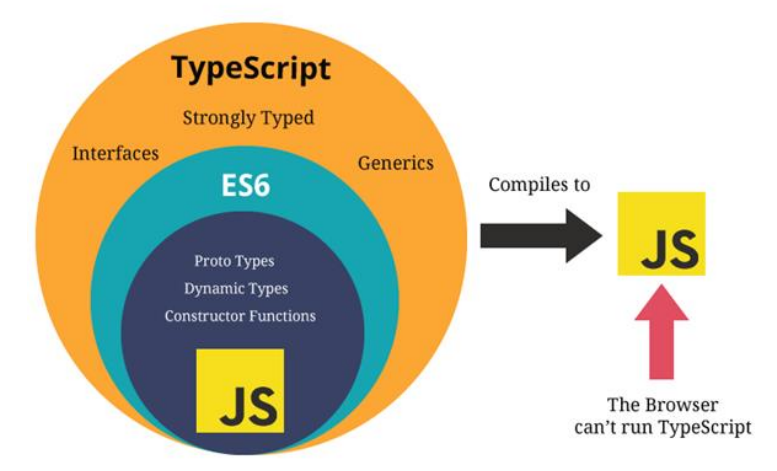
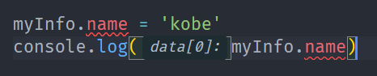
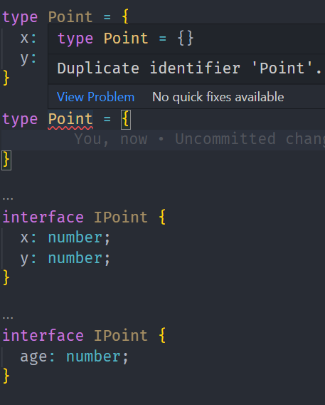
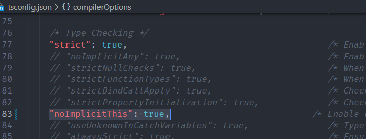
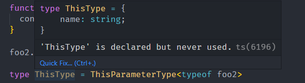
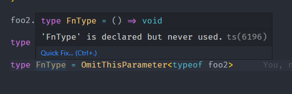

# TypeScript

## TS的运行

- #### 编辑环境

```powershell
# 安装命令
npm install typescript -g
# 查看版本
tsc --version
```

- #### 运行环境

  - 方式一：通过webpack，配置本地的TypeScript编译环境和开启一个本地服务，可以直接运行在浏览器上； 

  - 方式二：通过ts-node库，为TypeScript的运行提供执行环境；


- ##### 方式一

  - 通过webpack，配置本地的TypeScript编译环境和开启一个本地服务，可以直接运行在浏览器上
  - https://mp.weixin.qq.com/s/wnL1l-ERjTDykWM76l4Ajw

- ##### 方式二

  - 通过ts-node库，为TypeScript的运行提供执行环境；
  - 使用ts-node
    - 安装ts-node `npm install ts-node -g`
    - 另外ts-node需要依赖 tslib 和 @types/node 两个包：`npm install tslib @types/node -g`
    - 现在，我们可以直接通过 ts-node 来运行TypeScript的代码：`ts-node ./xxx.ts`


## 变量声明

- 声明格式:
  - `var/let/const 标识符: 数据类型 = 赋值;`
  - 声明了类型后TypeScript就会进行类型检测，声明的类型可以称之为类型注解（Type Annotation）；
- 声明变量的关键字
  - var、let、const
  - 减少使用var
- 变量的类型推导
  - 在开发中，有时候为了方便起见我们并不会在声明每一个变量时都写上对应的数据类型，我们更希望可以通过TypeScript本身的 特性帮助我们推断出对应的变量类型


## JavaScript和TypeScript的数据类型



### number类型

- 数字类型是我们开发中经常使用的类型，TypeScript和JavaScript一样，不区分整数类型（int）和浮点型（double），统一为 number类型。

- ES6新增了二进制和八进制的表示方法，而TypeScript也是支持二进制、八进制、十六进制的表示：

  ```javascript
  let num:number
  
  num = 100 // 十进制
  num = 0b110 // 二进制
  num = 0o555 // 八进制
  num = 0xf23 // 十六进制
  ```

### boolean类型

- boolean类型只有两个取值：true和false

  ```javascript
  let flag:boolean = true
  ```

### string类型

```javascript
let message:string = "Hello World~"
```

### Array类型

```js
const names: string[] = ['kobe', 'james']
const ages: Array<number> = [1,2,3] // 泛型写法
```

### Object类型

- object对象类型可以用于描述一个对象：

  ```js
  const myInfo:object = {
    name: 'justin',
    age: '28',
    height: '188'
  }
  ```

  

- 但是从myinfo中我们不能获取数据，也不能设置数据：




### Symbol类型

```js
let s1: symbol = Symbol('title')
let s2: symbol = Symbol('title')

const person = {
  [s1]: 'teacher',
  [s2]: 'engineer'
}
```

### null和undefined类型

- 在 JavaScript 中，undefined 和 null 是两个基本数据类型。

- 在TypeScript中，它们各自的类型也是undefined和null，也就意味着它们既是实际的值，也是自己的类型：

  ```js
  let n:null = null
  let u:undefined = undefined
  ```

### 函数的参数类型

- 函数是JavaScript非常重要的组成部分

- TypeScript允许我们指定函数的参数和返回值的类型。

- 参数的类型注解

  - 声明函数时，可以在每个参数后添加类型注解，以声明函数接受的参数类型：

    ```typescript
    function fn(name: string): string {
      console.log(name.toUpperCase)
    }
    
    fn('Justin')
    ```

- 函数的返回值类型

  - 添加返回值的类型注解，这个注解出现在函数列表的后面，
  - 和变量的类型注解一样，我们通常情况下不需要返回类型注解，因为TypeScript会根据 return 返回值推断函数的返回类型：

#### 匿名函数的参数

- 匿名函数与函数声明会有一些不同：

  - 当一个函数出现在TypeScript可以确定该函数会被如何调用的地方时；

  - 该函数的参数会自动指定类型；

    ```typescript
    const names: string[] = ['kobe', 'james']
    
    names.forEach(item => {
      console.log(item.toUpperCase())
    })
    ```

- 我们并没有指定item的类型，但是item是一个string类型： 

  - 这是因为TypeScript会根据forEach函数的类型以及数组的类型推断出item的类型； 
  - 这个过程称之为上下文类型（contextual typing），因为函数执行的上下文可以帮助确定参数和返回值的类型；

#### 对象类型

- 如果我们希望限定一个函数接受的参数是一个对象，这个时候要如何限定呢？ 

  - 我们可以使用对象类型； 

- 在这里我们使用了一个对象来作为类型： 

  - 在对象我们可以添加属性，并且告知TypeScript该属性需要是什么类型； 
  - 属性之间可以使用 , 或者 ; 来分割，最后一个分隔符是可选的； 
  - 每个属性的类型部分也是可选的，如果不指定，那么就是any类型；

  ```typescript
  function printCoordinate(point: {x: number, y: number}) {
    console.log('x坐标：', point.x)
    console.log('y坐标：', point.y)
  }
  
  printCoordinate({x:10, y:30})
  ```

#### 可选类型

- 对象类型也可以指定哪些属性是可选的，可以在属性的后面添加一个?

  ```typescript
  function printCoordinate(point: {x: number, y: number, z?: number}) {
    console.log('x坐标：', point.x)
    console.log('y坐标：', point.y)
  
    if(point.z) {
      console.log('z坐标：', point.z)
    					}
  }
  ```

### any类型

- 在某些情况下，我们确实无法确定一个变量的类型，并且可能它会发生一些变化，这个时候我们可以使用any类型
- any类型有点像一种讨巧的TypeScript手段： 
  - 可以对any类型的变量进行任何的操作，包括获取不存在的属性、方法； 
  - 给一个any类型的变量赋值任何的值，比如数字、字符串的值；
- 如果对于某些情况的处理过于繁琐不希望添加规定的类型注解，或者在引入一些第三方库时，缺失了类型注解，这个时候我们可 以使用any： 
  - 包括在Vue源码中，也会使用到any来进行某些类型的适配；

### unknown类型

- unknown是TypeScript中比较特殊的一种类型，它用于描述类型不确定的变量。 
  - 和any类型有点类似，但是unknown类型的值上做任何事情都是不合法的；

### void类型

- void通常用来指定一个函数是没有返回值的，那么它的返回值就是void类型：
- 函数没有写任何类型，那么它默认返回值的类型就是void的，也可以显示的来指定返回值是void：
- **注意**：
  - 可以将undefined赋值给void类型，也就是函数可以返回undefined
- 当基于上下文的类型推导（Contextual Typing）推导出返回类型为 void 的时候，并不会强制函数一定不能返回内容。

### never类型

- never 表示永远不会发生值的类型，比如一个函数：

  -  如果一个函数中是一个死循环或者抛出一个异常，那么这个函数会返回东西吗？ 

  ```ts
  function loopFun(): never {
        while(true) {
          console.log('123')
        }
  }
  ```

  

  - 不会，那么写void类型或者其他类型作为返回值类型都不合适，我们就可以使用never类型；

### tuple类型

- tuple是元组类型，很多语言中也有这种数据类型，比如Python、Swift等。

  ```ts
  const tInfo: [string, number, boolean] = ['justin', 123, true]
  const item1 = tInfo[0] // justin, 并且知道类型是string
  const item2 = tInfo[1] // 123， 并且知道类型是number
  ```

- 那么tuple和数组有什么区别呢？

  - 首先，数组中通常建议存放相同类型的元素，不同类型的元素是不推荐放在数组中。（可以放在对象或者元组中） 
  - 其次，元组中每个元素都有自己特性的类型，根据索引值获取到的值可以确定对应的类型；

### Tuple的应用场景

- tuple通常可以作为返回的值，在使用的时候会非常的方便；

  ```typescript
  function useState<T>(state: T): [T, (newState: T) => void]{
    let currentState = state
    const changeState = (newState: T) => {
      currentState = newState
    }
  
    return [currentState, changeState]
  }
  
  const [counter, setCounter] = useState(10)
  ```


## 语法细节

### 联合类型

- TypeScript的类型系统允许使用多种运算符，从现有类型中构建新类型。 

- 我们来使用第一种组合类型的方法：联合类型（Union Type） 

  - 联合类型是由两个或者多个其他类型组成的类型； 
  - 表示可以是这些类型中的任何一个值； 
  - 联合类型中的每一个类型被称之为联合成员（union's members）

  ```ts
  function printId(id: string | number) {
    console.log(id)
  }
  
  printId(10)
  printId('abc')
  ```

#### 使用联合类型

- 传入给一个联合类型的值是非常简单的：只要保证是联合类型中的某一个类型的值即可 

  - 但是我们拿到这个值之后，我们应该如何使用它呢？因为它可能是任何一种类型。 
  - 比如我们拿到的值可能是string或者number，我们就不能对其调用string上的一些方法；

- 怎么处理这样的问题

  - 需要使用缩小（narrow）联合
  - TypeScript可以根据我们缩小的代码结构，推断出更加具体的类型；

  ```ts
  function printId1(id: string | number) {
        if(typeof id === 'string') {
          // string
          console.log(id)
        } else {
          // number
          console.log(id)
        }
  }
  ```

#### 类型别名

- 们通过在类型注解中编写 对象类型 和 联合类型，但是当我们想要多次在其他地方使用时，就要编写多次。 

- 比如可以给对象类型起一个别名：

  ```ts
  type Point = {
    x: number,
    y: number
  }
  
  type ID = number | string
  
  function printId1(id: ID) {
      console.log(id)
  }
  ```

#### 接口的声明

- 通过type可以用来声明一个对象类型：

  ```ts
  type Point = {
    x: number,
    y: number
  }
  ```

- 对象的另外一种声明方式就是通过接口来声明：

  ```ts
  interface IPoint {
    x: number
    y: number
  }
  ```

- 它们有什么区别

  - 类型别名和接口非常相似，在定义对象类型时，大部分时候，你可以任意选择使用。
  - 接口的几乎所有特性都可以在 type 中使用

#### interface和type区别

- interface和type都可以用来定义对象类型，那么在开发中定义对象类型时，到底选择哪一个呢？

  - 如果是定义非对象类型，通常推荐使用type，比如Direction、Alignment、一些Function；

- 如果是定义对象类型，那么他们是有区别的： 

  - interface 可以重复的对某个接口来定义属性和方法； 
  - 而type定义的是别名，别名是不能重复的；

  

- 所以，interface可以为现有的接口提供更多的扩展。

### 交叉类型（Intersection Types）

- 类型合并，交叉类型：

  - 交叉类似表示需要满足多个类型的条件； 
  - 交叉类型使用 & 符号；

- 来看下面的交叉类型： 

  - 表达的含义是number和string要同时满足； 、
  - 但是有同时满足是一个number又是一个string的值吗？其实是没有的，所以MyType其实是一个never类型；

  ```ts
  type MyType = number & string
  ```

#### 交叉类型的应用

- 在开发中，我们进行交叉时，通常是对对象类型进行交叉的：

```typescript
interface IColor {
  color: string;
}

interface IRun {
  running: () => void;
}

type NewType = IColor & IRun;

const obj1: NewType = {
  color: "red",
  running: function () {},
}
```

### 类型断言as

- 有时候TypeScript无法获取具体的类型信息，这个我们需要使用类型断言（Type Assertions）
- TypeScript只允许类型断言转换为 更具体 或者 不太具体 的类型版本，此规则可防止不可能的强制转换：

### 非空类型断言!

- 非空断言使用的是 ! ，表示可以确定某个标识符是有值的，跳过ts在编译阶段对它的检测；

  ```ts
  function printMsg(msg?: string) {
        console.log(msg)
        console.log(msg!.toUpperCase())
  }
  ```

### 字面量类型

- 可以将多个类型联合在一起

```ts
type Alignment = 'left' | 'center' | 'right'
```

### 字面量推理

```ts
const req = {
  url: 'https://test.com',
  method: 'GET'
} as const  //  as  方式一

function request(url: string, method: 'GET'|'POST') {
  console.log(url, method)
}

//  as  方式二
request(req.url, req.method as 'GET')
```

### 类型缩小

- 什么是类型缩小呢？ 

  - 类型缩小的英文是 Type Narrowing（也有人翻译成类型收窄）； 
  - 通过类似于 typeof padding === "number" 的判断语句，来改变TypeScript的执行路径； 
  - 在给定的执行路径中，可以缩小比声明时更小的类型，这个过程称之为 缩小（ Narrowing ）;
  -  而编写的 typeof padding === "number 可以称之为 类型保护（type guards）；
- 常见的类型保护有如下几种：

  -  typeof（检查返回的值typeof是一种类型保护）
  - 平等缩小（比如===、!==）（以使用Switch或者相等的一些运算符来表达相等性（比如===, !==, ==, and != ））
  -  instanceof （来检查一个值是否是另一个构造函数的“实例”）
  - in （果指定的属性在指定的对象或其原型链中，则in 运算符返回true）
  - ...


### TypeScript函数类型

- 在JavaScript开发中，函数是重要的组成部分，并且函数可以作为一等公民（可以作为参数，也可以作为返回值进行传递）。

- ts可以编写函数类型的表达式（Function Type Expressions），来表示函数类型；

  ```ts
  // 函数类型
  type CalcFunc = (num: number, num2: number) => void;
  
  function calc(fn: CalcFunc) {
    console.log(fn(20, 30));
  }
  
  function sum(num1: number, num2: number) {
    return num1 + num2
  }
  
  function mul(num1: number, num2: number) {
    return num1 * num2
  }
  
  calc(sum)
  calc(mul)
  ```

  

### TypeScript函数类型解析

- 在上面的语法中 (num1: number, num2: number) => void，代表的就是一个函数类型：  
  - 接收两个参数的函数：num1和num2，并且都是number类型； 
  - 并且这个函数是没有返回值的，所以是void； 
- 注意：在某些语言中，可能参数名称num1和num2是可以省略，但是TypeScript是不可以的：

### 调用签名（Call Signatures）

- 在 JavaScript 中，函数除了可以被调用，自己也是可以有属性值的。 

  - 然而前面讲到的函数类型表达式并不能支持声明属性； 

  - 如果我们想描述一个带有属性的函数，我们可以在一个对象类型中写一个调用签名（call signature）； 

    ```ts
    interface ICalcFn {
      name: string
      (num1: number, num2: number): void
    }
    
    function calc(fn: ICalcFn) {
      console.log(fn.name)
      console.log(fn(20, 30));
    }
    ```

- 注意这个语法跟函数类型表达式稍有不同，在参数列表和返回的类型之间用的是 : 而不是 =>。

### 构造签名 （Construct Signatures）

- JavaScript 函数也可以使用 new 操作符调用，当被调用的时候，TypeScript 会认为这是一个构造函数(constructors)，因为 他们会产生一个新对象。 

- 可以写一个构造签名（ Construct Signatures ），方法是在调用签名前面加一个 new 关键词；

  ```ts
  class Person {
    name: string
    constructor(name: string) {
      this.name = name
    }
  }
  
  interface IPerson {
    new (name: string): Person
  }
  
  function factory(ctor: IPerson) {
    return new ctor('Justin')
  }
  
  console.log(factory(Person))
  ```

### 参数的可选类型

```ts
function foo(x: number, y?:number) {
  console.log(x, y)
}
//  y 的类型被推断为 number | undefined
```

- 这个参数y依然是有类型的，它是什么类型呢？ number | undefined
- 可选类型需要在**必传**参数的**后面**：

### 默认参数

```ts
function foo1(x: number, y:number = 6) {
  console.log(x, y)
}
```

### 剩余参数

```ts
function sum(...num: number[]) {
  					// .	..
}
```

### 函数的重载（了解）

- 在TypeScript中，我们可以去编写不同的重载签名（overload signatures）来表示函数可以以不同的方式进行调用； 
- 一般是编写两个或者以上的重载签名，再去编写一个通用的函数以及实现；

### sum函数的重载

- 们调用sum的时候，它会根据我们传入的参数类型来决定执行函数体时，到底执行哪一个函数的重载签名；

```ts
function sum(a1: number, a2: number): number;
function sum(a1: string, a2: string): string;
function sum(a1: any, a2: any): any {
  return a1 + a2;
}

console.log(sum(20, 30))
console.log(sum('Abraham', 'Justin'))
```

### 联合类型和重载

- 现在有一个需求：定义一个函数，可以传入字符串或者数组，获取它们的长度。 

- 这里有两种实现方案： 

  - 方案一：使用联合类型来实现； 

  - 方案二：实现函数重载来实现；

  - ```ts
    function getLength(a: string | any[]) {
      return a.length
    }
    
    function getLength(a: string): number;
    function getLength(a: any[]): number;
    function getLength(a: any) {
      return a.length
    }
    ```

-  在开发中我们选择使用哪一种呢？ 

  - 在可能的情况下，尽量选择使用联合类型来实现；

### 可推导的this类型

```ts
const obj = {
  name: 'obj',
  foo: function() {
    console.log(this.name)
  }
}

obj.foo()
```

- 上面的代码默认情况下是可以正常运行的，也就是TypeScript在编译时，认为我们的this是可以正确去使用的： 
- 这是因为在没有指定this的情况，this默认情况下是any类型的；

#### this的编译选项

- VSCode在检测我们的TypeScript代码时，默认情况下运行不确定的this按照any类型去使用。 
- 但是我们可以创建一个tsconfig.json文件，并且在其中告知VSCodethis必须明确执行（不能是隐式的）；
- 
- 在设置了noImplicitThis为true时， TypeScript会根据上下文推导this，但是在不能正确推导时，就会报错，需要我们明确 的指定this。

#### 指定this的类型

- 在开启noImplicitThis的情况下，我们必须指定this的类型。 

- 如何指定呢？函数的第一个参数类型： 
  - 函数的第一个参数我们可以根据该函数之后被调用的情况，用于声明this的类型（名词必须叫this）； 
  - 在后续调用函数传入参数时，从第二个参数开始传递的，this参数会在编译后被抹除；
  
  ```ts
  function foo2(this: {name: string}) {
    console.log(this)
  }
  
  foo2.call({name: 'Justin'})
  ```

#### this相关的内置工具

- Typescript 提供了一些工具类型来辅助进行常见的类型转换，这些类型全局可用。 
- ThisParameterType： 
  - 用于提取一个函数类型Type的this (opens new window)参数类型； 
  - 如果这个函数类型没有this参数返回unknown；
  - 
- OmitThisParameter： 
  - 用于移除一个函数类型Type的this参数类型, 并且返回当前的函数类型
  - 
- ThisType:
  - 这个类型不返回一个转换过的类型，它被用作标记一个上下文的this类型。

