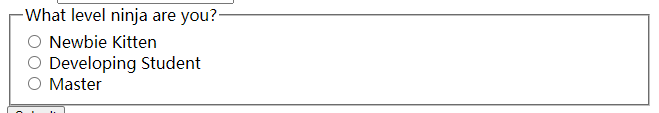
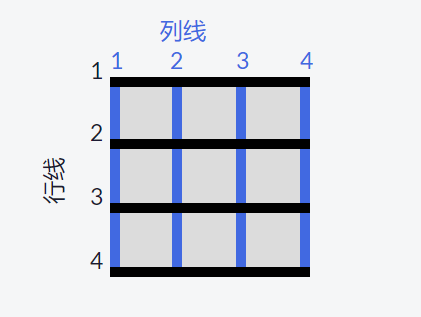
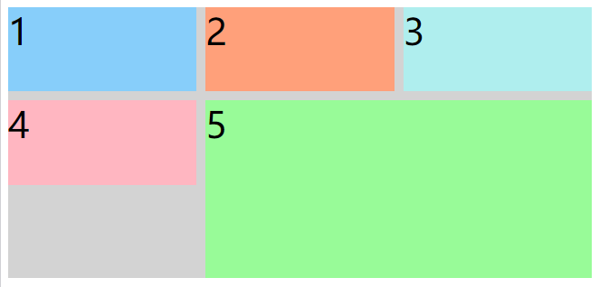

# HTML/CSS 日常总结

### 应用无障碍

- h1~h6 可以让搜索引擎获取页面的大纲

- HTML5 引入了一些新元素，给予开发者更多的选择，也包含辅助功能。 HTML5 引入了诸如 `main`、`header`、`footer`、`nav`、`article`、`section` 等大量新标签。

- `main` 标签用于呈现网页的主体内容，且每个页面应只有一个。 这是为了围绕与页面中心主题相关的信息， 而不应包含如导航连接、网页横幅等需要在多个页面中重复出现的内容。

- `main` 标签也有一个内嵌的特性，以便辅助技术快速定位到页面的主体。 如果你在页面顶部看到过“跳转到主要内容”链接，那么使用 `main` 标签会自动让辅助设备具有这个跳转的功能。

- `article` 是一个分段标签，用于呈现独立及完整的内容。 这个标签适用于博客、论坛帖子或者新闻文章。

- `header` 也是一个具有语义化的、可以提升页面可访问性的 HTML5 标签。 它可以为父级标签呈现简介信息或者导航链接，适用于那些在多个页面顶部重复出现的内容。

- `nav` 也是一个具有语义化特性的 HTML5 标签，它可以使屏幕阅读器快速识别出页面中的导航信息。 它用于呈现页面中的主导航链接。

- `footer` 元素也具有语义化的特性，可以让辅助工具快速定位到它。 它位于页面底部，用于呈现版权信息或者相关文档链接。

- HTML5 引入了 `figure` 标签以及与之相关的 `figcaption` 标签。 它们一起用于展示可视化信息（如：图片、图表）及其标题。 这样通过语义化对内容进行分组并配以用于解释 `figure` 的文字，可以极大地提升内容的可访问性。

- `fieldset` 标签包裹整组单选按钮，实现这个功能。 它经常使用 `legend` 标签来提供分组的描述，以便屏幕阅读器用户会阅读 `fieldset` 元素中的每个选项。当选项的含义很明确时，如“性别选择”，`fieldset` 与 `legend` 标签可以省略。 这时，使用包含 `for` 属性的 `label` 标签就足够了。

  - ```html
    <fieldset>
            <legend>What level ninja are you?</legend>
            <input id="newbie" type="radio" name="levels" value="newbie">
            <label for="newbie">Newbie Kitten</label><br>
            <input id="intermediate" type="radio" name="levels" value="intermediate">
            <label for="intermediate">Developing Student</label><br>
            <input id="master" type="radio" name="levels" value="master">
            <label for="master">Master</label>
          </fieldset>
    ```

  - 

- **使用高对比度文本提高可读性**

  - Web 内容无障碍指南（WCAG）建议正常文本的对比度至少为 4.5 : 1。 对比度是通过比较两种颜色的相对亮度值来计算的。 对比度的范围是从相同颜色的 1:1（无对比度）到白色与黑色的最高对比度 21:1。 在线可用的对比检查工具很多，可以计算这个比率。

- **考虑色盲用户的需求设置合适的对比度**

  - WCAG 建议为颜色及灰度组合使用 4.5:1 的对比度。
  - 实践中，在对比度检测工具的帮助下，我们可以通过将较暗的颜色变暗、将较淡的颜色变淡的方法来使对比度达到 4.5:1。 在色轮中，较暗的颜色通常是蓝色、紫色、洋红和红色，而较淡的颜色通常是橙色、黄色、绿色和蓝绿色。

- **通过给元素添加 accesskey 属性来让用户可以在链接之间快速导航**

  - HTML 提供 `accesskey` 属性，用于指定激活元素或者使元素获得焦点的快捷键。 添加 `accesskey` 属性可以让使用键盘的用户更高效率地导航。
  - HTML5 允许在任何标签上使用这个属性。 该属性尤其适用于链接、按钮、表单组件等元素。

- **使用 tabindex 将键盘焦点添加到元素中**


### 响应式网页设计原则

- @media
- 图片自适应 max-width
- **针对高分辨率屏幕应使用视网膜图片**
- **使排版根据设备尺寸自如响应**
  - 除了使用 `em` 或 `px` 设置文本大小，你还可以用视窗单位来做响应式排版。 视窗单位和百分比都是相对单位，但它们是基于不同的参照物。 视窗单位是相对于设备的视窗尺寸（宽度或高度），百分比是相对于父级元素的大小。
  - 四个不同的视窗单位分别是：
    - `vw`：如 `10vw` 的意思是视窗宽度的 10%。
    - `vh：` 如 `3vh` 的意思是视窗高度的 3%。
    - `vmin：` 如 `70vmin` 的意思是视窗的高度和宽度中较小一个的 70%。
    - `vmax：` 如 `100vmax` 的意思是视窗的高度和宽度中较大一个的 100%。

#### CSS变量

- :root 伪类，表示根元素，也就是html，
- --variable-name: 100px, 定义变量名
- width: var(--variable-name)，获取变量值

#### CSS 弹性盒子

- display: flex
- flex-direction
- flex-wrap
- justify-content 主轴main axis 对齐方式
- align-items 交叉轴 cross axis 对象方式
- item 子元素
  - flex-shrink，收缩规则，父容器缩小
  - flex-grow, 增长系数，父容器变大
  - flex-basis，元素基本大小
  - order，项目排列顺序


#### CSS网格

- display: grid;

- grid-template-columns: 10px 10% auto 1fr 2fr; 设置列数

- grid-template-rows: 3; 设置行数

- grid-column-gap，每列之间的间距

- grid-row-gap, 每行之间的间距

- grid-gap, grid-row-gap 和 grid-column-gap的缩写

- 网格中，假想的水平线和垂直线被称为线（lines）。 这些线在网格的左上角从 1 开始编号，垂直线向右、水平线向下累加计数。

  - 这是一个 3x3 网格的线条：

  -  

- 在 CSS 网格中，每个网格项的内容分别位于被称为单元格（cell）的框内

  - grid-column: 1 / 3;  网格占几列，从左侧开始第一条线到第三条线结束，占用两列

  - ```html
    <style>
      .item1{background:LightSkyBlue;}
      .item2{background:LightSalmon;}
      .item3{background:PaleTurquoise;}
      .item4{background:LightPink;}
    
      .item5 {
        background: PaleGreen;
        grid-column: 2 / 4;
        /* 只修改这一行下面的代码 */
        grid-row: 2 / 4;
        /* 只修改这一行上面的代码 */
      }
    
      .container {
        font-size: 40px;
        min-height: 300px;
        width: 100%;
        background: LightGray;
        display: grid;
        grid-template-columns: 1fr 1fr 1fr;
        grid-template-rows: 1fr 1fr 1fr;
        grid-gap: 10px;
      }
    </style>
    
    <div class="container">
      <div class="item1">1</div>
      <div class="item2">2</div>
      <div class="item3">3</div>
      <div class="item4">4</div>
      <div class="item5">5</div>
    </div>
    ```

  -  

  - justify-self: stretch | start | center | end, 设置其内容的位置在单元格内沿水平轴的对齐方式

  - align-self: stretch | start | center | end, 设置其内容的位置在单元格内沿垂直轴的对齐方式

- justify-items: stretch | start | center | end, **水平对齐所有项目**

- align-items: stretch | start | center | end, 垂直对齐所有项目

- **将网格划分为区域模板**

  - 容器css属性： grid-template-areas，下面代码网格单元格分成四个区域：`header`、`advert`、`content` 和 `footer`。 每个单词代表一个单元格，每对引号代表一行。

  - ```css
    grid-template-areas:
    	"header header header"
    	"advert advert advert"
    	"advert footer footer";
    ```

  - cell 网格项属性 grid-area，在为网格添加区域模板后，可以通过引用你所定义的区域的名称，将元素放入相应的区域。`grid-area: footer;`

  - 如果没有定义区域模板，可以通过水平线和垂直线序号对cell进行区域划分：

    - `grid-area: horizontal line to start at / vertical line to start at / horizontal line to end at / vertical line to end at;`
    - `grid-area: 3/1/4/4;` 表示元素放置在第 3 条和第 4 条水平网格线，以及第 1 条和第 4 条垂直网格线之间的区域内。

- 使用repeat 减少重复，用于设置 `grid-template-columns` 和 `grid-template-rows` 的值

  - 用 `repeat` 方法指定行或列的重复次数，后面加上逗号以及需要重复的值。
  - `grid-template-columns: repeat(1fr)`

- 内置函数 `minmax` 也可用于设置 `grid-template-columns` 和 `grid-template-rows` 的值。 它的作用是在网格容器改变大小时限制网格项的大小

  - `grid-template-columns: repeat(3, minmax(90px, 1fr));`限定其最小值为 `90px`，最大值为`1fr`

- **使用 auto-fill 创建弹性布局**

  - repeat 方法带有一个名为自动填充（auto-fill）的功能。 它的功能是根据容器的大小，尽可能多地放入指定大小的行或列。 你可以通过结合 `auto-fill` 和 `minmax` 来更灵活地布局。
  - `grid-template-columns: repeat(auto-fill, minmax(60px, 1fr));`

- **使用 auto-fit 创建弹性布局**

  - `auto-fit` 效果几乎和 `auto-fill` 一样。 不同点仅在于，当容器的大小大于各网格项之和时，`auto-fill` 会持续地在一端放入空行或空列，这样就会使所有网格项挤到另一边；而 `auto-fit` 则不会在一端放入空行或空列，而是会将所有网格项拉伸至合适的大小。

- 结合媒体查询，实现响应式布局

- 在网格中创建网格