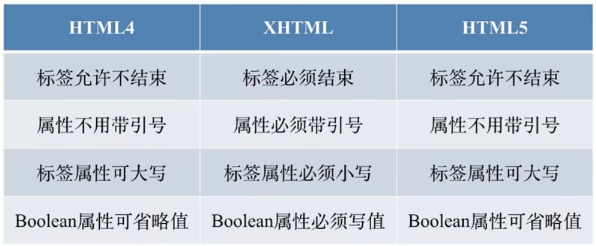
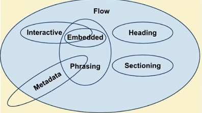
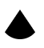
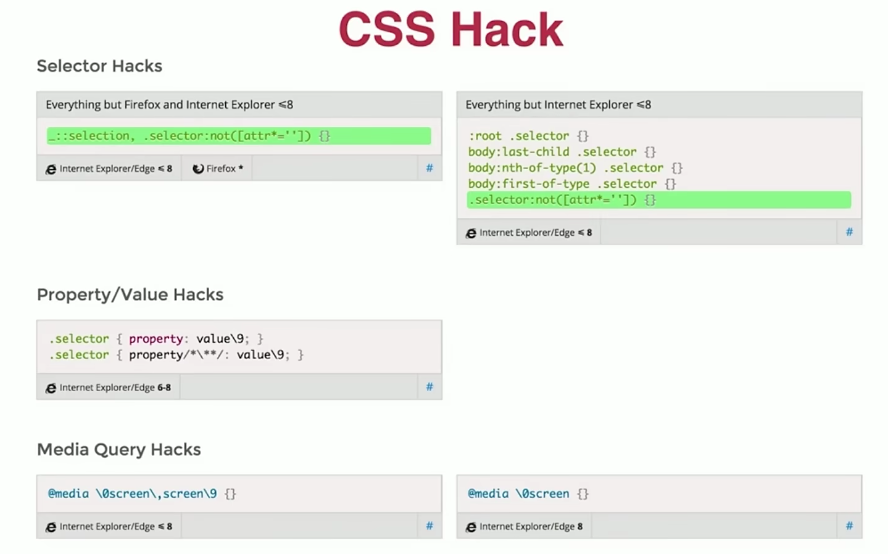
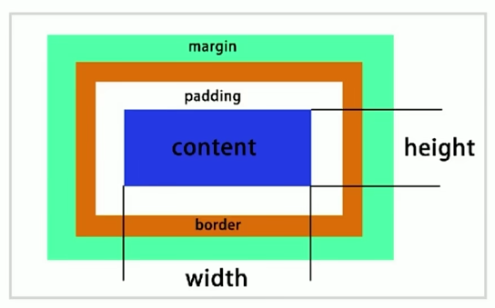
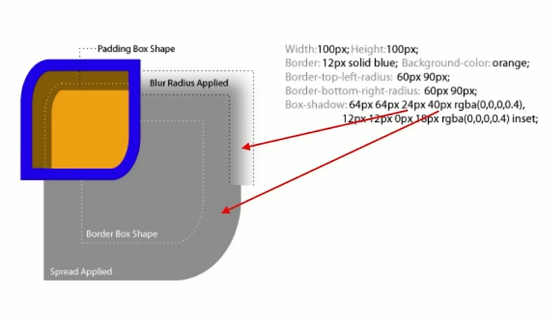
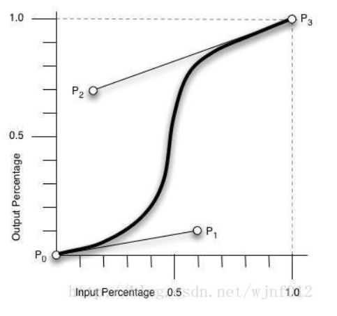

# HTML

### HTML常见元素

- header 元素，不会在页面展示
  - meta
  - title
  - style
  - link
  - script
  - base
- body 元素，展示在页面上
  - div/section/article/aside/header/footer
  - p
  - span/em/strong
  - table/thead/tbody/tr/td
  - ul/ol/li/dl/dt/dd
  - a
  - form/input/select/textarea/button


#### HTML重要属性

- a[href, target]
- img[src, alt]
- table
- form[target, method,enctype] enctype post的编码格式 from-data
- input[type, value]
- button[type]
- select>option[value]
- label[for]


#### HTML 文档

- 描述文档
- 结构化
- 语义化

https://h5o.github.io/#h5o-2 W3C查看页面大纲，html语义化可以使搜索引擎可以爬取页面大纲、关键字


#### HTML版本

- HTML4
  - 基于SGML标记语言（XML的超集）
  - HMTL4会进行标签修正容错
- XHTML(XML) 
  - 严格约束标签写法
- HMTL5




#### HTML5

- 新区块标签
  - section
  - article
  - nav
  - aside
- 表单增强
  - 日期、时间、搜索
  - 表单验证
  - Placeholder 自动聚焦
- 新增语义
  - header、footer 头尾
  - section、article 区域
  - nav 导航
  - aside 不重要的内容 侧边栏
  - em、strong 强调 em强调斜体 strong粗体
  - i => icon  i 标签现在常用来做图标

#### HMTL元素分类

##### 默认样式分类

- 块级 block 规则形状
- 行内 inline 不规则形状
- inline-block 规则形状

##### 按内容分 Flow content

- https://html.spec.whatwg.org/multipage/dom.html#the-nothing-content-model




#### 嵌套关系的合法性

- 块级元素可以包含行内元素
- 块级不一定能包含块级元素
- 行内一般不能包含块级元素
- a > div H5 a是一个transparent，可以包含块元素


#### HTML默认样式

- 默认样式的意义
- 默认样式带来一些问题
- CSS Reset Normalize


#### 问题

- doctype的意义
  - 让浏览器以标准模式渲染
  - 让浏览器知道元素的合法性
- HTML XHTML HTML5 的关系
  - HTML 属于 SGML
  - XHTML 属于 XML，是HTML进行XML严格化的结果
  - HTML5不属于SGML和XML，比XHTML宽松
- HTML5有什么变化
  1. 新的语义化元素
  2. 表单增强
  3. 新的API（离线、音视频、图形、实时通信、本地存储、设备能力）
  4. 分类和嵌套变更
- em 和 i 有什么区别
  - em是语义化的标签，表强调
  - i 是纯样式的标签，没有强调
  - h5已废弃，现在用作图标
- 语义化的意义
  - 开发者容易理解
  - 机器容易理解结构（搜索引擎、读屏软件）
  - 有利于SEO
  - semantic microdata 另外一个规范，添加一些标记，把页面中的元素进行一些语义化
- 哪些元素可以自闭合
  1. input
  2. img
  3. br hr
  4. meta link
- HTML和DOM的关系
  - HMTL是静态的
  - DOM由HMTL解析而来
  - JS可以操作DOM
- property 和 attribute 的区别
  - property 特性，是动态的
  - attribute 属性，是静态的
- form的作用
  - 直接提交表单
  - 使用 submit 、reset按钮
  - 便于浏览器保存表单
  - 第三方库可以整体提取值
  - 第三方库可以进行表单验证


### CSS基础

- Cascading style sheet
- 层叠样式表 样式叠加


#### 基本规则

- 选择器
  - 用于匹配HTML元素
  - 有不同的匹配规则
  - 选择器可以叠加


#### 选择器

- 分类和权重
- 解析方式和性能 浏览器解析样式从右往左解析选择器，然后查找父级进行验证，可以快速解析
- 值得关注的选择器


#### 选择器分类

- 元素选择器 a{}
- 伪元素选择器 ::before{} 真是存在的元素
- 类选择器 .link{}
- 属性选择器 [type=radio]{}
- 伪类选择器 :hover{} 元素的状态
- ID选择器 #id{}
- 组合选择器 +
- 否定选择器 :not(.link) {}
- 通用选择器 *{}


#### 选择器权重

一个选择器的优先级可以说是由四个部分相加 (分量)，可以认为是个十百千 — 四位数的四个位数：

1. **千位**： 如果声明在 [`style`](https://developer.mozilla.org/zh-CN/docs/Web/HTML/Global_attributes#attr-style) 的属性（内联样式）则该位得一分。这样的声明没有选择器，所以它得分总是1000。
2. **百位**： 选择器中包含ID选择器则该位得一分。
3. **十位**： 选择器中包含类选择器、属性选择器或者伪类则该位得一分。
4. **个位**：选择器中包含元素、伪元素选择器则该位得一分。

> **注**: 通用选择器 (`*`)，组合符 (`+`, `>`, `~`, ' ')，和否定伪类 (`:not`) 不会影响优先级。
>
> 选择器不进位

| 选择器                                 | 千位 | 百位 | 十位 | 个位 | 优先级 |
| -------------------------------------- | :--: | :--: | :--: | :--: | :----: |
| h1                                     |  0   |  0   |  0   |  1   |  0001  |
| h1 + p::first-letter                   |  0   |  0   |  0   |  3   |  0012  |
| li > a[href*="en-US"] > .inline-waring |  0   |  0   |  2   |  2   |  0022  |
| #id                                    |  0   |  1   |  0   |  0   |  0100  |
| 内联样式                               |  1   |  0   |  0   |  0   |  1000  |

- !important 优先级最高
- 元素属性 style 优先级高
- 相同权重 后写的生效


#### 非布局样式

- 字体、字重、颜色、大小、行高
- 背景、边框
- 滚动、换行
- 粗体、斜体、下划线
- 其他


#### 字体

- 字体族 不加引号
  - serif sans-serif monospace cursive fantasy

- 多字体 fallback机制，多平台下的字体适配fallback机制

- 网络字体、自定义字体

  ```css
  @font-face {
      font-family: 'IF',
      src: url('url') // 网络地址可能跨域
  }
  .custom-font {
      font-family: IF
  }
  
  ```

- iconfont

- 行高的构成

  - line box 组成，由inline box 的line-height 决定

  - 按照base-line 基线对齐，inline元素需要全部设置相同的才会展示一样

    ```css
    span1 {
        vertival-align: middle;
    }
    
    span2 {
        vertical-align: middle;
    }
    ```

    

- 行高的现象和方案

  - 图片底部留白三像素问题，图片也是也是基于base-line 对齐，可以设置 `vertical-align: bottom`，或者是display：block 独占一行

- 行高的调整


#### 背景

- 背景颜色
- 渐变色的背景
- 多个背景的叠加
- 背景图片和属性（雪碧图）
  - 减少http请求
- base64和性能优化
  - 减小http请求
  - base64 是原图的4/3，体积变大
  - 生产中通过构建对图片就行转换
- 多分辨率适配
  - 不同分辨率，使用不同倍数的图片


#### 边框

- 边框的属性：线型 大小 颜色

- 边框背景图

  ```css
  border-image: url('url') 30 round;
  ```

- 边框实现三角形

  - 临边相交的地方是斜切

  - 下面代码实现一个扇形

    ```css
    div {
        width: 0;
        height: 10px;
        border-bottom: 30px solid black;
        border-right: 20px solid transparent;
        border-left: 20px solid transparent;
        border-radius: 20px;
    }
    ```

    

#### 滚动

- 滚动行为和滚动条

- 滚动条的隐藏和显示

  ```css
  overflow: scroll
  overflow: auto // 根据内容自动显示
  overflow: hidden
  ```


#### 文字折行

- overflow-wrap(word-wrap) 通用换行控制
  - 是否保留单词
- word-break 针对多字节文字
  - 中文句子也是单词
- white-space 空白处是否换行


#### 装饰性属性

- 字重 font-weight

  ```css
  font-weight: normal; // 400
  font-weight: bold; // 700
  font-weight: bolder; // 取决于父级
  font-weight: lighter; // 取决于父级
  font-weight: 100 - 900;
  ```

  

- 斜体 font-style: itatic

- 下划线 text-decoration

- 指针 cursor


#### CSS Hack

- 在一部分浏览器上生效的写法，不合法的写法
- 主要用于区分不同浏览器
- 替代方案：特性检测
- 替代方案：针对性价class




#### 案例

- checkbox css 中设置选中的样式

  ```html
  <input type="checkbox" id="one"/>
  <label for="one">哈哈</label>
  ```

  ```css
  input:checked + label {}
  input + label {}
  ```

- 用radio实现一个选项卡

- 用checkbox 实现一个树结构


#### 真题

- CSS选择器优先级
  - 权重计算
  - !important
  - 内联样式
  - 优先级相同，后写的生效
- 雪碧图的作用
  - 减少http请求数，提高加载性能
  - 有一些情况下减少大小
- 自定义字体的使用场景
  - 固定文案字体
  - 字体图标
- base64 使用
  - 减少http请求
  - 适用于小图片
  - 体积为原图的4/3
- 伪类和伪元素
  - 伪类表状态
  - 伪元素是真是存在的元素
  - 前者单冒号，后者双冒号
  - 历史遗留问题，比如伪元素 :after 有的浏览器还是用单冒号
- 如何美化checkbox
  - label[for] 和 id
  - 隐藏原生input
  - :checked + label 切换样式


### CSS布局

- CSS知识体系的重中之重
- 早起以table为主
- 后来以技巧性为主
- flex、grid
- 响应式布局

#### 常用的布局方法

- table 表格布局
- float + margin
- inline-block
- flexbox
- grid


#### table 布局


#### 盒模型



#### display

#### position

#### flexbox

#### grid

#### float

- 脱离文档流
- 不脱离文本流
- 对自身的影响
  - 形成“块”（BFC）display 为 block
  - 尽量考上、尽量靠左
- 对兄弟元素的影响
  - 上面贴非float元素
  - 旁边贴float元素
  - 不影响其他跨级元素的位置
  - 影响非float元素的文本位置
- 对父级的影响
  - 脱离文档流
  - 高度塌陷
  - 父级 overflow：auto 变成BFC
  - ::after { content: '';visibility:hidden;height:0;display:block; clear:both}

#### inline-block 适用于定宽

- 像文本一样排block
- 字符间距，需要处理间隙，像文字一样，中间的换行会有空白，可以设置父级的font-size: 0;


#### 响应式设计和布局

- 在不同的设备上正常使用
- 一般主要处理屏幕大小问题
- 主要方法：
  - 隐藏 + 折行 + 自适应空间
  - rem / viewport / media query


### 效果属性

- #### 效果如何实现

- box-shadow

- text-shadow

- border-radius

  

#### box-shadow

- 营造层次感（立体感）
- 充当没有宽度边框
- 特殊效果（无限投影，做一个图案）

#### 

#### text-shadow

**text-shadow**为文字添加阴影。可以为文字与 [`text-decorations`](https://developer.mozilla.org/zh-CN/docs/Web/CSS/text-decoration) 添加多个阴影，阴影值之间用逗号隔开。每个阴影值由元素在X和Y方向的偏移量、模糊半径和颜色值组成。

- 立体感
- 印刷感

#### border-radius

- 圆角矩形
- 原形
- 半圆、扇形
- 一些奇怪的


#### background

- 纹理、图案
- 径向渐变、线型渐变
- 雪碧图动画
- 背景图尺寸适应


#### clip-path

- 对容器进行裁剪
- 常见的几何图形
- 自定义路径

```css
clip-path: inset(100px, 50px); // 矩形
clip-path: circle(50px at 100px 100px) // 圆
clip-path: polygon(50% 0, 100% 50%, 50% 100%, 0% 50%) // 多边形 x, y
```

```css
.box {
            width: 500px;
            height: 300px;
            border: 1px solid #000;
            background: url('./Couple wallpaper.jpg') no-repeat center center/cover;
            /*background: url('./Couple wallpaper.jpg') no-repeat center center/contain;*/

            /*background: url('./Couple wallpaper.jpg') no-repeat;*/
            /* 矩形 */
            /*clip-path: inset(100px 50px);*/
            clip-path: circle(50px at 100px 100px);
            /*clip-path: polygon(50% 0, 100% 50%, 50% 100%, 0% 50%);*/
    		clip-path: url(#myPath)

            transition: cilp-path .4s ease;
        }

        .box:hover {
            clip-path: circle(80px at 100px 100px);
        }
```


#### 3D变换

- transform

  ```css
  .container {
      /* 透视距离 */
              perspective: 500px;
  }
  
  #box {
      transform-style: preserve-3d;
  }
  ```

  


#### 问题

- 用一个div画图

  - box-shadow 无限投影 ::before ::after

- 不占空间的边框

  - box-shadow
  - outline

  ```css
  .box {
            width: 200px;
            height: 200px;
            margin: 200px;
            /*border: 1px solid #000;*/
            /* 下面两个不占据空间 */
            /*box-shadow: 0 0 0 1px #000;*/
            outline: 10px solid #0ea9ff;
        }
    </style>
  ```

- 如何实现圆形 border-radius

- 如何实现ios图片

  - clip-path(svg)

    ```css
    clip-path: url(#myPath)
    ```

- 实现半圆、扇形

  - border-radius组合


### CSS动画

> 动画的原理：
>
> 1. 视觉暂留作用
> 2. 画面逐渐变化


#### 动画的作用

- 用户体验愉悦感
- 引起注意
- 掩饰：loading动画


#### 动画类型

- transition 补间动画，中间的过渡动画自动生成
- keyframe 关键帧动画
- 逐帧动画

#### 补间动画

- 位置 - 平移
  - left/right/margin/transform
  - 方位 - 旋转 transform
  - 大小 - 缩放 transform
  - 透明度（opacity）
  - 其他 - 线型变换（transform）

##### transition

> 浏览器控制台Animations面板调试动画 

- 与元素的状态有关
- timing
  - linear
  - ease
  - cubic-bezier 贝塞尔曲线自定义
    - 三次贝塞尔曲线，主要是生成速去曲线的函数
    - 规定：cubic-bezier(<x1>,<y1>,<x2>,<y2>)



从上图中我们可以看到，cubic-bezier有四个点：
两个默认的，即：P0(0,0)，P3(1,1)；
两个控制点，即：P1(x1,y1)，P2(x2,y2)
注：X轴的范围是0~1，超出cubic-bezier将失效，Y轴的取值没有规定，但是也不宜过大。
我们只要调整两个控制点P1和P2的坐标，最后形成的曲线就是动画曲线。


#### 关键帧动画

> 可以指定动画的关键帧动画，
>
> 相当于多个补间动画，
>
> 与元素的状态变化无关，
>
> 定义更加灵活

- animation
- @keyframes


#### 逐帧动画

- 适用于无法补间计算的动画
- 资源较大
- 使用 setps
  - animation-timing-function: steps(1)
  - steps 指定关键帧之间的有几个画面，steps(1)指定一个帧只有一个画面
- 使用场景
  - 适用于动画面积小
  - 适用于动画时长不是很长
  - 控制好面积大小和动画时长，否则会有性能问题


#### 问题

- css动画的实现方式
  - transition
  - animation
- 过渡动画和关键帧动画的区别
  - 过渡动画需要有状态变化
  - 关键帧不需要有状态变化
  - 关键帧动画能控制更精细
- 如何实现逐帧动画
  - 使用关键帧动画
  - 去掉补间（steps 1）
- CSS动画的性能
  1. 性能不坏
  2. 部分情况下由于JS
  3. 但JS可以做到更好
  4. 部分高危属性
     1. box-shadow 等


### CSS预处理器

- 基于CSS的另一种语言
- 通过工具编译成CSS
- 添加了很多CSS不具备的特性
- 能提升CSS文件的组织
  - js 有模块化，css没有
- 预处理的好处
  - 帮助更好的组织代码
  - 提高代码的复用率
  - 提高可维护性


#### 常见的CSS预处理器

- less
  - 基于js写的，编译速度快
  - less 选择变量定义@接近css
- sass
  - 基于Ruby语言写的，有Node版本
  - sass选择变量定义$为了区别css
- stylus


#### CSS预处理器

- 嵌套 反映层级和约束
- 变量和计算，减少重复代码
- Extend 和 Mixin 代码片段
  - 根据场景去选择
  - mixin 带条件参数，代码混入，会出现重复样式
  - extend 提取公共样式，不会出现重复出现
- 循环 适用于复杂有规律的样式
- import CSS文件模块化
  - css 也有 import 会发起http请求，影响性能
  - 按照css模块进行模块划分，组织我们的文件


#### CSS预处理器框架

- SASS - Compass
- Less - Lesshat / EST
- 提供现成的 mixin
- 类似JS类库 封装常用功能


#### Bootstrap

- 一个CSS框架
- Twitter出品
- 提供通用的基础样式

#### bootstrap

- 兼容IE10+
- 使用flexbox布局
- 抛弃Nomalize.css
- 提供布局和reboot版本
- 提供
  - 基础样式
  - 常用组件、交互组件
    - 需要引入JQuery
    - Popper.js
    - poper 组件的基本使用
      - 基于 data-* 属性
      - 基于 JS 
  - JS插件
- 响应式布局
- 定制
  - 修改CSS同名类覆盖
    - 容易遗留，覆盖不全
  - 修改源码重新构建
    - 需要了解源码文件组织结构
  - 引用scss源文件，修改变量
    - 当做一个预处理器的类库
    - 按需使用
    - 需要了解bs各个模块的关系


#### 问题

- bootstrap优缺点
  - 优点：css代码结构合理，现成的样式可以直接用
  - 缺点：定制较为繁琐、体积大
- bs 实现响应式布局
  - 原理：通过media query 设置不同的分辨率的class
  - 使用：通过不同分辨率使用不同的class
- 定制


### CSS工程化

- 组织
- 优化
- 构建
- 维护

##### PostCSS：css => PostCSS 转换(模块化、兼容性、加前缀) => css

- 本身只有解析能力

- 通过插件进行处理

  - import 模块合并 `postcss-import`

  - `autoprefixier` 自动加前缀

    - [BrowserList](https://browserslist.dev/?q=bGFzdCAyIHZlcnNpb25z) `browserslist` 实际上就是声明了⼀段浏览器的集合，我们的⼯具可以根据这段集合描述，针对性的输出兼容性代码。

    - `browserslist`就是帮助我们来设置⽬标浏览器的⼯具。`browserslist` 被⼴泛的应⽤到 `Babel`、`postcsspreset-env`、`autoprefixer` 等开发⼯具上。

    - 在package.json中配置

      ```json
      {
       "browserslist": ["last 2 version", "> 1%", "maintained node versions", "not
      ie < 11"]
      }
      ```

    - 或者在项⽬的根⽬录下创建⼀个 `.browserslistrc` ⽂件：

      ```tex
      # 注释是这样写的，以#号开头
      # 每⾏⼀个浏览器集合描述
      last 2 version
      > 1%
      maintained node versions
      not ie < 11
      ```

      

  - `cssnano` 压缩代码

  - `cssnext` 使用CSS新特性

  - precss 变量、mixin、循环等

  

  #### 使用

  - 安装`postcss-cli`

    ```sh
    ..\node_modules\.bin\postcss .\01-postcss.css -o build/01-postcss.css
    ```

    

  

### 总结

- CSS学习路径
  - HTML基础、CSS基础
  - CSS布局
  - 效果和动画
  - 工具、工程化、框架