# react 学习总结


### 核心语法

#### JSX

- JSX是一种JavaScript的语法扩展（eXtension），也在很多地方称之为JavaScript XML，因为看起就是一段XML语法； 
- 它用于描述我们的UI界面，并且其完成可以和JavaScript融合在一起使用； 
- 它不同于Vue中的模块语法，你不需要专门学习模块语法中的一些指令（比如v-for、v-if、v-else、v-bind）；
- JSX的书写规范： 
  - JSX的顶层只能有一个根元素，所以我们很多时候会在外层包裹一个div原生（或者使用后面我们学习的Fragment）； 
  - 为了方便阅读，我们通常在jsx的外层包裹一个小括号()，这样可以方便阅读，并且jsx可以进行换行书写； 
  - JSX中的标签可以是单标签，也可以是双标签； ü 注意：如果是单标签，必须以/>结尾；

#### JSX的使用

- jsx中的注释 
- JSX嵌入变量
  - 情况一：当变量是Number、String、Array类型时，可以直接显示 
  - 情况二：当变量是null、undefined、Boolean类型时，内容为空； 
    - 如果希望可以显示null、undefined、Boolean，那么需要转成字符串； 
    - 转换的方式有很多，比如toString方法、和空字符串拼接，String(变量)等方式； 
  - 情况三：对象类型不能作为子元素（not valid as a React child）
- JSX嵌入表达式 
  - 运算表达式
  - 三元运算符 
  - 执行一个函数
- jsx绑定属性 
  - 比如元素都会有title属性 
  - 比如img元素会有src属性 
  - 比如a元素会有href属性 
  - 比如元素可能需要绑定class 
  - 比如原生使用内联样式style

#### React事件绑定

- React 事件的命名采用小驼峰式（camelCase），而不是纯小写； 
- 我们需要通过{}传入一个事件处理函数，这个函数会在事件发生时被执行；

#### this的绑定问题

- 方案一：bind给btnClick显示绑定this 
- 方案二：使用 ES6 class fields 语法 
- 方案三：事件监听时传入箭头函数（推荐）

#### 事件参数传递

- 在执行事件函数时，有可能我们需要获取一些参数信息：比如event对象、其他参数 
- 情况一：获取event对象 
  - 很多时候我们需要拿到event对象来做一些事情（比如阻止默认行为） 
  - 假如我们用不到this，那么直接传入函数就可以获取到event对象； 
- 情况二：获取更多参数 
  - 有更多参数时，我们最好的方式就是传入一个箭头函数，主动执行的事件函数，并且传入相关的其他参数；

#### React条件渲染

- 方式一：条件判断语句 
  - 适合逻辑较多的情况 
- 方式二：三元运算符 
  - 适合逻辑比较简单 
- 与运算符&& 
  - 适合如果条件成立，渲染某一个组件；如果条件不成立，什么内容也不渲染；

#### JSX的本质

- 实际上，jsx 仅仅只是 React.createElement(component, props, ...children) 函数的语法糖。 p 所有的jsx最终都会被转换成React.createElement的函数调用。
- createElement需要传递三个参数： 
- 参数一：type 
  - 当前ReactElement的类型； 
  - 如果是标签元素，那么就使用字符串表示 “div”； 
  - 如果是组件元素，那么就直接使用组件的名称；
- 参数二：config 
  - 所有jsx中的属性都在config中以对象的属性和值的形式存储
- 参数三：children 
  - 存放在标签中的内容，以children数组的方式进行存储； 
  - 当然，如果是多个元素呢？

#### Babel官网查看

- 默认jsx是通过babel帮我们进行语法转换的，所以我们之前写的jsx代码都需要依赖babel。 
- 可以在babel的官网中快速查看转换的过程：https://babeljs.io/repl/#?presets=react

#### 虚拟DOM的创建过程

- 我们通过 React.createElement 最终创建出来一个 ReactElement对象：
- 这个ReactElement对象是什么作用呢？React为什么要创建它呢？ 
  - 原因是React利用ReactElement对象组成了一个JavaScript的对象树； 
  - JavaScript的对象树就是大名鼎鼎的虚拟DOM（Virtual DOM）；
- 如何查看ReactElement的树结构呢？ 
  - 我们可以将之前的jsx返回结果进行打印； 
  - 注意下面代码中我打jsx的打印；
- 而ReactElement最终形成的树结构就是Virtual DOM；

#### jsx - 虚拟dom - 真实dom

#### 虚拟dom的优点

- 为什么要采用虚拟DOM，而不是直接修改真实的DOM呢？ 
  - 很难跟踪状态发生的改变：原有的开发模式，我们很难跟踪到状态发生的改变，不方便针对我们应用程序进行调试；
  - 操作真实DOM性能较低：传统的开发模式会进行频繁的DOM操作，而这一的做法性能非常的低；
- DOM操作性能非常低：
  - 首先，document.createElement本身创建出来的就是一个非常复杂的对象； 
    - https://developer.mozilla.org/zh-CN/docs/Web/API/Document/createElement
  - 其次，DOM操作会引起浏览器的回流和重绘，所以在开发中应该避免频繁的DOM操作；

#### 声明式编程

- 虚拟DOM帮助我们从命令式编程转到了声明式编程的模式
- React官方的说法：Virtual DOM 是一种编程理念。
  - 在这个理念中，UI以一种理想化或者说虚拟化的方式保存在内存中，并且它是一个相对简单的JavaScript对象
  - 我们可以通过ReactDOM.render让虚拟DOM 和 真实DOM同步起来，这个过程中叫做协调（Reconciliation）；
- 这种编程的方式赋予了React声明式的API：
  - 你只需要告诉React希望让UI是什么状态； 
  - React来确保DOM和这些状态是匹配的； 
  - 你不需要直接进行DOM操作，只可以从手动更改DOM、属性操作、事件处理中解放出来；


### React脚手架

- 脚手架（Scaffold），其实是一种工具，帮我们可以快速生成项目的工程化结构；
- 脚手架让项目从搭建到开发，再到部署，整个流程变得快速和便捷；
- React的脚手架工具：create-react-app

#### 安装脚手架

`npm install -g create-react-app`

#### 创建React项目

- 创建React项目的命令如下： 
  - 注意：项目名称不能包含大写字母 
  - 另外还有更多创建项目的方式，可以参考GitHub 的readme
  - `create-react-app project_name`

#### 目录结构分析

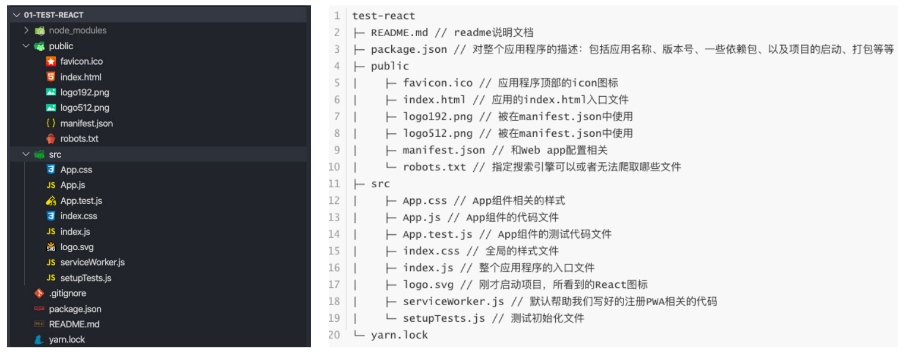

#### 了解PWA

- 整个目录结构都非常好理解，只是有一个PWA相关的概念： 
  - PWA全称Progressive Web App，即渐进式WEB应用； 
  - 一个 PWA 应用首先是一个网页, 可以通过 Web 技术编写出一个网页应用； 
  - 随后添加上 App Manifest 和 Service Worker 来实现 PWA 的安装和离线等功能； 
  - 这种Web存在的形式，我们也称之为是 Web App；
- PWA解决了哪些问题呢？ 
  - 可以添加至主屏幕，点击主屏幕图标可以实现启动动画以及隐藏地址栏； 
  - 实现离线缓存功能，即使用户手机没有网络，依然可以使用一些离线功能； 
  - 实现了消息推送； 
  - 等等一系列类似于Native App相关的功能；


### React组件化开发

#### 分而治之的思想

- 面对复杂问题的处理方式： 
  - 任何一个人处理信息的逻辑能力都是有限的 
  - 所以，当面对一个非常复杂的问题时，我们不太可能一次性搞定一大堆的内容。 
  - 但是，我们人有一种天生的能力，就是将问题进行拆解。 
  - 如果将一个复杂的问题，拆分成很多个可以处理的小问题，再将其放在整体当中，你会发现大的问题也会迎刃而解。
- 上面的思想就是分而治之的思想： 
  - 分而治之是软件工程的重要思想，是复杂系统开发和维护的基石； 
  - 而前端目前的模块化和组件化都是基于分而治之的思想；

#### 什么是组件化开发呢？

- 组件化也是类似的思想： 
  - 如果我们将一个页面中所有的处理逻辑全 部放在一起，处理起来就会变得非常复杂， 而且不利于后续的管理以及扩展。 
  - 但如果，我们讲一个页面拆分成一个个小的功能块，每个功能块完成属于自己这部 分独立的功能，那么之后整个页面的管理 和维护就变得非常容易了。
- 我们需要通过组件化的思想来思考整个应用程 序： 
  - 我们将一个完整的页面分成很多个组件； 
  - 每个组件都用于实现页面的一个功能块； 
  - 而每一个组件又可以进行细分； 
  - 而组件本身又可以在多个地方进行复用；

#### React的组件化

- 组件化是React的核心思想： 
  - 组件化提供了一种抽象，让我们可以开发出一个个独立可复用的小组件来构造我们的应用。 
  - 任何的应用都会被抽象成一颗组件树。

#### React的组件化

- 组件化思想的应用： 
  - 有了组件化的思想，我们在之后的开发中就要充分的利用它。 
  - 尽可能的将页面拆分成一个个小的、可复用的组件。 
  - 这样让我们的代码更加方便组织和管理，并且扩展性也更强。
- React的组件相对于Vue更加的灵活和多样，按照不同的方式可以分成很多类组件： 
  - 根据组件的定义方式，可以分为：函数组件(Functional Component )和类组件(Class Component)； 
  - 根据组件内部是否有状态需要维护，可以分成：无状态组件(Stateless Component )和有状态组件(Stateful Component)； 
  - 根据组件的不同职责，可以分成：展示型组件(Presentational Component)和容器型组件(Container Component)；

- 这些概念有很多重叠，但是他们最主要是关注数据逻辑和UI展示的分离： 
  - 函数组件、无状态组件、展示型组件主要关注UI的展示； 
  - 类组件、有状态组件、容器型组件主要关注数据逻辑； 
- 当然还有很多组件的其他概念：比如异步组件、高阶组件等。

#### 类组件

- 类组件的定义有如下要求： 
  - 组件的名称是大写字符开头（无论类组件还是函数组件） 
  - 类组件需要继承自 React.Component 
  - 类组件必须实现render函数

- 在ES6之前，可以通过create-react-class 模块来定义类组件，但是目前官网建议我们使用ES6的class类定义。
- 使用class定义一个组件： 
  - constructor是可选的，我们通常在constructor中初始化一些数据； 
  - this.state中维护的就是我们组件内部的数据； 
  - render() 方法是 class 组件中唯一必须实现的方法；

#### render函数的返回值

- 当 render 被调用时，它会检查 this.props 和 this.state 的变化并返回以下类型之一：
  - React 元素：
  
    - 通常用 JSX创建
  
  - 数组或 fragments：使得 render 方法可以返回多个元素。
  
  - Portals：可以渲染子节点到不同的 DOM 子树中。
  
  - 字符串或数值类型：它们在 DOM 中会被渲染为文本节点
  
  - 布尔类型或 null：什么都不渲染。
  
    ```js
    export default class App extends Component {
      render() {
        return (
          <h2>Hello Class Component</h2>
        )
      }
    }
    ```
  
    

#### 函数组件

- 函数组件是使用function来进行定义的函数，只是这个函数会返回和类组件中render函数返回一样的内容。 

- 函数组件有自己的特点（当然，后面我们会讲hooks，就不一样了）： 

  - 没有生命周期，也会被更新并挂载，但是没有生命周期函数； 

  - 没有this(组件实例）； 

  - 没有内部状态（state）；

  - 我们来定义一个函数组件：

    ```js
    export default function App() {
      return (
        <h2>Hello Function Component</h2>
      )
    }
    ```

#### 认识生命周期

- 很多的事物都有从创建到销毁的整个过程，这个过程称之为是生命周期； 
- React组件也有自己的生命周期，了解组件的生命周期可以让我们在最合适的地方完成自己想要的功能； 
- 生命周期和生命周期函数的关系： 
- 生命周期是一个抽象的概念，在生命周期的整个过程，分成了很多个阶段； 
  - 比如装载阶段（Mount），组件第一次在DOM树中被渲染的过程； 
  - 比如更新过程（Update），组件状态发生变化，重新更新渲染的过程； 
  - 比如卸载过程（Unmount），组件从DOM树中被移除的过程； 
- React内部为了告诉我们当前处于哪些阶段，会对我们组件内部实现的某些函数进行回调，这些函数就是生命周期函数： 
  - 比如实现componentDidMount函数：组件已经挂载到DOM上时，就会回调； 
  - 比如实现componentDidUpdate函数：组件已经发生了更新时，就会回调； 
  - 比如实现componentWillUnmount函数：组件即将被移除时，就会回调； 
  - 可以在这些回调函数中编写自己的逻辑代码，来完成自己的需求功能； 
- 我们谈React生命周期时，主要谈的类的生命周期，因为函数式组件是没有生命周期函数的；（后面我们可以通过hooks来模拟一些生命周期的回调）

#### 生命周期解析

- https://projects.wojtekmaj.pl/react-lifecycle-methods-diagram/

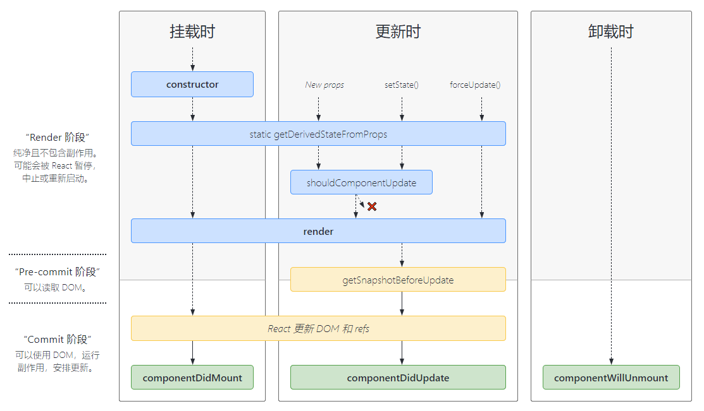

#### 生命周期函数

- Constructor 
  - 如果不初始化 state 或不进行方法绑定，则不需要为 React 组件实现构造函数。 
  - constructor中通常只做两件事情： 
    - 通过给 this.state 赋值对象来初始化内部的state； 
    - 为事件绑定实例（this）；
- componentDidMount
  - componentDidMount() 会在组件挂载后（插入 DOM 树中）立即调用。 
  - componentDidMount中通常进行哪里操作呢？ 
    - 依赖于DOM的操作可以在这里进行； 
    - 在此处发送网络请求就最好的地方；（官方建议） 
    - 可以在此处添加一些订阅（会在componentWillUnmount取消订阅）；
- componentDidUpdate
  - componentDidUpdate() 会在更新后会被立即调用，**首次渲染不会执行此方法**。 
  - 当组件更新后，可以在此处对 DOM 进行操作； 
  - 如果你对更新前后的 props 进行了比较，也可以选择在此处进行网络请求；（例如，当 props 未发生变化时，则不会执行网络请求）。
- componentWillUnmount
  - componentWillUnmount() 会在组件卸载及销毁之前直接调用。 
  - 在此方法中执行必要的清理操作； 
  - 例如，清除 timer，取消网络请求或清除 在 componentDidMount() 中创建的订阅等；
- getDerivedStateFromProps：state的值在任何时候都依赖于 props时使用；该方法返回一个对象来更新state； 
- getSnapshotBeforeUpdate：在React更新DOM之前回调的一个函数，可以获取DOM更新前的一些信息（比如说滚动位置）； 
- shouldComponentUpdate：该生命周期函数很常用， 性能优化时再来详细讲解；

#### 组件的嵌套

- 它们存在如下关系： 
  - App组件是Header、Main、Footer组件的父组件； 
  - Main组件是Banner、ProductList组件的父组件；

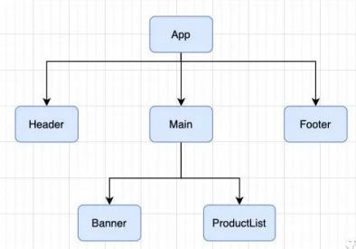 

#### 组件间的通信

- 父组件在展示子组件，可能会传递一些数据给子组件： 
  - 父组件通过 属性=值 的形式来传递给子组件数据； 
  - 子组件通过 props 参数获取父组件传递过来的数据；
  - 父组件传递子组件 - 类组件和函数组件

#### 参数propTypes

- 对于传递给子组件的数据，有时候我们可能希望进行验证，特别是对于大型项目来说： 
  - 当然，如果你项目中默认继承了Flow或者TypeScript，那么直接就可以进行类型验证； 
  - 但是，即使我们没有使用Flow或者TypeScript，也可以通过 prop-types 库来进行参数验证；
- 从 React v15.5 开始，React.PropTypes 已移入另一个包中：prop-types 库
- 更多的验证方式，可以参考官网：https://zh-hans.reactjs.org/docs/typechecking-withproptypes.html 
  - 比如验证数组，并且数组中包含哪些元素； 
  - 比如验证对象，并且对象中包含哪些key以及value是什么类型； 
  - 比如某个原生是必须的，使用 requiredFunc: PropTypes.func.isRequired
- 如果没有传递，我们希望有默认值呢？ 
  - 我们使用defaultProps就可以了

#### 子组件传递父组件

- 子组件向父组件传递消息： 
  - 在vue中是通过自定义事件来完成的； 
  - 在React中同样是通过props传递消息，只是让父组件给子组件传递一个回调函数，在子组件中调用这个函数即可；

#### Context应用场景

- 非父子组件数据的共享： 
  - 在开发中，比较常见的数据传递方式是通过props属性自上而下（由父到子）进行传递。 
  - 但是对于有一些场景：比如一些数据需要在多个组件中进行共享（地区偏好、UI主题、用户登录状态、用户信息等）。 
  - 如果我们在顶层的App中定义这些信息，之后一层层传递下去，那么对于一些中间层不需要数据的组件来说，是一种冗余的操作
- 但是，如果层级更多的话，一层层传递是非常麻烦，并且代码是非常冗余的： 
  - React提供了一个API：Context； 
  - Context 提供了一种在组件之间共享此类值的方式，而不必显式地通过组件树的逐层传递 props； 
  - Context 设计目的是为了共享那些对于一个组件树而言是“全局”的数据，例如当前认证的用户、主题或首选语言；

#### Context相关API

- React.createContext 
  - 创建一个需要共享的Context对象： 
  - 如果一个组件订阅了Context，那么这个组件会从离自身最近的那个匹配的 Provider 中读取到当前的context值； 
  - defaultValue是组件在顶层查找过程中没有找到对应的Provider，那么就使用默认值
- Context.Provider 
  - 每个 Context 对象都会返回一个 Provider React 组件，它允许消费组件订阅 context 的变化： 
  - Provider 接收一个 value 属性，传递给消费组件； 
  - 一个 Provider 可以和多个消费组件有对应关系； 
  - 多个 Provider 也可以嵌套使用，里层的会覆盖外层的数据； 
  - 当 Provider 的 value 值发生变化时，它内部的所有消费组件都会重新渲染；
- Class.contextType
  - 挂载在 class 上的 contextType 属性会被重赋值为一个由 React.createContext() 创建的 Context 对象： 
  - 这能让你使用 this.context 来消费最近 Context上的那个值；
  - 你可以在任何生命周期中访问到它，包括 render 函数中；
- Context.Consumer 
  - 这里，React 组件也可以订阅到 context 变更。这能让你在函数式组件中完成订阅 context。 
  - 这里需要函数作为子元素（function as child）这种做法； 
  - 这个函数接收当前的 context 值，返回一个 React 节点；

#### 使用setState

- 开发中我们并不能直接通过修改state的值来让界面发生更新： 
  - 因为我们修改了state之后，希望React根据最新的State来重新渲染界面，但是这种方式的修改React并不知道数据发生了变 化； 
  - React并没有实现类似于Vue2中的Object.defineProperty或者Vue3中的Proxy的方式来监听数据的变化； 
  - 我们必须通过setState来告知React数据已经发生了变化；
- setState方法是从Component中继承过来的。

#### setState异步更新

- 为什么setState设计为异步呢？ 
  - setState设计为异步其实之前在GitHub上也有很多的讨论； 
  - React核心成员（Redux的作者）Dan Abramov也有对应的回复，有兴趣的同学可以参考一下； 
    - https://github.com/facebook/react/issues/11527#issuecomment-360199710
- setState设计为异步，可以显著的提升性能； 
  - 如果每次调用 setState都进行一次更新，那么意味着render函数会被频繁调用，界面重新渲染，这样效率是很低的； 
  - 最好的办法应该是获取到多个更新，之后进行批量更新； 
- 如果同步更新了state，但是还没有执行render函数，那么state和props不能保持同步； 
  - state和props不能保持一致性，会在开发中产生很多的问题；

#### 获取异步的结果

- 方式一：setState的回调 
  - setState接受两个参数：第二个参数是一个回调函数，这个回调函数会在更新后会执行； 
  - 格式如下：setState(partialState, callback)
- 在生命周期 componentDidupdate中获取，此时render渲染完毕

#### setState一定是异步吗？

- 在setTimeout中的更新：

  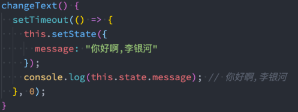 

- 原生DOM事件：

  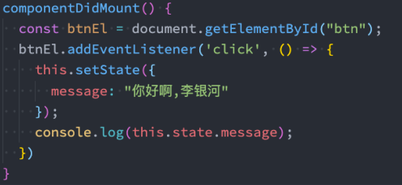 

- 其实分成两种情况： 
  - 在组件生命周期或React合成事件中，setState是异步； 
  - ~~在setTimeout或者原生dom事件中，setState是同步；~~，现在react18，这两种方式返回的也是异步

#### 源码

- react
- react-dom
- react-reconciler
  - ReactFiberClassComponent.js -> classComponentUpdater

#### state数据的合并

- 通过setState去修改message，是不会对name产生影响的； 
- 源码中其实是有对 原对象 和 新对象进行合并的：
- 对应源码：react-reconciler - > ReactUpdateQueue.js
  - `Object.assign({}, prevState, partialState)`

#### 多个setState的合并

- 内部setState 会存在一队列中，循环遍历队列，然后更新
  - setState({})，传入一个对象，执行多次，最后数据更新执行一次，Object.assign({},, prevState, partialState)，数据不会累加
  - setState(function(preState, props))，传入一个函数，内部遍历，preState会更新，执行多次，数据会累加

#### React更新机制

- React的渲染流程：JSX -> 虚拟DOM -> 真实DOM
- react的更新流程：state/props改变 -> render函数重新执行 -> 产生新的DOM树 -> 新旧的DOM树进行diff -> 计算出差异进行更新 -> 更新到真实DOM

#### React的更新流程

- React在props或state发生改变时，会调用React的render方法，会创建一颗不同的树。 
- React需要基于这两棵不同的树之间的差别来判断如何有效的更新UI： 
  - 如果一棵树参考另外一棵树进行完全比较更新，那么即使是最先进的算法，该算法的复杂程度为 O(n3)，其中 n 是树中元素的数量； 
  - https://grfia.dlsi.ua.es/ml/algorithms/references/editsurvey_bille.pdf； 
  - 如果在 React 中使用了该算法，那么展示 1000 个元素所需要执行的计算量将在十亿的量级范围； 
  - 这个开销太过昂贵了，React的更新性能会变得非常低效；
- 于是，React对这个算法进行了优化，将其优化成了O(n)，如何优化的呢？ 
  - 同层节点之间相互比较，不会垮节点比较； 
  - 不同类型的节点，产生不同的树结构； 
  - 开发中，可以通过key来指定哪些节点在不同的渲染下保持稳定；

#### 情况一：对比不同类型的元素

- 当节点为不同的元素，React会拆卸原有的树，并且建立起新的树： 
  - 当一个元素从 a 变成 img，会触发一个完整的重建流程； 
  - 当卸载一棵树时，对应的DOM节点也会被销毁，组件实例将执行 componentWillUnmount() 方法； 
  - 当建立一棵新的树时，对应的 DOM 节点会被创建以及插入到 DOM 中，组件实例将执行 componentWillMount() 方法， 紧接着 componentDidMount() 方法；

#### 情况二：对比同一类型的元素

- 当比对两个相同类型的 React 元素时，React 会保留 DOM 节点，仅比对及更新有改变的属性。 

- 比如下面的代码更改： 

  - 通过比对这两个元素，React 知道只需要修改 DOM 元素上的 className 属性；

    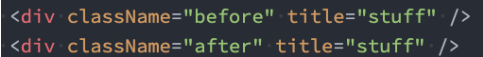 

- 如果是同类型的组件元素： 

  - 组件会保持不变，React会更新该组件的props，并且调用componentWillReceiveProps() 和 componentWillUpdate() 方法； 
  - 下一步，调用 render() 方法，diff 算法将在之前的结果以及新的结果中进行递归；

#### 情况三：对子节点进行递归

- 在默认条件下，当递归 DOM 节点的子元素时，React 会同时遍历两个子元素的列表；当产生差异时，生成一个 mutation。
- 在最后插入一条数据的情况： 
  - 前面两个比较是完全相同的，所以不会产生mutation； 
  - 最后一个比较，产生一个mutation，将其插入到新的 DOM树中即可；
- 是在中间插入一条数据： 
  - React会对每一个子元素产生一个mutation；
  - 这种低效的比较方式会带来一定的性能问题；

#### keys的优化

- 方式一：在最后位置插入数据 
  - 这种情况，有无key意义并不大 
- 方式二：在前面插入数据 
  - 这种做法，在没有key的情况下，所有的li都需要进行修改；
- 当子元素(这里的li)拥有 key 时，React 使用 key 来匹配原有树上的子元素以及最新树上的子元素： 
  - 在下面这种场景下，key为111和222的元素仅仅进行位移，不需要进行任何的修改； 
  - 将key为333的元素插入到最前面的位置即可；
- key的注意事项： 
  - key应该是唯一的； 
  - key不要使用随机数（随机数在下一次render时，会重新生成一个数字）； 
  - 使用index作为key，对性能是没有优化的；

#### render函数被调用

- 使用之前的一个嵌套案例： 
  - 在App中，我们增加了一个计数器的代码； 
  - 当点击+1时，会重新调用App的render函数； 
  - 而当App的render函数被调用时，所有的子组件的render 函数都会被重新调用；
- 那么，我们可以思考一下，在以后的开发中，我们只要是修改 了App中的数据，所有的组件都需要重新render，进行diff算法，性能必然是很低的： 
  - 事实上，很多的组件没有必须要重新render； 
  - 它们调用render应该有一个前提，就是依赖的数据（state、 props）发生改变时，再调用自己的render方法； 
  - 如何来控制render方法是否被调用呢？ 
    - 通过shouldComponentUpdate方法即可；

#### shouldComponentUpdate

- React给我们提供了一个生命周期方法 shouldComponentUpdate（很多时候，我们简称为SCU），这个方法接受参数，并且需要有返回值： 
- 该方法有两个参数： 
  - 参数一：nextProps 修改之后，最新的props属性 
  - 参数二：nextState 修改之后，最新的state属性
- 该方法返回值是一个boolean类型 
  - 返回值为true，那么就需要调用render方法； 
  - 返回值为false，那么久不需要调用render方法； 
  - 默认返回的是true，也就是只要state发生改变，就会调用render方法；
- 比如我们在App中增加一个message属性： 
  - jsx中并没有依赖这个message，那么它的改变不应该引起重新渲染；
  - 但是因为render监听到state的改变，就会重新render，所以最后render方法还是被重新调用了；

#### PureComponent

- 如果所有的类，我们都需要手动来实现 shouldComponentUpdate，那么会给我们开发者增加非常多的工作量。 

  - 我们来设想一下shouldComponentUpdate中的各种判断的目的是什么？ 
  - props或者state中的数据是否发生了改变，来决定shouldComponentUpdate返回true或者false； 

- 事实上React已经考虑到了这一点，所以React已经默认帮我们实现好了，如何实现呢？ 

  - 将class继承自PureComponent。

- 源码

  - react-reconciler

    - ReactFiberClassComponent.js -> classComponentUpdater

    - checkShouldComponetUpdate() 函数返回Boolean

      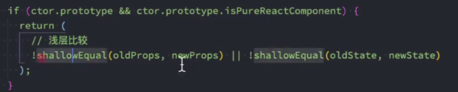 

#### shallowEqual方法

- 这个方法中，调用 !shallowEqual(oldProps, newProps) || !shallowEqual(oldState, newState)，这个shallowEqual就是进行浅层比较：

#### 高阶组件memo

- 对于函数式组件，通过memo函数包裹，可以实现函数式子组件没有props依赖，不会重新渲染
- 源码：\packages\react-reconciler\src\ReactFiberBeginWork.new.js -> updateMemoComponent()

#### 不可变数据的力量

- setState传递的数据，传入新的对象，不要改变原对象

  ```js
  handleClick() {
    this.setState(state => ({
      words: state.words.concat(['marklar'])
    }));
  }
  
  handleClick() {
    this.setState(state => ({
      words: [...state.words, 'marklar'],
    }));
  };
  
  function updateColorMap(colormap) {
    return Object.assign({}, colormap, {right: 'blue'});
  }
  
  function updateColorMap(colormap) {
    return {...colormap, right: 'blue'};
  }
  ```


#### 事件总线

- 组件间数据通信
- events常用的API： 
  - 创建EventEmitter对象：eventBus对象； 
  - 发出事件：eventBus.emit("事件名称", 参数列表); 
  - 监听事件：eventBus.addListener("事件名称", 监听函数)； 
  - 移除事件：eventBus.removeListener("事件名称", 监听函数)；

```js
import {PureComponent} from "react";
import {EventEmitter} from 'events'

const eventBus = new EventEmitter()

class Home extends PureComponent {
  componentDidMount() {
    eventBus.addListener('home', this.handlerEvent)
  }

  componentWillUnmount() {
    eventBus.removeListener('home', this.handlerEvent)
  }

  render() {
    return (
      <h2>Home</h2>
    )
  }

  handlerEvent(...args) {
    console.log(...args)
  }
}

class Main extends PureComponent {
  render() {
    return (
      <div>
        <h2>Main</h2>
        <button onClick={() => this.handlerEmit()}>与Home通信</button>
      </div>
    )
  }

  handlerEmit() {
    eventBus.emit('home', 123, 'Hello Home')
  }
}

export default class App extends PureComponent {
  render() {
    return (
      <div>
        <h2>Hello EventBus</h2>
        <Home/>
        <Main/>
      </div>
    )
  }
}
```


#### 如何使用ref

- 在React的开发模式中，通常情况下不需要、也不建议直接操作DOM原生，但是某些特殊的情况，确实需要获取到DOM进行某些操作： 
  - 管理焦点，文本选择或媒体播放； 
  - 触发强制动画； 
  - 集成第三方 DOM 库；
- 如何创建refs来获取对应的DOM呢？目前有三种方式：
  - 方式一：传入字符串 
    - 使用时通过 this.refs.传入的字符串格式获取对应的元素； 
  - 方式二：传入一个对象 
    - 对象是通过 React.createRef() 方式创建出来的； 
    - 使用时获取到创建的对象其中有一个current属性就是对应的元素； 
  - 方式三：传入一个函数 
    - 该函数会在DOM被挂载时进行回调，这个函数会传入一个元素对象，我们可以自己保存； 
    - 使用时，直接拿到之前保存的元素对象即可；

#### ref的类型 

- ref 的值根据节点的类型而有所不同： 
  - 当 ref 属性用于 HTML 元素时，构造函数中使用 React.createRef() 创建的 ref 接收底层 DOM 元素作为其 current 属性； 
  - 当 ref 属性用于自定义 class 组件时，ref 对象接收组件的挂载实例作为其 current 属性； 
  - 你不能在函数组件上使用 ref 属性，因为他们没有实例；
- 函数式组件是没有实例的，所以无法通过ref获取他们的实例： 
  - 但是某些时候，我们可能想要获取函数式组件中的某个DOM元素； 
  - 这个时候我们可以通过 React.forwardRef ，后面我们也会学习 hooks 中如何使用ref；

#### 认识受控组件

- 在React中，HTML表单的处理方式和普通的DOM元素不太一样：表单元素通常会保存在一些内部的state。
- HTML表单元素： 
  - 处理方式是 DOM默认处理HTML表单的行为，在用户点击提交时会提交到某个服务器中，并且刷新页面； 
  - 在React中，并没有禁止这个行为，它依然是有效的； 
  - 但是通常情况下会使用JavaScript函数来方便的处理表单提交，同时还可以访问用户填写的表单数据； 
  - **实现这种效果**的标准方式是**使用“受控组件”**；

#### 受控组件基本演练

- 在 HTML 中，表单元素（如、  和 <select>）之类的表单元素通常自己维护 state，并根据用户输入进行 更新。

- 而在 React 中，可变状态（mutable state）通常保存在组件的 state 属性中，并且只能通过使用 setState()来更新。 

  - 将两者结合起来，使React的state成为“唯一数据源”； 
  - 渲染表单的 React 组件还控制着用户输入过程中表单发生的操作； 
  - 被 React 以这种方式控制取值的表单输入元素就叫做“受控组件”；

- 由于在表单元素上设置了 value 属性，因此显示的值将始终为 this.state.value，这使得 React 的 state 成为唯一数据源。

  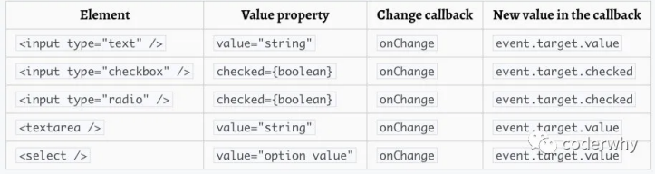 

- textarea标签 

  - texteare标签和input比较相似： 

- select标签 

  - select标签的使用也非常简单，只是它不需要通过selected属性来控制哪一个被选中，它可以匹配state的value来选中。 

- 处理多个输入 

  - 多处理方式可以像单处理方式那样进行操作，但是需要多个监听方法： 
  - 这里我们可以使用ES6的一个语法：计算属性名（Computed property names）

#### 非受控组件

- React推荐大多数情况下使用 受控组件 来处理表单数据： 
  - 一个受控组件中，表单数据是由 React 组件来管理的； 
- 另一种替代方案是使用非受控组件，这时表单数据将交由 DOM 节点来处理； 
  - 如果要使用非受控组件中的数据，那么我们需要使用 ref 来从DOM节点中获取表单数据。 
  - 使用ref来获取input元素； 
- 在非受控组件中通常使用defaultValue来设置默认值；
  - 同样，`<input type="checkbox">` 和 `<input type="radio"> ` 支持 defaultChecked，select 和 textarea 支 持 defaultValue。

#### 认识高阶函数

- 什么是高阶组件呢？ 
- 相信很多同学都听说过，也用过 高阶函数，它们非常相似，所以我们可以先来回顾一下什么是高阶函数。 
- 高阶函数的维基百科定义：至少满足以下条件之一： 
  - 接受一个或多个函数作为输入； 
  - 输出一个函数； 
- JavaScript中比较常见的filter、map、reduce都是高阶函数。 
- 那么说明是高阶组件呢？ 
  - 高阶组件的英文是 Higher-Order Components，简称为 HOC； 
  - 官方的定义：高阶组件是参数为组件，返回值为新组件的函数； 
- 我们可以进行如下的解析：
  - 首先， 高阶组件本身不是一个组件，而是一个函数； 
  - 其次，这个函数的参数是一个组件，返回值也是一个组件；

#### 高阶组件的定义

- 高阶组件接收一个组件，返回一个新的组件

- ```js
  function enhanceComponet(WrappedComponent, displayName = 'NewComponent') {
    class NewComponent extends PureComponent {
      render() {
        return <App {...this.props}/>
      }
    }
  
    // react devtools 组件展示的名字
    NewComponent.displayName = displayName
  
    return NewComponent
  }
  ```
  
- 组件的名称问题： 

  - 在ES6中，类表达式中类名是可以省略的； 
  - 组件的名称都可以通过displayName来修改；

- 高阶组件并不是React API的一部分，它是基于React的 组合特性而形成的设计模式； 

- 高阶组件在一些React第三方库中非常常见： 

  - 比如redux中的connect；（后续会讲到） 
  - 比如react-router中的withRouter；（后续会讲到）

#### 类表达式（ES6）

```js
const Person = class {} // 类表达式，class 后面的类名可以省略
```

-XX:ReservedCodeCacheSize=768m

#### 应用一 – props的增强

- 不修改原有代码的情况下，添加新的props

  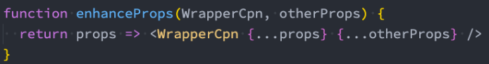

- 利用高阶组件来共享Context

  ```js
  function withUser(WrappedComponent) {
    return props => {
      return (
        <UserContext.Consumer>
          {
            user => <WrappedComponent {...props} {...user}/>
          }
        </UserContext.Consumer>
      )
    }
  }
  ```

#### 应用二 – 渲染判断鉴权，对组件进行劫持

- 在开发中，我们可能遇到这样的场景： 
  - 某些页面是必须用户登录成功才能进行进入； 
  - 如果用户没有登录成功，那么直接跳转到登录页面； 
- 这个时候，我们就可以使用高阶组件来完成鉴权操作：

#### 应用三 – 生命周期劫持

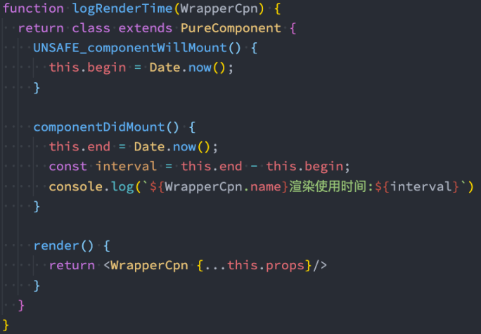  

#### 高阶函数的意义

- 我们会发现利用高阶组件可以针对某些React代码进行更加优雅的处理。 
- 其实早期的React有提供组件之间的一种复用方式是mixin，目前已经不再建议使用： 
  - Mixin 可能会相互依赖，相互耦合，不利于代码维护 
  - 不同的Mixin中的方法可能会相互冲突 
  - Mixin非常多时，组件是可以感知到的，甚至还要为其做相关处理，这样会给代码造成滚雪球式的复杂性
- 当然，HOC也有自己的一些缺陷： 
  - HOC需要在原组件上进行包裹或者嵌套，如果大量使用HOC，将会产生非常多的嵌套，这让调试变得非常困难； 
  - HOC可以劫持props，在不遵守约定的情况下也可能造成冲突；
- Hooks的出现，是开创性的，它解决了很多React之前的存在的问题 
  - 比如this指向问题、比如hoc的嵌套复杂度问题等等；

#### ref的转发

- 在前面我们学习ref时讲过，ref不能应用于函数式组件： 
  - 因为函数式组件没有实例，所以不能获取到对应的组件对象
- 但是，在开发中我们可能想要获取函数式组件中某个元素的DOM，这个时候我们应该如何操作呢？ 
  - 方式一：直接传入ref属性（错误的做法） 
  - 方式二：通过forwardRef高阶函数；

#### Portals的使用

- 某些情况下，我们希望渲染的内容独立于父组件，甚至是独立于当前挂载到的DOM元素中（默认都是挂载到id为root的DOM元 素上的）。 
- Portal 提供了一种将子节点渲染到存在于父组件以外的 DOM 节点的优秀的方案： 
  - 第一个参数（child）是任何可渲染的 React 子元素，例如一个元素，字符串或 fragment； 
  - 第二个参数（container）是一个 DOM 元素；

#### fragment

- 使用Fragment p Fragment 允许你将子列表分组，而无需向 DOM 添加额外节点； 
- React还提供了Fragment的短语法： 
  - 它看起来像空标签 <> ； 
  - 但是，如果我们需要在Fragment中添加key，那么就不能使用短语法

#### StrictMode

- StrictMode 是一个用来突出显示应用程序中潜在问题的工具。 
  - 与 Fragment 一样，StrictMode 不会渲染任何可见的 UI； 
  - 它为其后代元素触发额外的检查和警告； 
  - 严格模式检查仅在开发模式下运行；它们不会影响生产构建；

#### 严格模式检查的内容

1. 识别不安全的生命周期： 
2. 使用过时的ref API 
3. 使用废弃的findDOMNode方法 
   - 在之前的React API中，可以通过findDOMNode来获取DOM，已经不推荐使用了；
4. 检查意外的副作用 
   - 这个组件的constructor会被调用两次； 
   - 这是严格模式下故意进行的操作，让你来查看在这里写的一些逻辑代码被调用多次时，是否会产生一些副作用； 
   - 在生产环境中，是不会被调用两次的； 
5. 检测过时的context API 
   - 早期的Context是通过static属性声明Context对象属性，通过getChildContext返回Context对象等方式来使用Context的； 
   - 目前这种方式已经不推荐使用；


### React中的样式

<hr/>

#### 组件化天下的CSS

- 在组件化中选择合适的CSS解决方案应该符合以下条件： 
  - 可以编写局部css：css具备自己的具备作用域，不会随意污染其他组件内的原生； 
  - 可以编写动态的css：可以获取当前组件的一些状态，根据状态的变化生成不同的css样式； 
  - 支持所有的css特性：伪类、动画、媒体查询等； 
  - 编写起来简洁方便、最好符合一贯的css风格特点； p 等等...

#### React中的CSS

- 事实上，css一直是React的痛点，也是被很多开发者吐槽、诟病的一个点。 
- 在这一点上，Vue做的要确实要好于React： 
  - Vue通过在.vue文件中编写 style 标签来编写自己的样式；
  - 通过是否添加 scoped 属性来决定编写的样式是全局有效还是局部有效； 
  - 通过 lang 属性来设置你喜欢的 less、sass等预处理器； 
  - 通过内联样式风格的方式来根据最新状态设置和改变css； 
  - 等等...
- Vue在CSS上虽然不能称之为完美，但是已经足够简洁、自然、方便了，至少统一的样式风格不会出现多个开发人员、多个项目采用不一样的样式风格。 
- 相比而言，React官方并没有给出在React中统一的样式风格： 
  - 由此，从普通的css，到css modules，再到css in js，有几十种不同的解决方案，上百个不同的库； 
  - 大家一致在寻找最好的或者说最适合自己的CSS方案，但是到目前为止也没有统一的方案；

#### 内联样式

- 内联样式是官方推荐的一种css样式的写法： 

  - style 接受一个采用小驼峰命名属性的 JavaScript 对象，，而不是 CSS 字符串； 
  - 并且可以引用state中的状态来设置相关的样式；

- 内联样式的优点: 

  1. 内联样式, 样式之间不会有冲突 

  2. 可以动态获取当前state中的状态

- 内联样式的缺点： 

  1. 写法上都需要使用驼峰标识 
  2. 某些样式没有提示 
  3. 大量的样式, 代码混乱 
  4. 某些样式无法编写(比如伪类/伪元素) 

- 所以官方依然是希望内联合适和普通的css来结合编写；

#### 普通的css

- 普通的css我们通常会编写到一个单独的文件，之后再进行引入。 
- 这样的编写方式和普通的网页开发中编写方式是一致的： 
  - 如果我们按照普通的网页标准去编写，那么也不会有太大的问题； 
  - 但是组件化开发中我们总是希望组件是一个独立的模块，即便是样式也只是在自己内部生效，不会相互影响； 
  - 但是普通的css都属于全局的css，样式之间会相互影响； 
- 这种编写方式最大的问题是样式之间会相互层叠掉；

#### css modules

- css modules并不是React特有的解决方案，而是所有使用了类似于webpack配置的环境下都可以使用的。 
  - 但是，如果在其他项目中使用个，那么我们需要自己来进行配置，比如配置webpack.config.js中的modules: true等。
- React的脚手架已经内置了css modules的配置： 
  - .css/.less/.scss 等样式文件都修改成 .module.css/.module.less/.module.scss 等； 
  - 之后就可以引用并且进行使用了；
- css modules确实解决了局部作用域的问题，也是很多人喜欢在React中使用的一种方案。
- 但是这种方案也有自己的缺陷： 
  - 引用的类名，不能使用连接符(.home-title)，在JavaScript中是不识别的； 
  - 所有的className都必须使用{style.className} 的形式来编写； 
  - 不方便动态来修改某些样式，依然需要使用内联样式的方式； 
- 如果你觉得上面的缺陷还算OK，那么你在开发中完全可以选择使用css modules来编写，并且也是在React中很受欢迎的一种方 式。

#### 认识CSS in JS

- 实际上，官方文档也有提到过CSS in JS这种方案： 
  - “CSS-in-JS” 是指一种模式，其中 CSS 由 JavaScript 生成而不是在外部文件中定义； 
  - 注意此功能并不是 React 的一部分，而是由第三方库提供。 React 对样式如何定义并没有明确态度；

#### 认识styled-components

- 批评声音虽然有，但是在我们看来很多优秀的CSS-in-JS的库依然非常强大、方便： 
  - CSS-in-JS通过JavaScript来为CSS赋予一些能力，包括类似于CSS预处理器一样的样式嵌套、函数定义、逻辑复用、动态修 改状态等等； 
  - 依然CSS预处理器也具备某些能力，但是获取动态状态依然是一个不好处理的点； 
  - 所以，目前可以说CSS-in-JS是React编写CSS最为受欢迎的一种解决方案；
- 目前比较流行的CSS-in-JS的库有哪些呢？ 
  - styled-components 
  - emotion 
  - glamorous
- ES6标签模板字符串，在styled component中，就是通过这种方式来解析模块字符串，最终生成 我们想要的样式的

### React中添加class

- 借助于一个第三方的库：classnames 
  - 这是一个用于动态添加classnames的一个库。

### 使用 Antdesign库

### 使用 axios库

#### 对 axios进行二次封装

- 进行二次封装，方便统一处理，封装一次，重复利用
- 新建实例，抽离配置信息

### React-Transition-Group

- 在开发中，我们想要给一个组件的显示和消失添加某种过渡动画，可以很好的增加用户体验。 
- 当然，我们可以通过原生的CSS来实现这些过渡动画，但是React社区为我们提供了react-transition-group用来完成过渡动画。 
- React曾为开发者提供过动画插件 react-addons-css-transition-group，后由社区维护，形成了现在的 react-transition-group。
- `npm install react-transition-group --save`

### Redux的使用

#### 为什么需要redux

- JavaScript开发的应用程序，已经变得越来越复杂了： 
  - JavaScript需要管理的状态越来越多，越来越复杂； 
  - 这些状态包括服务器返回的数据、缓存数据、用户操作产生的数据等等，也包括一些UI的状态，比如某些元素是否被选中， 是否显示加载动效，当前分页；
- 管理不断变化的state是非常困难的： 
  - 状态之间相互会存在依赖，一个状态的变化会引起另一个状态的变化，View页面也有可能会引起状态的变化； 
  - 当应用程序复杂时，state在什么时候，因为什么原因而发生了变化，发生了怎么样的变化，会变得非常难以控制和追踪；
- React是在视图层帮助我们解决了DOM的渲染过程，但是State依然是留给我们自己来管理： 
  - 无论是组件定义自己的state，还是组件之间的通信通过props进行传递；也包括通过Context进行数据之间的共享； 
  - React主要负责帮助我们管理视图，state如何维护最终还是我们自己来决定；
- Redux就是一个帮助我们管理State的容器：Redux是JavaScript的状态容器，提供了可预测的状态管理； 
- Redux除了和React一起使用之外，它也可以和其他界面库一起来使用（比如Vue），并且它非常小（包括依赖在内，只有2kb）

#### Redux的核心理念 - Store

- Redux的核心理念非常简单。 
- 比如我们有一个朋友列表需要管理： 
  - 如果我们没有定义统一的规范来操作这段数据，那么整个数据的变化就是无法跟踪的；
  - 比如页面的某处通过products.push的方式增加了一条数据；
  - 比如另一个页面通过products[0].age = 25修改了一条数据；
- 整个应用程序错综复杂，当出现bug时，很难跟踪到底哪里发生的变化；

#### Redux的核心理念 - action

- Redux要求我们通过action来更新数据： 
  - 所有数据的变化，必须通过派发（dispatch）action来更新； 
  - action是一个普通的JavaScript对象，用来描述这次更新的type和content；

#### Redux的核心理念 - reducer

- reducer做的事情就是将传入的state和action结合起来生成一个新的state；

#### Redux的三大原则

- 单一数据源 
  - 整个应用程序的state被存储在一颗object tree中，并且这个object tree只存储在一个 store 中： 
  - Redux并没有强制让我们不能创建多个Store，但是那样做并不利于数据的维护； 
  - 单一的数据源可以让整个应用程序的state变得方便维护、追踪、修改；
- State是只读的 
  - 唯一修改State的方法一定是触发action，不要试图在其他地方通过任何的方式来修改State： 
  - 这样就确保了View或网络请求都不能直接修改state，它们只能通过action来描述自己想要如何修改state； 
  - 这样可以保证所有的修改都被集中化处理，并且按照严格的顺序来执行，所以不需要担心race condition（竟态: 多个操作去操作同一块数据）的问题；
- 使用纯函数来执行修改 
  - 通过reducer将 旧state和 actions联系在一起，并且返回一个新的State： 
  - 随着应用程序的复杂度增加，我们可以将reducer拆分成多个小的reducers，分别操作不同state tree的一部分； 
  - 但是所有的reducer都应该是纯函数，不能产生任何的副作用；

#### redux使用流程

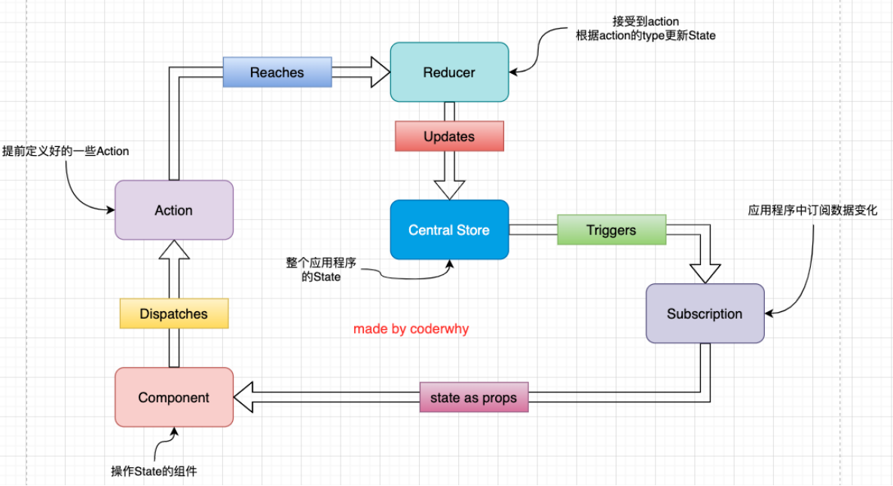

#### react-redux使用

- redux和react没有直接的关系，你完全可以在React, Angular, Ember, jQuery, or vanilla JavaScript中 使用Redux。

#### 组件中异步操作

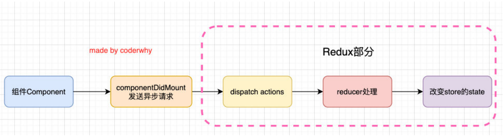

#### redux中异步操作

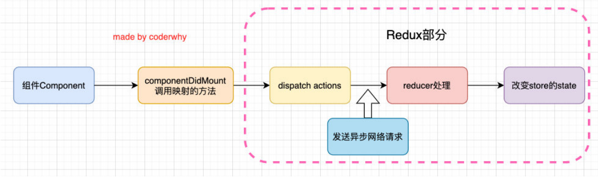

- 在redux中可以进行异步的操作
  - 使用中间件（Middleware）；
- redux也引入了中间件（Middleware）的概念： 
  - 这个中间件的目的是在dispatch的action和最终达到的reducer之间，扩展一些自己的代码； 
  - 比如日志记录、调用异步接口、添加代码调试功能等等；
- 官网推荐的、包括演示的网络请求的中间件是使用 redux-thunk；
  - redux-thunk可以让dispatch(action函数)，action可以是一个函数；
  - 该函数会被调用，并且会传给这个函数一个dispatch函数和getState函数； 
    - dispatch函数用于我们之后再次派发action；
    - getState函数考虑到我们之后的一些操作需要依赖原来的状态，用于让我们可以获取之前的一些状态；


#### redux-devtools的使用

- 浏览器配置
- 代码中配置


#### redux-saga 

- https://redux-saga-in-chinese.js.org/
- `redux-saga` 是一个用于管理应用程序 Side Effect（副作用，例如异步获取数据，访问浏览器缓存等）的 library，它的目标是让副作用管理更容易，执行更高效，测试更简单，在处理故障时更容易。
- 用于构建复杂、大型的应用
- saga中间件使用了ES6的generator语法
- 使用：
  1. 安装redux-saga 
  2. 集成redux-saga中间件 
     1. 导入创建中间件的函数； 
     2. 通过创建中间件的函数，创建中间件，并且放到applyMiddleware函数中； 
     3. 启动中间件的监听过程，并且传入要监听的saga； 
  3. saga.js文件的编写 
     - takeEvery：可以传入多个监听的actionType，每一个都可以被执行（对应有一个takeLatest，会取消前面的） 
     - put：在saga中派发action不再是通过dispatch，而是通过put； 
     - all：可以在yield的时候put多个action；


#### redux中间件的实现

```JS
import {legacy_createStore} from 'redux'
import reducer from "./reducer.js";

const store = legacy_createStore(reducer)

function patchLogging(store) {
  let next = store.dispatch

  function dispatchAndLog(action) {
    console.log('dispatching: ', action)
    next(action)
    console.log('new state：', store.getState())
  }

  return dispatchAndLog
}

function patchThunk(store) {
  let next = store.dispatch

  function dispatchAndThunk(action) {
    if(typeof action === 'function') {
      action(store.dispatch, store.getState)
    } else {
      next(action)
    }
  }

  return dispatchAndThunk
}

// store.dispatch = patchLogging(store)
// store.dispatch = patchThunk(store)

function applyMiddleware(store, middlewares) {
  middlewares = middlewares.slice()

  middlewares.forEach(middleware => {
    store.dispatch = middleware(store)
  })
}

applyMiddleware(store, [patchLogging, patchThunk])

export default store
```


#### combineReducers函数

- redux给我们提供了一个combineReducers函数可以方便的让我们对多个reducer进行合并：

  ```js
  import {combineReducers} from 'redux'
  
  import {reducer as counterReducer} from './counter'
  import {reducer as homeReducer} from './home'
  
  // function reducer(state = {}, action) {
  //   return {
  //     counterInfo: counterReducer(state.counterInfo, action),
  //     homeInfo: homeReducer(state.homeInfo, action)
  //   }
  // }
  
  const reducer = combineReducers({
    counterInfo: counterReducer,
    homeInfo: homeReducer
  })
  
  export default reducer
  ```

  

### react-router的使用

#### 路由的由来

- 说起路由你想起了什么？ 
  - 路由是一个网络工程里面的术语。 
  - 路由（routing）就是通过互联的网络把信息从源地址传输到目的地址的活动. --- 维基百科 
- 路由器提供了两种机制: 路由和转送. 
  - 路由是决定数据包从来源到目的地的路径. 
  - 转送将输入端的数据转移到合适的输出端. 
- 路由中有一个非常重要的概念叫路由表. 
  - 路由表本质上就是一个映射表, 决定了数据包的指向. 
- 路由的概念出现最早是在后端路由中实现的，原因是web的发展主要经历了这样一些阶段： 
  - 后端路由阶段； 
  - 前后端分离阶段； 
  - 单页面富应用（SPA）；


#### 阶段一：后端路由阶段

- 早期的网站开发整个HTML页面是由服务器来渲染的. 
  - 服务器直接生产渲染好对应的HTML页面, 返回给客户端进行展示. 
- 但是, 一个网站, 这么多页面服务器如何处理呢? 
  - 一个页面有自己对应的网址, 也就是URL. 
  - URL会发送到服务器, 服务器会通过正则对该URL进行匹配, 并且最后交给一个Controller进行处理. p
  - Controller进行各种处理, 最终生成HTML或者数据, 返回给前端. 
  - 这就完成了一个IO操作. 
- 上面的这种操作, 就是后端路由. 
  - 当我们页面中需要请求不同的路径内容时, 交给服务器来进行处理, 服务器渲染好整个页面, 并且将页面返回给客户顿. 
  - 这种情况下渲染好的页面, 不需要单独加载任何的js和css, 可以直接交给浏览器展示, 这样也有利于SEO的优化. 
- 后端路由的缺点: 
  - 一种情况是整个页面的模块由后端人员来编写和维护的. 
  - 另一种情况是前端开发人员如果要开发页面, 需要通过PHP和Java等语言来编写页面代码. 
  - 而且通常情况下HTML代码和数据以及对应的逻辑会混在一起, 编写和维护都是非常糟糕的事情

#### 阶段二：前后端分离阶段

- 前端渲染的理解： 
  - 每次请求涉及到的静态资源都会从静态资源服务器获取； 
  - 这些资源包括HTML+CSS+JS，然后在前端对这些请求回来的资源进行渲染； 
  - 需要注意的是，客户端的每一次请求，都会从静态资源服务器请求文件； 
  - 同时可以看到，和之前的后断路由不同，这时后端只是负责提供API了；
- 前后端分离阶段： 
  - 随着Ajax的出现, 有了前后端分离的开发模式； 
  - 后端只提供API来返回数据，前端通过Ajax获取数据，并且可以通过JavaScript将数据渲染到页面中； 
  - 这样做最大的优点就是前后端责任的清晰，后端专注于数据上，前端专注于交互和可视化上； 
  - 并且当移动端(iOS/Android)出现后，后端不需要进行任何处理，依然使用之前的一套API即可； 
  - 目前很多的网站依然采用这种模式开发（jQuery开发模式）；

#### 阶段三：单页面富应用（SPA）

- 单页面富应用的理解： 
  - 单页面富应用的英文是single-page application，简称SPA；
  - 整个Web应用只有实际上只有一个页面，当URL发生改变时，并不会从服务器请求新的静态资源； 
  - 而是通过JavaScript监听URL的改变，并且根据URL的不同去渲染新的页面；
- 如何可以应用URL和渲染的页面呢？**前端路由** 
  - 前端路由维护着URL和渲染页面的映射关系； 
  - 路由可以根据不同的URL，最终让我们的框架（比如Vue、React、Angular）去渲染不同的组件； 
  - 最终我们在页面上看到的实际就是渲染的一个个组件页面；

#### 前端路由的原理

- 前端路由是如何做到URL和内容进行映射呢？监听URL的改变。
- URL发生变化，同时不引起页面的刷新有两个办法： 
  - 通过URL的 hash改变URL； 
  - 通过HTML5中的 history模式修改URL；
- 当监听到URL发生变化时，我们可以通过自己判断当前的URL，决定到底渲染什么样的内容。

#### URL的hash

- URL的hash p URL的hash也就是锚点(#), 本质上是改变window.location的href属性； p 我们可以通过直接赋值location.hash来改变href, 但是页面不发生刷新；

- 注意：

  - Ø hash的优势就是兼容性更好，在老版 IE中都可以运行；
  - Ø 但是缺陷是有一个#，显得不像一个真 实的路径；

- ```html
  <!DOCTYPE html>
  <html lang="en">
    <head>
      <meta charset="UTF-8">
      <title>Hash路由</title>
    </head>
    <body>
      <ul>
        <li><a href="#/home">首页</a></li>
        <li><a href="#/about">关于</a></li>
      </ul>
      <div class="router-view"></div>
  
      <script>
        const routerViewEl = document.getElementsByClassName('router-view')[0]
  
        window.addEventListener('hashchange', urlChange)
  
        function urlChange(e) {
          switch (location.hash) {
            case '#/home':
              routerViewEl.innerHTML = '首页'
              break
            case '#/about':
              routerViewEl.innerHTML = '关于'
              break
            default:
              routerViewEl.innerHTML = ''
          }
        }
      </script>
    </body>
  </html>
  ```

#### HTML5的history

- history接口是HTML5新增的, 它有l六种模式改变URL而不刷新页面： 

  - replaceState：替换原来的路径； 
  - pushState：使用新的路径； 
  - popState：路径的回退； 
  - go：向前或向后改变路径； 
  - forward：向前改变路径； 
  - back：向后改变路径；

  ```html
  <!DOCTYPE html>
  <html lang="en">
    <head>
      <meta charset="UTF-8">
      <title>History路由</title>
    </head>
    <body>
      <ul>
        <li><a href="/home">首页</a></li>
        <li><a href="/about">关于</a></li>
      </ul>
      <div class="router-view"></div>
  
      <script>
        const routerViewEl = document.getElementsByClassName('router-view')[0]
  
        const aEls = document.querySelectorAll('a')
  
        for(let el of aEls) {
          el.addEventListener('click', (e) => {
            e.preventDefault()
            const path = e.target.getAttribute('href')
            console.log(path)
            history.pushState({}, '', path)
            urlChange(path)
          })
        }
  
        window.addEventListener('popstate', urlChange)
  
        function urlChange(e) {
          switch (location.pathname) {
            case '/home':
              routerViewEl.innerHTML = '首页'
              break
            case '/about':
              routerViewEl.innerHTML = '关于'
              break
            default:
              routerViewEl.innerHTML = ''
          }
        }
      </script>
    </body>
  </html>
  ```


#### [react-router V6_DOC](https://reactrouter.com/docs/en/v6)

- 目前前端流行的三大框架, 都有自己的路由实现: 
  - Angular的ngRouter 
  - React的react-router 
  - Vue的vue-router

- React Router的版本4开始，路由不再集中在一个包中进行管理了： 
  - react-router是router的核心部分代码； 
  - react-router-dom是用于浏览器的； 
  - react-router-native是用于原生应用的；

### Hook

- useState(initialState)
- useEffect
- useCallback
- useMemo
- useContext
- 自定义hook
  - useContext共享数据
  - 公共服务抽离

#### hook 原理

#### Fiber原理 - React16推出

- 源码react-reconciler 中

### 打包优化

- 路由懒加载

### 打包发布

1. 有一台服务器：通常会选择阿里云、华为云、腾讯云等都可以。 
   1. 服务器安装操作系统，通常会安装centos，比较稳定； 
2. 服务器中安装Nginx服务 
   1. 可以借助于yum工具来安装Nginx； 
3. 配置Nginx的代理 
4. 设置Nginx的权限为root； 
   1. 可以将配置文件进行分离； 
   2. 单独配置conf.d文件夹下的配置文件；
