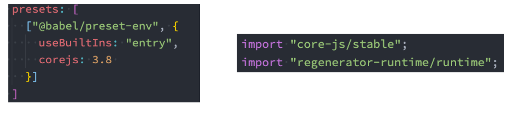

# 邂逅Webpack

> webpack is a static module bundler for modern JavaScript applications.

- 打包 bundler：webpack可以将帮助我们进行打包，所以它是一个打包工具；
- 静态的 static：最终可以将代码打包成最终的静态资源（部署到静态服务器）； 
- 模块化 module：webpack默认支持各种模块化开发，ES Module、CommonJS、AMD等； 
- 现代的 modern：正是因为现代前端开发面临各种各样的问题，才催生了webpack的出现和发展；


### 核心内容

- webpack核心配置深入解析； 
- webpack常用Loaders和Plugins深入学习； 
- 自定义webpack中自己的Loader和Plugin； 
- Babel各种用法以及polyfill、TypeScript的支持； 
- ESLint的配置规则以及在VSCode、webpack中的使用； 
- 各种性能优化方案：打包抽取分包、Tree Shaking、动态链接库、CDN、gzip压缩等等； 
- webpack模块化原理解析、打包原理实现； 
- 掌握其他流行构件工具：gulp、rollup、vite；


#### Webpack的安装

- webpack的安装目前分为两个：webpack、webpack-cli 
- 那么它们是什么关系呢？ 
  - 执行webpack命令，会执行node_modules下的.bin目录下的webpack； 
  - webpack在执行时是依赖webpack-cli的，如果没有安装就会报错； 
  - 而webpack-cli中代码执行时，才是真正利用webpack进行编译和打包的过程； 
  - 所以在安装webpack时，我们需要同时安装webpack-cli（第三方的脚手架事实上是没有使用webpack-cli的，而是类似于 自己的vue-service-cli的东西）


#### webpack默认打包

- 在目录下直接执行 webpack 命令 `webpack`
- 生成一个dist文件夹，里面存放一个main.js的文件，就是我们打包之后的文件： 
  - 这个文件中的代码被压缩和丑化了； 
  - 我们暂时不关心他是如何做到的，后续我讲webpack实现模块化原理时会再次讲到； 
  - 另外发现代码中依然存在ES6的语法，比如箭头函数、const等，这是因为默认情况下webpack并不清楚我们打包后的文件是否需要转成ES5之前的语法，后续需要通过babel来进行转换和设置；
- webpack是如何确定我们的入口的呢？ 
  - 事实上，当我们运行webpack时，webpack会查找当前目录下的 src/index.js作为入口； 
  - 所以，如果当前项目中没有存在src/index.js文件，那么会报错；


#### Webpack配置文件

- 以在根目录下创建一个webpack.config.js文件，来作为webpack的配置文件：

  ```js
  const path = require('path')
  
  // 导出配置信息
  module.exports = {
    entry: './src/main.js',
    output: {
      filename: 'bundle.js',
      path: path.resolve(__dirname, './dist')
    }
  }
  ```

- 执行局部webpack

  - package.json 添加scripts

  - npx webpack

    `npx webpack --entry ./src/main.js --output-path ./build`

#### 指定配置文件

- 通过 --config 来指定对应的配置文件；

  `webpack --config wk.config.js`

- 配置对应的scripts脚本


### Webpack依赖图

- webpack到底是如何对我们的项目进行打包的呢？ 
  - 事实上webpack在处理应用程序时，它会根据命令或者配置文件找到入口文件； 
  - 从入口开始，会生成一个 依赖关系图，这个依赖关系图会包含应用程序中所需的所有模块（比如.js文件、css文件、图片、 字体等）； 
  - 然后遍历图结构，打包一个个模块（根据文件的不同使用不同的loader来解析）；

#### css-loader的使用

- loader 可以用于对模块的源代码进行转换； 
  - 可以将css文件也看成是一个模块，我们是通过import来加载这个模块的； 
- 在加载这个模块时，webpack其实并不知道如何对其进行加载，我们必须制定对应的loader来完成这个功能；
  - 对于加载css文件来说，我们需要一个可以读取css文件的loader； 
  - 这个loader最常用的是css-loader；

- css-loader的安装： `npm install css-loader -D`
- 使用方式：
  - 内联方式；
  - 配置方式；

#### style-loader

- 以通过css-loader来加载css文件了 
  - 这个css在我们的代码中并没有生效（页面没有效果）。 
- 这是为什么呢？ 
  - 因为css-loader只是负责将.css文件进行解析，并不会将解析之后的css插入到页面中； 
  - 如果我们希望再完成插入style的操作，那么我们还需要另外一个loader，就是style-loader；
  - `npm install style-loader -D`

#### 处理less文件

- 在我们开发中，我们可能会使用less、sass、stylus的预处理器来编写css样式，效率会更高。 
- 那么，如何可以让我们的环境支持这些预处理器呢？ 
  - 首先我们需要确定，less、sass等编写的css需要**通过工具**转换成**普通的css**；

#### Less工具处理

- 可以使用less工具来完成它的编译转换：
  - `npm install less -D`
- 执行如下命令
  - `npx less ./src/css/title.less > title.css`


#### less-loader处理

- 在项目中我们会编写大量的css，它们如何可以自动转换呢？ 
  - 这个时候我们就可以使用less-loader，来自动使用less工具转换less到css；
  - 两个都要安装，less-loader 可以自动使用 less 工具进行编译；
- 配置webpack.config.js


#### loader配置方式

- 配置方式表示的意思是在我们的webpack.config.js文件中写明配置信息： 
  - module.rules中允许我们配置多个loader（因为我们也会继续使用其他的loader，来完成其他文件的加载）； 
  - 这种方式可以更好的表示loader的配置，也方便后期的维护，同时也让你对各个Loader有一个全局的概览； 
- module.rules的配置如下： 
- rules属性对应的值是一个数组：[Rule] 
- loader的执行顺序是从右向左（或者说从下到上，或者说从后到前的），所以需要将style-loader写到css-loader的前面；
- 数组中存放的是一个个的Rule，Rule是一个对象，对象中可以设置多个属性：
  - test属性：用于对 resource（资源）进行匹配的，通常会设置成正则表达式； 
  - use属性：对应的值时一个数组：[UseEntry] 
    - UseEntry是一个对象，可以通过对象的属性来设置一些其他属性 
      - loader：必须有一个 loader属性，对应的值是一个字符串； 
      - options：可选的属性，值是一个字符串或者对象，值会被传入到loader中； 
      - ~~query：目前已经使用options来替代；~~ 
    - 传递字符串（如：use: [ 'style-loader' ]）是 loader 属性的简写方式（如：use: [ { loader: 'style-loader'} ]）； 
  - loader属性： Rule.use: [ { loader } ] 的简写。


#### 浏览器兼容性

- 开发中，浏览器的兼容性问题，我们应该如何去解决和处理？ 

  - 当然这个问题很笼统，这里我说的兼容性问题不是指屏幕大小的变化适配； 
  - 我这里指的兼容性是针对不同的浏览器支持的特性：比如css特性、js语法，之间的兼容性； 

- 我们知道市面上有大量的浏览器： 

  - 有Chrome、Safari、IE、Edge、Chrome for Android、UC Browser、QQ Browser等等； 
  - 它们的市场占率是多少？我们要不要兼容它们呢？ 

- 其实在很多的脚手架配置中，都能看到类似于这样的配置信息： 

  - 这里的百分之一，就是指市场占有率

  ```txt
  > 1%
  last 2 versions
  not dead
  ```

  

#### 浏览器市场占有率

- 查看浏览器市场占有率 https://caniuse.com/usage-table


#### 认识browserslist工具

- 但是有一个问题，我们如何可以在css兼容性和js兼容性下共享我们配置的兼容性条件呢？ 
  - 就是当我们设置了一个条件： > 1%；
  - 我们表达的意思是css要兼容市场占有率大于1%的浏览器，js也要兼容市场占有率大于1%的浏览器； 
  - 如果我们是通过工具来达到这种兼容性的，比如后面我们会讲到的postcss-prest-env、babel、autoprefixer等
- 如何可以让他们共享我们的配置呢？ 
  - 这个问题的答案就是Browserslist；
- Browserslist是什么？Browserslist是一个在不同的前端工具之间，共享目标浏览器和Node.js版本的配置： 
  - Autoprefixer 
  - Babel 
  - postcss-preset-env 
  - eslint-plugin-compat 
  - stylelint-no-unsupported-browser-features 
  - postcss-normalize 
  - obsolete-webpack-plugin


#### 浏览器查询过程

- 以编写类似于这样的配置：

  ```txt
  > 1%
  last 2 versions
  not dead
  ```

- 那么之后，这些工具会根据我们的配置来获取相关的浏览器信息，以方便决定是否需要进行兼容性的支持： 

  - 条件查询使用的是caniuse-lite的工具，这个工具的数据来自于caniuse的网站上；

    `npx browserslist ">1%, last 2 version, not dead"`


#### Browserslist编写规则一：

- defaults：Browserslist的默认浏览器（> 0.5%, last 2 versions, Firefox ESR, not dead）。 
- 5%：通过全局使用情况统计信息选择的浏览器版本。 >=，<和<=工作过。 
  - `5% in US`：使用美国使用情况统计信息。它接受两个字母的国家/地区代码。 
  - `> 5% in alt-AS`：使用亚洲地区使用情况统计信息。有关所有区域代码的列表，请参见caniuse-lite/data/regions  
  - `> 5% in my stats`：使用自定义用法数据。 
  - `> 5% in browserslist-config-mycompany stats`：使用来自的自定义使用情况数据browserslist-config-mycompany/browserslist-stats.json。 
  - cover 99.5%：提供覆盖率的最受欢迎的浏览器。 
  - cover 99.5% in US：与上述相同，但国家/地区代码由两个字母组成。 
  - cover 99.5% in my stats：使用自定义用法数据。 
- dead：24个月内没有官方支持或更新的浏览器。现在是IE 10，IE_Mob 11，BlackBerry 10，BlackBerry 7， Samsung 4和OperaMobile 12.1。 
- last 2 versions：每个浏览器的最后2个版本。 
  - last 2 Chrome versions：最近2个版本的Chrome浏览器。 
  - last 2 major versions或last 2 iOS major versions：最近2个主要版本的所有次要/补丁版本。
- node 10和node 10.4：选择最新的Node.js10.x.x 或10.4.x版本。 
  - current node：Browserslist现在使用的Node.js版本。 
  - maintained node versions：所有Node.js版本，仍由 Node.js Foundation维护。 
- iOS 7：直接使用iOS浏览器版本7。 
  - Firefox > 20：Firefox的版本高于20 >=，<并且<=也可以使用。它也可以与Node.js一起使用。 
  - ie 6-8：选择一个包含范围的版本。 
  - Firefox ESR：最新的[Firefox ESR]版本。 
  - PhantomJS 2.1和PhantomJS 1.9：选择类似于PhantomJS运行时的Safari版本
- extends browserslist-config-mycompany：从browserslist-config-mycompanynpm包中查询 。 n
- supports es6-module：支持特定功能的浏览器。 es6-module这是“我可以使用” 页面feat的URL上的参数。有关所有可用功能的列表，请参见 。caniuselite/data/features 
- browserslist config：在Browserslist配置中定义的浏览器。在差异服务中很有用，可用于修改用户的配置，例如 browserslist config and supports es6-module。 
- since 2015或last 2 years：自2015年以来发布的所有版本（since 2015-03以及since 2015-03-10）。 
- nunreleased versions或unreleased Chrome versions：Alpha和Beta版本。 
- not ie <= 8：排除先前查询选择的浏览器。


#### 命令行使用browserslist

- 直接通过命令来查询某些条件所匹配到的浏览器：`npx browserslist ">1%, last 2 version, not dead"`


#### 配置browserslist

- 配置browserslist呢？两种方案：
  - 方案一：在package.json中配置； 
  - 方案二：单独的一个配置文件.browserslistrc文件；

#### 默认配置和条件关系


#### 认识PostCSS工具

- 什么是PostCSS呢？ 
  - PostCSS是一个通过**JavaScript**来**转换样式**的**工具**； 
  - 这个工具可以帮助我们进行一些**CSS的转换和适配**，比如**自动添加浏览器前缀**、**css样式的重置**； 
  - 但是实现这些工具，我们需要借助于PostCSS对应的插件；
- 如何使用PostCSS呢？主要就是两个步骤： 
  - 第一步：查找PostCSS在构建工具中的扩展，比如 webpack 中的postcss-loader； 
  - 第二步：选择可以添加你需要的PostCSS相关的插件；


#### 命令行使用postcss

- 当然，我们能不能也直接在终端使用PostCSS呢？ 

  - 也是可以的，但是我们需要单独安装一个工具postcss-cli； 

- 我们可以安装一下它们：postcss、postcss-cli 

  `npm install postcss postcss-cli -D`

- 我们编写一个需要添加前缀的css： 

  - https://autoprefixer.github.io/ 
  - 我们可以在上面的网站中查询一些添加css属性的样式；


#### 插件autoprefixer

- 因为我们需要添加前缀，所以要安装autoprefixer：

  `npm install autoprefixer -D`

- 直接使用使用postcss工具，并且制定使用autoprefixer:  

  `npx postcss --use autoprefixer -o end.css ./src/css/style.css`


#### postcss-loader

- 真实开发中我们必然不会直接使用命令行工具来对css进行处理，而是可以借助于构建工具： 
  - 在webpack中使用postcss就是使用postcss-loader来处理的； 
- 我们来安装postcss-loader：`npm install postcss-loader -D`
- 修改加载css的loader：
  - 注意：因为postcss需要有对应的插件才会起效果，所以我们需要配置它的plugin；


#### 单独的postcss配置文件

- 也可以将这些配置信息放到一个单独的文件中进行管理： 
  - 在根目录下创建postcss.config.js


#### postcss-preset-env

- 事实上，在配置postcss-loader时，我们配置插件并不需要使用autoprefixer。 
- 我们可以使用另外一个插件：postcss-preset-env 
  - postcss-preset-env也是一个postcss的插件； 
  - 它可以帮助我们将一些现代的CSS特性，转成大多数浏览器认识的CSS，并且会根据目标浏览器或者运行时环境添加所需的polyfill；
  - 也包括会自动帮助我们添加autoprefixer（所以相当于已经内置了autoprefixer）； 
- 首先，我们需要安装postcss-preset-env：


#### 加载和处理其他资源

#### 案例准备

- 为了演示我们项目中可以加载图片，我们需要在项目中使用图片，比较常见的使用图片的方式是两种： 
  - img元素，设置src属性； 
  - 其他元素（比如div），设置background-image的css属性；

#### file-loader

- 要处理jpg、png等格式的图片，我们也需要有对应的loader：file-loader 
  - file-loader的作用就是帮助我们处理import/require()方式引入的一个文件资源，并且会将它放到我们输出的文件夹中； 
  - 当然我们待会儿可以学习如何修改它的名字和所在文件夹；


#### 文件的名称规则

- 有时候我们处理后的文件名称按照一定的规则进行显示： 

  - 比如保留原来的文件名、扩展名，同时为了防止重复，包含一个hash值等； 

- 这个时候我们可以使用PlaceHolders来完成，webpack给我们提供了大量的PlaceHolders来显示不同的内容： 

  - https://webpack.js.org/loaders/file-loader/#placeholders 
  - 我们可以在文档中查阅自己需要的placeholder； 

- 我们这里介绍几个最常用的placeholder： 

  - [ext]： 处理文件的扩展名； 
  - [name]：处理文件的名称； 
  - [hash]：文件的内容，使用MD4的散列函数处理，生成的一个128位的hash值（32个十六进制）； 
  - [contentHash]：在file-loader中和[hash]结果是一致的（在webpack的一些其他地方不一样，后面会讲到）； 
  - [hash:]：截图hash的长度，默认32个字符太长了； 
  - [path]：文件相对于webpack配置文件的路径；

  ```js
  {
      test: /\.(png|jpe?g|gif|svg)$/,
          use: [
              {
                  loader: 'file-loader',
                  options: {
                      // 设置文件名称
                      name: 'img/[name].[hash:6].[ext]',
                      // 设置路径
                      // outputPath: 'img'
                  }
              }
          ]
  }
  ```

  

#### url-loader

- url-loader和file-loader的工作方式是相似的，但是可以将较小的文件，转成base64的URI。

- limit 超过限制单独打包

  ```js
  {
          test: /\.(png|jpe?g|gif|svg)$/i,
          use: [
            {
              loader: 'url-loader',
              options: {
                name: 'img/[name].[hash:6].[ext]',
                // outputPath: 'img',
                limit: 100 * 1024
              }
            }
          ]
        }
  ```


#### url-loader的limit

- 开发中我们往往是小的图片需要转换，但是大的图片直接使用图片即可
  - 这是因为小的图片转换base64之后可以和页面一起被请求，减少不必要的请求过程； 
  - 而大的图片也进行转换，反而会影响页面的请求速度； 
- 那么，我们如何可以限制哪些大小的图片转换和不转换呢？ 
  - url-loader有一个options属性limit，可以用于设置转换的限制； 
  - 下面的代码38kb的图片会进行base64编码，而295kb的不会；


#### asset module type的介绍

- 我们当前使用的webpack版本是webpack5： 
  - 在webpack5之前，加载这些资源我们需要使用一些loader，比如raw-loader 、url-loader、file-loader； 
  - webpack5之后，我们可以直接使用资源模块类型（asset module type），来替代上面的这些loader； 
- 资源模块类型(asset module type)，通过添加 4 种新的模块类型，来替换所有这些 loader： 
  - asset/ 发送一个单独的文件并导出 URL。之前通过使用 file-loader 实现； 
  - asset/inline 导出一个资源的 data URI。之前通过使用 url-loader 实现； 
  - asset/source 导出资源的源代码。之前通过使用 raw-loader 实现； 
  - asset 在导出一个 data URI 和发送一个单独的文件之间自动选择。之前通过使用 url-loader，并且配置资源体积限制实现；

#### Asset module type的使用

- `{ test: /\.jpg$/, type: 'asset' }`

- 自定义文件的输出路径和文件名呢？ 
  - 方式一：修改output，添加assetModuleFilename属性； 
  - 方式二：在Rule中，添加一个generator属性，并且设置filename；

```js
{
        test: /\.(png|jpe?g|gif|svg)$/i,
        // type: 'asset/resource', // file-loader
        // type: 'asset/inline', // url-loader
        type: 'asset',
        generator: {
          filename: 'img/[name].[hash:6][ext]'
        },
        parser: {
          dataUrlCondition: {
            maxSize: 100 * 1024
          }
        }
      }
```


#### 加载字体文件

- 处理eot、ttf、woff等文件：可以选择使用file-loader来处理，也可以选择直接使用webpack5的资源模块类型来处理；

- 如果我们需要使用某些特殊的字体或者字体图标，那么我们会引入很多字体相关的文件，这些文件的处理也是一样的。

- 在component中引入，并且添加一个 i 元素用于显示字体图标：

```js
{
        test: /\.(ttf|eot|woff2?)$/i,
        type: 'asset/resource',
        generator: {
          filename: 'font/[name][hash:6][ext]'
        }
      }

// 创建一个i元素，设置字体
  const iEl = document.createElement('i')
  iEl.className = 'iconfont icon-caps-lock'
  el.append(iEl)
```


### 认识Plugin

- Webpack的核心：

  - While loaders are used to transform certain types of modules, plugins can be leveraged to perform a wider range of tasks like bundle optimization, asset management and injection of environment variables.

- Loader是用于特定的模块类型进行转换； 

- Plugin可以用于执行更加广泛的任务，比如打包优化、资源管理、环境变量注入等；

  


#### CleanWebpackPlugin

- 每次修改了一些配置，重新打包时，都需要手动删除dist文件夹：、

  - 我们可以借助于一个插件来帮助我们完成，这个插件就是CleanWebpackPlugin； 

- 首先，我们先安装这个插件：`npm install clean-webpack-plugin -D`

  ```js
  const { CleanWebpackPlugin } = require('clean-webpack-plugin')
  //
  plugins: [
     new CleanWebpackPlugin()
  ]
  ```

  

#### HtmlWebpackPlugin

- 另外还有一个不太规范的地方： 
  - 我们的HTML文件是编写在根目录下的，而最终打包的dist文件夹中是没有index.html文件的。 
  - 在进行项目部署的时，必然也是需要有对应的入口文件index.html； 
  - 所以我们也需要对index.html进行打包处理； 
- 对HTML进行打包处理我们可以使用另外一个插件：HtmlWebpackPlugin；
  - `npm install html-webpack-plugin -D`

#### 生成的index.html分析

- 现在自动在dist文件夹中，生成了一个index.html的文件： 
  - 该文件中也自动添加了我们打包的bundle.js文件；
- 这个文件是如何生成的呢？ 
  - 默认情况下是根据ejs的一个模板来生成的； 
  - 在html-webpack-plugin的源码中，有一个default_index.ejs模块；

#### 自定义HTML模板

- 如果我们想在自己的模块中加入一些比较特别的内容： 
  - 比如添加一个noscript标签，在用户的JavaScript被关闭时，给予响应的提示； 
  - 比如在开发vue或者react项目时，我们需要一个可以挂载后续组件的根标签 
- 这个我们需要一个属于自己的index.html模块：


#### 自定义模板数据填充

- 上面的代码中，会有一些类似这样的语法<% 变量 %>，这个是EJS模块填充数据的方式。 

- 在配置HtmlWebpackPlugin时，我们可以添加如下配置： 

  - template：指定我们要使用的模块所在的路径； 
  - title：在进行htmlWebpackPlugin.options.title读取时，就会读到该信息；

  ```js
  plugins: [
      new HtmlWebpackPlugin({
        title: 'coderzyp webpack',
        template: './public/index.html'
      }),
    ]
  ```


#### DefinePlugin的介绍

- 这个时候编译还是会报错，因为在我们的模块中还使用到一个BASE_URL的常量： 
- 这是因为在编译template模块时，有一个BASE_URL： 
- `<link rel="icon" href="<%= BASE_URL %>favicon.ico">`； 
- 但是我们并没有设置过这个常量值，所以会出现没有定义的错误； 
- 这个时候我们可以使用DefinePlugin插件；

#### DefinePlugin的使用

- DefinePlugin允许在编译时创建配置的全局常量，是一个webpack内置的插件（不需要单独安装）：

- 这个时候，编译template就可以正确的编译了，会读取到BASE_URL的值；

  ```js
  plugins: [
      new CleanWebpackPlugin(),
      new HtmlWebpackPlugin({
        title: 'coderzyp webpack',
        template: './public/index.html'
      }),
      new DefinePlugin({
        // 注意这里需要字符串，会被解析 "./"
        BASE_URL: '"./"'
      })
    ]
  ```

#### CopyWebpackPlugin

- 在vue的打包过程中，如果我们将一些文件放到public的目录下，那么这个目录会被复制到dist文件夹中。 
  - 这个复制的功能，我们可以使用CopyWebpackPlugin来完成； 
  - 安装CopyWebpackPlugin插件：`npm install copy-webpack-plugin -D`
- 配置CopyWebpackPlugin即可： 
  - 复制的规则在patterns中设置； 
  - from：设置从哪一个源中开始复制； 
  - to：复制到的位置，可以省略，会默认复制到打包的目录下； 
  - globOptions：设置一些额外的选项，其中可以编写需要忽略的文件： 
    - .DS_Store：mac目录下回自动生成的一个文件； 
    - index.html：也不需要复制，因为我们已经通过HtmlWebpackPlugin完成了index.html的生成；

```js
new CopyPlugin({
      patterns: [
        {
          from: 'public',
          globOptions: {
            ignore: ['**/index.html', '**/[xxx].xx']
          }
        }
      ]
    })
```


### 模块化原理和source-map

#### Mode配置

- Mode配置选项，可以告知webpack使用响应模式的内置优化： 
  - 默认值是production（什么都不设置的情况下）； 
  - 可选值有：'none' | 'development' | 'production';


#### Webpack的模块化

- Webpack打包的代码，允许我们使用各种各样的模块化，但是最常用的是CommonJS、ES Module。 
  - 那么它是如何帮助我们实现了代码中支持模块化呢？ 
- 我们来研究一下它的原理，包括如下原理： 
  - CommonJS模块化实现原理； 
  - ES Module实现原理； 
  - CommonJS加载ES Module的原理； 
  - ES Module加载CommonJS的原理；

#### source-map

- 代码通常运行在浏览器上时，是通过打包压缩的： 
  - 也就是真实跑在浏览器上的代码，和我们编写的代码其实是有差异的； 
  - 比如ES6的代码可能被转换成ES5； 
  - 比如对应的代码行号、列号在经过编译后肯定会不一致； 
  - 比如代码进行丑化压缩时，会将编码名称等修改；
  - 比如我们使用了TypeScript等方式编写的代码，最终转换成JavaScript； 
- 但是，当代码报错需要调试时（debug），调试转换后的代码是很困难的 
- 但是我们能保证代码不出错吗？不可能。 
- 那么如何可以调试这种转换后不一致的代码呢？答案就是source-map 
  - source-map是从已转换的代码，映射到原始的源文件； 
  - 使浏览器可以重构原始源并在调试器中显示重建的原始源；

#### 使用source-map

- 两个步骤： 
  - 第一步：根据源文件，生成source-map文件，webpack在打包时，可以通过配置生成source-map； 
  - 第二步：在转换后的代码，最后添加一个注释，它指向sourcemap；
  - `//# sourceMappingURL=common.bundle.js.map`
- 浏览器会根据我们的注释，查找响应的source-map，并且根据source-map还原我们的代码，方便进行调试。 
- 在Chrome中，我们可以按照如下的方式打开source-map：


#### 分析source-map

- 最初source-map生成的文件大小是原始文件的10倍，第二版减少了约50%，第三版又减少了50%，所以目前一个 133kb的文件，最终的source-map的大小大概在300kb。
- 目前的source-map长什么样子呢？
  - version：当前使用的版本，也就是最新的第三版； 
  - sources：从哪些文件转换过来的source-map和打包的代码（最初始的文件）； 
  - names：转换前的变量和属性名称（因为我目前使用的是development模式，所以不需要保留转换前的名 称）； 
  - mappings：source-map用来和源文件映射的信息（比如位置信息等），一串base64 VLQ（veriable length quantity可变长度值）编码； 
  - file：打包后的文件（浏览器加载的文件）； 
  - sourceContent：转换前的具体代码信息（和sources是对应的关系）； 
  - sourceRoot：所有的sources相对的根目录；


#### 生成source-map

- 如何在使用webpack打包的时候，生成对应的source-map呢？ 

  - webpack为我们提供了非常多的选项（目前是26个），来处理source-map； 
  - https://webpack.docschina.org/configuration/devtool/ 
  - 选择不同的值，生成的source-map会稍微有差异，打包的过程也会有性能的差异，可以根据不同的情况进行 选择；

- 下面几个值不会生成source-map 

  - false：不使用source-map，也就是没有任何和source-map相关的内容。 
  - none：production模式下的默认值（什么值都不写），不生成source-map。 
  - eval：development模式下的默认值，不生成source-map
    - 但是它会在eval执行的代码中，添加 //# sourceURL=； 
    - 它会被浏览器在执行时解析，并且在调试面板中生成对应的一些文件目录，方便我们调试代码；

  #### eval的效果

  

#### source-map值

- source-map： 
  - 生成一个独立的source-map文件，并且在bundle文件中有一个注释，指向source-map文件； 
- bundle文件中有如下的注释： 
  - 开发工具会根据这个注释找到source-map文件，并且解析；
  - `//# sourceMappingURL=bundle.js.map`


#### 多个值的组合

- webpack提供给我们的26个值，是可以进行多组合的。 
- 组合的规则如下： 
  - inline-|hidden-|eval：三个值时三选一； 
  - nosources：可选值； 
  - cheap可选值，并且可以跟随module的值；
  - `[inline-|hidden-|eval-][nosources-][cheap-[module-]]source-map`
- 那么在开发中，最佳的实践是什么呢？
  - 开发阶段：推荐使用 source-map或者cheap-module-source-map 
    - 这分别是vue和react使用的值，可以获取调试信息，方便快速开发；
  - 测试阶段：推荐使用 source-map或者cheap-module-source-map 
    - 测试阶段我们也希望在浏览器下看到正确的错误提示；
  - 发布阶段：false、缺省值（不写）

#### eval-source-map值

- eval-source-map：会生成sourcemap，但是source-map是以DataUrl添加到eval函数的后面

#### inline-source-map值

- inline-source-map：会生成sourcemap，但是source-map是以DataUrl添加到bundle文件的后面

#### cheap-source-map

- 会生成sourcemap，但是会更加高效一些（cheap低开销），因为它没有生成列映射（Column Mapping） 
- 因为在开发中，我们只需要行信息通常就可以定位到错误了


#### cheap-module-source-map值

- cheap-module-source-map： 
  - 会生成sourcemap，类似于cheap-source-map，但是对源自**loader的sourcemap处理会更好**。
- 这里有一个很模糊的概念：对源自loader的sourcemap处理会更好，官方也没有给出很好的解释 
  - 其实是如果loader对我们的源码进行了特殊的处理，比如babel；
  - 源码es6会被解析es5，cheap-module-source-map可以显示源码，cheap-source-map显示被编译后的代码

#### hidden-source-map值

- hidden-source-map： 
  - 会生成sourcemap，但是不会对source-map文件进行引用； 
  - 相当于删除了打包文件中对sourcemap的引用注释；
  - `// 被删除掉的 //# sourceMappingURL=bundle.js.map`
- 如果我们手动添加进来，那么sourcemap就会生效了

#### nosources-source-map值

- nosources-source-map： 
  - 会生成sourcemap，但是生成的sourcemap只有错误信息的提示，不会生成源代码文件；
- 正确的错误提示：
- 点击错误提示，无法查看源码：


### Babel的深入解析

#### 为什么需要babel？

- 事实上，在开发中我们很少直接去接触babel，但是babel对于前端开发来说，目前是不可缺少的一部分： 
  - 开发中，我们想要使用ES6+的语法，想要使用TypeScript，开发React项目，它们都是离不开Babel的； 
  - 所以，学习Babel对于我们理解代码从编写到线上的转变过程直观重要； 
  - 了解真相，才能获得真知的自由！
- 那么，Babel到底是什么呢？ 
  - Babel是一个工具链，主要用于旧浏览器或者环境中将ECMAScript 2015+代码转换为向后兼容版本的 JavaScript； 
  - 包括：语法转换、源代码转换、Polyfill实现目标环境缺少的功能等；

#### Babel命令行使用

- babel本身可以作为一个独立的工具（和postcss一样），可以不和webpack等构建工具配置来单独使用。 
- 如果我们希望在命令行尝试使用babel，需要安装如下库： 
  - @babel/core：babel的核心代码，必须安装； 
  - @babel/cli：可以让我们在命令行使用babel；
  - `npm install @babel/cli @babel/core`
- 使用babel来处理我们的源代码： 
  - src：是源文件的目录； 
  - --out-dir：指定要输出的文件夹dist；
  - `npx babel src --out-dir dist`

#### 插件的使用

- 需要转换箭头函数，那么我们就可以使用箭头函数转换相关的插件：

  `npm install @babel/plugin-transform-arrow-functions -D`

  `npx babel src --out-dir dist --plugins=@babel/plugin-transform-arrow-functions`

- 查看转换后的结果：我们会发现 const 并没有转成 var 

  - 这是因为 plugin-transform-arrow-functions，并没有提供这样的功能； 
  - 我们需要使用 plugin-transform-block-scoping 来完成这样的功能；

  `npm install @babel/plugin-transform-block-scoping -D`

  `npx babel src --out-dir dist --plugins=@babel/plugin-transform-block-scoping ,@babel/plugin-transform-arrow-functions`

#### Babel的预设preset

- 但是如果要转换的内容过多，一个个设置是比较麻烦的，我们可以使用预设（preset）： 

  - 后面我们再具体来讲预设代表的含义； 

- 安装@babel/preset-env预设：

  `npm install @babel/preset-env -D`

  `npx babel src --out-dir dist --presets=@babel/preset-env`

#### Babel的底层原理

- babel是如何做到将我们的一段代码（ES6、TypeScript、React）转成另外一段代码（ES5）的呢？
  - 从一种源代码（原生语言）转换成另一种源代码（目标语言），这是什么的工作呢？ 
  - 就是编译器，事实上我们可以将babel看成就是一个编译器。 
  - Babel编译器的作用就是将我们的源代码，转换成浏览器可以直接识别的另外一段源代码；
- Babel也拥有编译器的工作流程：
  - 解析阶段（Parsing） 
  - 转换阶段（Transformation） 
  - 生成阶段（Code Generation）
-  https://github.com/jamiebuilds/the-super-tiny-compiler

#### babel编译器执行原理

- Babel的执行阶段

  - Lexical Analysis 词法分析，对每个词进行分析
  - tokens 数组
  - 语法分析
  - AST

  


#### babel-loader

- 在实际开发中，我们通常会在构建工具中通过配置babel来对其进行使用的，比如在webpack中。 

- 那么我们就需要去安装相关的依赖：

  - 如果之前已经安装了@babel/core，那么这里不需要再次安装；

- 设置一个规则，在加载js文件时，使用我们的babel：

  ```js
  {
          test: /\.js$/,
          use: {
            loader: 'babel-loader',
            options: {
              presets: ['@babel/preset-env']
            }
          }
        }
  ```

#### 设置目标浏览器 browserslist

- 我们最终打包的JavaScript代码，是需要跑在目标浏览器上的，那么如何告知babel我们的目标浏览器呢？ 
  - browserslist工具 
  - target属性 
- 之前我们项目中已经使用了browserslist工具，我们可以对比一下不同的配置，打包的区别：


#### 设置目标浏览器 targets

- 通过targets来进行配置：

  ```js
  {
      test: /\.js$/,
          use: {
              loader: 'babel-loader',
                  options: {
                      presets: [
                          ['@babel/preset-env', {
                              targets: 'chrome 88'
                          }]
                      ]
                  }
          }
  }
  ```

- 如果两个同时配置了，哪一个会生效呢？ 

  - 配置的targets属性会覆盖browserslist； 
  - 但是在开发中，更推荐通过browserslist来配置，因为类似于postcss工具，也会使用browserslist，进行统一浏览器 的适配；

#### Stage-X的preset

- 要了解Stage-X，我们需要先了解一下TC39的组织： 
  - TC39是指技术委员会（Technical Committee）第 39 号； 
  - 它是 ECMA 的一部分，ECMA 是 “ECMAScript” 规范下的 JavaScript 语言标准化的机构； 
  - ECMAScript 规范定义了 JavaScript 如何一步一步的进化、发展；
- TC39 遵循的原则是：分阶段加入不同的语言特性，新流程涉及四个不同的 Stage 
  - Stage 0：strawman（稻草人），任何尚未提交作为正式提案的讨论、想法变更或者补充都被认为是第 0 阶段的" 稻草人"； 
  - Stage 1：proposal（提议），提案已经被正式化，并期望解决此问题，还需要观察与其他提案的相互影响； 
  - Stage 2：draft（草稿），Stage 2 的提案应提供规范初稿、草稿。此时，语言的实现者开始观察 runtime 的具体 实现是否合理； 
  - Stage 3：candidate（候补），Stage 3 提案是建议的候选提案。在这个高级阶段，规范的编辑人员和评审人员必 须在最终规范上签字。Stage 3 的提案不会有太大的改变，在对外发布之前只是修正一些问题； 
  - Stage 4：finished（完成），进入 Stage 4 的提案将包含在 ECMAScript 的下一个修订版中；

#### Babel的Stage-X设置

- 在babel7之前（比如babel6中），我们会经常看到这种设置方式： 

  - 它表达的含义是使用对应的 babel-preset-stage-x 预设； 

  - 但是从babel7开始，已经不建议使用了，建议使用preset-env来设置；

    `'presets': ['stage-3']`

#### Babel的配置文件

- 像之前一样，我们可以将babel的配置信息放到一个独立的文件中，babel给我们提供了两种配置文件的编写： 
  - babel.config.json（或者.js，.cjs，.mjs）文件； 
  - .babelrc.json（或者.babelrc，.js，.cjs，.mjs）文件；
- 它们两个有什么区别呢？目前很多的项目都采用了多包管理的方式（babel本身、element-plus、umi等）； 
  - .babelrc.json：早期使用较多的配置方式，但是对于配置Monorepos项目是比较麻烦的； 
  - babel.config.json（babel7）：可以直接作用于Monorepos项目的子包，更加推荐；

#### 认识polyfill

- Polyfill是什么呢？ 
  - 翻译：一种用于衣物、床具等的聚酯填充材料, 使这些物品更加温暖舒适； 
  - 理解：更像是应该填充物（垫片），一个补丁，可以帮助我们更好的使用JavaScript；
- 为什么时候会用到polyfill呢？ 
  - 比如我们使用了一些语法特性（例如：Promise, Generator, Symbol等以及实例方法例如 Array.prototype.includes等） 
  - 但是某些浏览器压根不认识这些特性，必然会报错； 
  - 我们可以使用polyfill来填充或者说打一个补丁，那么就会包含该特性了；

#### 如何使用polyfill？

- babel7.4.0之前，可以使用 @babel/polyfill的包，但是该包现在已经不推荐使用了：

  `npm i @babel/polyfill --save `

- babel7.4.0之后，可以通过单独引入core-js和regenerator-runtime来完成polyfill的使用：

  `npm install core-js regenerator-runtime --save`

#### 配置babel.config.js

- 我们需要在babel.config.js文件中进行配置，给preset-env配置一些属性： 
  - useBuiltIns：设置以什么样的方式来使用polyfill； 
  - corejs：设置corejs的版本，目前使用较多的是3.x的版本，比如我使用的是3.8.x的版本； 
    - 另外corejs可以设置是否对提议阶段的特性进行支持； 
    - 设置 proposals属性为true即可；

#### useBuiltIns属性设置

- useBuiltIns属性有三个常见的值 

- 第一个值：false 

  - 打包后的文件不使用polyfill来进行适配； 
  - 并且这个时候是不需要设置corejs属性的；

- 第二个值：usage 

  - 会根据源代码中出现的语言特性，自动检测所需要的polyfill； 

  - 这样可以确保最终包里的polyfill数量的最小化，打包的包相对会小一些； 

  - 可以设置corejs属性来确定使用的corejs的版本；

    ```js
    module.exports = {
      presets: [
        ['@babel/preset-env', {
          // false 不使用任何polyfill相关代码
          // usage 代码中用到那些，就去引用那些
          // entry
          useBuiltIns: 'usage',
          corejs: 3
        }]
      ]
    }
    ```

- 第三个值：entry 

  - 如果我们依赖的某一个库本身使用了某些polyfill的特性，但是因为我们使用的是usage，所以之后用户浏览器可能会报错； 
  - 所以，如果你担心出现这种情况，可以使用 entry； 
  - 并且需要在入口文件中添加 `import 'core-js/stable'; import 'regenerator-runtime/runtime'; 
  - 这样做会根据 browserslist 目标导入所有的polyfill，但是对应的包也会变大；



#### 认识Plugin-transform-runtime（了解）

- 在前面我们使用的polyfill，默认情况是添加的所有特性都是全局的
  - 如果我们正在编写一个工具库，这个工具库需要使用polyfill； 
  - 别人在使用我们工具时，工具库通过polyfill添加的特性，可能会污染它们的代码； 
  - 所以，当编写工具时，babel更推荐我们使用一个插件： @babel/plugin-transform-runtime来完成polyfill 的功能；


#### 使用Plugin-transform-runtime

- 安装 @babel/plugin-transform-runtime：

  `npm install @babel/plugin-transform-runtime -D`

- 使用plugins来配置babel.config.js：

  > 注意：因为我们使用了corejs3，所以我们需要安装对应的库：

  

   

#### React的jsx支持

- 在我们编写react代码时，react使用的语法是jsx，jsx是可以直接使用babel来转换的。

- 对react jsx代码进行处理需要如下的插件：

  - @babel/plugin-syntax-jsx 
  - @babel/plugin-transform-react-jsx 
  - @babel/plugin-transform-react-display-name

- 但是开发中，我们并不需要一个个去安装这些插件，我们依然可以使用preset来配置：

  `npm install @babel/preset-react -D`


#### TypeScript的编译

- 在项目开发中，我们会使用TypeScript来开发，那么TypeScript代码是需要转换成JavaScript代码。 

- 可以通过TypeScript的compiler来转换成JavaScript：

  `npm install typescript -D`

- TypeScript的编译配置信息我们通常会编写一个tsconfig.json文件：

  `tsc --init`

- 生成配置文件如下：tsconfig.json

- 可以运行 npx tsc来编译自己的ts代码：

  `npx tsc`

#### 使用ts-loader

- 如果我们希望在webpack中使用TypeScript，那么我们可以使用ts-loader来处理ts文件：

  `npm install ts-loader -D`

- 配置ts-loader：

  ```js
  {
      test: /\.ts$/,
     	exclude: /node_modules/,
      use: [
          loader: 'ts-loader'
      ]
  }
  ```

- npm run build

#### 使用babel-loader

- 除了可以使用TypeScript Compiler来编译TypeScript之外，我们也可以使用Babel： 
  - Babel是有对TypeScript进行支持； 
  - 我们可以使用插件： @babel/tranform-typescript；
  - 但是更推荐直接使用preset：@babel/preset-typescript；

#### ts-loader和babel-loader选择

- 那么我们在开发中应该选择ts-loader还是babel-loader呢？
- 使用ts-loader（TypeScript Compiler） 
  - 来直接编译TypeScript，那么只能将ts转换成js； 
  - 如果我们还希望在这个过程中添加对应的polyfill，那么ts-loader是无能为力的； 
  - 我们需要借助于babel来完成polyfill的填充功能；
- 使用babel-loader（Babel） 
  - 来直接编译TypeScript，也可以将ts转换成js，并且可以实现polyfill的功能； 
  - 但是babel-loader在编译的过程中，不会对类型错误进行检测；

#### 编译TypeScript最佳实践

- 事实上TypeScript官方文档有对其进行说明：
- However, a useful heuristic could be:
  - Is your build output mostly the same as your source input files? Use `tsc`
  - Do you need a build pipeline with multiple potential outputs? Use `babel` for transpiling and `tsc` for type checking
- 也就是说我们使用Babel来完成代码的转换，使用tsc来进行类型的检查。
- 但是，如何可以使用tsc来进行类型的检查呢？ 
  - 在这里，我在scripts中添加了两个脚本，用于类型检查； 
  - 我们执行 npm run type-check可以对ts代码的类型进行检测； 
  - 我们执行 npm run type-check-watch可以实时的检测类型错误；
  -  

#### 认识ESLint

- 什么是ESLint呢？ 
- ESLint是一个静态代码分析工具（Static program analysis，在没有任何程序执行的情况下，对代码进行分析）； 
- ESLint可以帮助我们在项目中建立统一的团队代码规范，保持正确、统一的代码风格，提高代码的可读性、可维护性； 
- 并且ESLint的规则是可配置的，我们可以自定义属于自己的规则； 
- 早期还有一些其他的工具，比如JSLint、JSHint、JSCS等，目前使用最多的是ESLint。

#### 使用ESLint

- 安装ESLint：

  `npm install eslint -D`

- 创建ESLint的配置文件：

  `npx eslint --init`

#### ESLint的文件解析

- 默认创建的环境如下： 
- env：运行的环境，比如是浏览器，并且我们会使用es2021（对应的ecmaVersion是12）的语法； 
- extends：可以扩展当前的配置，让其继承自其他的配置信息，可以跟字符串或者数组（多个）； 
- parserOptions：这里可以指定ESMAScript的版本、sourceType的类型 
- parser：默认情况下是espree（也是一个JS Parser，用于ESLint），但是因为我们需要编译TypeScript，所 以需要指定对应的解释器； 
- plugins：指定我们用到的插件； 
- rules：自定义的一些规则；
  - 配置的规则名称：对应的值值可以是数字、字符串、数组： 
  - 字符串对应有三个值： off、warn、error； 
  - 数字对应有三个值： 0、1、2（分别对应上面的值）; 
  - 数组我们可以告知对应的提示以及希望获取到的值：比如 ['error', 'double']

#### VSCode的Prettier插件

- ESLint会帮助我们提示错误（或者警告），但是不会帮助我们自动修复： 
  - 在开发中我们希望文件在保存时，可以自动修复这些问题； 
  - 我们可以选择使用另外一个工具：prettier；

#### ESLint-Loader的使用

- 我们在编译代码的时候，也希望进行代码的eslint检测，这个时候我们就可以使用eslint-loader来完成了：

  `npm i eslint-loader -D`

#### 为什么要搭建本地服务器？

- 目前我们开发的代码，为了运行需要有两个操作： 
  - 操作一：npm run build，编译相关的代码； 
  - 操作二：通过live server或者直接通过浏览器，打开index.html代码，查看效果；
- 这个过程经常操作会影响我们的开发效率，我们希望可以做到，当文件发生变化时，可以自动的完成 编译 和 展示；
- 为了完成自动编译，webpack提供了几种可选的方式： 
  - webpack watch mode； 
  - webpack-dev-server； 
  - webpack-dev-middleware

#### Webpack watch

- webpack给我们提供了watch模式：
  - 在该模式下，webpack依赖图中的所有文件，只要有一个发生了更新，那么代码将被重新编译； 
  - 我们不需要手动去运行 npm run build指令了； 
- 如何开启watch呢？两种方式： 
  - 方式一：在导出的配置中，添加 watch: true； 
  - 方式二：在启动webpack的命令中，添加 --watch的标识； 
- 这里我们选择方式二，在package.json的 scripts 中添加一个 watch 的脚本：

```js
module.exports = {
  watch: true,
  entry: './src/index.js',
  output: {
    filename: 'bundle.js',
    path: path.resolve(__dirname, './build')
  },
  plugins: [
    new HtmlWebpackPlugin({
      title: 'webpack',
      template: './public/index.html'
    })
  ]
}

"scripts": {
    "test": "echo \"Error: no test specified\" && exit 1",
    "watch": "webpack --watch",
    "build": "webpack --config webpack.config.js"
  },
```

#### webpack-dev-server

- 上面的方式可以监听到文件的变化，但是事实上它本身是没有自动刷新浏览器的功能的： 

  - 当然，目前我们可以在VSCode中使用live-server来完成这样的功能； 
  - 但是，我们希望在不适用live-server的情况下，可以具备live reloading（实时重新加载）的功能；

- 安装webpack-dev-server

  `npm install --save-dev webpack-dev-server`

- 修改配置文件，告知 dev server，从什么位置查找文件：

- webpack-dev-server 在编译之后不会写入到任何输出文件。而是将 bundle 文件保留在内存中： 

  - 事实上webpack-dev-server使用了一个库叫memfs（memory-fs webpack自己写的）

#### webpack-dev-middleware

- webpack-dev-middleware 是一个封装器(wrapper)，它可以把 webpack 处理过的文件发送到一个 server。 

  - webpack-dev-server 在内部使用了它，然而它也可以作为一个单独的 package 来使用，以便根据需求进行 更多自定义设置； 
  - 我们可以搭配一个服务器来使用它，比如express；

  `npm install --save-dev express webpack-dev-middleware`

#### 认识模块热替换（HMR）

- 什么是HMR呢？
  - HMR的全称是Hot Module Replacement，翻译为模块热替换；
  - 模块热替换是指在应用程序运行过程中，替换、添加、删除模块，而无需重新刷新整个页面；
- HMR通过如下几种方式，来提高开发的速度：
  - 不重新加载整个页面，这样可以保留某些应用程序的状态不丢失；
  - 只更新需要变化的内容，节省开发的时间；
  - 修改了css、js源代码，会立即在浏览器更新，相当于直接在浏览器的devtools中直接修改样式；
- 如何使用HMR呢？
  - 默认情况下，webpack-dev-server已经支持HMR，我们只需要开启即可；
  - 在不开启HMR的情况下，当我们修改了源代码之后，整个页面会自动刷新，使用的是live reloading；

#### 开启HMR

- 修改webpack 配置：

  ```js
  const path = require('path')
  const HtmlWebpackPlugin = require('html-webpack-plugin')
  
  module.exports = {
    watch: true,
    entry: './src/index.js',
    mode: 'development',
    output: {
      filename: 'bundle.js',
      path: path.resolve(__dirname, './build')
    },
    devServer: {
      hot: true
    },
    plugins: [
      new HtmlWebpackPlugin({
        title: 'webpack',
        template: './public/index.html'
      })
    ]
  }
  ```

- 修改了某一个模块的代码时，依然是刷新的整个页面：

  - 这是因为我们需要去指定哪些模块发生更新时，进行HMR；

    ```js
    import './js/math'
    
    const message = 'Hello Webpack'
    
    const foo = (bar) => {
      console.log(bar)
    }
    
    foo(message)
    
    if (module.hot) {
      module.hot.accept('./js/math.js', () => {
        console.log('math 模块更新')
      })
    }
    ```

#### 框架的HMR

- 有一个问题：在开发其他项目时，我们是否需要经常手动去写入module.hot.accpet相关的API呢？
- 比如开发Vue、React项目，我们修改了组件，希望进行热更新，这个时候应该如何去操作呢？
- 事实上社区已经针对这些有很成熟的解决方案了：
- 比如vue开发中，我们使用vue-loader，此loader支持vue组件的HMR，提供开箱即用的体验；
- 比如react开发中，有React Hot Loader，实时调整react组件（目前React官方已经弃用了，改成使用react-
  refresh）；
- 接下来我们分别对React、Vue实现一下HMR功能。

#### React的HMR

- 在之前，React是借助于React Hot Loader来实现的HMR，目前已经改成使用react-refresh来实现了。

- 安装实现HMR相关的依赖：

  - 注意：这里安装@pmmmwh/react-refresh-webpack-plugin，最新的npm安装有bug（建议使用lts版本对应的npm版本）；

    `npm install -D @pmmmwh/react-refresh-webpack-plugin react-refresh`

- 修改webpack.config.js和babel.config.js文件：
  

#### Vue的HMR

- Vue的加载我们需要使用vue-loader，而vue-loader加载的组件默认会帮助我们进行HMR的处理。 

- 安装加载vue所需要的依赖：

  `npm install vue-loader vue-template-compiler -D`

- 配置webpack.config.js：

  

#### HMR的原理

- 那么HMR的原理是什么呢？如何可以做到只更新一个模块中的内容呢？ 
  - webpack-dev-server会创建两个服务：提供静态资源的服务（express）和 Socket服务（net.Socket）； 
- express server负责直接提供静态资源的服务（打包后的资源直接被浏览器请求和解析）；
- HMR Socket Server，是一个socket的长连接： 
  - 长连接有一个最好的好处是建立连接后双方可以通信（服务器可以直接发送文件到客户端）； 
  - 当服务器监听到对应的模块发生变化时，会生成两个文件.json（manifest文件）和.js文件（update chunk）； 
  - 通过长连接，可以直接将这两个文件主动发送给客户端（浏览器）； 
  - 浏览器拿到两个新的文件后，通过HMR runtime机制，加载这两个文件，并且针对修改的模块进行更新；


#### output的publicPath

- output中有两个很重要的属性：path和publicPath 

  - path：用于指定文件的输出路径（比如打包的html、css、js等），是一个绝对路径； 
  - publicPath：默认是一个空字符串，它为我们项目中的资源指定一个公共的路径（publicPath）；该属性是指定index.html文件打包引用的一个基本路径：

- 这个publicPath很不容易理解，其实就是给我们打包的资源，给它一个路径：

  `资源的路径 = output.publicPath + 打包资源的路径（比如"js/[name].bundle.js"）`

- 比较常设置的是两个值： 

  - ./：本地环境下可以使用这个相对路径； 
  - /：服务器部署时使用，服务器地址 + /js/[name].bundle.js；

#### devServer的publicPath

- devServer中也有一个publicPath的属性，该属性是指定本地服务所在的文件夹： 
- 它的默认值是 /，也就是我们直接访问端口即可访问其中的资源 http://localhost:8080； 
- 如果我们将其设置为了 /abc，那么我们需要通过 http://localhost:8080/abc才能访问到对应的打包后的资源； 
- 并且这个时候，我们其中的bundle.js通过 http://localhost:8080/bundle.js也是无法访问的： 
  - 所以必须将output.publicPath也设置为 /abc； 
  - 官方其实有提到，建议 devServer.publicPath 与 output.publicPath相同；

#### devServer的contentBase

- devServer中contentBase对于我们直接访问打包后的资源其实并没有太大的作用，它的主要作用是如果我们打包后的资源，又依赖于其他的一些资源，那么就需要指定从哪里来查找这个内容： 
  - 比如在index.html中，我们需要依赖一个 abc.js 文件，这个文件我们存放在 public文件中； 
  - 在index.html中，我们应该如何去引入这个文件呢？ 
    - 比如代码是这样的：`<script src="./public/abc.js"></script>`； 
    - 但是这样打包后浏览器是无法通过相对路径去找到这个文件夹的； 
    - 所以代码是这样的：`<script src="/abc.js"></script>`; 
    - 但是我们如何让它去查找到这个文件的存在呢？ 设置contentBase即可； 
- 当然在devServer中还有一个可以监听contentBase发生变化后重新编译的一个属性：watchContentBase。

#### hotOnly、host配置

- hotOnly是当代码编译失败时，是否刷新整个页面： 
  - 默认情况下当代码编译失败修复后，我们会重新刷新整个页面； 
  - 如果不希望重新刷新整个页面，可以设置hotOnly为true；
- host设置主机地址： 
  - 默认值是localhost； 
  - 如果希望其他地方也可以访问，可以设置为 0.0.0.0；
- localhost 和 0.0.0.0 的区别： 
  - localhost：本质上是一个域名，通常情况下会被解析成127.0.0.1; 
  - 127.0.0.1：回环地址(Loop Back Address)，表达的意思其实是我们主机自己发出去的包，直接被自己接收; 
    - 正常的数据库包经常 应用层 - 传输层 - 网络层 - 数据链路层 - 物理层 ; 
    - 而回环地址，是在网络层直接就被获取到了，是不会经常数据链路层和物理层的; 
    - 比如我们监听 127.0.0.1时，在同一个网段下的主机中，通过ip地址是不能访问的; 
  - 0.0.0.0：监听IPV4上所有的地址，再根据端口找到不同的应用程序; 
    - 比如我们监听 0.0.0.0时，在同一个网段下的主机中，通过ip地址是可以访问的;

#### port、open、compress

- port设置监听的端口，默认情况下是8080 
- open是否打开浏览器： 
  - 默认值是false，设置为true会打开浏览器； 
  - 也可以设置为类似于 Google Chrome等值； 
- compress是否为静态文件开启gzip compression： 
  - 默认值是false，可以设置为true；

#### Proxy代理

- proxy是我们开发中非常常用的一个配置选项，它的目的设置代理来解决跨域访问的问题： 
  - 比如我们的一个api请求是 http://localhost:8888，但是本地启动服务器的域名是 http://localhost:8000，这个时候发送网络请求就会出现跨域的问题； 
  - 那么我们可以将请求先发送到一个代理服务器，代理服务器和API服务器没有跨域的问题，就可以解决我们的 跨域问题了；
- 可以进行如下的设置： 
  - target：表示的是代理到的目标地址，比如 /api-hy/moment会被代理到 http://localhost:8888/apihy/moment； 
  - pathRewrite：默认情况下，我们的 /api-hy 也会被写入到URL中，如果希望删除，可以使用pathRewrite； 
  - secure：默认情况下不接收转发到https的服务器上，如果希望支持，可以设置为false； 
  - changeOrigin：它表示是否更新代理后请求的headers中host地址；

#### historyApiFallback

- historyApiFallback是开发中一个非常常见的属性，它主要的作用是解决SPA页面在路由跳转之后，进行页面刷新时，返回404的错误。
- boolean值：默认是false 
  - 如果设置为true，那么在刷新时，返回404错误时，会自动返回 index.html 的内容；
- object类型的值，可以配置rewrites属性： 
  - 可以配置from来匹配路径，决定要跳转到哪一个页面；
- 事实上devServer中实现historyApiFallback功能是通过connect-history-api-fallback库的： 
  - 可以查看connect-history-api-fallback 文档

#### resolve模块解析

- resolve用于设置模块如何被解析： 
  - 在开发中我们会有各种各样的模块依赖，这些模块可能来自于自己编写的代码，也可能来自第三方库； 
  - resolve可以帮助webpack从每个 require/import 语句中，找到需要引入到合适的模块代码； 
  - webpack 使用 enhanced-resolve 来解析文件路径；
- webpack能解析三种文件路径： 
  - 绝对路径 
    - 由于已经获得文件的绝对路径，因此不需要再做进一步解析。 
  - 相对路径 
    - 在这种情况下，使用 import 或 require 的资源文件所处的目录，被认为是上下文目录； 
    - 在 import/require 中给定的相对路径，会拼接此上下文路径，来生成模块的绝对路径； 
  - 模块路径 
    - 在 resolve.modules中指定的所有目录检索模块； 
      - 默认值是 ['node_modules']，所以默认会从node_modules中查找文件； 
      - 我们可以通过设置别名的方式来替换初识模块路径，具体后面讲解alias的配置；

#### 确实文件还是文件夹

- 如果是一个文件： 
  - 如果文件具有扩展名，则直接打包文件； 
  - 否则，将使用 resolve.extensions选项作为文件扩展名解析； 
- 如果是一个文件夹： 
  - 会在文件夹中根据 resolve.mainFiles配置选项中指定的文件顺序查找； 
    - resolve.mainFiles的默认值是 ['index']； 
    - 再根据 resolve.extensions来解析扩展名；

#### extensions和alias配置

- extensions是解析到文件时自动添加扩展名： 
  - 默认值是 ['.wasm', '.mjs', '.js', '.json']； 
  - 所以如果我们代码中想要添加加载 .vue 或者 jsx 或者 ts 等文件时，我们必须自己写上扩展名； 
- 另一个非常好用的功能是配置别名alias： 
  - 特别是当我们项目的目录结构比较深的时候，或者一个文件的路径可能需要 ../../../这种路径片段； 
  - 我们可以给某些常见的路径起一个别名；

#### 如何区分开发环境

- 目前我们所有的webpack配置信息都是放到一个配置文件中的：webpack.config.js
  - 当配置越来越多时，这个文件会变得越来越不容易维护； 
  - 并且某些配置是在开发环境需要使用的，某些配置是在生成环境需要使用的，当然某些配置是在开发和生成环 境都会使用的； 
  - 所以，我们最好对配置进行划分，方便我们维护和管理；
- 那么，在启动时如何可以区分不同的配置呢？ 
  - 方案一：编写两个不同的配置文件，开发和生成时，分别加载不同的配置文件即可； 
  - 方式二：使用相同的一个入口配置文件，通过设置参数来区分它们；

#### 入口文件解析

- 我们之前编写入口文件的规则是这样的：./src/index.js，但是如果我们的配置文件所在的位置变成了 config 目录， 我们是否应该变成 ../src/index.js呢？ 

  - 如果我们这样编写，会发现是报错的，依然要写成 ./src/index.js； 
  - 这是因为入口文件其实是和另一个属性时有关的 context； 
  - context的作用是用于解析入口（entry point）和加载器（loader）： 
  - 官方说法：默认是当前路径（但是经过我测试，默认应该是**webpack的启动目录**）

  

#### 配置文件的分离

- 这里我们创建三个文件： 
  - webpack.common.js 
  - webpack.dev.conf.js 
  - webpack.prod.conf.js
- babel.config.js 插件分离 process.env.production

#### 认识代码分离

- 代码分离（Code Splitting）是webpack一个非常重要的特性： 
  - 它主要的目的是将代码分离到不同的bundle中，之后我们可以按需加载，或者并行加载这些文件； 
  - 比如默认情况下，所有的JavaScript代码（业务代码、第三方依赖、暂时没有用到的模块）在首页全部都加载， 就会影响首页的加载速度； 
  - 代码分离可以分出出更小的bundle，以及控制资源加载优先级，提供代码的加载性能； 
- Webpack中常用的代码分离有三种： 
  - 入口起点：使用entry配置手动分离代码； 
  - 防止重复：使用Entry Dependencies或者SplitChunksPlugin去重和分离代码； 
  - 动态导入：通过模块的内联函数调用来分离代码；

#### 多入口起点

- 入口起点的含义非常简单，就是配置多入口： 
  - 比如配置一个index.js和main.js的入口； 
  - 他们分别有自己的代码逻辑；

#### Entry Dependencies(入口依赖)

- 假如我们的index.js和main.js都依赖两个库：lodash、dayjs 
  - 如果我们单纯的进行入口分离，那么打包后的两个bunlde都有会有一份lodash和dayjs； 
  - 事实上我们可以对他们进行共享；


#### SplitChunks

- 另外一种分包的模式是splitChunk，它是使用SplitChunksPlugin来实现的： 
  - 因为该插件webpack已经默认安装和集成，所以我们并不需要单独安装和直接使用该插件； 
  - 只需要提供SplitChunksPlugin相关的配置信息即可； 
- Webpack提供了SplitChunksPlugin默认的配置，我们也可以手动来修改它的配置： 
  - 比如默认配置中，chunks仅仅针对于异步（async）请求，我们可以设置为initial或者all；

#### 动态导入的文件命名

- 动态导入的文件命名： 

  - 因为动态导入通常是一定会打包成独立的文件的，所以并不会再cacheGroups中进行配置； 

  - 那么它的命名我们通常会在output中，通过 chunkFilename 属性来命名；

    ```js
    output: {
        path: resolveApp("./build"),
        filename: "[name].bundle.js",
        chunkFilename: "[name].[hash:6].chunk.js"
      },
    ```

    

- 但是，你会发现默认情况下我们获取到的 [name] 是和id的名称保持一致的 

  - 如果我们希望修改name的值，可以通过magic comments（魔法注释）的方式；

  ```js
  // 只要是异步导入的代码, webpack都会进行代码分离
  // magic comments
  import(/* webpackChunkName: "foo" */"./foo").then(res => {
    console.log(res);
  });
  ```

#### 代码的懒加载

- 动态import使用最多的一个场景是懒加载（比如路由懒加载）： 
  - 封装一个component.js，返回一个component对象； 
  - 我们可以在一个按钮点击时，加载这个对象；


#### optimization.chunkIds配置

- optimization.chunkIds配置用于告知webpack模块的id采用什么算法生成。 
- 有三个比较常见的值： 
  - natural：按照数字的顺序使用id； 
  - named：development下的默认值，一个可读的名称的id； 
  - deterministic：确定性的，在不同的编译中不变的短数字id 
    - 在webpack4中是没有这个值的； 
    - 那个时候如果使用natural，那么在一些编译发生变化时，就会有问题； 
- 最佳实践： 
  - 开发过程中，我们推荐使用named； 
  - 打包过程中，我们推荐使用deterministic；

#### optimization. runtimeChunk配置

- 配置runtime相关的代码是否抽取到一个单独的chunk中： 
  - runtime相关的代码指的是在运行环境中，对模块进行解析、加载、模块信息相关的代码； 
  - 比如我们的component、bar两个通过import函数相关的代码加载，就是通过runtime代码完成的； 
- 抽离出来后，有利于浏览器缓存的策略： 
  - 比如我们修改了业务代码（main），那么runtime和component、bar的chunk是不需要重新加载的； 
  - 比如我们修改了component、bar的代码，那么main中的代码是不需要重新加载的； 
- 设置的值： 
  - true/multiple：针对每个入口打包一个runtime文件； 
  - single：打包一个runtime文件； 
  - 对象：name属性决定runtimeChunk的名称；

#### Prefetch和Preload

- webpack v4.6.0+ 增加了对预获取和预加载的支持。 
- 在声明 import 时，使用下面这些内置指令，来告知浏览器： 
  - prefetch(预获取)：将来某些导航下可能需要的资源 
  - preload(预加载)：当前导航下可能需要资源 
- 与 prefetch 指令相比，preload 指令有许多不同之处： 
  - preload chunk 会在父 chunk 加载时，以并行方式开始加载。prefetch chunk 会在父 chunk 加载结束后开始加载。 
  - preload chunk 具有中等优先级，并立即下载。prefetch chunk 在浏览器闲置时下载。 
  - preload chunk 会在父 chunk 中立即请求，用于当下时刻。prefetch chunk 会用于未来的某个时刻。

#### 什么是CDN？

- CDN称之为内容分发网络（Content Delivery Network或Content Distribution Network，缩写：CDN）
  - 它是指通过相互连接的网络系统，利用最靠近每个用户的服务器； 
  - 更快、更可靠地将音乐、图片、视频、应用程序及其他文件发送给用户； 
  - 来提供高性能、可扩展性及低成本的网络内容传递给用户；
- 在开发中，我们使用CDN主要是两种方式： 
  - 方式一：打包的所有静态资源，放到 CDN服务器，用户所有资源都是通过CDN服务器加载的； 
  - 方式二：一些第三方资源放到CDN服务器上；

#### 购买CDN服务器

- 如果所有的静态资源都想要放到CDN服务器上，我们需要购买自己的CDN服务器； 

  - 目前阿里、腾讯、亚马逊、Google等都可以购买CDN服务器； 
  - 我们可以直接修改publicPath，在打包时添加上自己的CDN地址；

  - `publicPath: "https://coderjz.com/cdn/"`

- 打包生成的文件路径：
  - `<script defer="defer" src="https://coderjz.com/cdn/index.bundle.js"></script>`

#### 第三方库的CDN服务器

- 通常一些比较出名的开源框架都会将打包后的源码放到一些比较出名的、免费的CDN服务器上： 
  - 国际上使用比较多的是unpkg、JSDelivr、cdnjs； 
  - 国内也有一个比较好用的CDN是bootcdn；
- 在项目中，我们如何去引入这些CDN呢？ 
  - 第一，在打包的时候我们不再需要对类似于lodash或者dayjs这些库进行打包； 
  - 第二，在html模块中，我们需要自己加入对应的CDN服务器地址；
- 第一步，我们可以通过webpack配置，来排除一些库的打包： 
- 第二步，在html模块中，加入CDN服务器地址：

#### 认识shimming

- shimming是一个概念，是某一类功能的统称： 
  - shimming翻译过来我们称之为 垫片，相当于给我们的代码填充一些垫片来处理一些问题； 
  - 比如我们现在依赖一个第三方的库，这个第三方的库本身依赖lodash，但是默认没有对lodash进行导入（认 为全局存在lodash），那么我们就可以通过ProvidePlugin来实现shimming的效果；
- 注意：webpack并不推荐随意的使用shimming 
  - Webpack背后的整个理念是使前端开发更加模块化； 
  - 也就是说，需要编写具有封闭性的、不存在隐含依赖（比如全局变量）的彼此隔离的模块；

#### Shimming预支全局变量

- 目前我们的lodash、dayjs都使用了CDN进行引入，所以相当于在全局是可以使用_和dayjs的 
  - 假如一个文件中我们使用了axios，但是没有对它进行引入，那么下面的代码是会报错的；
- 我们可以通过使用ProvidePlugin来实现shimming的效果： 
  - ProvidePlugin能够帮助我们在每个模块中，通过一个变量来获取一个package； 
  - 如果webpack看到这个模块，它将在最终的bundle中引入这个模块； 
  - 另外是webpack默认的一个插件，所以不需要专门导入；

#### MiniCssExtractPlugin

- MiniCssExtractPlugin可以帮助我们将css提取到一个独立的css文件中，该插件需要在webpack4+才可以使用。 

- 首先，我们需要安装 mini-css-extract-plugin：`npm install mini-css-extract-plugin -D`

- 配置rules和plugins：

   

#### Hash、ContentHash、ChunkHash

- 在我们给打包的文件进行命名的时候，会使用placeholder，placeholder中有几个属性比较相似： 
  - hash、chunkhash、contenthash
  - hash本身是通过MD4的散列函数处理后，生成一个128位的hash值（32个十六进制）；
- hash值的生成和整个项目有关系： 
  - 比如我们现在有两个入口 index.js和 main.js； 
  - 它们分别会输出到不同的bundle文件中，并且在文件名称中我们有使用hash； 
  - 这个时候，如果修改了index.js文件中的内容，那么hash会发生变化； 
  - 那就意味着两个文件的名称都会发生变化；
- chunkhash可以有效的解决上面的问题，它会根据不同的入口进行借来解析来生成hash值： 
  - 比如我们修改了index.js，那么main.js的chunkhash是不会发生改变的；
- contenthash表示生成的文件hash名称，只和内容有关系： 
  - 比如我们的index.js，引入了一个style.css，style.css有被抽取到一个独立的css文件中； 
  - 这个css文件在命名时，如果我们使用的是chunkhash； 
  - 那么当index.js文件的内容发生变化时，css文件的命名也会发生变化； 
  - 这个时候我们可以使用contenthash；

#### 认识DLL库

- DLL是什么呢？ 
  - DLL全程是动态链接库（Dynamic Link Library），是为软件在Windows中实现共享函数库的一种实现方式； 
  - 那么webpack中也有内置DLL的功能，它指的是我们可以将可以共享，并且不经常改变的代码，抽取成一个共享的库； 
  - 这个库在之后编译的过程中，会被引入到其他项目的代码中；
- DDL库的使用分为两步: 
  - 第一步：打包一个DLL库； 
  - 第二步：项目中引入DLL库
- 注意：在升级到webpack4之后，React和Vue脚手架都移除了DLL库

#### 打包一个DLL库

- webpack帮助我们内置了一个DllPlugin可以帮助我们打包一个DLL的库文件；

  ```js
  const path = require('path');
  const webpack = require('webpack');
  const TerserPlugin = require('terser-webpack-plugin');
  
  module.exports = {
    entry: {
      react: ["react", "react-dom"]
    },
    output: {
      path: path.resolve(__dirname, "./dll"),
      filename: "dll_[name].js",
      library: 'dll_[name]'
    },
    optimization: {
      minimizer: [
        new TerserPlugin({
          extractComments: false
        })
      ]
    },
    plugins: [
      new webpack.DllPlugin({
        name: "dll_[name]",
        path: path.resolve(__dirname, "./dll/[name].manifest.json")
      })
    ]
  }
  ```

#### 使用打包的DLL库

- 如果我们在我们的代码中使用了react、react-dom，我们有配置splitChunks的情况下，他们会进行分包，打包到一个独立的chunk中。 

- 但是现在我们有了dll_react，不再需要单独去打包它们，可以直接去引用dll_react即可： 

  - 第一步：通过DllReferencePlugin插件告知要使用的DLL库； 
  - 第二步：通过AddAssetHtmlPlugin插件，将我们打包的DLL库引入到Html模块中；

  ```js
  const AddAssetHtmlPlugin = require("add-asset-html-webpack-plugin");
  const webpack = require('webpack');
  
  plugins: [
        new HtmlWebpackPlugin({
          template: "./index.html",
        }),
        new VueLoaderPlugin(),
        new webpack.DllReferencePlugin({
          context: resolveApp("./"),
          manifest: resolveApp("./dll/react.manifest.json")
        }),
        new AddAssetHtmlPlugin({
          filepath: resolveApp('./dll/dll_react.js')
        })
      ],
  ```

  

#### Terser介绍和安装

- 什么是Terser呢？ 
  - Terser是一个JavaScript的解释（Parser）、Mangler（绞肉机）/Compressor（压缩机）的工具集； 
  - 早期我们会使用 uglify-js来压缩、丑化我们的JavaScript代码，但是目前已经不再维护，并且不支持ES6+的 语法； 
  - Terser是从 uglify-es fork 过来的，并且保留它原来的大部分API以及适配 uglify-es和uglify-js@3等；
- Terser可以帮助我们压缩、丑化我们的代码，让我们的bundle变得更小。 
- 因为Terser是一个独立的工具，所以它可以单独安装：`npm install terser`

#### CSS的压缩

- 另一个代码的压缩是CSS： 
  - CSS压缩通常是去除无用的空格等，因为很难去修改选择器、属性的名称、值等； 
  - CSS的压缩我们可以使用另外一个插件：css-minimizer-webpack-plugin； 
  - css-minimizer-webpack-plugin是使用cssnano工具来优化、压缩CSS（也可以单独使用）；
- 安装 css-minimizer-webpack-plugin：
  - `npm install css-minimizer-webpack-plugin -D`

#### Scope Hoisting

- 什么是Scope Hoisting呢？ 
  - Scope Hoisting从webpack3开始增加的一个新功能； 
  - 功能是对作用域进行提升，并且让webpack打包后的代码更小、运行更快；
- 默认情况下webpack打包会有很多的函数作用域，包括一些（比如最外层的）IIFE： 
  - 无论是从最开始的代码运行，还是加载一个模块，都需要执行一系列的函数； 
  - Scope Hoisting可以将函数合并到一个模块中来运行；
- 使用Scope Hoisting非常的简单，webpack已经内置了对应的模块： 
  - 在production模式下，默认这个模块就会启用； 
  - 在development模式下，我们需要自己来打开该模块；

#### 什么是Tree Shaking

- 什么是Tree Shaking呢？ 
  - Tree Shaking是一个术语，在计算机中表示消除死代码（dead_code）； 
  - 最早的想法起源于LISP，用于消除未调用的代码（纯函数无副作用，可以放心的消除，这也是为什么要求我们在进 行函数式编程时，尽量使用纯函数的原因之一）； 
  - 后来Tree Shaking也被应用于其他的语言，比如JavaScript、Dart；
- JavaScript的Tree Shaking： 
  - 对JavaScript进行Tree Shaking是源自打包工具rollup（后面我们也会讲的构建工具）； 
  - 这是因为Tree Shaking依赖于ES Module的静态语法分析（不执行任何的代码，可以明确知道模块的依赖关系）； 
  - webpack2正式内置支持了ES2015模块，和检测未使用模块的能力； 
  - 在webpack4正式扩展了这个能力，并且通过 package.json的 sideEffects属性作为标记，告知webpack在编译时，哪里文件可以安全的删除掉； 
  - webpack5中，也提供了对部分CommonJS的tree shaking的支持；

#### webpack实现Tree Shaking

- 事实上webpack实现Tree Shaking采用了两种不同的方案： 
  - usedExports：通过标记某些函数是否被使用，之后通过Terser来进行优化的； 
  - sideEffects：跳过整个模块/文件，直接查看该文件是否有副作用；

#### usedExports

- 将mode设置为development模式： 
  - 为了可以看到 usedExports带来的效果，我们需要设置为 development 模式 
  - 因为在 production 模式下，webpack默认的一些优化会带来很大额影响。 
- 设置usedExports为true和false对比打包后的代码： 
  - 在usedExports设置为true时，会有一段注释：unused harmony export mul； 
  - 这段注释的意义是什么呢？告知Terser在优化时，可以删除掉这段代码； 
- 这个时候，我们讲 minimize设置true： 
  - usedExports设置为false时，mul函数没有被移除掉； 
  - usedExports设置为true时，mul函数有被移除掉； 
- 所以，**usedExports实现Tree Shaking是结合Terser来完成的。**

#### sideEffects

- sideEffects用于告知webpack compiler哪些模块时有副作用的： 

  - 副作用的意思是这里面的代码有执行一些特殊的任务，不能仅仅通过export来判断这段代码的意义； 

- 在package.json中设置sideEffects的值： 

  - 如果我们将sideEffects设置为false，就是告知webpack可以安全的删除未用到的exports； 
  - 如果有一些我们希望保留，可以设置为数组； 

- 比如我们有一个format.js、style.css文件： 

  - 该文件在导入时没有使用任何的变量来接受； 
  - 那么打包后的文件，不会保留format.js、style.css相关的任何代码；
  - 如果设置 sideEffects为 false，css rules 中设置 sideEffetcs为true，这样就可以对import ‘**/**.css’ 打包

   

#### Webpack中tree shaking的设置

- 所以，如何在项目中对JavaScript的代码进行TreeShaking呢（生成环境）
  - 在optimization中配置usedExports为true，来帮助Terser进行优化； 
  - 在package.json中配置sideEffects，直接对模块进行优化；

#### CSS实现Tree Shaking

- CSS的Tree Shaking需要借助于一些其他的插件； 

- 在早期的时候，我们会使用PurifyCss插件来完成CSS的tree shaking，但是目前该库已经不再维护了（最新更新也是在4年前了）； 

- 目前我们可以使用另外一个库来完成CSS的Tree Shaking：PurgeCSS，也是一个帮助我们删除未使用的CSS 的工具；安装 PurgeCss的 webpack插件

  `npm install purgecss-webpack-plugin -D`

#### 配置PurgeCss

- 配置这个插件（生产环境）： 
  - paths：表示要检测哪些目录下的内容需要被分析，这里我们可以使用glob； 
  - 默认情况下，Purgecss会将我们的html标签的样式移除掉，如果我们希望保留，可以添加一个safelist的属性；


- purgecss也可以对less文件进行处理（所以它是对打包后的css进行tree shaking操作）；

#### 什么是HTTP压缩？

- HTTP压缩是一种内置在 **服务器** 和 **客户端** 之间的，以改进传输速度和带宽利用率的方式；
- HTTP压缩的流程什么呢？ 
  - 第一步：HTTP数据在服务器发送前就已经被压缩了；（可以在webpack中完成） 
  - 第二步：兼容的浏览器在向服务器发送请求时，会告知服务器自己支持哪些压缩格式；
  -  
- 第三步：服务器在浏览器支持的压缩格式下，直接返回对应的压缩后的文件，并且在响应头中告知浏览器；

 

#### 目前的压缩格式

- 目前的压缩格式非常的多： 
  - compress – UNIX的“compress”程序的方法（历史性原因，不推荐大多数应用使用，应该使用gzip或 deflate）； 
  - deflate – 基于deflate算法（定义于RFC 1951）的压缩，使用zlib数据格式封装； 
  - gzip – GNU zip格式（定义于RFC 1952），是目前使用比较广泛的压缩算法； 
  - br – 一种新的开源压缩算法，专为HTTP内容的编码而设计；

#### Webpack对文件压缩

- webpack中相当于是实现了HTTP压缩的第一步操作，我们可以使用CompressionPlugin。
- 第一步，安装CompressionPlugin：`npm install cpmpression-webpack-plugin -D`
- 第二步，使用CompressionPlugin即可：

 

#### HTML文件中代码的压缩

- 我们之前使用了HtmlWebpackPlugin插件来生成HTML的模板，事实上它还有一些其他的配置：
- inject：设置打包的资源插入的位置 
  - true、 false 、body、head 
- cache：设置为true，只有当文件改变时，才会生成新的文件（默认值也是true） 
- minify：默认会使用一个插件html-minifier-terser

 

#### InlineChunkHtmlPlugin

- 另外有一个插件，可以辅助将一些chunk出来的模块，内联到html中： 
  - 比如runtime的代码，代码量不大，但是是必须加载的； 
  - 那么我们可以直接内联到html中；
  
- 这个插件是在react-dev-utils中实现的，所以我们可以安装一下它：
  - `npm install react-dev-utils -D`
  
- 在production的plugins 中配置

  `new InlineChunkHtmlPlugin(HtmlWebpackPlugin, [/runtime.+\.js/])`

#### 封装Library

- webpack可以帮助我们打包自己的库文件，比如我们需要打包一个coderwhy_utils的一个库。

 

- npm search xxx ，查看一个 npm包详情

#### 打包Library

- 配置webpack.config.js文件

   

#### 浏览器中 self = window = golbalThis = this


### 打包分析

#### 使用插件 speed-measure-webpack-plugin测量打包时间

- 分析每个 loader和 plugin的消耗时间

- http://webpack.github.io/analyse/#assets 上传stats文件进行分析，package.json 添加该命令用于生成打包参数文件

  ```js
  "stats": "webpack --config ./config/webpack.common.js --env production --profile --json=stats",
  ```

- Guides -> Code Splitting -> Bundle Analysis 官方具体分析文档


### Webpack 启动流程


- webpack-cli 内部使用new webpack(config)，处理一些命令行参数，传递给webpack
- vue-cli、create-react-app，内部自定义cli
- Compiler和Compilation的区别 
  - 在webpack构建的之初就会创建的一个对象, 并且在webpack的整个生命周期都会存在(before - run - beforeCompiler - compile - make - finishMake - afterCompiler - done) 
  - 只要是做webpack的编译, 都会先创建一个Compiler 
  - Compilation是到准备编译模块(比如main.js), 才会创建Compilation对象 
  - 主要是存在于 compile - make 阶段主要使用的对象 
  - watch -> 源代码发生改变就需要重新编译模块 
  - Compiler可以继续使用( 如果我修改webpack的配置, 那么需要重新执行npm run build ) 
  - Compilation需要创建一个新的Compilation对象

#### webpack 源码阅读

- 第一步：下载webpack的源码 
  - https://github.com/webpack/webpack 
- 第二步：安装项目相关的依赖 
  - npm install 
- 第三步：编写自己的源代码
  - 这里我创建了一个 test文件夹，里面存放了一些代码 
- 第四步：编写webpack的配置文件 
  - webpack.config.js 
- 第五步：编写启动的文件build.js

#### 创建Compiler


#### Compiler中run方法执行的Hook


Compilation对Module的处理


#### module的build阶段


#### 输出asset阶段


### 自定义Loader

- 自定义loader

  - normalLoader
  - pitchLoader
  - loaderIndex
  - 同步loader
  - 异步loader this.async()
  - loader参数传递(options 配置)、获取(this.getOptions)、校验(schema-utils)

- resolveLoader属性，可以直接去加载本地的loader文件夹

  ```js
  resolveLoader: {
      modules: ["node_modules", path.resolve(__dirname, "loaders")],
  },
  ```

- 执行顺序和enforce

  - 其实这也是为什么loader的执行顺序是相反的： 
    - run-loader先优先执行PitchLoader，在执行PitchLoader时进行loaderIndex++； 
    - run-loader之后会执行NormalLoader，在执行NormalLoader时进行loaderIndex--； 
  - 那么，能不能改变它们的执行顺序呢？ 
  - 我们可以拆分成多个Rule对象，通过enforce来改变它们的顺序； 
  - enforce一共有四种方式： 
    - 默认所有的loader都是normal； 
    - 在行内设置的loader是inline（在前面将css加载时讲过，import 'loader1!loader2!./test.js'）； 
  - 也可以通过enforce设置 pre 和 post； 
  - 在Pitching和Normal它们的执行顺序分别是：
    - post, inline, normal, pre； 
    - pre, normal, inline, post；

- babel-loader

  ```js
  const babel = require('@babel/core')
  
  module.exports = function(content) {
    // 获取传入的参数
    const options = this.getOptions()
  
    const cb = this.async()
  
    // 对源码转化
    babel.transform(content, options, (err, result) => {
      if(err) {
        cb(err)
      } else {
        cb(null, result.code)
      }
    })
  }
  ```

- md-loader

  - marked 解析md
  - highlight.js 代码高亮

  ```js
  const marked = require('marked')
  const hljs = require('highlight.js')
  
  module.exports = function(content) {
    console.log('md-loader run~')
  
    // 处理md，转换为html
    // code 高亮
    marked.setOptions({
      highlight: function(code, lang) {
        return hljs.highlight(code, {language: lang}).value
      }
    })
    const htmlContent = marked.parse(content)
    // return htmlContent
    // 转换为JavaScript字符串
    // 或者是使用 html-loader
    const innerContent = '`'+htmlContent+'`'
    const moduleCode = `var code=${innerContent}; export default code`
  
    return moduleCode
  }
  ```


### 自定义plugin

#### webpack和tapable

- 道webpack有两个非常重要的类：Compiler和Compilation 
  - 他们通过注入插件的方式，来监听webpack的所有生命周期； 
  - 插件的注入离不开各种各样的Hook，而他们的Hook是如何得到的呢？ 
  - 其实是创建了Tapable库中的各种Hook的实例； 
- 所以，如果我们想要学习自定义插件，最好先了解一个库：Tapable 
  - Tapable是 webpack官方编写和维护的一个库； 
  - Tapable是管理着需要的Hook，这些Hook可以被应用到我们的插件中；

#### Tapable有哪些Hook呢？


#### Tapable的Hook分类

- 同步和异步的： 
  - 以sync开头的，是同步的Hook； 
  - 以async开头的，两个事件处理回调，不会等待上一次处理回调结束后再执行下一次回调；
- 其他的类别 
  - bail：当有返回值时，就不会执行后续的事件触发了； 
  - Loop：当返回值为true，就会反复执行该事件，当返回值为undefined或者不返回内容，就退出事件； 
  - Waterfall：当返回值不为undefined时，会将这次返回的结果作为下次事件的第一个参数； 
  - Parallel：并行，会同时执行次事件处理回调结束，才执行下一次事件处理回调； 
  - Series：串行，会等待上一是异步的Hook；

```js
const {
  SyncHook,
  SyncBailHook,
  SyncLoopHook,
  SyncWaterfallHook,
} = require("tapable");
const { AsyncSeriesHook, AsyncParallelHook } = require("tapable");

class LearnTapable {
  constructor() {
    this.hooks = {
      syncHook: new SyncHook(["name", "age"]),
      // bail 当任何被选中的函数返回任何值时，将停止执行剩余的函数。
      syncBailHook: new SyncBailHook(["name", "age"]),
      // loop 监听函数返回true 重复执行，直到返回false
      syncLoopHook: new SyncLoopHook(["name", "age"]),
      // SyncWaterfallHook 监听函数的返回值作为下一个函数的第一个参数
      syncWaterfallHook: new SyncWaterfallHook(["name", "age"]),
      // asyncSeriesHook 在一个hook中，监听了两次事件，这两次事件串行执行
      asyncSeriesHook: new AsyncSeriesHook(["name", "age"]),
      // AsyncParallelHook 在一个hook中，监听了两次事件，这两次事件并行执行
      asyncParallelHook: new AsyncParallelHook(["name", "age"]),
    };

    // synchook
    this.hooks.syncHook.tap("event1", (name, age) => {
      console.log("event1: ", name, age);
    });

    this.hooks.syncHook.tap("event2", (name, age) => {
      console.log("event2: ", name, age);
    });

    // syncbailhook
    this.hooks.syncBailHook.tap("event1", (name, age) => {
      console.log("event1: ", name, age);
      return "123";
    });

    this.hooks.syncBailHook.tap("event2", (name, age) => {
      console.log("event2: ", name, age);
    });

    // SyncWaterfallHook
    this.hooks.syncWaterfallHook.tap("event1", (name, age) => {
      console.log("event1: ", name, age);
      return "123";
    });

    this.hooks.syncWaterfallHook.tap("event2", (name, age) => {
      console.log("event2: ", name, age);
    });

    // syncloophook
    let count = 0;
    this.hooks.syncLoopHook.tap("event1", (name, age) => {
      console.log("event1: ", name, age);
      if (count < 3) {
        count++;
        return count;
      }
    });

    this.hooks.syncLoopHook.tap("event2", (name, age) => {
      console.log("event2: ", name, age);
    });

    // asyncSeriesHook
    this.hooks.asyncSeriesHook.tapAsync("event1", (name, age, callback) => {
      setTimeout(() => {
        console.log("event1: ", name, age);
        callback();
      }, 2000);
    });

    this.hooks.asyncSeriesHook.tapAsync("event2", (name, age, callback) => {
      setTimeout(() => {
        console.log("event2: ", name, age);
        callback();
      }, 2000);
    });

    // asyncParallelHook
    // this.hooks.asyncParallelHook.tapAsync("event1", (name, age, callback) => {
    //   setTimeout(() => {
    //     console.log("event1: ", name, age)
    //     callback()
    //   }, 2000);
    // });

    // this.hooks.asyncParallelHook.tapAsync("event2", (name, age, callback) => {
    //   setTimeout(() => {
    //     console.log("event2: ", name, age)
    //     callback()
    //   }, 2000);
    // });

    this.hooks.asyncSeriesHook.tapPromise("event1", (name, age, callback) => {
      return new Promise((resolve) => {
        setTimeout(() => {
          console.log("event1: ", name, age);
          resolve();
        }, 2000);
      });
    });

    this.hooks.asyncSeriesHook.tapPromise("event2", (name, age, callback) => {
      return new Promise((resolve) => {
        setTimeout(() => {
          console.log("event2: ", name, age);
          resolve();
        }, 2000);
      });
    });
  }

  emit() {
    // this.hooks.syncHook.call('jz', '18')
    // this.hooks.syncHook.call('kobe', '38')
    // this.hooks.syncBailHook.call('jz', '18')
    // this.hooks.syncBailHook.call('kobe', '38')
    // this.hooks.syncLoopHook.call("jz", "18");
    // this.hooks.syncLoopHook.call("kobe", "38");
    // this.hooks.syncWaterfallHook.call("kobe", 30);
    this.hooks.asyncSeriesHook.callAsync('kobe', 30, () => {
      console.log('asyncSeriesHook run~')
    })
    // this.hooks.asyncParallelHook.callAsync("kobe", 30, () => {
    //   console.log("asyncParallelHook run~");
    // });
  }
}

const lt = new LearnTapable();

lt.emit();

```

#### 自定义plugin

- 通过hooks注册插件，在不同的阶段进行自定义的配置

- 这里自定义打包完上传到服务器的插件

  ```js
  const { NodeSSH } = require("node-ssh");
  
  class AutoUploadPlugin {
    constructor(options) {
      this.ssh = new NodeSSH();
      this.options = options;
    }
  
    apply(compiler) {
      compiler.hooks.afterEmit.tapAsync(
        "AutoUploadPlugin",
        async (compilation, callback) => {
          console.log("开始上传内容");
          // 1. 获取输出的文件
          const outputPath = compilation.outputOptions.path;
  
          // 2. 连接服务器(ssh)
          await this.connectServer();
  
          // 3. 删除原来目录中的内容
          const serverDir = this.options.remotePath;
          await this.rmFiles(serverDir);
  
          // 4. 上传文件到服务器(ssh)
          await this.uploadFiles(outputPath, serverDir);
  
          // 5. 关闭ssh
          this.ssh.dispose();
  
          callback();
        }
      );
    }
  
    async connectServer() {
      await this.ssh.connect({
        host: this.options.host,
        username: this.options.username,
        password: this.options.password,
      });
  
      console.log("连接成功~");
    }
  
    async rmFiles(serverDir) {
      await this.ssh.execCommand(`rm -rf ${serverDir}/*`);
    }
  
    async uploadFiles(localPath, remotePath) {
      const status = await this.ssh.putDirectory(localPath, remotePath, {
        recursive: true,
        concurrency: 10,
      });
  
      console.log("上传", status ? "成功~" : "失败！");
    }
  }
  
  module.exports = AutoUploadPlugin;
  
  ```


## Gulp

- gulp的核心概念：task runner
  - 定义一系列任务，等待任务执行
  - 基于文件Stream的构建流
  - 使用gulp的插件体系来完成某些任务
- webpack的核心概念 module bundler
  - 模块化打包工具
  - loader加载不同的模块
  - plugin在webpack打包的生命周期完成其他任务
- gulp与webpack
  - gulp适合编写一些自动化任务
  - gulp不支持模块化

#### 

## rollup

- 官方对rollup的定义： 
  - Rollup is a module bundler for JavaScript which compiles small pieces of code into something larger and more complex, such as a library or application. 
  - Rollup是一个JavaScript的模块化打包工具，可以帮助我们编译小的代码到一个大的、复杂的代码中，比如一个库或者一个应用程 序；
- Rollup的定义、定位和webpack非常的相似： 
  - Rollup也是一个模块化的打包工具，但是Rollup主要是针对ES Module进行打包的； 
  - 另外webpack通常可以通过各种loader处理各种各样的文件，以及处理它们的依赖关系； 
  - rollup更多时候是专注于处理JavaScript代码的（当然也可以处理css、font、vue等文件）； 
  - 另外rollup的配置和理念相对于webpack来说，更加的简洁和容易理解； 
  - 在早期webpack不支持tree shaking时，rollup具备更强的优势；
- 目前webpack和rollup分别应用在什么场景呢？ 
  - 通常在实际项目开发过程中，我们都会使用webpack（比如vue、react、angular项目都是基于webpack的）； 
  - 在对库文件进行打包时，我们通常会使用rollup（比如vue、react、dayjs源码本身都是基于rollup的）；

#### 基本使用

- *commonjs 可以通过import导入*，安装插件`@rollup/plugin-commonjs`
- *nodeResolve 第三方依赖可以打包*，安装插件`@rollup/plugin-node-resolve`
- babel 转换ES5+的语法、以及polify，安装插件`@rollup/plugin-babel`
- terser 丑化、压缩代码，安装插件`rollup-plugin-terser`

#### 处理CSS

- `rollup-plugin-postcss`处理css

#### 处理vue文件

- `rollup-plugin-vue`对.vue 文件处理
- `rollup-plugin-replace`注入环境变量

#### 搭建本地服务

- `rollup-plugin-serve`
- live-reload，实时刷新
