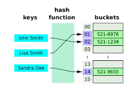
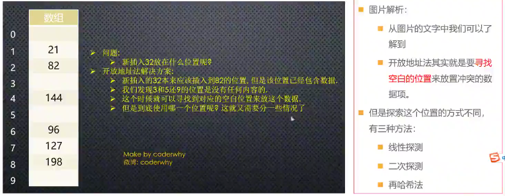

# 数据结构与算法

### 为什么需要学习数据结构和算法

数据结构和算法本质：是一门专门研究数据组如何织、存储和操作的科目；

- 编程尽头，数据结构（编程目的：是对数据进行操作和处理）
- 如何去存储和处理数据
- 前端和后端处理数据的方式
  - 前端从后端获取数据，对数据进行处理、展示
  - 和用户交互产生新的数据，传递给后端，后端进行处理、保存到数据库
- Pascal之父---- Nicklaus Wirth
  - 算法 + 数据结构 = 程序 （Algorithm + Data Structures = Programs）
- 勿在浮沙筑高台

### 实际应用

- 系统、语言、框架源码随处可见 数据结构与算法
  - 队列结构（微任务队列、宏任务队列）
  - DOM Tree

### 如何学习数据结构和算法

- 晦涩难懂、复杂抽象
- 学习方式
  - 高质量文章（缺点不够系统）
  - 看书学习（质量、动手、问题）
  - Leetcode（学习能力、基础）
  - 视频课程
- 
- 


### 数据结构

- 数据结构与算法
  - 官方定义：并没有。。。
- 分开理解：
  - 数据结构（Data Structure）是指组织和管理数据的方式，常见的数据结构有数组、链表、栈、队列、树、图等；
    - 数据结构是计算机中存储、组织数据的方式
  - 算法是指解决问题的方法和步骤，常见的算法有排序算法、查找算法、图算法等
  - 数据结构和算法是计算机科学的基础，在设计和分析程序时起着重要的作用，正确的使用数据结构和算法可以提高程序的性能和可维护性
- 如何摆放图书
  - 摆放规则
    - 摆放 有两个 **相关操作** 方便实现：
      - 操作一：新书怎么插入
      - 操作二：如何找到某本指定的书
    - 方式一：随便放
      - 随便摆
      - 找一本书要累死
    - 方式二：按照字母排序
      - 按照字母排序插入
      - 二分法查找
    - 方式三：按照板块分类，然后按照字母排序
      - 插入
      - 查找
- 常见的数据结构
  - 数组（Array）、栈结构（Stack）、队列（Queue）、链表（LinkedList）、图结构（Graph）、散列表（Hash）、树结构（Tree）、堆结构（Heap）
  - 每一种都有其对应的应用场景，不同的数据结构的操作性能是不同的
  - 有的查询性能快，有的插入速度快，有的是插入头和尾的速度快
  - 有的做范围查找快，有的允许元素重复，有的不允许重复等等
  - 在开发中需要根据具体的需求来选择
- 注意：数据结构和语言无关，常见的编程语言都有 **直接或者间接**使用上述常见的数据结构
- 了解真相，你才能获得真正的自由


### 算法

- 算法的认识
  - 不同的算法，执行效率不一样
  - 在解决问题的过程中，不仅仅数据的存储方式会影响效率，算法的优劣也会影响效率
- 定义
  - 一个有限指令集，每条指令的描述不依赖于语言
  - 接受一些输入（有些情况不需要输入）
  - 产生输出
  - 一定在有限步骤之后终止
- 算法通俗理解：
  - Algorithm这个单词本意就是解决问题的办法、步骤逻辑
  - 数据结构的实现，离不开算法


### 生活中的数据结构与算法

- 图书的摆放
  - 为了更加方便的插入和搜索书籍，需要合理的组织数据，并且通过更加高效的算法插入和查询数据
- 快递的存取
  - 合理组织数据，对于我们获取数据效率的重要性至关重要
- 找出线缆出问题的地方：
  - 两地有一条高架线，长度为100W米，其中一米出现了故障
  - 使用一种算法，可以快速定位到出问题的地方
  - 线性查找：
    - 一米一米的排查，最终找到出问题的地方
    - 如果出问题的线段在另一头，需要排查 100w 次，这是最坏的情况。平均需要 50w 次
  - 二分查找：
    - 从中间位置开始排查，排查出出问题的点
    - 然后再从中间位置开始排查，按照这个逻辑一步一步排查
    - 最坏情况是20次就可以找到出问题的地方
    - log(2)1000000, 以2为底，1000000的对数 约等于 20
  - 结论：解决问题的办法有很多，算法的好坏，效率天壤之别


### 数据结构

#### 线性结构（Linear List）

- 概念：是由n (n >=0) 个数据元素（节点）a[0]，a[1]，a[2]...，a[n-1]组成的有限序列

- 其中：

  - 数据元素的个数 n定义为表的长度 = list.length（list.length = 0 表里没有一个元素时称为空表）
  - 将非空的线性表（n>=1）记作：（a[0]，a[1]，a[2]...，a[n-1]）
  - 数据元素 a[i]（0 <=i<=n-1）只是个抽象符号，其具体的含义在不同情况下不同

- 常见的线性结构

  

#### 数组结构

- 数组（Array）结构是一种重要的数据结构：

  - 几乎是每种编程语言都会提供一种原生数据结构

  - 并且可以借助数组结构来实现其他的数据结构，比如栈（Stack）、队列（Queue）、堆（Heap）

- 通常数组的内存是连续的，所以知道数组下标值的情况下，访问效率非常高

  

  - 早期的 javaScript是有很多语言缺陷，实现数组时，内存不是连续的（类似链表），查找效率低

#### 栈结构（Stack）

1. 认识栈结构和特性
2. 栈结构特性-面试题
3. 实现栈结构的封装
4. 栈结构常见的方法
5. 栈面试题-转二进制
6. 栈面试题-有效括号

##### 认识栈结构

- 数组

  - 线性结构，可以在数组的任意位置插入和删除数据
  - 栈和队列，受限的线性结构

- 栈结构示意图：后进先出

  

- 栈（stack），是一种受限的线性结构，后进先出（LIFO）

  - 其限制是仅允许 表的一端 进行插入和删除运算。这一端成为栈顶，相对的，把另一端成为栈底
  - LIFO（last in first out）表示就是后进入的元素，第一个弹出栈空间
  - 向一个栈插入新元素又称作进栈、入栈或压栈，它是把新元素放到栈顶元素的上面，使之成为新的栈顶元素
  - 从一个栈删除元素又称作出栈或退栈，它是把栈顶元素删掉，使其相邻元素成为新的栈顶元素

- 生活中类似于栈的

  - 自助餐的托盘，最新放上去的，最先被客人拿走使用
  - 收到很多的邮件（实体的），从上往下依次处理这些邮件。（最新到的邮件，最先处理）
  - 注意：不允许改变邮件的次序，否则就不是栈结构了

##### 栈结构面试题

面试题目：有六个元素6，5，4，3，2，1 的顺序进栈，下面哪一个不是合法的出栈序列？（C）

A、5，4，3，6，1，2

B、4，5，3，2，1，6

C、3，4，6，5，2，1

D、2，3，4，1，5，6


##### 栈结构的实现

- 实现栈结构的两种比较常见的方式：
  - 基于数组实现
  - 基于链表实现
- 基于数组实现栈
  - class Stack {}
- 栈常见的操作
  - push(element)：入栈，添加一个新元素到栈顶
  - pop()：出栈，移除栈顶元素，同时返回被移除的元素
  - peek()：返回栈顶元素，不对栈做任何修改
  - isEmpty()：判断栈是否为空
  - size()：返回栈的元素个数
- 十进制转二进制（面试题）
  - **除2取余，逆序排列**
  - 使用循环：
    - while：不确定次数，只知道循环结束条件
    - for：知道循环的次数
- 有效的括号（面试题）
  - 给定一个只包括 '(', ')', '{', '}', '[', ']' 的字符串 s,判断字符串是否有效（Leetcode 20)
  - 有效字符串需满足：
    1. 左括号必须使用相同类型的右括号闭合；
    2. 左括号必须以正确的顺序闭合
    3. 没有右括号都有一个对应的形同的类型的做括号

#### 

#### 队列结构（Queue）

1. 认识队列以及特性
2. 实现队列结构的封装
3. 队列结构的常见方法
4. 面试题 — 击鼓传花
5. 面试题 — 约瑟夫环

##### 认识队列

- 受限的线性结构
- 队列（Queue），它是一种受限的线性表，先进先出（FIFO First In First Out）
  - 受限指出在于它只允许在队列的前端（front）进行删除操作
  - 而在队列的后端（rear）进行插入操作；


- 生活中类似的队列结构
  - 电影院、商场排队
  - 优先排队的人，优先进入
- 打印队列
- 线程队列
- 二叉树的层序遍历

##### 队列结构实现

- 队列类的创建
  - 基于数组实现（数组删除一个元素，剩余元素下标会改变，效率低）
  - 基于链表实现（链表头尾删除效率高）

##### 队列的创建操作

- enqueue(element)：向队列尾部添加一个（或多个）新的项；
- dequeue()：移除队列第一项（在队列最前面的），并返回被移除的元素；
- front/peek()：返回队列中的第一个元素 —— 最先被添加，也将是最先被移除的元素，队列不做任何变动
- isEmpty()：如果队列不包含任何元素，返回true，否则返回false；
- size()：返回的队列包含的元素个数，与数组的length属性相似；

##### 击鼓传花

- 原游戏规则：
  - 班级中玩一个游戏，所有学生围成一个圈，从某位同学手里开始向旁边的同学传一束花
  - 这个时候某个人在击鼓，鼓声停下的一刻，花落在谁手里，谁就出来表演节目
- 修改游戏规则：
  - 几个朋友一起玩一个游戏，围城一圈，开始数数，数到某个数字的自动淘汰，
  - 最后剩下的这个人会获得胜利，请问最后剩下的这个人在原来的哪个位置上的人
- 封装一个基于队列的函数：
  - 参数：所有参与人的姓名，基于的数字；
  - 结果：最终剩下的一个人的姓名；
- 实现：
  - 假设数的数字为3，每次数到三的人会被淘汰
  - 数的1、2，操作出队然后在入队
  - 数的3，操作出队，不需要入队
  - 当队列长度为1，结束

##### 约瑟夫环

- 阿桥问题（约瑟夫斯置换），是一个出现在计算机科学和数学中的问题。在计算机编程的算法中，类似问题又被成为约瑟夫环。
  - 人们站在一个等待被处决的圈子里；
  - 计数从圆圈中的指定点开始，并沿指定方向围绕圆圈进行；
  - 在跳过指定数量的人之后，处刑下一个人；
  - 在剩下的人中重复该过程，从下一个人开始，朝同一方向跳过相同数量的人，直到只剩下一个人，并被释放；
  - 再给定数量的情况下，站在第几个位置可以避免被处决
- 0，1，...，n-1 这个n个数字排成一个圆圈，从数字0开始，每次从这个圆圈里删除第 m个数字（删除后从下一个数字开始计数）。求出这个圆圈里剩下的最后一个数字

#### 链表结构（LinkedList）

1. 认识链表以及特性
2. 封装链表的类结构
3. 封装链表相关方法
4. 链表常见面试题
5. 算法的复杂度分析
6. 数组和链表的对比

##### 认识链表以及特性

- 链表和数组，都可以用于存储一系列元素，，但是链表和数组的实现机制完全不同

- 数组的缺点

  - 数组的创建需要申请一段连续的内存空间（一整块的内存），并且大小是固定的（大多是编程语言数组都是固定的），所以当数组不能满足容量需求时，需要扩容。（一般情况是申请一个更大的数组，比如2倍，然后将原数组的元素复制过去）
  - 而且在数组开头或中间位置插入数据的成本很高，需要进行大量元的位移。

- 链表的优势

  - 不同于数组，链表中的元素在内存中不必是连续的空间
  - 链表的每个元素有一个存储元素本身的节点和一个指向下一个元素的引用（指针/链接）组成
  - 相对于数组，链表有一些优点
    - 内存空间不是必须连续的，可以充分利用计算机的内存，实现灵活的内存动态管理
    - 链表不必在创建时就确定大小，并且大小可以无限的延伸下去
    - 链表在插入和删除数据时，时间复杂度可以达到O(1)，相对数组效率高很多

- 链表的缺点：

  - 链表访问任何一个位置的元素时，都需要从头开始访问（无法跳过第一个元素访问任何一个元素）。
  - 无法通过下标直接访问元素，需要从头一个个访问，直到找到对应的元素。

- 链表的概念

  - 链表类似于火车：有一个火车头，火车头会连接一个节点，节点上有乘客（类似于数据），并且这个节点会连接下一个节点，一次类推

  

##### 链表的实现

- 封装类
  - Node 节点类
  - LinkedList 链表类
- 常见操作
  - append(element): 项链表尾部添加一个新的项
  - insert(position, element): 向链表的特定位置插入一个新元素
  - get(position): 获取对应位置的元素
  - indexOf(element): 返回元素在链表中的索引。如果没有返回 -1
  - update(position, element): 修改某个位置的元素
  - removeAt(position): 从链表的特定位置移除一项
  - remove(element): 从链表移除一项
  - isEmpty(): 如果链表不包含任何元素，返回true，否则返回false
  - size(): 返回链表包含的元素个数
- traverse(): 遍历链表的方法

##### 面试题——设计链表

##### 面试题——删除链表中的节点

- 删除链表的节点
- https://leetcode.cn/problems/delete-node-in-a-linked-list/
- 给你一个需要删除的节点 node 。你将 无法访问 第一个节点  head。
- 链表的所有值都是 **唯一的**，并且保证给定的节点 node 不是链表中的最后一个节点。
- 删除给定的节点。注意，删除节点并不是指从内存中删除它。这里的意思是：
  - 给定节点的值不应该存在于链表中。
  - 链表中的节点数应该减少 1。
  - node 前面的所有值顺序相同。
  - node 后面的所有值顺序相同。

##### 反转链表

- 给定单链表的头节点 `head` ，请反转链表，并返回反转后的链表的头节点。

- [剑指 Offer II 024. 反转链表](https://leetcode.cn/problems/UHnkqh/)

   

- 链表可以选用**迭代**或**递归**方式完成反转
- 解题思路
  - 使用栈来反转
  - 迭代
  - 递归

#### 类型封装

- 类型继承关系


#### 复杂度

##### 时间复杂度

- 通过查找算法进行分析

  - 顺序查找算法（时间复杂度O(n)）
  - 二分查找算法（时间复杂度O(logn))

- 顺序查找算法

  - ```typescript
    function sequentialSearch<T>(array: T[], searchVal: T): number {
        if (!array.length) return -1
    
        let index = 0
        for (let value of array) {
            if (value === searchVal) {
                return index
            }
            index += 1
        }
    
        return -1
    }
    
    const array = new Array(1000000).fill(0).map((_, index) => index)
    
    const startTime = performance.now()
    const index = sequentialSearch(array, 500000)
    // const index = binaraySearch(array, 500000)
    const endTime = performance.now()
    
    console.log('目标索引: ', index)
    console.log('顺序查找耗时：', (endTime - startTime) + 'ms')
    ```

  

- 二分法查找算法

  ```typescript
  function binaraySearch<T>(array: T[], searchVal: T): number {
      if (!array.length) return -1
  
      let left: number = 0
      let right: number = array.length - 1
  
      while (left <= right) {
          let mid = Math.floor((left + right) / 2)
  
          if (array[mid] === searchVal) {
              return mid
          } else if (array[mid] > searchVal) {
              right = mid - 1
          } else {
              left = mid + 1
          }
      }
  
      return -1
  }
  
  const array = new Array(1000000).fill(0).map((_, index) => index)
  
  const startTime = performance.now()
  // const index = sequentialSearch(array, 500000)
  const index = binaraySearch(array, 500000)
  const endTime = performance.now()
  
  console.log('目标索引: ', index)
  console.log('二分查找耗时：', (endTime - startTime) + 'ms')
  ```

  

##### 大O表示法（Big O notation）

- 大O表示法

  - 这个记号是在德国数论学家爱兰德.兰道的著作中才推广的，因此它有时又称为兰德符号

- 大O符号在分析算法效率的时候非常有用。

  - 举个例子，解决一个规模为的问题所花费的时间（或者所需步骤的数目）可以表示为：。当增大时，项将开始占主导地位，而其他各项可以被忽略。举例说明：当，项是项的1000倍大，因此在大多数场合下，省略后者对表达式的值的影响将是可以忽略不计的。
  - 进一步看，如果我们与任一其他级的表达式比较，项的[系数](https://zh.wikipedia.org/wiki/系数)也是无关紧要的。例如：一个包含或项的表达式，即使 ，假定，一旦增长到大于1,000,000，后者就会一直超越前者 。


  这样，针对这个例子，大O符号就记下剩余的部分，写作：

  

  或

  

  并且我们就说该算法具有阶（平方阶）的[时间复杂度](https://zh.wikipedia.org/wiki/时间复杂度)。

##### 常用的函数阶

下面是在[分析算法](https://zh.wikipedia.org/wiki/算法分析)的时候常见的函数分类列表。所有这些函数都处于趋近于无穷大的情况下，增长得慢的函数列在上面。是一个任意常数。

|                             符号                             |                             名称                             |
| :----------------------------------------------------------: | :----------------------------------------------------------: |
|  |    [常数](https://zh.wikipedia.org/wiki/常数)（阶，下同）    |
|  |          [对数](https://zh.wikipedia.org/wiki/对数)          |
| ![\mathrm {O} [(\log n)^{c}]\!](https://wikimedia.org/api/rest_v1/media/math/render/svg/1b59e14bd1ca3550ec4f649c41786884bbe368b5) |        [多对数](https://zh.wikipedia.org/wiki/多對數)        |
|  |      [线性](https://zh.wikipedia.org/wiki/線性)，次线性      |
|  | 为[迭代对数](https://zh.wikipedia.org/wiki/迭代對數) |
|  | [线性对数](https://zh.wikipedia.org/wiki/線性對數)，或对数线性、拟线性、超线性 |
|  |          [平方](https://zh.wikipedia.org/wiki/平方)          |
|  | [多项式](https://zh.wikipedia.org/wiki/多项式)，有时叫作“代数”（阶） |
|  | [指数](https://zh.wikipedia.org/wiki/指數函數)，有时叫作“[几何](https://zh.wikipedia.org/wiki/等比数列)”（阶） |
|  | [阶乘](https://zh.wikipedia.org/wiki/阶乘)，有时叫做“组合”（阶） |


##### 空间复杂度

- 空间复杂度指的是程序运行过程中所需要的额外存储空间
  - 空间复杂度也可以用大O表示法来表示；
  - 空间复杂度的计算方法与时间复杂度类似，通常需要分析程序中需要额外分配的内存空间，如数组、变量、对象、递归调用等
- 举个例子：
  - 对于一个简单的递归算法来说，每次调用都会在内存中分配新的栈帧，这些栈帧展占用了额外的空间。因此，该算法的空间复杂度是O(n)，其中 n是递归深度
  - 而对于迭代算法来说，在每次迭代中不需要分配额外的空间，因此其空间复杂度为O(1)
- 当空间复杂度很大时，可能会导致内存不足，程序崩溃。


##### 数组和链表的复杂度对比

- 使用大O表示法来对比数组和链表的时间复杂度：

  | Data Structure | Access | Search       | Insertion | Deletion |
  | -------------- | ------ | ------------ | --------- | -------- |
  | Array          | O(1)   | O(n)/O(logn) | O(n)      | O(n)     |
  | Linked List    | O(n)   | O(n)         | O(1)      | O(1)     |

- 数组是一种连续的存储结构，通过下标直接访问数组中的任意元素

  - 时间复杂度：对于数组，随机访问时间复杂度为O(1)，插入和删除操作的时间复杂度为O(n)
  - 空间复杂度：数组需要连续的存储空间，空间复杂度为O(n)

- 链表是一种链式存储结构，通过指针链接起来的节点组成，访问链表中的元素需要从头节点开始遍历

  - 时间复杂度：对于链表，随机访问时间复杂度为O(n)，插入和删除的时间复杂度为O(1)
  - 空间复杂度：链表需要为每个节点分配存储空间，空间复杂度为O(n)


#### 哈希表（HashTable）

1. 哈希表的介绍和特性
2. 数据的哈希化过程
3. 地址冲突解决方案
4. 哈希函数代码实现
5. 哈希表创建和操作
6. 哈希表的自动扩容


##### 哈希表的介绍

- 哈希表是一种非常重要的数据结构
- 几乎所有的编程语言都有直接或间接的应用这种数据结构

- 哈希表通常是基于数组进行实现的，相对于数组有很多优势

  - 可以提供非常快速的插入-删除-查找操作
  - 无论多少数据，插入和删除值都非常接近常量的时间：即O(1)的时间复杂度。实际上，只需要几个机器指令即可完成
  - 哈希表的速度比书还要快，基本上可以瞬间查找到想要的元素
  - 哈希表相对于树来说编码要容易很多

- 哈希表相对于数组的一些不足：

  - 哈希表中的数据是没有顺序的，所以不能以一种固定的方式来遍历其中元素（没有特殊处理情况下）。
  - 通常情况下，哈希表的key是不允许重复的，不能放置相同key，用于保存不同的元素。

- 哈希表的结构

  - 哈希表的结构就是数组，但是它神奇的地方在于对数组下标值的一种变换，这种变换可以使用哈希函数，通过哈希函数可以获取到HashCode。

    

- 通过两个案例，需要挑选某种数据结构，会发现最好的选择就是哈希表

  - 案例一：公司使用一种数据结构来保存所有员工信息；
  - 案例二：使用一种数据结构存储单词信息，比如有50000个单词。找到单词后每个单词有自己的翻译、读音、应用等等；


##### 案例一：公司使用一种数据结构来保存所有员工信息

- 案例介绍：
  - 假如一家公司有1000个员工，需要将这些员工的信息使用某种数据结构存储
- 方案一：数组
- 方案二：链表

##### 案例二：50000个单词的存储

- 案例介绍：
  - 使用一种数据结构存储单词信息
  - 到单词后每个单词有自己的翻译、读音、应用等等；
- 方案一：数组
  - 查找效率低
- 方案二：链表
  - 不考虑
- 方案三：将单词转换成下标值
  - 将单词转换成数组的下标值，通过下标值去查找
- 如何将字符串转换成下标值

##### 字母转数字的方案一

- 将单词转成适当的下标值：
  - 计算机中有很多编码方案就使用数字代替单词的字符（字符编码）
  - 比如ASCII编码：a是97
  - 设计自己的编码系统
- 方案一：数字相加
  - 一种转换单词的简单方案就是把单词每个字符的编码求和，
  - 例如单词cats转换成数字：3 + 1 + 20 = 43，那么43就作为cats单词的下标存在数组中。
- 问题：按照这种方案有一个很明显的问题就是很多单词的下标可能都是43
  - 所以一个下标存储这么多单词不合理

##### 字母转数字的方案二

- 幂的连乘
  - 通过一种算法，让cats转成数字后不那么普通
  - 幂的连乘
  - 使用大于10的数字，可以使用一种幂的连乘来表示它的唯一性：
    - 比如：7654 = 7 * 10(3) + 6 * 10(2) + 5 * 10 + 4
  - 这样得到的数字可以基本保证它的唯一性，不会和别的单词重复
- 问题：如果一个单词很长，转换得到的数字很大
  - 数组的空间有很大的浪费

两种方案总结：

- 第一种方案（把数字相加求和）产生的数组下标太少
- 第二种方案（幂相乘求和）产生的数组下标又太多

##### 下标的压缩算法

- 现在需要一种压缩方法，把幂的连乘方案系统中得到的巨大整数范围压缩到可接受的数组范围中
- 对于英文词典，多大的数组才合适？
  - 如果只有50000个单词，实际情况，往往需要更大的空间来存储这些单词
  - 比如两倍的大小：100000
- 如何压缩？
  - 取余操作符，它的作用是得到一个数被另外一个数整除后得到的余数
- 取余操作的实现：
  - 为了看到这个方法如何工作，先看一个小点的数字范围哦压缩到一个小点的空间中
  - 假设把0～199的数字，比如使用largeNumber表示，压缩为从0～9的数字，比如使用smallRange代表
  - 下标值的结果：index = largeNumber % smallRange
  - 当一个数字被10整除时，余数一定在0～9之间
  - 比如13%10 = 3，157%10 = 7
  - 当然，这中间还是会有重复，不过重复的数字明显变小。因为数组是100000，而只有50000个单词
  - 就好比，在0～199中间选取5个数字，放在这个长度为10的数组中，也会重复，但是重复的概率就非常小

##### 哈希表的一些概念

- 概念：
  - 哈希化：将大数字转化成数组范围内下标的过程，称之为哈希化
  - 哈希函数：通常会将单词转成大数字，大数字进行哈希化的代码实现放在一个函数中，这个函数称之为哈希函数
  - 哈希表：最终将数据插入到这个数组，对整个结构的封装，称之为是一个哈希表
- 问题：
  - 通过哈希化的下标值依然可能会重复，如何解决重复问题

##### 地址冲突的解决方案

- 开放地址法（寻找空白的单元格莱添加重复的数据）

  

- 链地址法

  - 每个数组单元存储的不再是单个数据，而是一个链条，
  - 这个链条采用什么结构？常见的是数组或者链表
  - 比如链表，每个数组单元存储着一个链表。一旦发现重复，再取出链表，将重复的元素插入到链表的首端或者末端即可
  - 当查询时，先根据哈希化后的下标值找到对应的位置，再取出链表，依次查询数据
  - 具体看业务需求，采用数组还是链表

