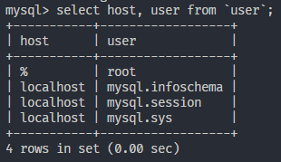

# Cloud

txy 公：121.5.70.248

mysql ps Zyp11111.

### 连接云服务器

- 使用ssh工具

  `ssh root@121.5.70.248`

- 修改主机名，重启服务器

  - `hostnamectl --static set-hostname coderwhy`

#### 安装软件

- 使用工具：dnf

  - DNF，全称Dandified（时髦的、华丽的） Yum； 
  - 是Yum的下⼀个版本，也被称之为Yum的替代品； 
  - 如果是centos7的版本，是没有⾃带dnf的，需要通过yum进⾏安装（这个⾃⾏安装⼀下）； 
  - centos8，所以是⾃带dnf的；

- 检查dnf是否可用：

  - `dnf --help`

- 安装⼀个软件包，可以进⾏如下的操作：

  - ```sh
    # 搜索软件包
    dnf search nodejs
    
    # 查看软件包信息: nodejs的版本是10.21.0
    dnf info nodejs
    
    # 安装nodejs
    dnf install nodejs
    
    # 使⽤更⾼的版本，⽐如最新的LTS或者Current版本；
    # 这个时候我们可以使⽤之前讲过的⼀个⼯具：n；
    # 安装n
    npm install n -g
    # 通过n安装最新的lts和current
    n install lts
    n install latest
    # 通过n切换版本
    n
    
    # 查找MySQL
    dnf search mysql-server
    # 查看MySQL，这⾥的版本是8.0.21
    dnf info mysql-server
    # 安装MySQL，这⾥加-y的意思是依赖的内容也安装
    dnf install mysql-server -y
    
    # 开启MySQL后台服务
    systemctl start mysqld
    # 查看MySQL服务：active (running)表示启动成功
    systemctl status mysql
    # 随着系统⼀起启动
    systemctl enable mysqld
    
    # 配置MySQL
    mysql_secure_installation
    ```

#### MySQL 本地连接

- 云服务器开放3306端口

- 修改数据库mysql中的user表，root用户的host为%，客户端可以连接到

  

#### 内网 ssh隧道（win）

- 开启openSSH 服务

- ssh隧道相关的命令参数：

  -f ： 输入密码后进入后台模式

  -N：不执行任何命令，用于端口转发

  -D：使用socket5代理

  -L： 转发tcp协议数据，需要指定host和port

  -C：使用数据压缩，在网络慢的时候能提高上网速度；在网络快的时候会影响网速

  ##### 建立ssh隧道

  在A与B之间建立ssh互信（比较简单，此处省略）

  我们在A机器上执行：

  ```sh
  #执行此命令
  ssh -f -N -D bindaddress:bindport username@address
  #bindaddress：指的是serverA对外开放可访问的ip，比如serverA机器的ip为192.168.20.22（本地电脑可以ping通此ip）
  #bindport：指的是serverA对外开放可访问的ip，随意填一个即可（比如7070)
  #username@address：serverA的用户名和地址，这里写root@127.0.0.1（ServerA要和自身建立互信）
  ```

  所以执行命令为：ssh -f -N -D 192.168.20.22:7070 root@127.0.0.1

  这样就建立了SOCKS5代理。
  -----------------------------------
  ©著作权归作者所有：来自51CTO博客作者测试生财的原创作品，请联系作者获取转载授权，否则将追究法律责任
  ssh端口转发实现socket5代理上网
  https://blog.51cto.com/u_14900374/2554274